# Reviews

For each order whose status has been set to Completed, the customer will receive an email for them to review their purchase.


**Make sure you have activated the review notification so that the system can send the email to your customer.** [**You can check that setting on your Store/website Notifications settings**](../settings/notifications.md)**.**


After the review is sent by the customer, you will be able to see the review on this page.

To display the review on the product's own page, you can follow the steps below:

1. Log in to your Shoppego account

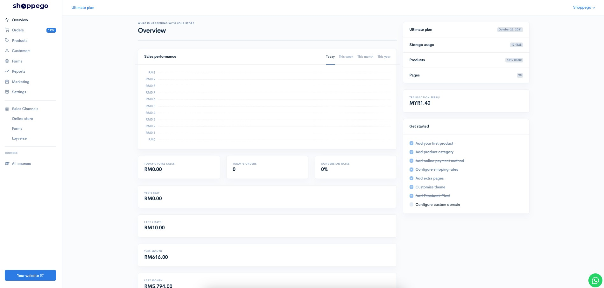

2\. Click on **Customers**.

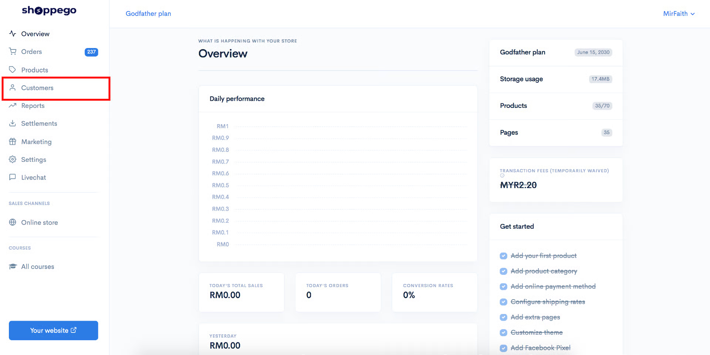

3. Click on **Reviews**

<figure>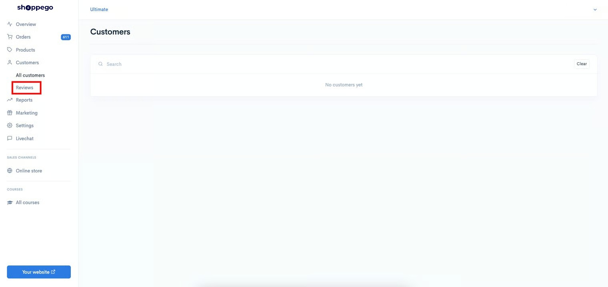<figcaption></figcaption></figure>

4. Click on the review you want to display/undisplay

<figure>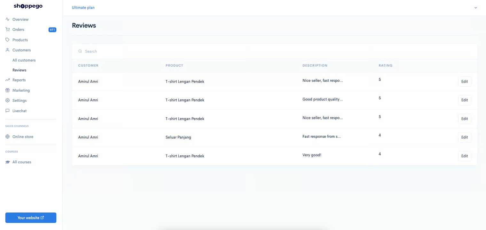<figcaption></figcaption></figure>

5. Then, you will be taken to the page below.\
   \
   If you **want to display** this review on the product page, you need to **click Approve**. Meanwhile, if you want **to undisplay** the review from the product page, you need to **click Disapprove**.\
   \
   By default, the system will set every review sent by the customer as Disapprove.\
   \
   To **remove the review** from the website/store, you can **click Delete**.

<figure>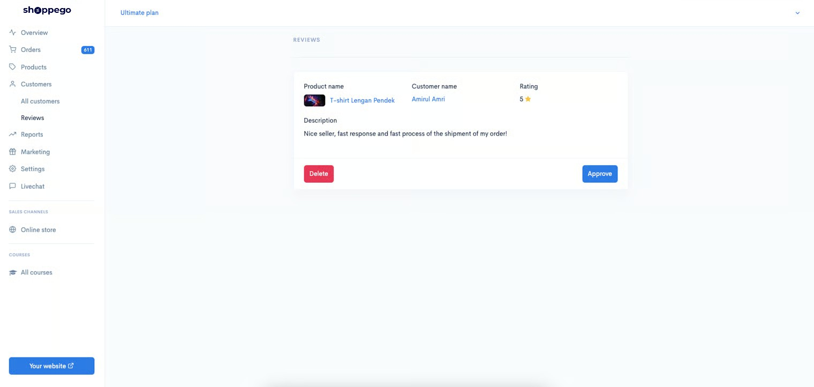<figcaption></figcaption></figure>

Once you're done making the settings you want and you've approved the review sent by the customer. You need to set it in Customize themes to display the review.

<figure>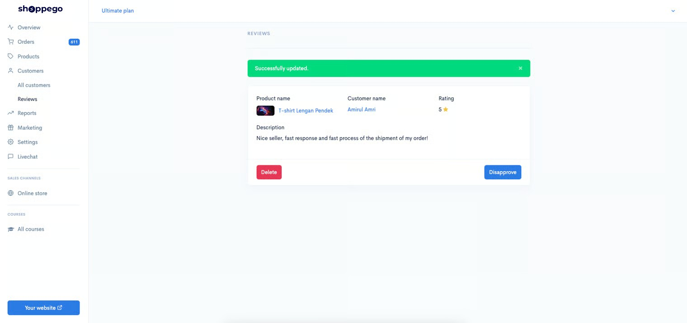<figcaption></figcaption></figure>

## Settings at Customize themes

1. From the Shoppego dashboard

<figure><figcaption></figcaption></figure>

2. Click on **Online store**

<figure>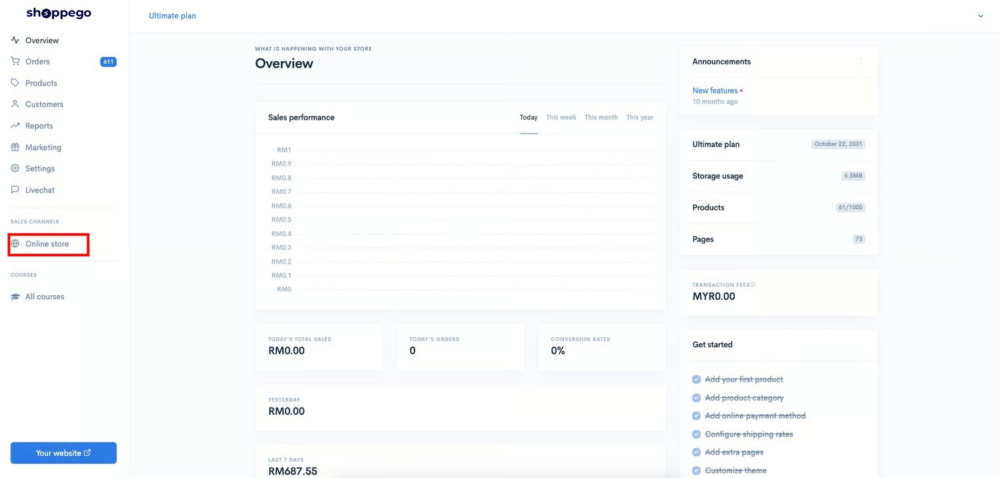<figcaption></figcaption></figure>

3. Click on **Customize**

<figure>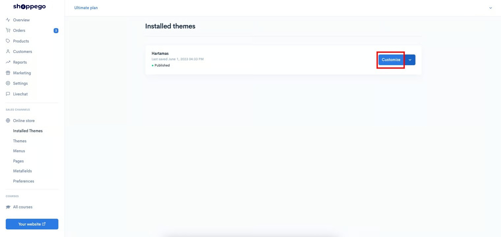<figcaption></figcaption></figure>

4. You can click on the **Product/Product settings tab** and tick **Yes** on the **Product reviews** setting

<figure>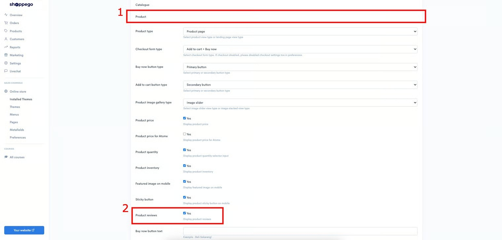<figcaption></figcaption></figure>

5. When finished click **Save**

<figure>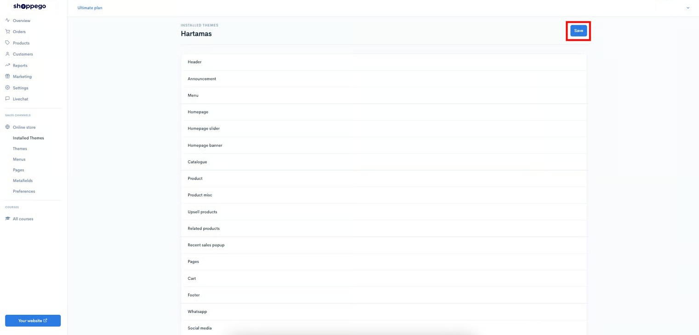<figcaption></figcaption></figure>

Now you can see the review display in the product page itself.

<figure>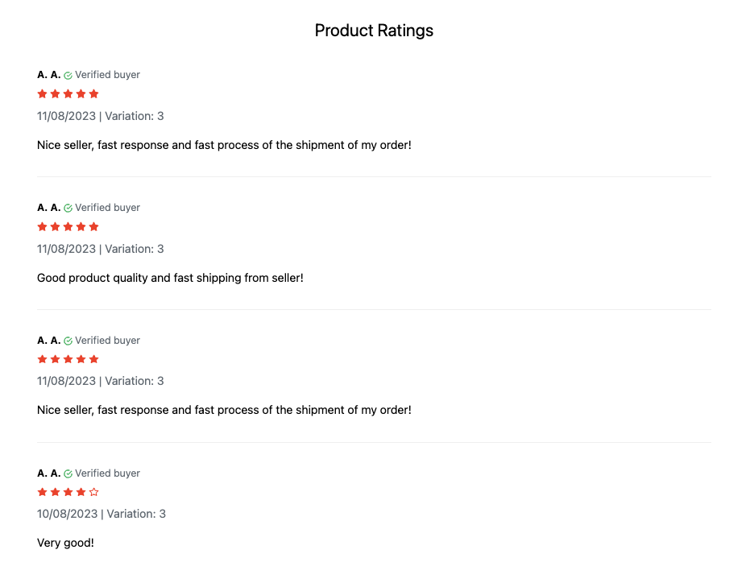<figcaption></figcaption></figure>

## Additional Information

* For information, the color display of the review star will depend on the color setting you set on the Buy now Button or the Primary color of your website/store.
* The system will also only display your 5 most recent reviews on the product page.
