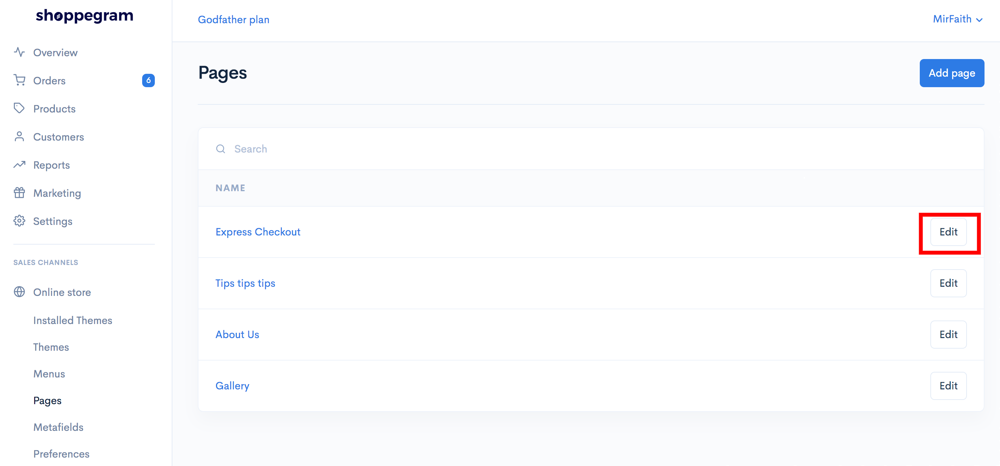
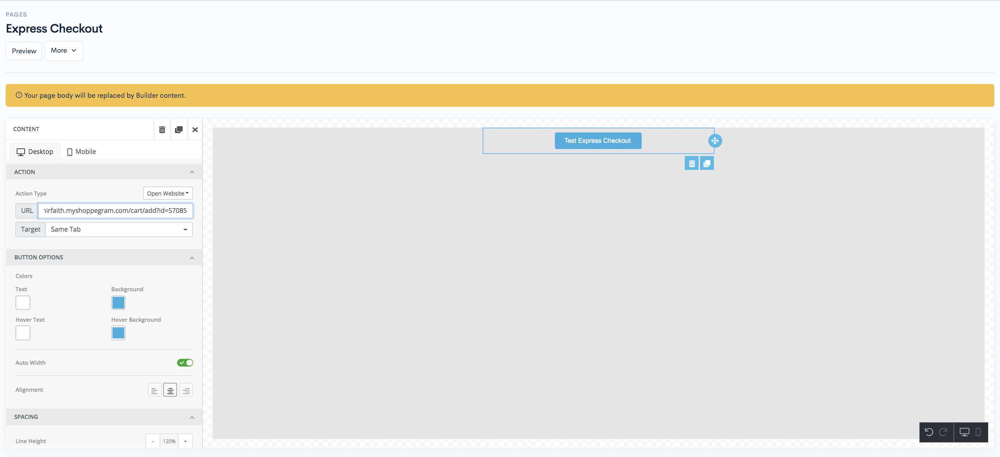
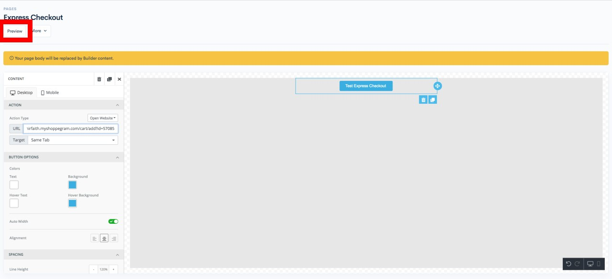

# Page Builder


Before you follow these steps make sure you :

* Already have the **product you want to make for express cart**
* Already has its **own pages** for you to enter the **express cart function**
* Already subscribed to the **Shoppego Standard plan and above for you to use the page builder function.**
  

## Get Product Variant ID

1\. Log in to your Shoppego account.

2\. Click on **Products**

3\. Click on the Product for which you want to enter the Express Checkout function.

4\. Click on **Express checkout**

5\. Select the variant that you want your customers to continue to buy and save the link

6\. Based on the url link, you only need to save the product variant ID.For example the link you get is **<https://mirfaith.myshoppegram.com/cart/57085:1>**

So you need to save **57085** only to use in the next step.

### Settings on Page Builder 

1\. Log in to your Shoppego account.

2\. Click on **Online Store** -> **Pages**

3\. Click on the Edit button on the pages where you want to enter the Express Checkout function.

4\. Klik on **Edit with Builder**

5\. Next, you will be taken to your page builder page. To set the express checkout, you can drag the Button element to the space provided.

6\. Click on the Button element that you just dragged and insert into your body content. Type the text you want to appear on the Button element.

7\. In the URL section you can enter/cart/add? Id = **enter the ID you obtained in step 1**&#x20;

(Example: [https://mirfaith.myshoppegram.com/cart/add?id=57085](https://mirfaith.myshoppegram.com/cart/57085:1))

 <mark style="color:red;">**Attention**</mark>: Make sure to include **add?id=** in your URL.


8\. In the **Target column** you can select the **Same Tab** or **New Tab** option while, in the other settings column you can set according to your design.

9\. When done you can click **Preview** to experiment with setting the button.

## Additional Info

If you want to make your customers continue to enter 3 products directly into their cart you can separate each product variant ID with a comma symbol.

For example: /cart /add? Id = **57085,12345**


**\*\*A maximum of only&#x20;**<mark style="color:red;">**3 ID variants**</mark>**&#x20;can be entered.**

\*\*If you want to **add quantity** in your **Express Cart**, make sure you modify it and press the **Update Cart button.**

