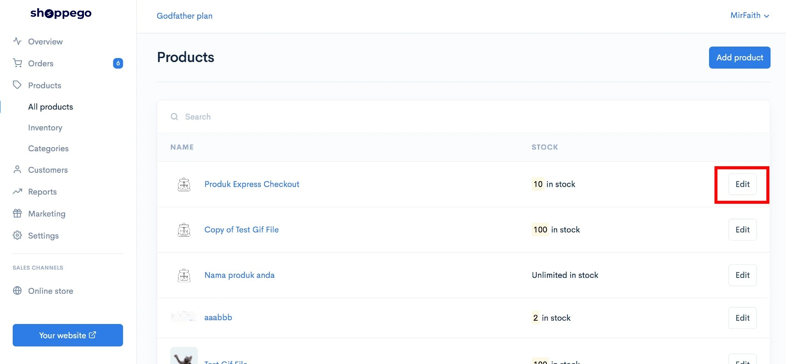
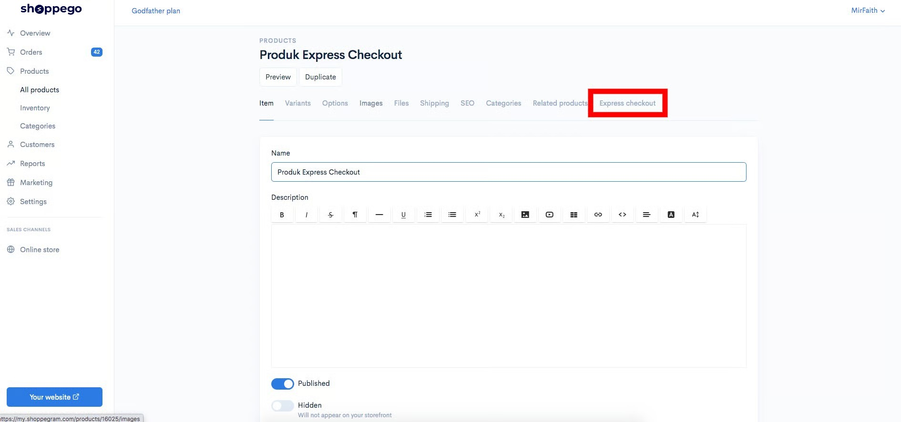
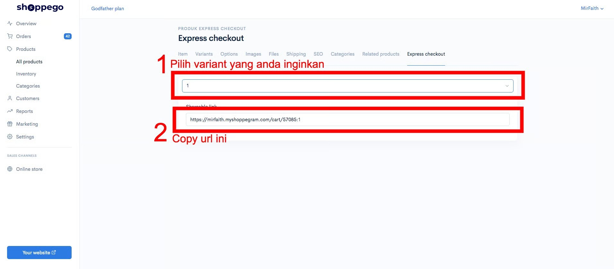
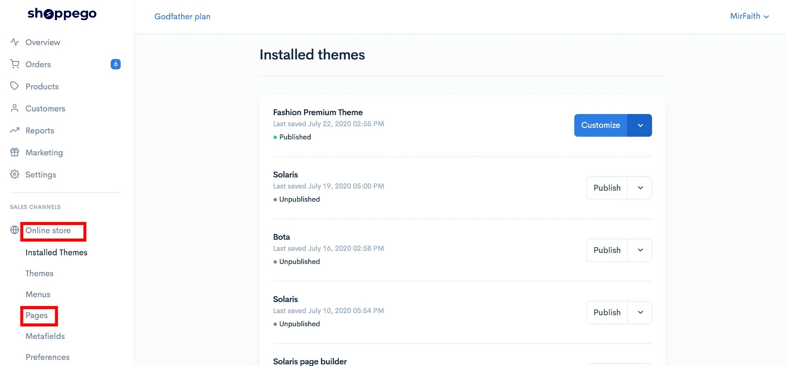
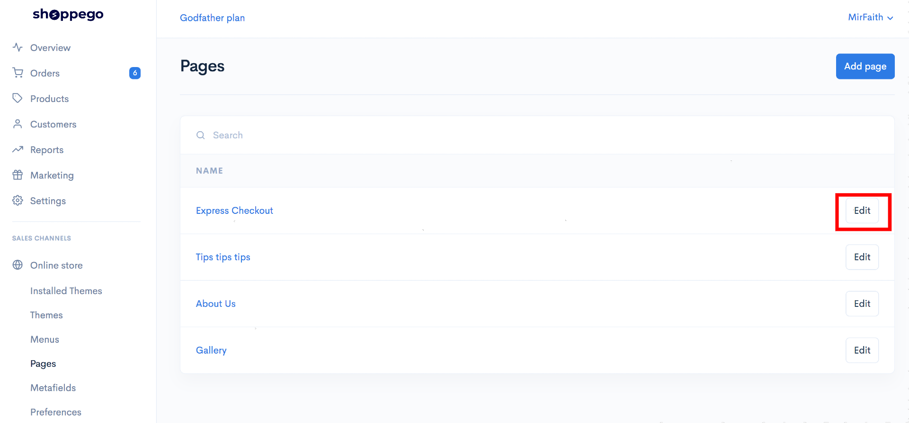
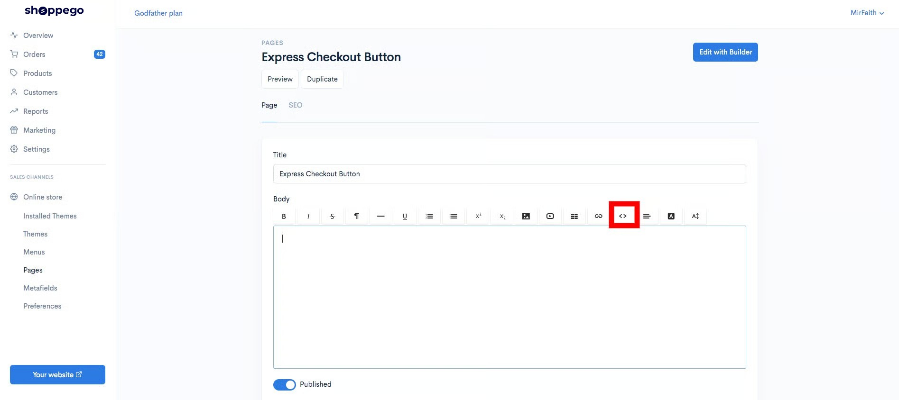
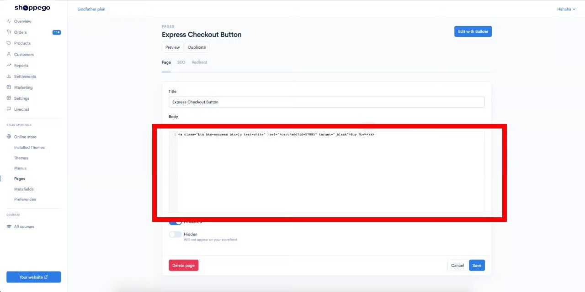
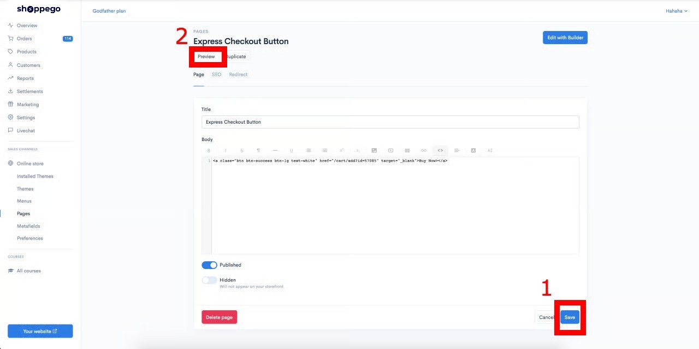

# Pages


Before you follow these steps, make sure you :

* Already have the product you want to make for **express cart.**
* Already has its own pages for you to enter the **express cart function.**
  

## Get Product Variant ID

1\. Log in to your Shoppego account.

2\. Click on **Products**

3\. Click on the Product for which you want to enter the Express Checkout function.

4\. Click on **Express checkout**

5\. Select the variant that you want your customers to continue to buy and save the link

6\. Based on the URL link, you only need to save the product variant ID. For example the link you get is **<https://mirfaith.myshoppegram.com/cart/57085:1>**

So you need to save **57085** only to use in the next step.

## Setting on Pages

1\. Log in to your Shoppego account.

2\. Click on **Online Store** -> **Pages**

3\. Click on the Edit button on the pages where you want to enter the **Express Checkout function.**

4\. Click on the <> icon to enter your button's custom code

5\. Next, you just need to enter this code in the field.

Code: **\<a class="btn btn -success btn-lg  text-white " href ="/cart/add?id=enter the ID you got in step 1" target="\_blank">Buy Now \</a>**

**\*\*In the href section, you can enter the link of your variant product that you just got in step 1**

6\. Once done you can click **Save** and see the result by clicking on **Preview** button.

## Additional Info

If you want to change your button styling, you can refer to this link for more information: <https://getbootstrap.com/docs/4.0/components/buttons/>

If you want to make your customers continue to enter 3 products directly into their cart you can separate each product variant ID with a comma symbol.

For example: /cart /add? Id = 57085,12345


**A maximum of only 3 ID variants can be entered.**

