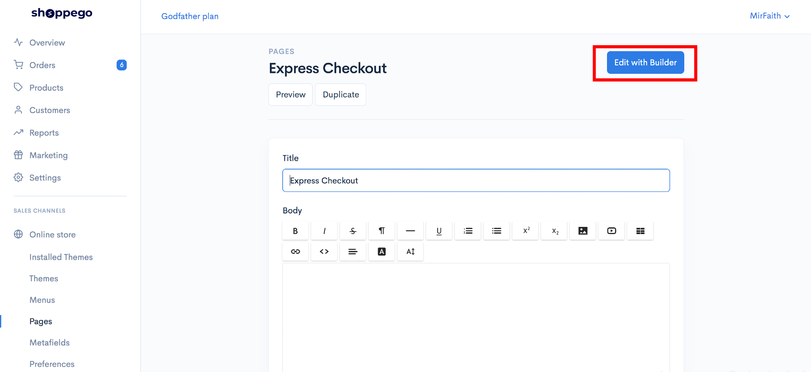
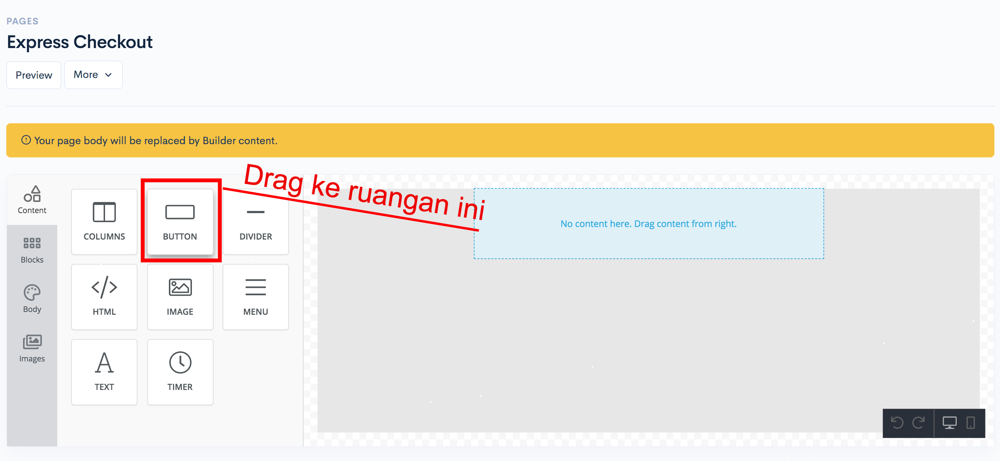
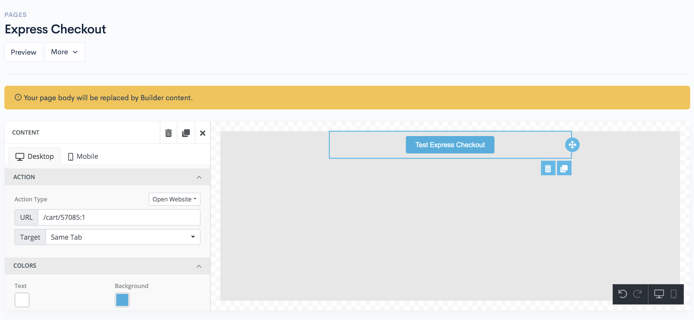
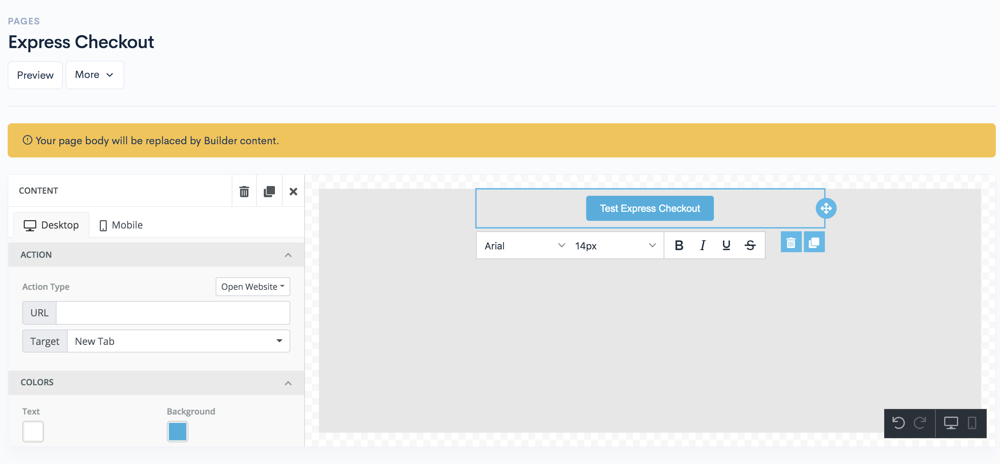
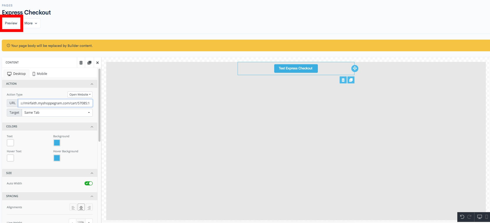

# Page Builder


Before you follow these steps make sure you:

* Already have the product you want to **create for express checkout**
* Already has its **own pages** for you to enter the **express checkout function**
* Already subscribed to Shoppego **Standard plan and above**
  

## Get Product Variant ID

1\. Log in to your Shoppego account.

2\. Click on **Products**.

3\. Click on the Product for which you want to enter the Express Checkout function.

4\. Click on **Express checkout**

5\. Select the variant you want your customers to continue buying and save the link

6\. Make sure you save the URL of the link first as it will be used for setting on your pages.

### Settings on Page Builder 

1\. Log in to your Shoppego account.

2\. Click on **Online Store** -> **Pages**

3\. Click on the Edit button on the pages where you want to enter the **Express Checkout** function.

4\. Click on **Edit with Builder**

5\. Next, you will be taken to your page builder page. To set the express checkout, you can drag the Button element to the space provided.

6\. Click on the **Button element** that you just dragged and insert into your body content. Type the text you want to appear on the Button element.

7\. In the URL section you can enter the **URL you just got from step 1.**

(Example: <https://mirfaith.myshoppegram.com/cart/57085:1>)

8\. In the **Target column** you can select the **Same Tab** or **New Tab** option while, in the other settings column you can set according to your design.

9\. Once done you can click **Preview** to test the button.

## Additional Info

### Checkout 3 Products

1. If you want to change your button styling, you can refer to this link for more information: <https://getbootstrap.com/docs/4.0/components/buttons/>\
   \
   If you want to make your customers continue to checkout with **3 products directly**, you can separate each **product variant ID** with **a comma symbol**.\
   \
   For example: /cart /**57085:&#x20;**<mark style="color:blue;">**1**</mark>**,12345:&#x20;**<mark style="color:blue;">**2**</mark>**, 57779:&#x20;**<mark style="color:blue;">**3**</mark>

### Applying Discount Code

1. If you want to ensure that **customers checkout automatically with the discount code that you want**, you can **add ?discount=\[Your discount code] to your express checkout URL**. 

   For example, your discount code is "FREESHIPPING":\
   /cart/57085:1,12345:2,57779:3?discount=FREESHIPPING


**\*\* The number after the colon refers to the&#x20;**<mark style="color:blue;">**quantity of items purchased**</mark>**.**

**\*\* A maximum of only&#x20;**<mark style="color:red;">**3 ID variants (valid)**</mark>**&#x20;can be read by our system.**

