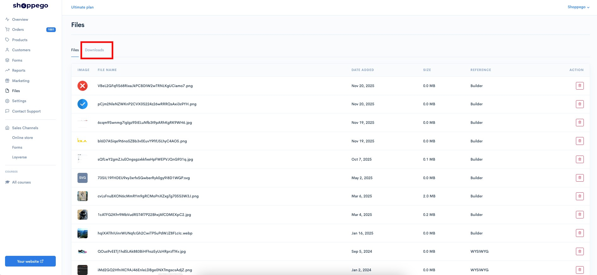
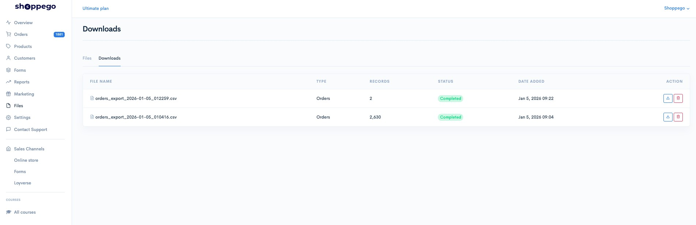
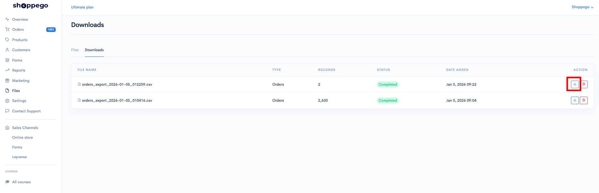
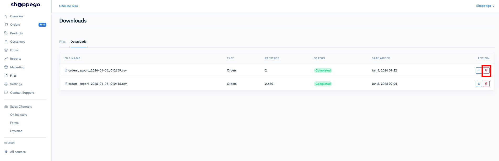

# Downloads

To manage export orders files, you can go to the section:

1. Log in to your Shoppego account

<figure><figcaption></figcaption></figure>

2. Click on **Files**

<figure><figcaption></figcaption></figure>

3. Click on the **Downloads** tab

<figure><figcaption></figcaption></figure>

4. Next, you will be able to see the status of your export order file.

<figure><figcaption></figcaption></figure>

If the file is ready to be downloaded (Status changes to Completed), you can click on the **download** button.


Please note that if your export file is too large, changing the status to "Completed" will take some time (depending on the size of your file).


<figure><figcaption></figcaption></figure>

To delete any of the export files, you can click on the **trash can icon** button.

<figure><figcaption></figcaption></figure>
