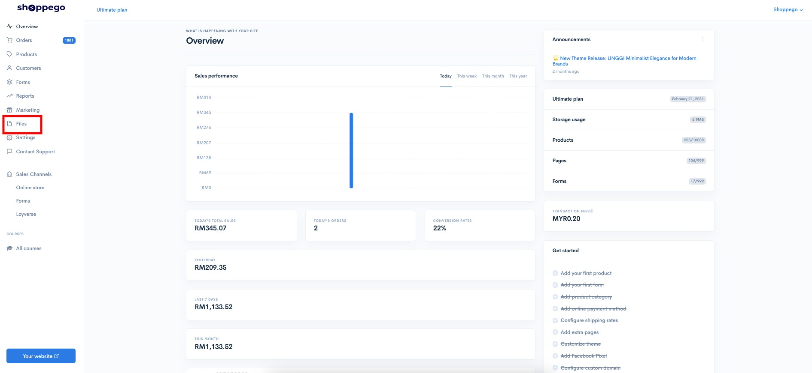
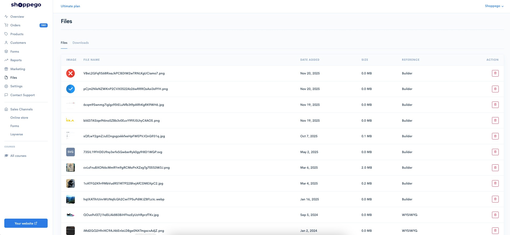
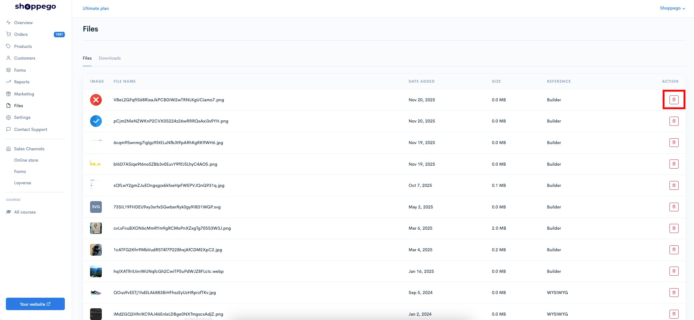

# Files

To manage the image files you have uploaded in the page editor, you can go to the section:

1. Log in to your Shoppego account

<figure><figcaption></figcaption></figure>

2. Click on **Files**

<figure><figcaption></figcaption></figure>

3. Next, you will be able to see all the image files you have uploaded in your page editor.

<figure><figcaption></figcaption></figure>

On that page, you will be able to see information about your image files.

| Parameter  | Description                                                                                     |
| ---------- | ----------------------------------------------------------------------------------------------- |
| Image      | View the images you have uploaded.                                                              |
| File Name  | The name of the file you uploaded.                                                              |
| Date Added | The date you uploaded the file.                                                                 |
| Size       | The size of the file you uploaded.                                                              |
| Reference  | The information of the file that you upload to either the builder editor or the WYSIWYG editor. |
| Action     | Settings you can make for the file.                                                             |

To delete any files you no longer want, you can click on the **trash can icon**.

<figure><figcaption></figcaption></figure>
