# Facebook Catalogue

What are Product Catalog Ads commonly used by large companies to promote businesses that have more than 1 product?

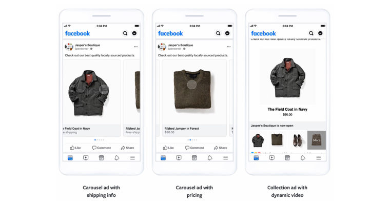

The image above shows a product catalog that is automatically generated by Facebook for Ecommerce dynamically for users ’gaze.

In Shoppego, this advantage has long been available for use by all users to get more robust and professional results for your business branding.

## Setting Product Catalog in Catalog Manager

1. Log in to your **Business Manager** Facebook account and click Business Settings in the upper left corner and click on **Commerce Manager.**

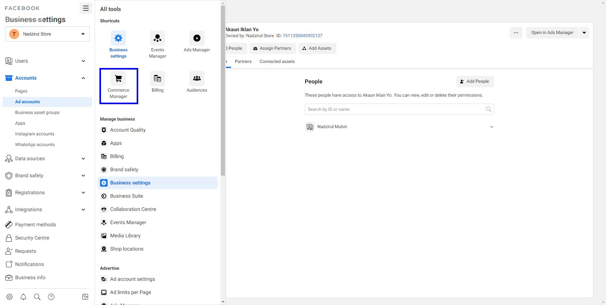

2. Next click on the **Create Catalog** button.

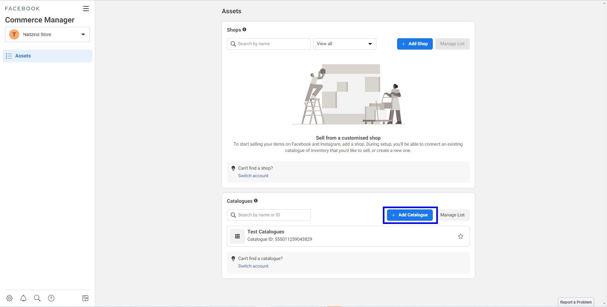

3. Click on the **Ecommerce** option and click the **Next** button.

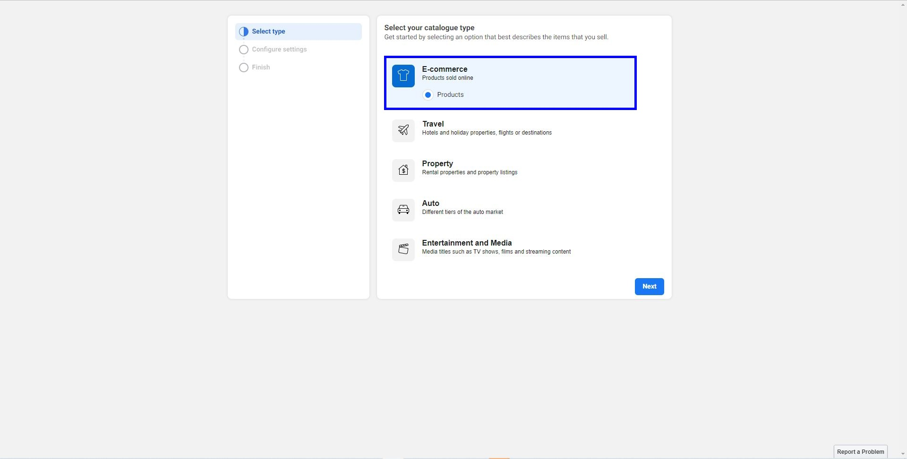

4. Then click on the **Upload Product Info** box and click the **Create** button.

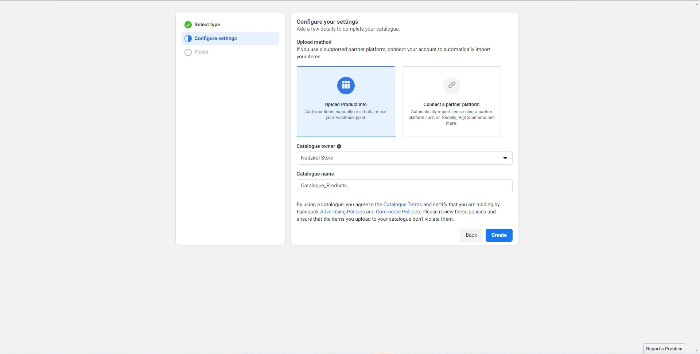

5. Click on **View Catalog.**

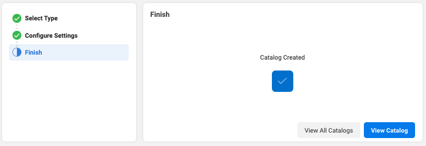

6. After that, you will be taken to your catalog page to be used to add products in the catalog that was just created just now.
7. Click on the **Data Sources.**

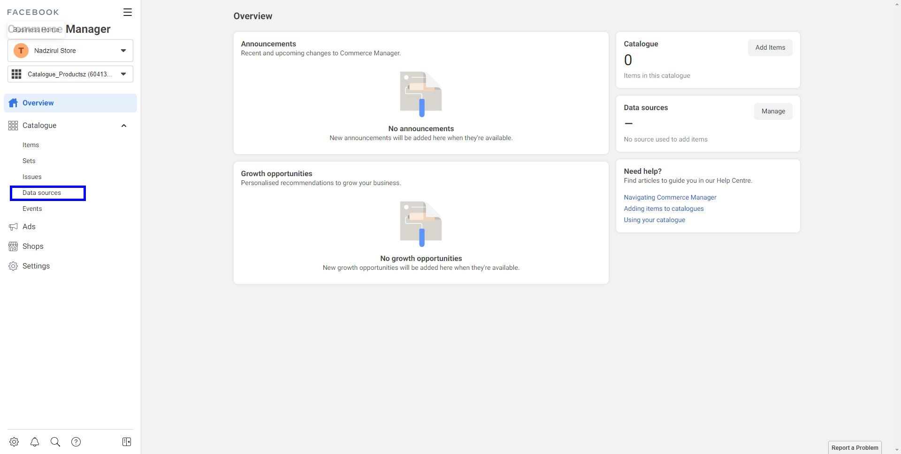

8. Click on **Data Feed** and **Next.**

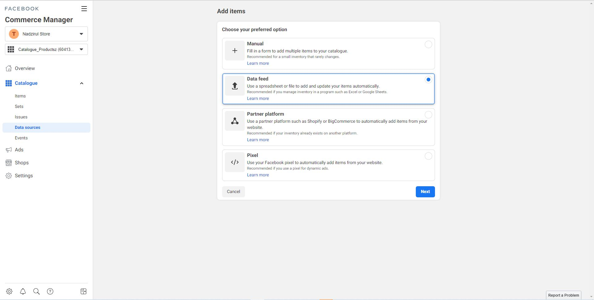

9. You need to select **Yes** and press the **Next** button.

<figure>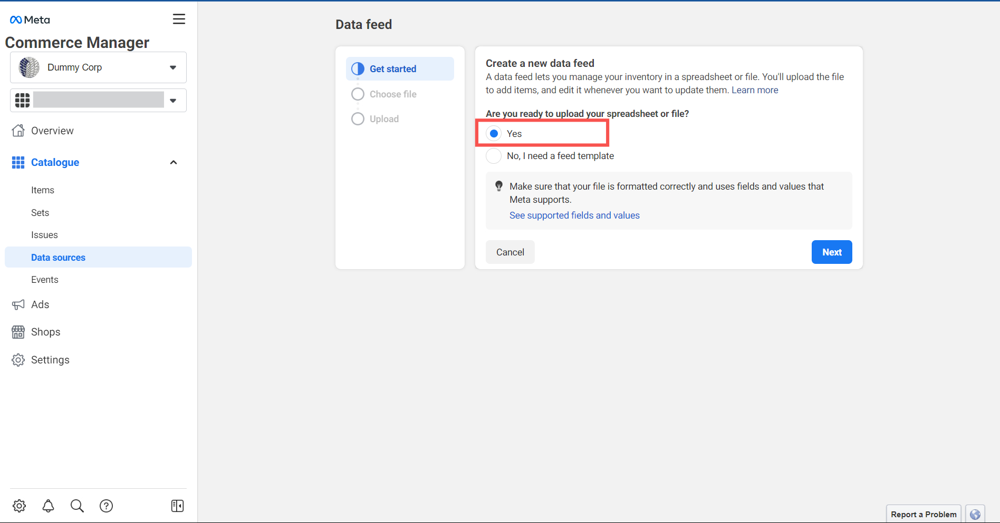<figcaption></figcaption></figure>

10. Select **Use a URL(1)** and enter **your domain(2)** followed by **/products.rss.** Leave the **Username** and **Password** fields blank.


1) **Without** a custom domain:\
   [https://kedaisaya.myshoppegram.com/products.rss](https://kedaisaya.myshoppegram.com/products.rss).
2) **With** a custom domain:\
   [https://kedaisaya.com/products.rss](https://kedaisaya.com/products.rss).


<figure>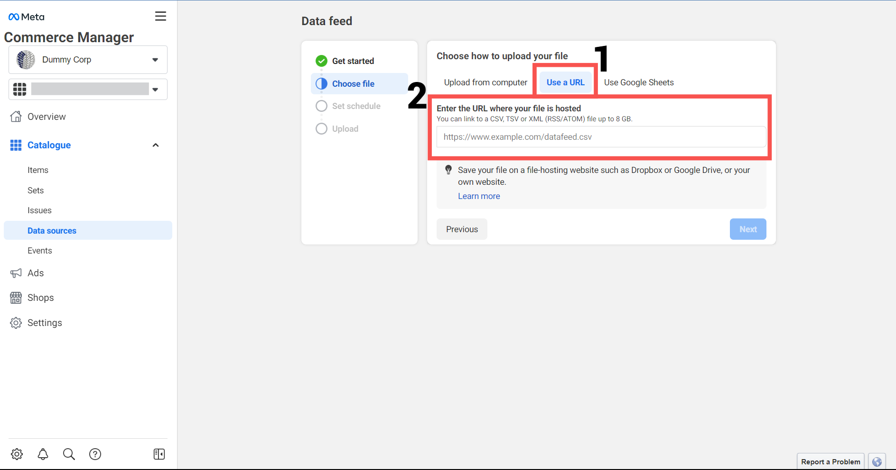<figcaption></figcaption></figure>

11. In the Schedule Updates section, you can **choose Hourly, Daily,** or **Weekly** to allow Facebook to automatically retrieve new data for your products. Then click the **Next** button.


The **Hourly option** - If your website **frequently adds and updates products** throughout the year. It is **more suitable** for marketplaces like **Lazada**.

Otherwise, you can simply choose **Weekly**.


<figure>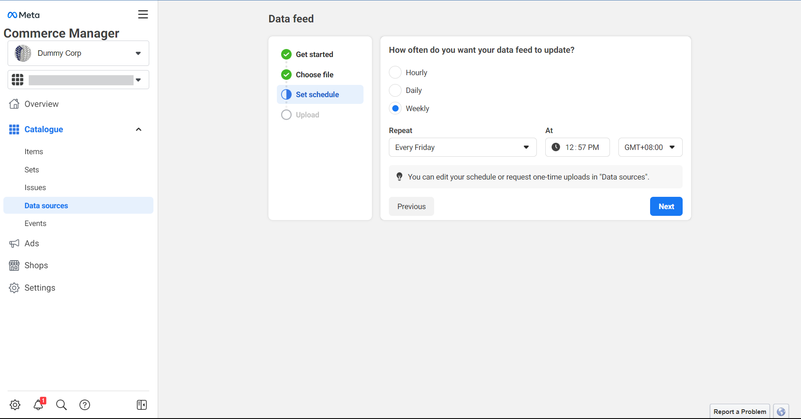<figcaption></figcaption></figure>

12. Enter any **information** about your business name and **select** the currency **MYR**.

<figure>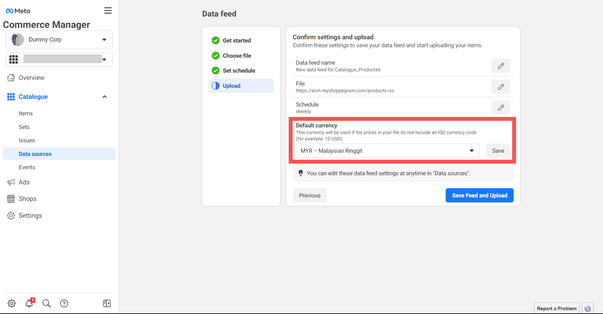<figcaption></figcaption></figure>

13. Make sure all your information is **correct** and click the **Save Feed and Upload** button.

<figure>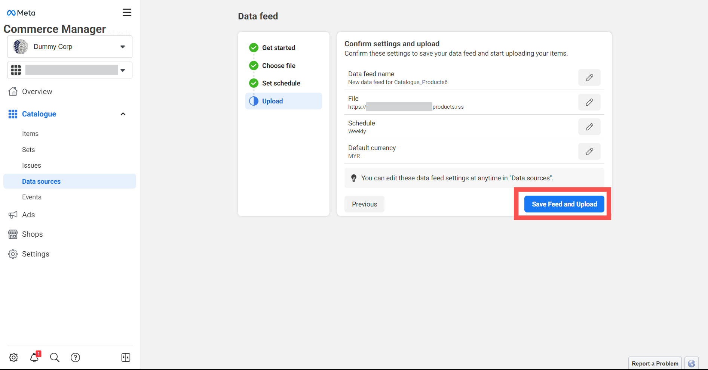<figcaption></figcaption></figure>


The **Upload process** may take a few minutes **depending on the number of your products**. The **more products**, the **longer it takes to upload** a product.



Make sure that the **result** column is marked with **Green** and check the number of your products with the number of results that have been **successfully** uploaded.



If they **do not match**, you can make changes to your products based on the messages and issues provided.



If **the FB system asks you to set Unrecognised columns, you can ignore it and just click on The Next button.**


<figure>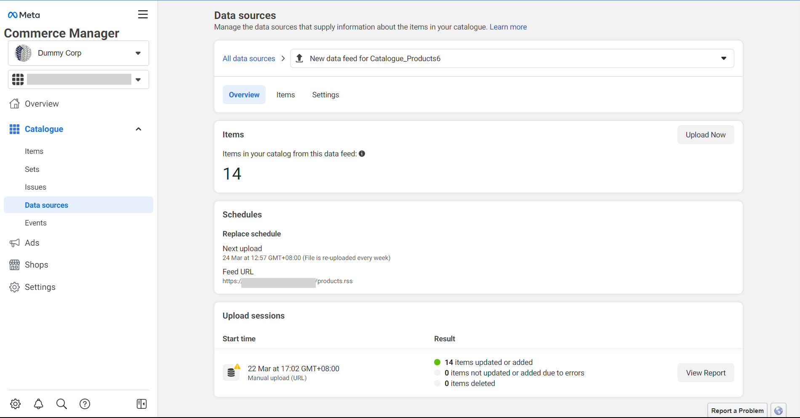<figcaption></figcaption></figure>

## Catalogue Display

1. Click on **Items** and you will see that your products have now been added to the Facebook catalog.

<figure>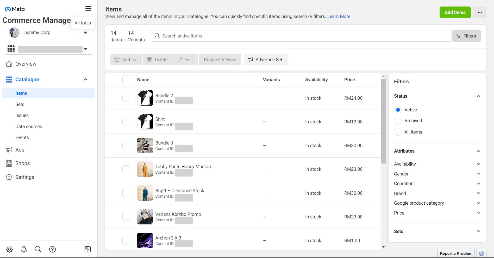<figcaption></figcaption></figure>


You can use this product catalog to **create ads** in **Facebook Ads Manager.**

