# Facebook Pixel

Shoppego has made it easier for users to setup Facebook pixels by simply setting up Facebook Pixel into the Shoppego Preferences setting. Very easy! No need to involve related settings and involve coding.


The **use of multiple Facebook Pixels** is available for **Premium plans and above**. This function is also **only available in the Forms setup**.




## What is Facebook Pixel?


**Facebook Pixel** is a **tracking mechanism** or in Malay referred to as a "*Mekanisma Penjejak*" to track the visitors who enter your website.


One of the best ways to setup **Facebook Pixels** is to use Facebook Business. So you need to register **Facebook Business Manager** for this Pixel setting.

## Registration of Business Suite Account

1. Click on this [<mark style="color:blue;">**link**</mark> ](https://business.facebook.com/)to go to **Facebook Business Manager** or <https://business.facebook.com/>
2. Click on **Create Account** to register.

<figure>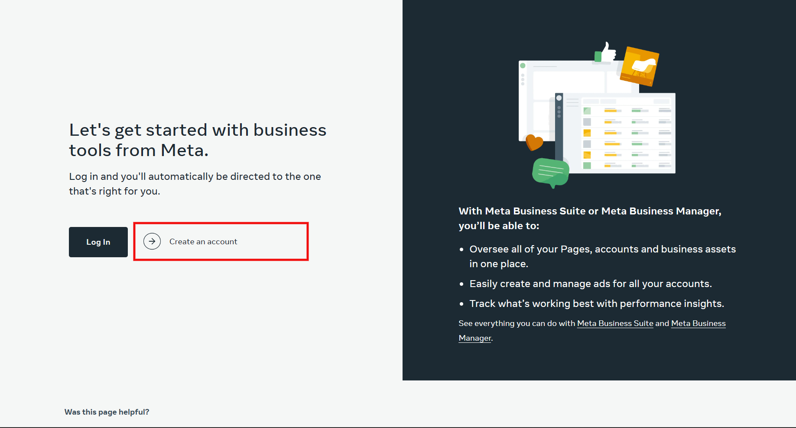<figcaption></figcaption></figure>

3. Fill in the **name of your business** and in the designated fields, you will also need to fill in the **Your Name** and **Business Email Address** fields. Once you have completed this, you can press **Submit**.

<figure>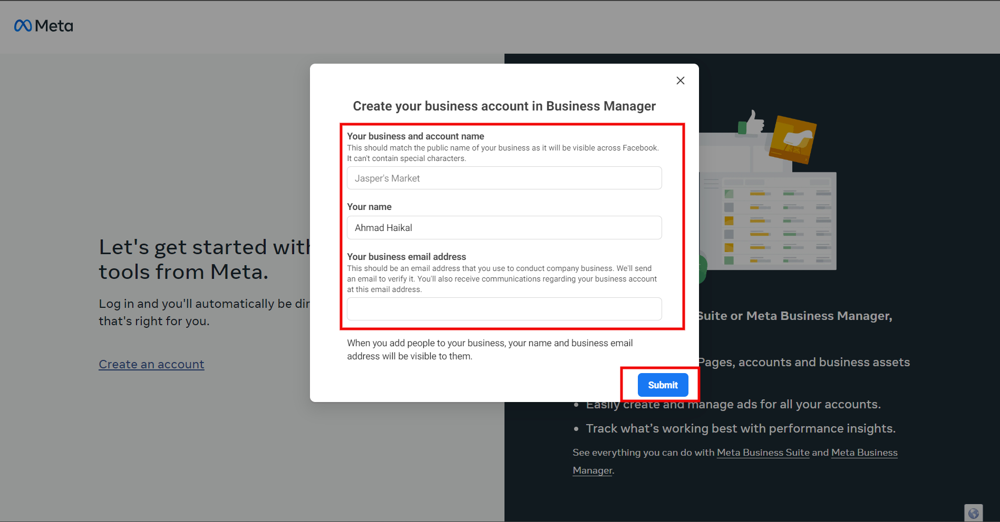<figcaption></figcaption></figure>

4. **A confirmation email** will be sent to the **registered email address**. You need to **open** and **verify** the email.

<figure>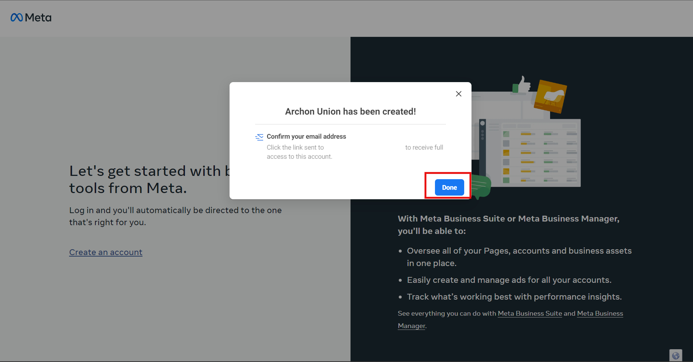<figcaption></figcaption></figure>

5. After that, the display you will receive is as follows.

<figure>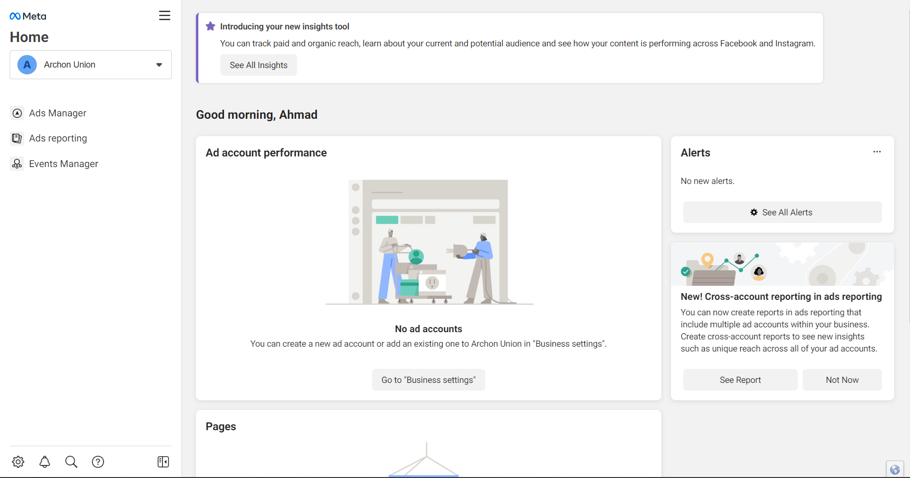<figcaption></figcaption></figure>

6. After that, you will need to **click** on the highlighted **≣** icon and go to **Business Settings**.

<figure>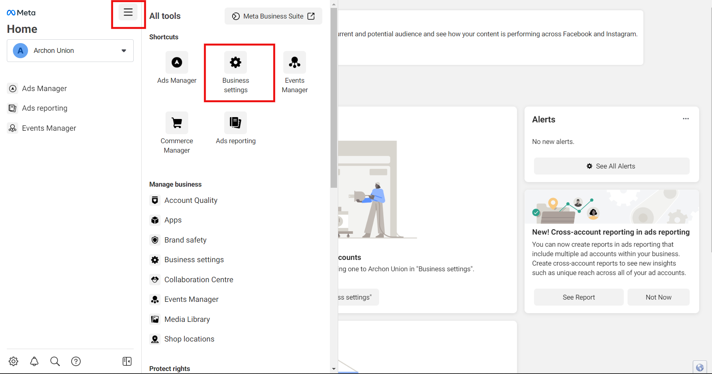<figcaption></figcaption></figure>

## Create an Ad Account

1. Go to **Accounts** and then select **Ad Accounts**. After that, you can press the **Add button**. The purpose of creating an **Ads Account** is to connect it with your **Meta Business Suites** account and to make it easier for you to run ads.

<figure>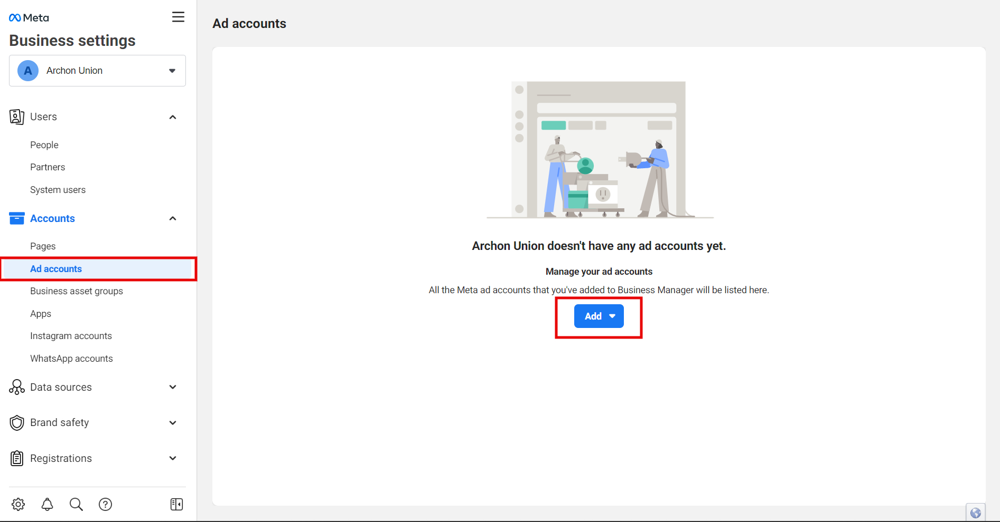<figcaption></figcaption></figure>

2. You will see **3 options** as shown in the picture below.&#x20;

Option: ***Add an Ad Account*** - If you already have a Facebook personal account with an Ad Account. You can use this option to transfer it from your personal account to your Business Account.&#x20;

Option: ***Request to an Ad Account*** - Use this option if you are managing ads for someone else.&#x20;

Option: ***Create a New Ad Account*** - This option is for those who are new to advertising or do not want to have any connection with previous ad accounts.&#x20;

For this setting step, the option **Create a New Ad Account** will be chosen to make it easier for all levels to learn and follow the next steps for this setting.

3. Click Create a **New Ad Account**.

<figure>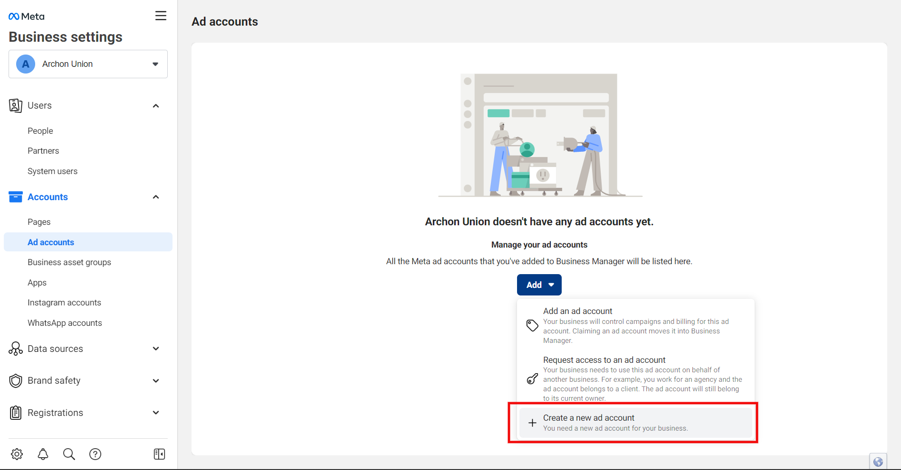<figcaption></figcaption></figure>

4. Enter the information and **select MYR (Malaysian Ringgit)** as the currency to ensure that your ad account always uses the value of the **Malaysian Ringgit** and then click the **Next** button.

<figure>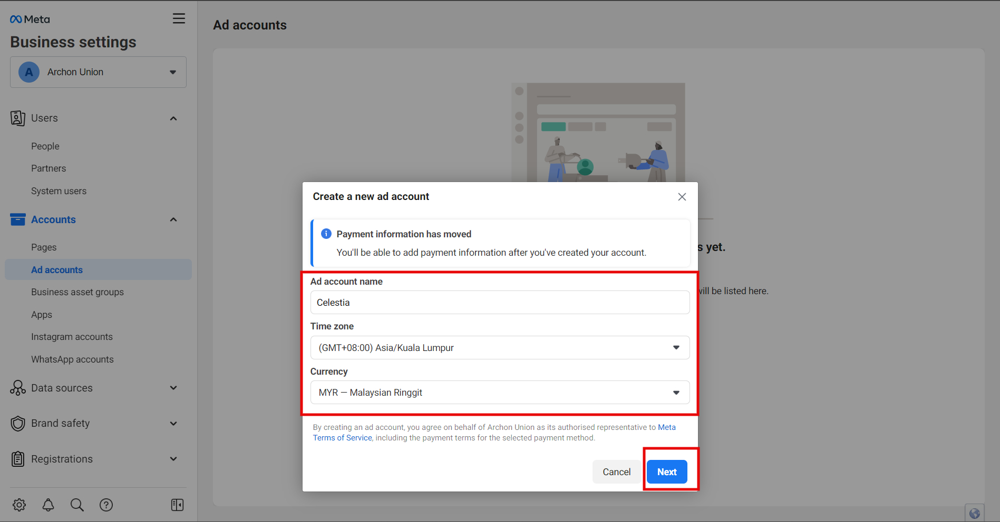<figcaption></figcaption></figure>

5. Mark on **My Business** and click **Create.**

<figure>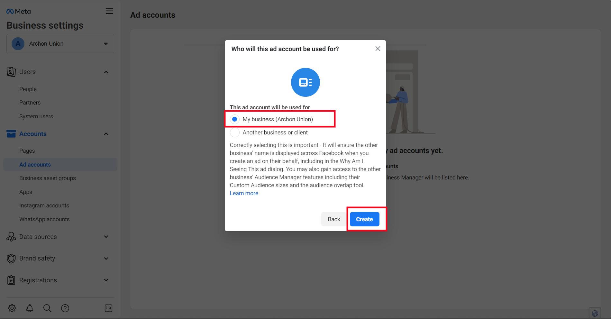<figcaption></figcaption></figure>

6. In the "**Assign**" section, you will be able to **assign the power** for the **Ad Account** that you created earlier. \
   \
   \*\*Make sure to **check the name on the left panel** and also check "**Manage Ad Account**" to give yourself full power. Then click the "**Assign**" button.

<figure>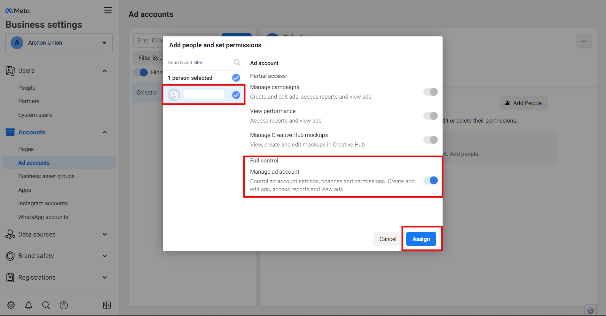<figcaption></figcaption></figure>

7. On this page, you will be given the option to choose "**Add Payment Info**" or "**Close**", for this tutorial, we will choose to "**Close**", but for those who want to **run Ads**, you will need to set up "**Add Payment Info**".

<figure><figcaption></figcaption></figure>

8. For this prompt, you will need to choose "**Exit**".

<figure>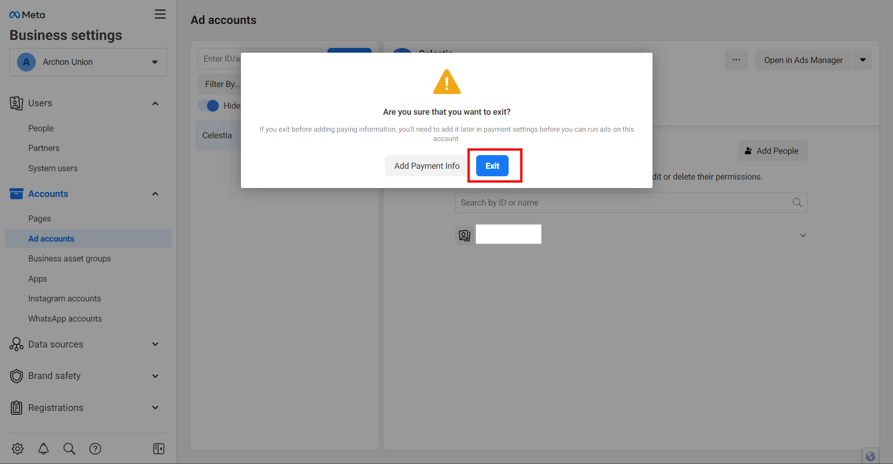<figcaption></figcaption></figure>

## Creating Facebook Pixel

1. You can go to the "Business settings" page first by clicking on the **gear icon** button

<figure>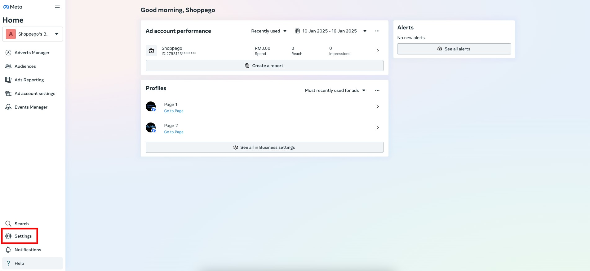<figcaption></figcaption></figure>

2. In the left panel, you need to click on **Data sources** and click on **Datasets**

<figure>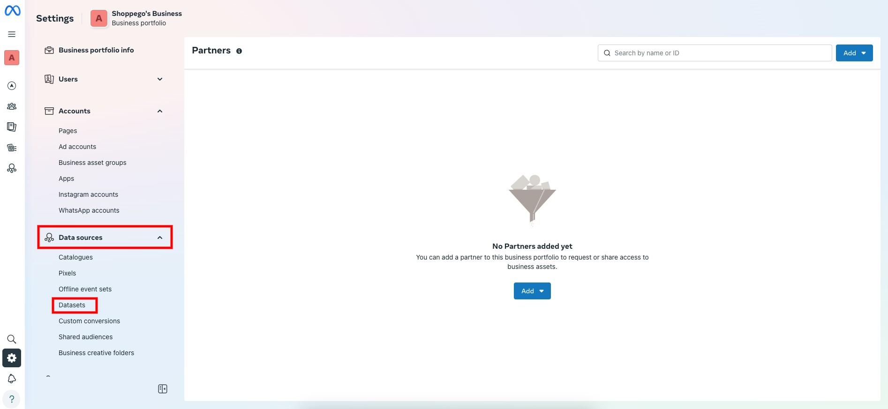<figcaption></figcaption></figure>

3. Next, click the **Add** button to start creating your Datasets/Pixels. The purpose of the Facebook Pixel is to show user activity on your website.

<figure>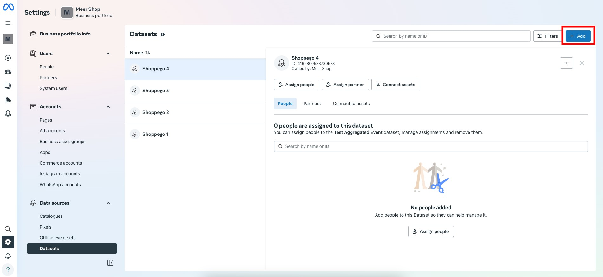<figcaption></figcaption></figure>

4. Then, on the "**Create a new dataset**" popup, you can enter the name of your datasets/pixels in the "**Name**" column and click the **Create** button when finished.

<figure>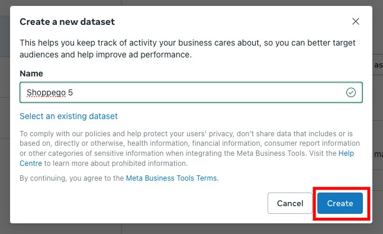<figcaption></figcaption></figure>

5. Once done, you can **refresh the Datasets page** and you will be able to see the Dataset settings you just created. You can also get a "**Pixel ID**" to use on Shoppego.

<figure>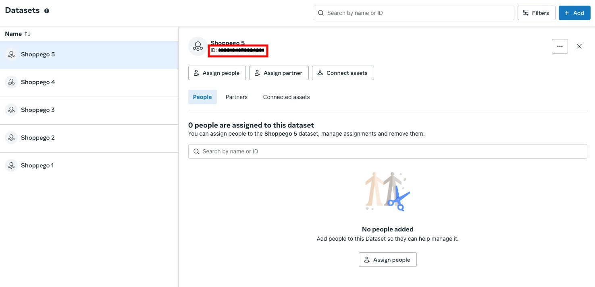<figcaption></figcaption></figure>

6. Then, you need to "**Assign people"** and "**Assign assets (Ad account)"** to the pixel. You can click on the **Assign people** button

<figure>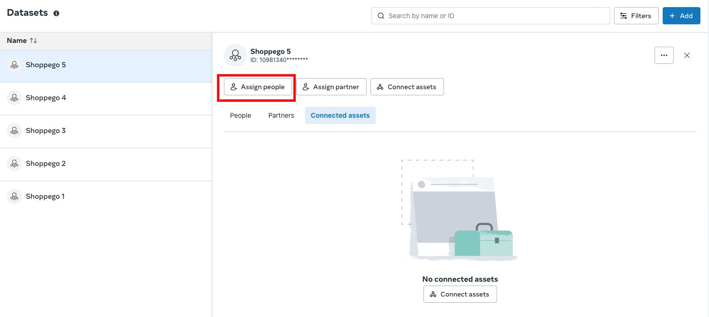<figcaption></figcaption></figure>

7. "**Select your account**", "**tick the Full control toggle**" and click **Assign**

<figure>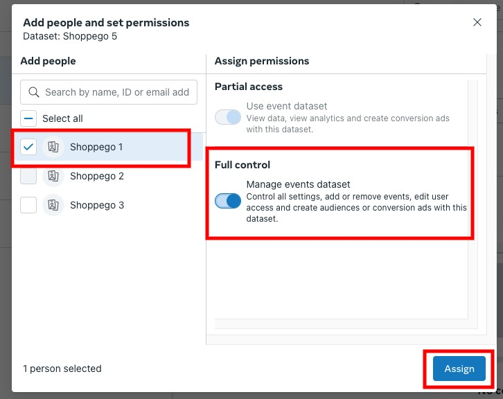<figcaption></figcaption></figure>

8. Then, click on the "**Connect assets**" button

<figure>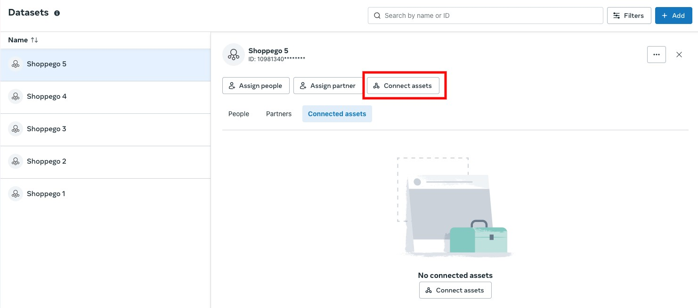<figcaption></figcaption></figure>

9. On the pop up that will be displayed later, you can click "**Other business assets**" and select y**our "Ad account"** and click **Add**. Once done, you can now enter the FB Pixel ID into your Shoppego store.

<figure>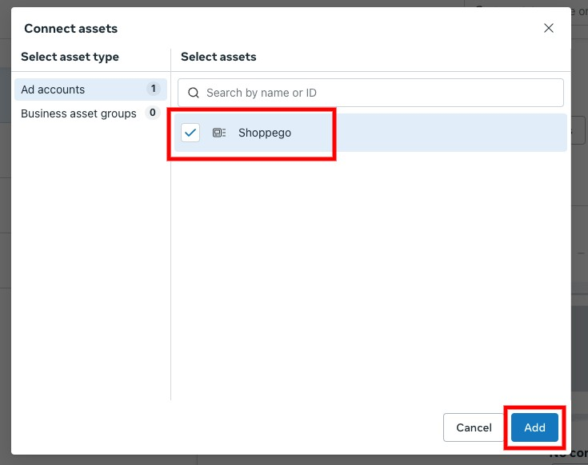<figcaption></figcaption></figure>

If you want to go to the Events Manager page, you can click on the **3-dot icon** button and select **Open in Events Manager**

<figure>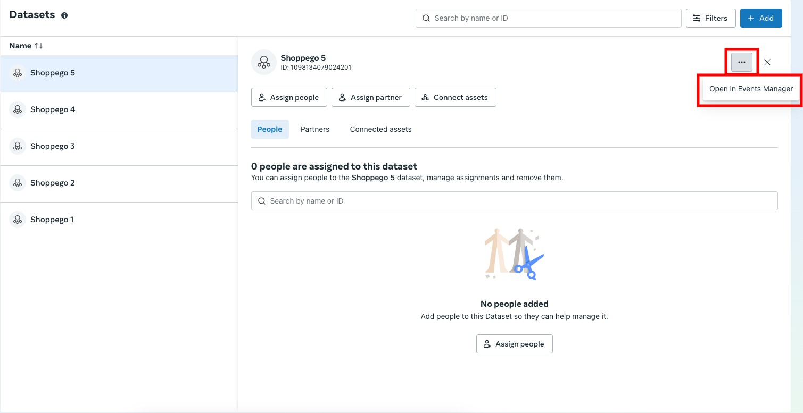<figcaption></figcaption></figure>

## Set up in Shoppego

1. Log in to your **Shoppego Dashboard Overview** and click on "**Settings**" > "General". After that, you can enter your **Facebook Pixel ID** in the provided field.

<figure>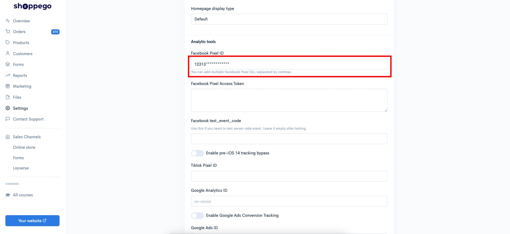<figcaption></figcaption></figure>

**Congratulations**! Your Pixel has been **successfully set up** in your Shoppego.

## Facebook Pixel Setup (Test Event)

 <mark style="color:red;">**Note**</mark>: Setting up test events is **important** and **should be done** before **using this Pixel** for your ad settings. This is to ensure that all your events can be triggered as usual and there are no problems.




1. To set up **Test Events** for the **Pixel** you just created, you can press "**Test events**" and then enter **your website name** or **domain** into the provided field. Then you can press "**Open Website**".

<figure>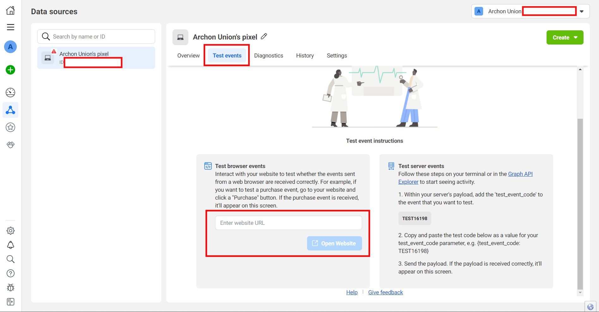<figcaption></figcaption></figure>

2. After that, you will be taken to **your website** and you can try to do **test events** such as **Page View, Add to Cart, etc.**

<figure>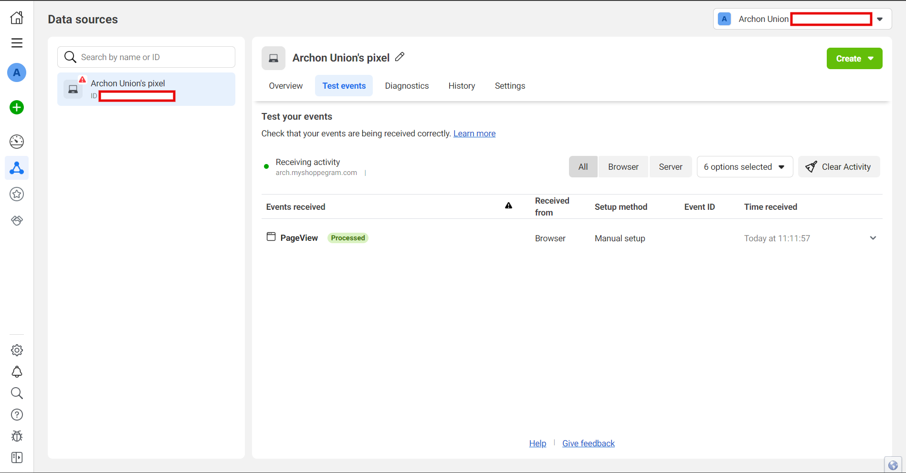<figcaption></figcaption></figure>

3. You will need to **check the data of the events that have been triggered,** if the **data** that **appears is the same**, this means that **the setting of your Facebook Pixel is correct** and there are **no issues**.

<figure>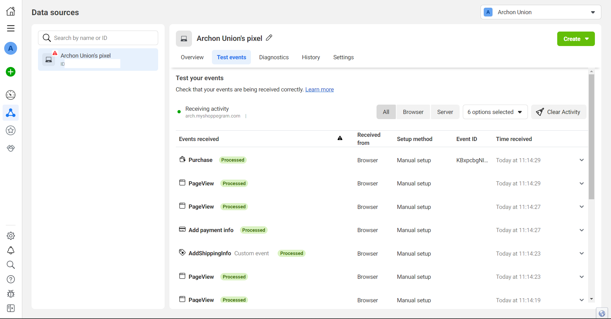<figcaption></figcaption></figure>

## Facebook Pixel Issues

If you are **experiencing issues** with your **Facebook Pixel**, you can refer to the tutorial link below for assistance:


[Configuration Error](facebook-pixel/configuration-error.md)

