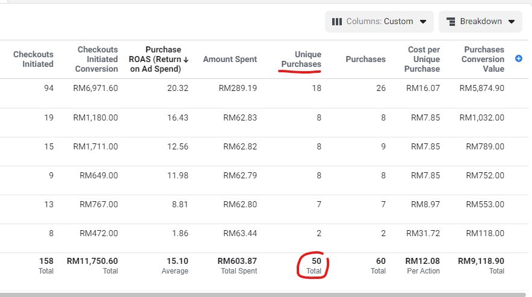
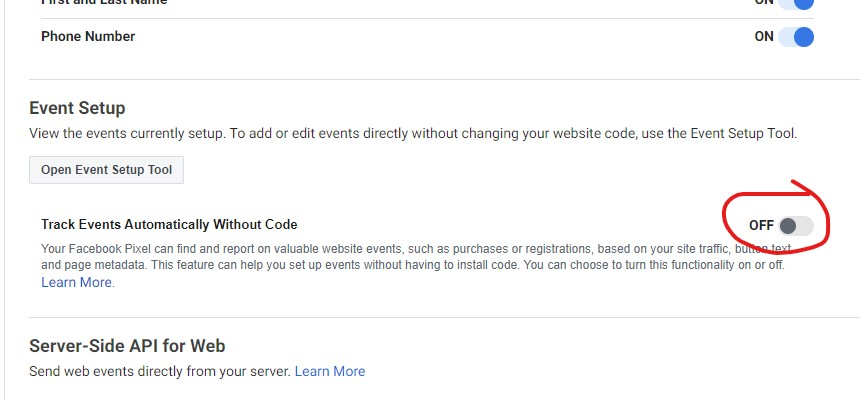

# Configuration Error

You have an issue with the Purchase data on the ads manager account not the same as the actual order on the website?

## There are 2 main reasons this error can occurred.

### 1. Inaccurate data track

Many people use **Purchase Count** in **ads manager** to **track purchases**. Actually, this method is <mark style="color:red;">**less accurate**</mark>.

To acquire the **accurate purchase data** in the ads manager, you have to use **UNIQUE purchase data**. **Unique means**, Facebook will only take data from the purchaser whose IP address is **unique**. Even if the customer **refreshes** the **thank you page many times**, **unique purchase events** are still **counted as once** because they are from the **same IP/individual**.

### 2. Pixel problem 

### Additional Scenarios

There are still many who incorrectly **installed** or **incorrectly setup Facebook Pixel**. How to **troubleshoot**?

* Go pixel manager events, test events. Enter the **website URL**. Run **one standard event** at a time from entering the **homepage, add to cart / initiate checkout** until purchase. **If all events** are **detected** **normally**. Your pixels are **OK**.

Standard events trigger more than once / duplicated?

* If this issue occurs, check on **Pixel settings -> Event Setup ->** Make sure you <mark style="color:red;">**OFF**</mark> "**Track events automatically without code**" This is a <mark style="color:red;">**setting that causes the issue of excessive data**</mark> that is purchase in ads manager more than the actual purchase and **it&#x20;**<mark style="color:red;">**will interfere**</mark>**&#x20;with the original code to track standard events**.


**Pro tips**: If you want to test the pixel using the <mark style="color:blue;">**chrome extension pixel helper**</mark>, make sure to <mark style="color:red;">**disable the AdBlocker**</mark>**&#x20;(if there is one)**.


## Troubleshoot Facebook Pixel

If you have issues with your **Facebook Pixel** where your data is not tallying correctly, you can refer to the tutorial link below for troubleshooting steps:

[https://my.shoppego.com/courses/facebook-ads-essentials-2024/116](https://my.shoppego.com/courses/facebook-ads-essentials-2024/116)
