# Google Ads

To set up Google Ads integration with Shoppego account, you need to get Google Ads ID, **Purchase label**, **Begin checkout label** and **Add to cart label**.

You need to make sure you already have your own Google Ads account for you to get the required keys.

You can refer to the link below for steps to get the required keys.

Also, make sure you have **Google Analytics** settings for your Shoppego store to enable you to create these **Google Ads settings**. If you have not yet set up Google Analytics for your store, click on the button below:


For "forms", you can still follow this tutorial. However, you need to choose the Leads Label ID.



[Google Analytics](google-analytics.md)


## Log in to your Google Ads account

You can **log in** to your **Google Ads account** first to make these settings. You can click on this link to log in: <https://ads.google.com/home/>

1. On the **Dashboard**, you can click on the **TOOLS & SETTINGS** button.

<figure>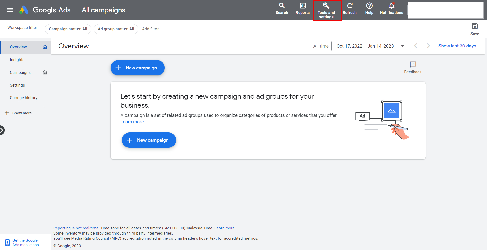<figcaption></figcaption></figure>

2. You can go to the **Measurement section** and **select Conversions**.

<figure>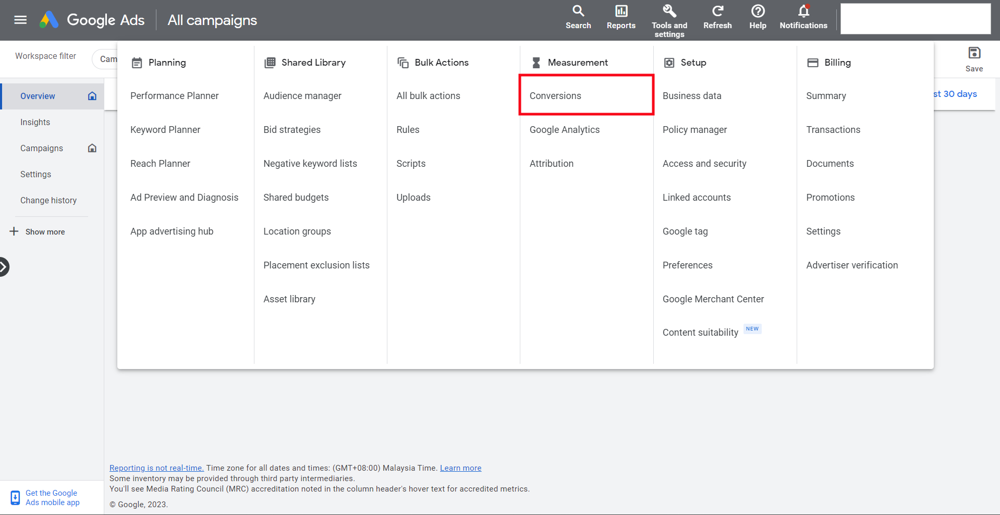<figcaption></figcaption></figure>

3. Then, you can **press New Conversion Action**.

<figure>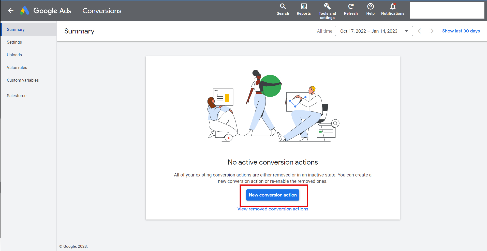<figcaption></figcaption></figure>

4. In this section, you need to select **Website**.

<figure>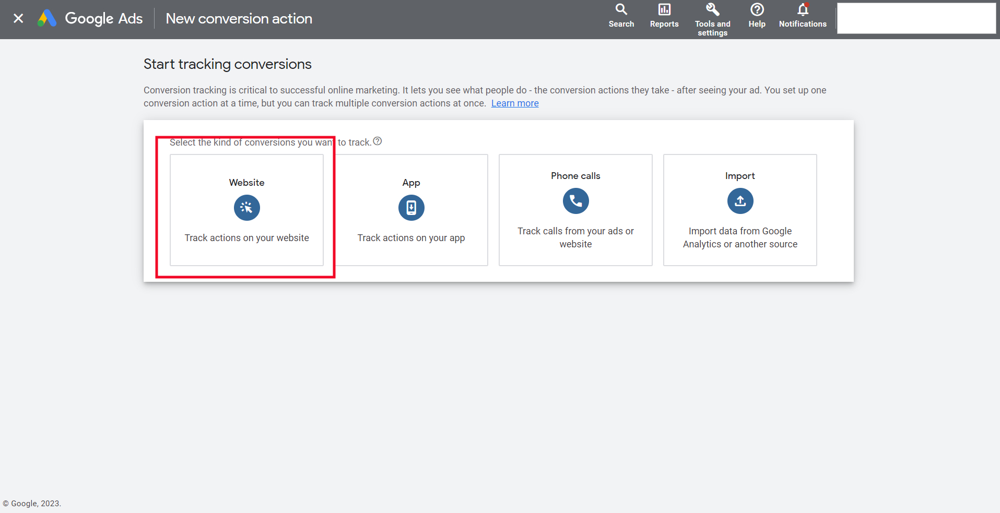<figcaption></figcaption></figure>

5. Then, you need to enter your **website name** or **domain name**. Then you can **press** the **Scan button**. After that, you can press the **Save and Continue** button.

<figure>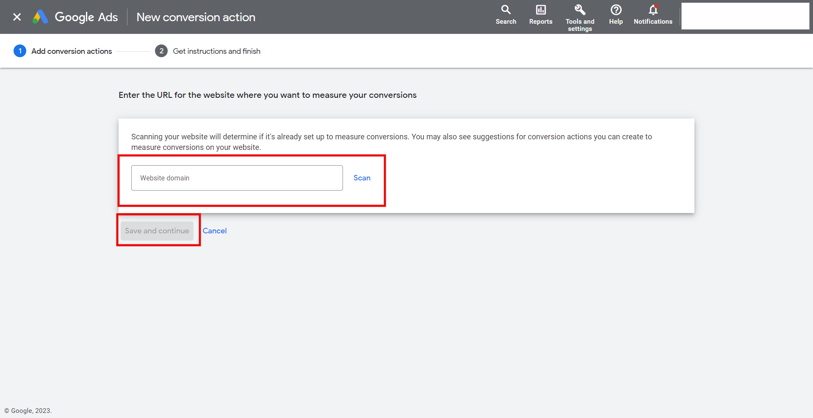<figcaption></figcaption></figure>

6. You need to make sure that the **domain name listed** in the **Website domain section is correct.** Then, you can press **Add a conversion action manually.**

<figure>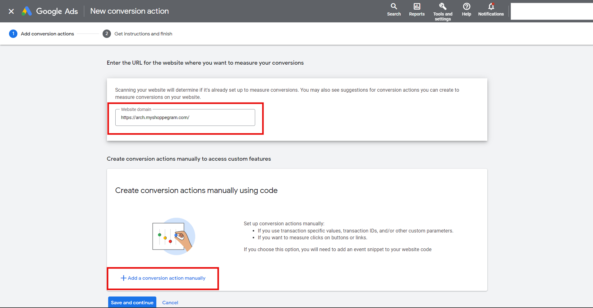<figcaption></figcaption></figure>

7. In the **Goal and action optimization** section, you can **select Purchase**. Then in the **Conversion name**, you can place the name **Purchase Shoppego**. In the **Value** section, you can select **Use different value for each conversion**.

<figure>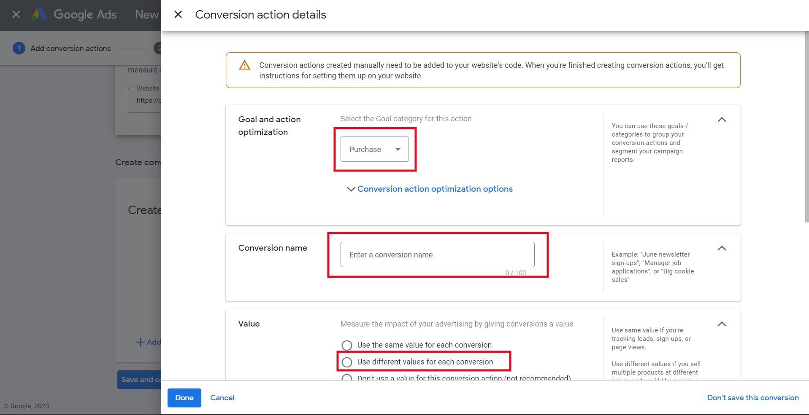<figcaption></figcaption></figure>

8. In the **Goal and action optimization** section, you will see in the **Conversion action optimization options** section, in this tutorial we will use the <mark style="color:red;">**default setting**</mark>, which is **Primary action used for bidding optimization.**

<figure>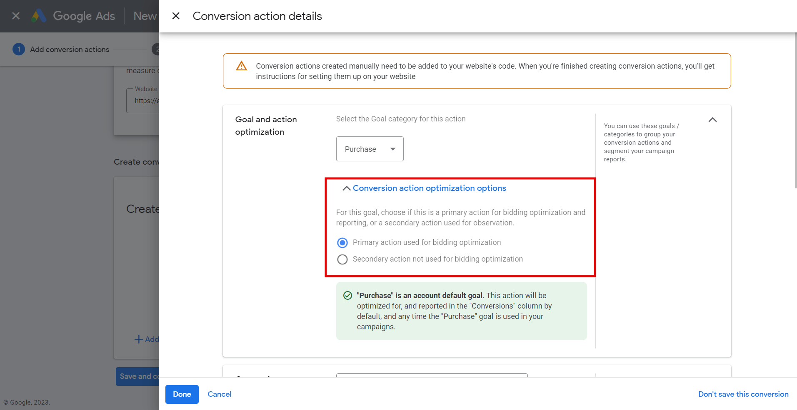<figcaption></figcaption></figure>

9. Make sure the **Conversion Name** and **Value** are the same as **step 1**. In the **Count** section, you can select **Every**.

<figure>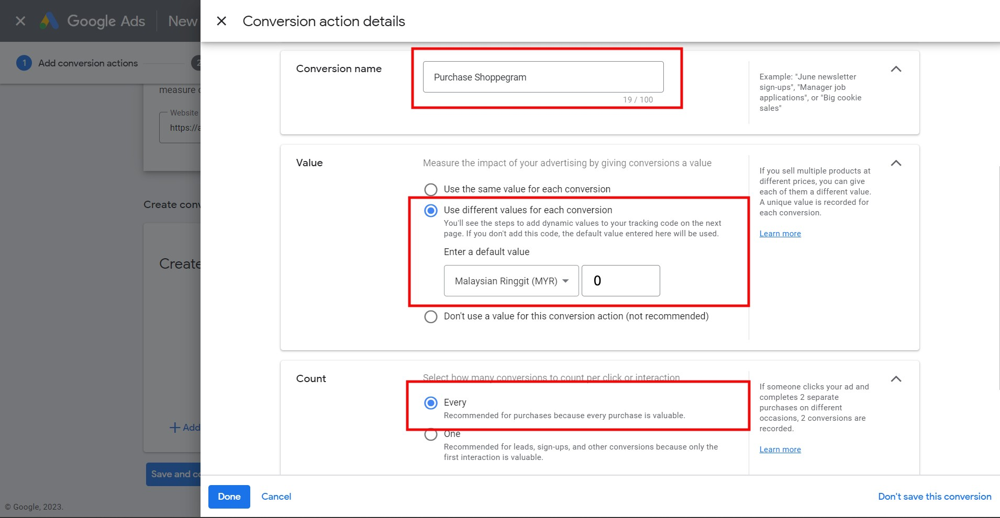<figcaption></figcaption></figure>

10. In the **Attribution Model** section, make sure you select the default setting, which is **Data-driven**. Then you can press the **Done** button.

<figure>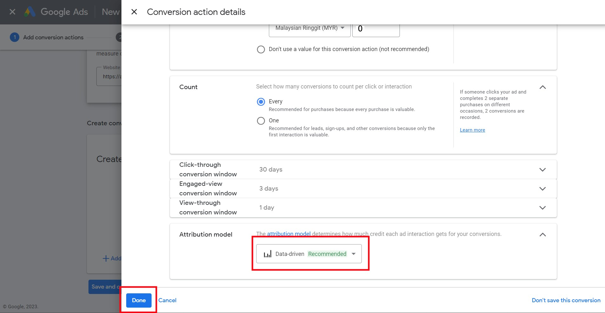<figcaption></figcaption></figure>

11. To get your **Tag**, you can press your **Purchase Shoppego.**

<figure>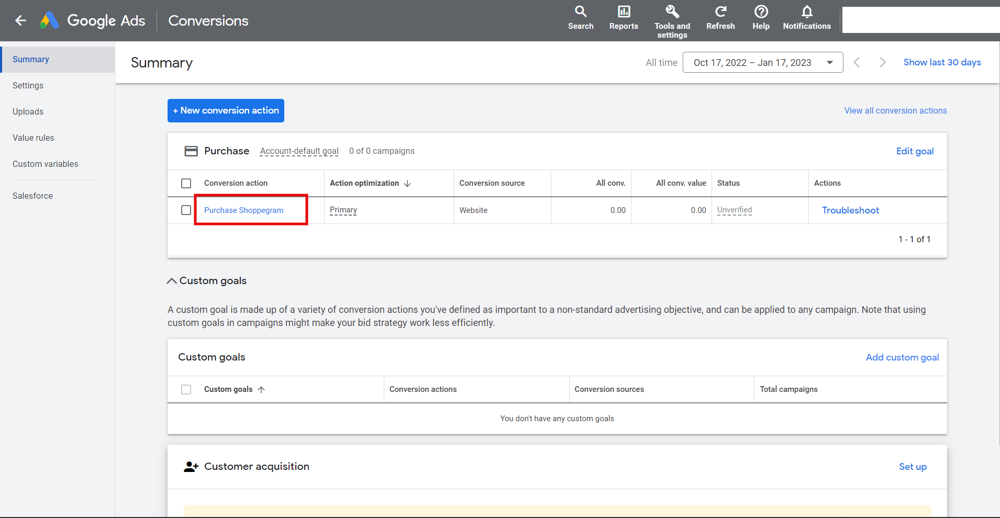<figcaption></figcaption></figure>

12. On this page, you can **press Tag Setup.**&#x54;hen, you can select **Install the tag yourself.**

<figure>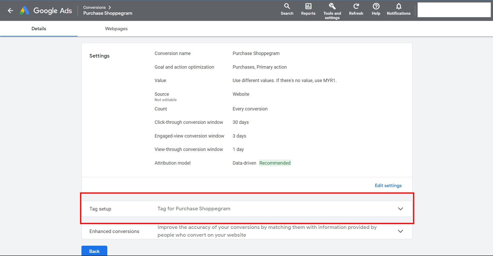<figcaption></figcaption></figure>

13. Then, you can select **Install the tag yourself.**

<figure>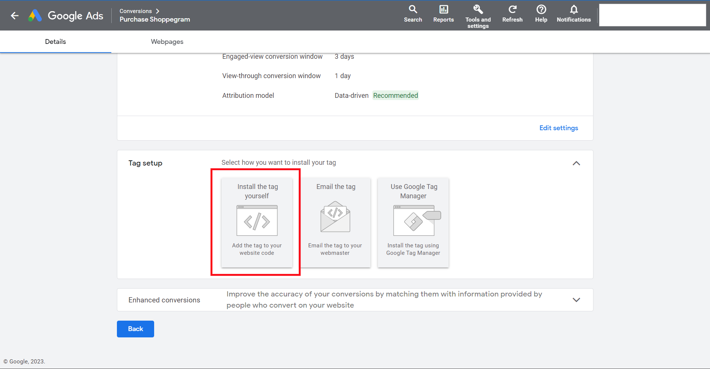<figcaption></figcaption></figure>

## Get Google Ads ID:

1. Make sure the **see code** for section has **HTML selected**, and in the **Google Tag section**, **select The Google tag isn't installed on your HTML pages**. You can copy the <mark style="color:red;">**value that is obscured**</mark> for setting up in Shoppego later.

<mark style="color:red;">**Note**</mark>: The obscured value in this picture is the value that will be placed in the **Google Ads ID**.

<figure>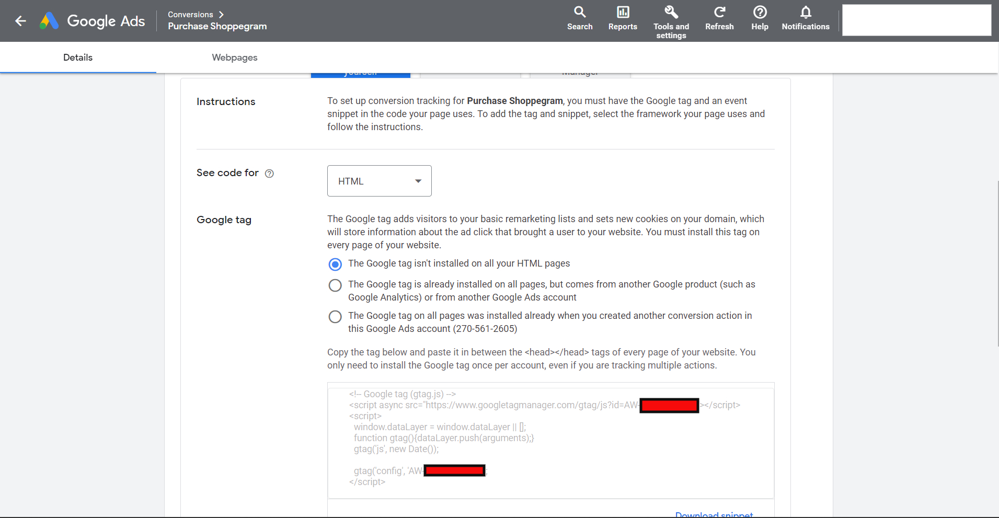<figcaption></figcaption></figure>

### **Purchase Label ID:**

2. In this picture, you will see the **value for your Purchase Label ID,** you can **copy** and **save** this value for setting up in Shoppego.

<figure>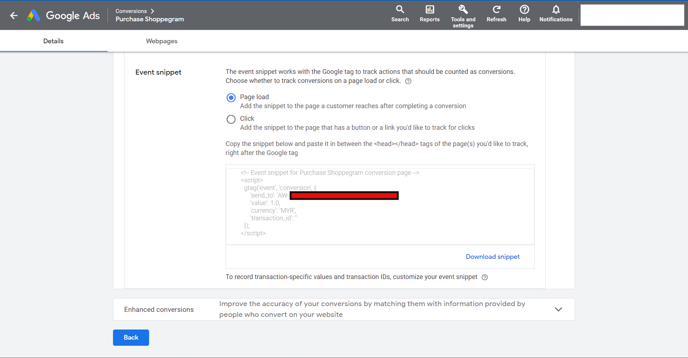<figcaption></figcaption></figure>

## Get Add to Cart Label ID:&#x20;

3. Then, **press New Conversion Action** to get the **Label value for Add to Cart** and **Begin Checkout.**

<figure>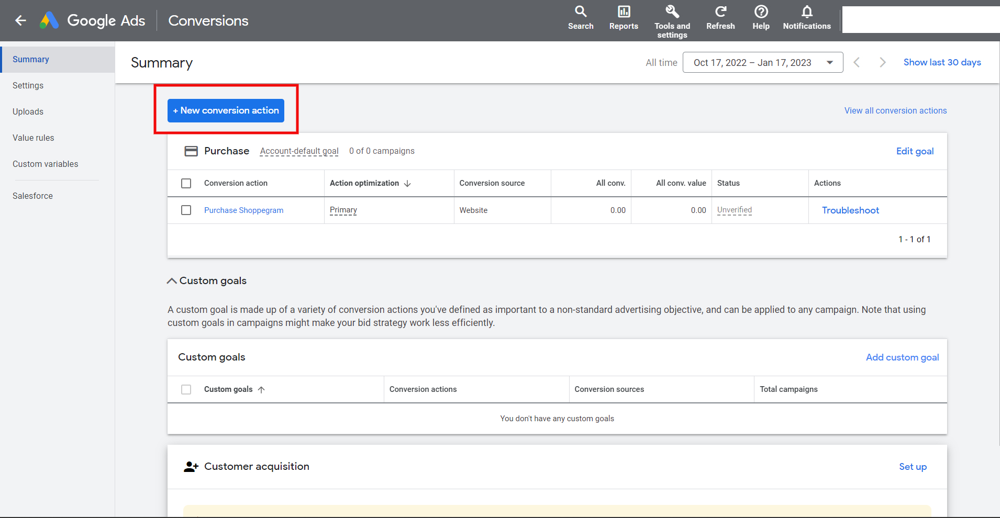<figcaption></figcaption></figure>

4. In this section, you can select **Website**.

<figure><figcaption></figcaption></figure>

5. Then, you need to **enter your website name** or **domain name.** Then you can press the **Scan** button. After that, you can press the **Save and Continue** button.

<figure><figcaption></figcaption></figure>

6. Make sure your **domain name is written** in the designated field on Website Domain. Then, you can **press Add a conversion action manually.**

<figure><figcaption></figcaption></figure>

7. In the **Goal and action optimization** section, you need to select **Add to Cart,** in the **Conversion Name** you can enter the name **Add to Cart Shoppego**. In the **Value** section, you can **select Use different value for each conversion** and enter **RM 1** in the **Enter a default value section**.

<figure>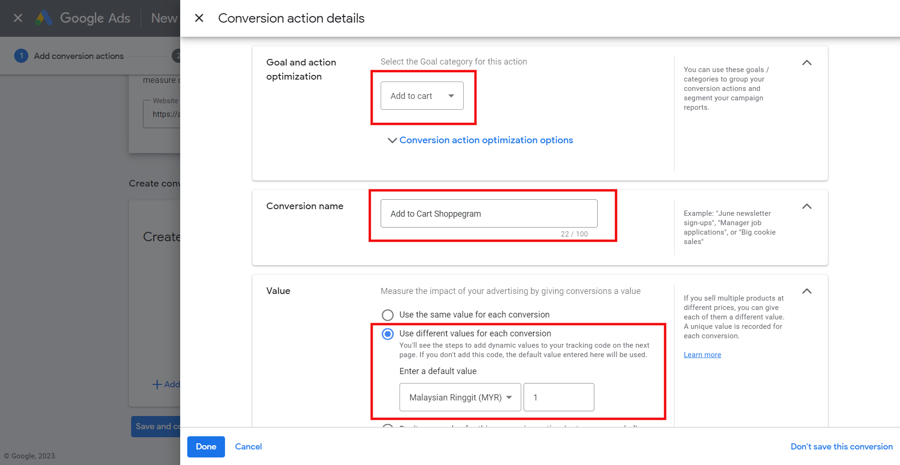<figcaption></figcaption></figure>

8. In the **Count** section, you can select **Every**, and in the **Attribution Model** section, make sure you have selected **Data-driven**. Then you can press the **Done** button.

<figure>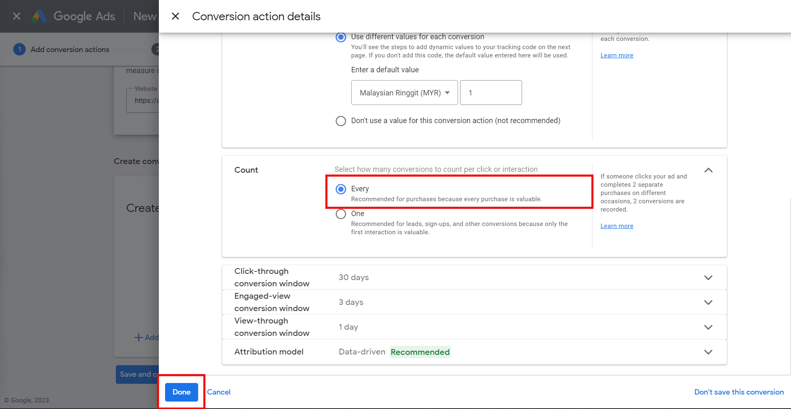<figcaption></figcaption></figure>

9. After entering all the required information, you can **press Save and Continue**.

<figure>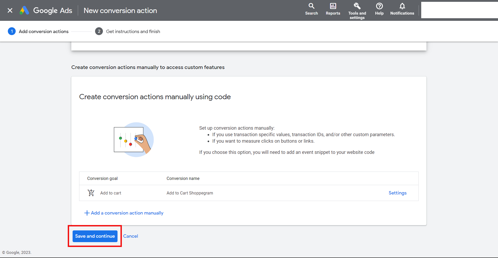<figcaption></figcaption></figure>

### Add to Cart Label ID:&#x20;

1. On this page, you can **press See event snippet**.

<figure>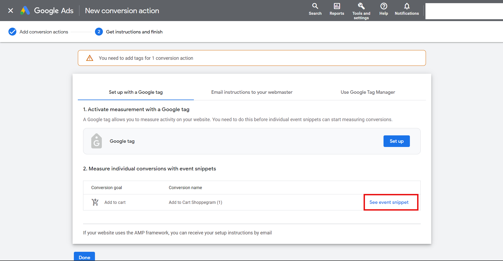<figcaption></figcaption></figure>

2. You will see your **Add to Cart ID** in the <mark style="color:red;">**red-boxed area**</mark>, you need to **copy** and **save** this value because it will be used in the Shoppego system. Then, you can **press the Close button**.

<figure>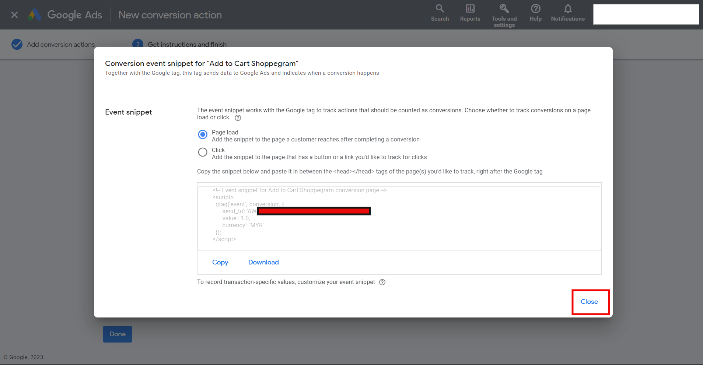<figcaption></figcaption></figure>

## Get Begin Checkout Label ID&#x20;

1. To start setting up to get the **label for Begin Checkout**, you need to **press the New Conversion Action** button.

<figure>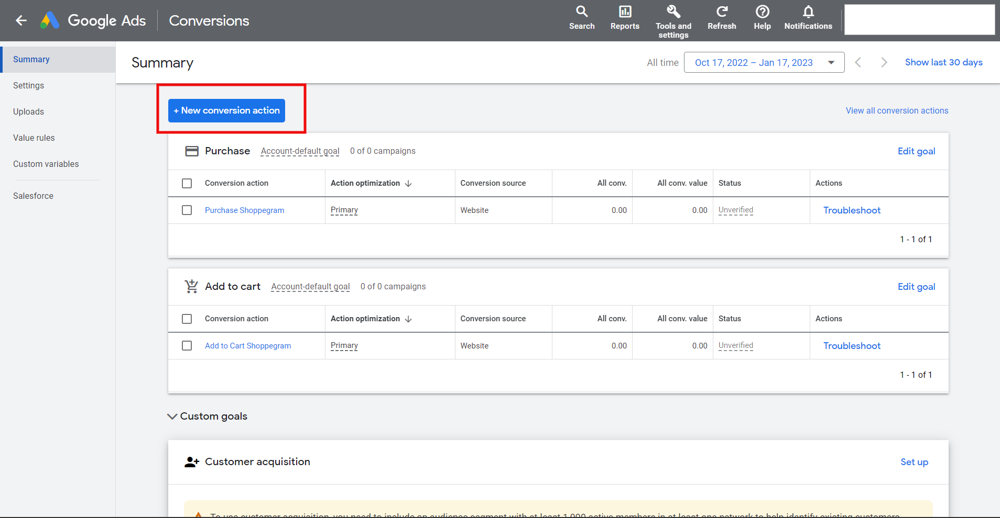<figcaption></figcaption></figure>

2. In this section, you can choose **Website**.

<figure><figcaption></figcaption></figure>

3. Then, you need to **enter your website name** or **domain name**. After that, you can press the **Scan** button. When finished, you can press the **Save and Continue** button.

<figure><figcaption></figcaption></figure>

4. Make sure your **domain name is written** in the designated field on **Website Domain**. Then, you can **press Add a conversion action manually**.

<figure><figcaption></figcaption></figure>

5. In the **Goal and action optimization**, you need to select **Begin to Checkout**, in the **Conversion Name** you can enter the name **Begin Checkout Shoppego**. For **Value**, you can choose **Use different value for each conversion** and in **Enter a default value**, you can enter a value of **RM 1.**

<figure>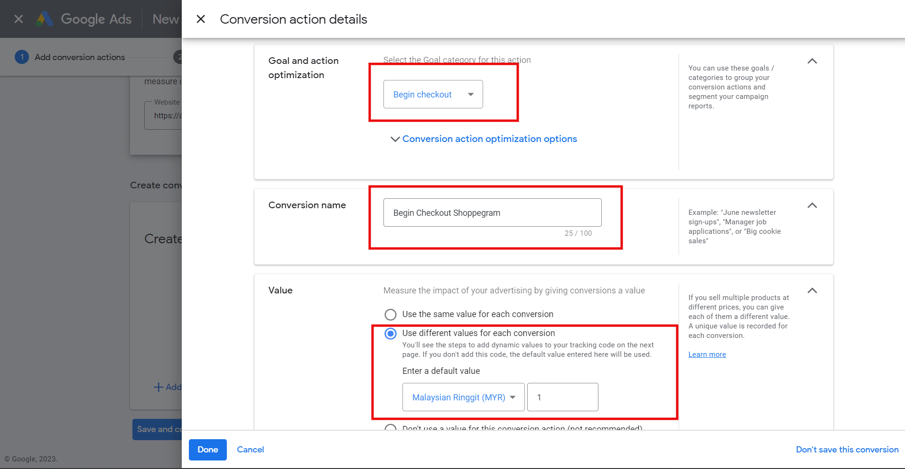<figcaption></figcaption></figure>

6. For **Count**, you can choose **Every**, for **Attribution Model** make sure you have selected **Data-driven**. After that, you can **press** the **Done** button.

<figure><figcaption></figcaption></figure>

## Add to Cart Label ID&#x20;

1. On that page, you can **press See event snippet.**

<figure>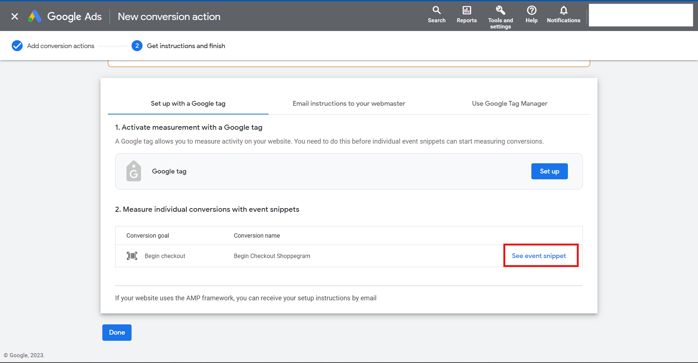<figcaption></figcaption></figure>

2. In the box that has been **highlighted,** that is the **Begin Checkout Label ID**, you need to **copy** and **save it** as it will be used in the Shoppego system.

<figure>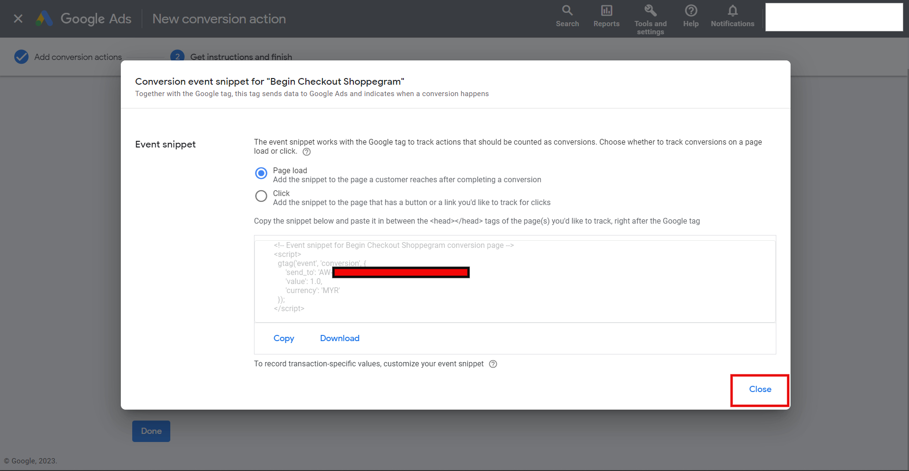<figcaption></figcaption></figure>

## Setup in Shoppego

Once you get all the keys you need, you can link your Google Ads with Shoppego by entering all the keys in your Shoppego account.

For more information, you can refer to the setup steps below:

1\. Log in to your Shoppego account. Click on **Settings > General.** Next, you can scroll down to enable the **Enable Google Ads Conversion Tracking** toggle

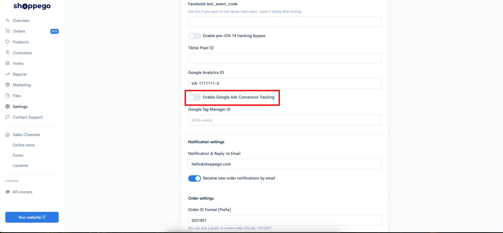

5\. Then, you can **enter all the keys in the space provided**

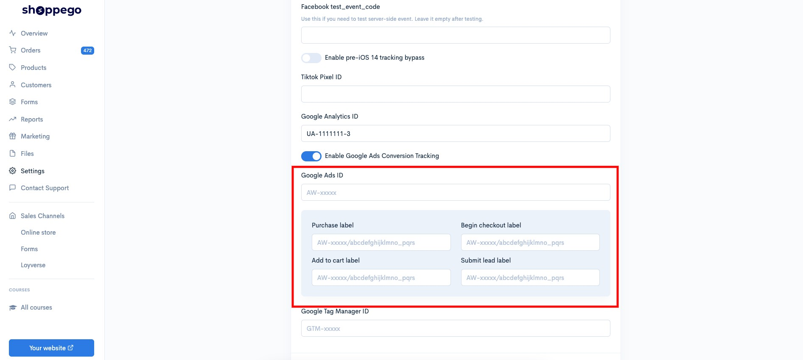

6\. Once done , click on **Save**.

