# Google Analytics


Google Analytics (GA) is a tool that **allows you to monitor all activities** on your website for the **purpose of data collection** so that the **improvement of your website flow can be done.**


For this **Google Analytics** setup in Shoppego, you only need to get a **Google Analytics ID** to enter in Shoppego.

You can refer to the settings below to get **Google Analytics** and enter it in the **Shoppego** system.

## Part 1: Login/Register your Google Analytics account

1\. You can log in to your Google Analytics account first. You can click on this link :  <https://analytics.google.com/analytics/web/>

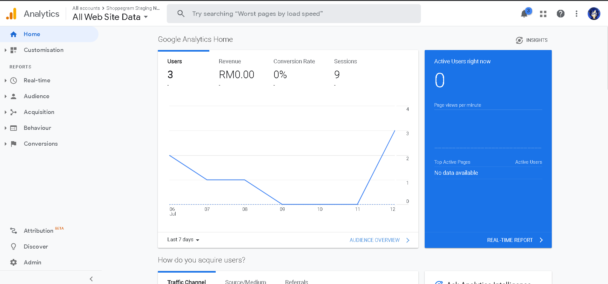

2\. Next you can click on the **Admin** button in your dashboard.

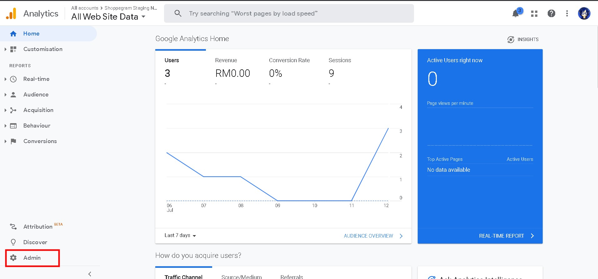

3\. If you do not have a Google Analytics Tracking ID you can click on **Create Property**. If you already have a Google Analytics Tracking ID, you can skip straight to step 8 of this part 1.

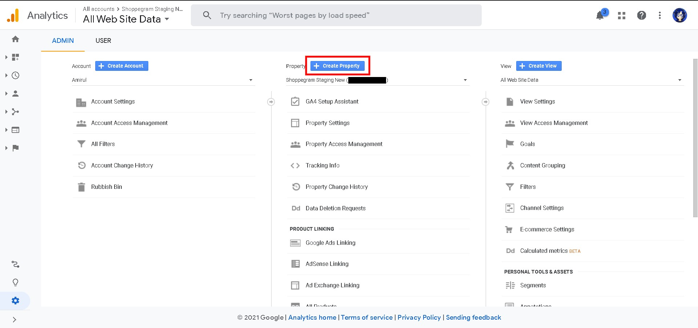

4. Next, you can enter the information they want as in the display below. Once you have entered the information, click Show advanced options
   * **Property name:** This tracking name makes it easier for you to **monitor the data**
   * **Reporting time zone:** Make sure you select **Malaysia**&#x20;
   * **Currency:** Make sure you select **Malaysian Ringgit (MYR)**

<figure>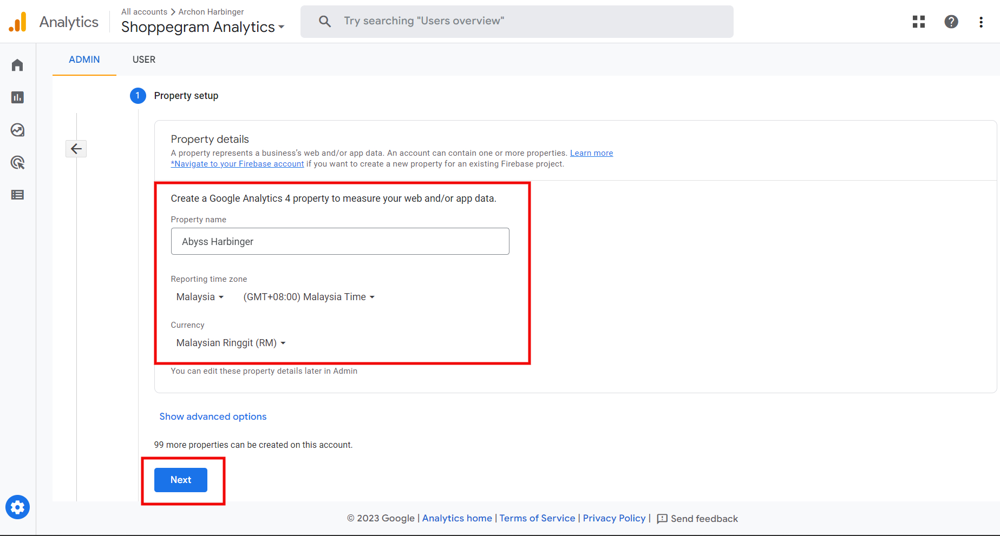<figcaption></figcaption></figure>

7\. Next, you need to enter some information about your business for the purpose of survey and data collection as well as improvement of their system. After you have finished entering all the information you can click **Create**

<figure>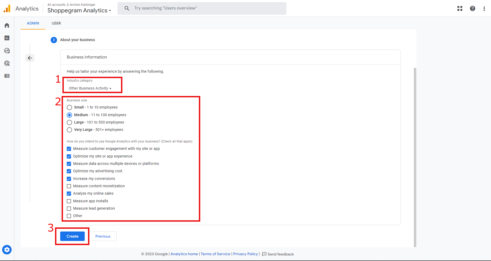<figcaption></figcaption></figure>

6\. Then you can enter your **website name** or **domain** in the **Website** URL and also create a name for your **Stream name** in the provided field. After that, you can click the **Create stream** button.

<figure>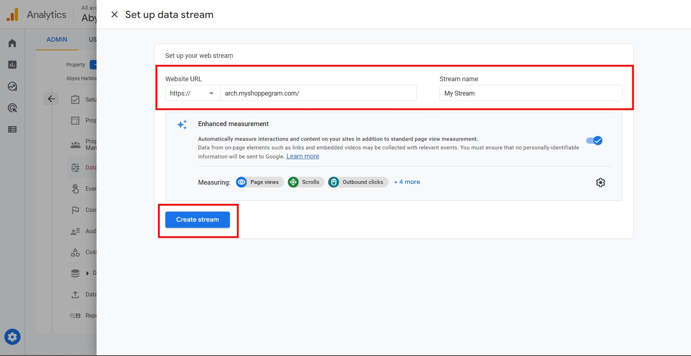<figcaption></figcaption></figure>

7\. You can **copy** the **Measurement ID** to be placed in your Shoppego system later.

<figure>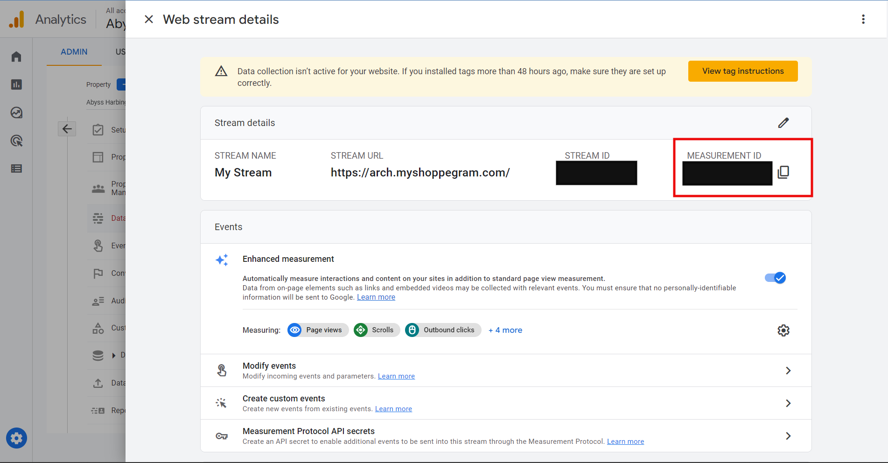<figcaption></figcaption></figure>

## Part 2: Setup in Shoppego

1\. Log in to your Shoppego account. Click on **Settings > General.** Scroll below to find the space for you to enter your **Google Analytics ID.**

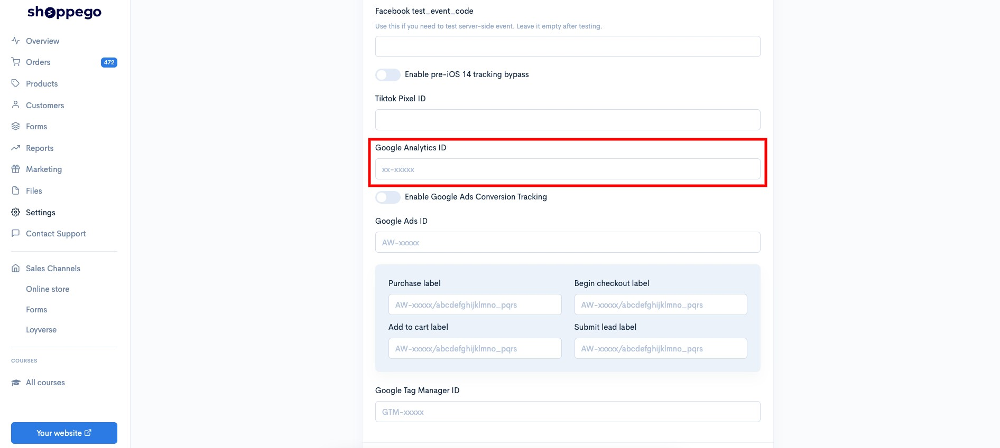

5\. In the **Google Analytics ID** field, you can enter the **Tracking ID** you just obtained in the previous Part 1 tutorial step number 8.

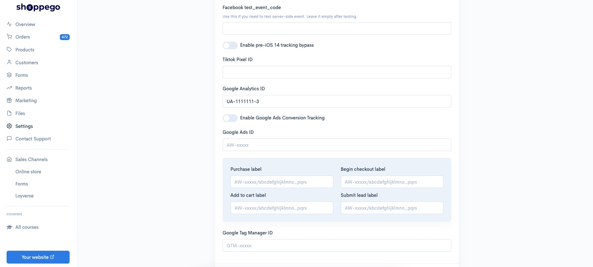

6\. Once done, you can click Save. Your **Google Analytics** setup is now successful.

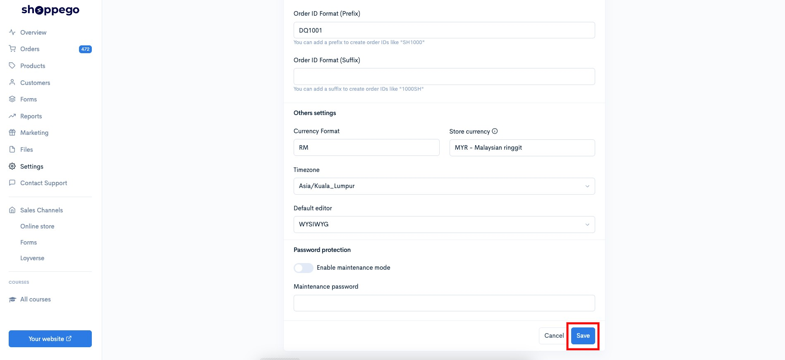

## E-commerce Setup


The following settings are for the **old Google Analytics system** (using Google Analytics - Universal Analytics). If you **do not have** these settings, you **can ignore** this section.


This function allows you to enhance the reporting of E-commerce related data for your website. For setting you can refer to the setting steps below:

1\. Go to your **Google Analytics** dashboard

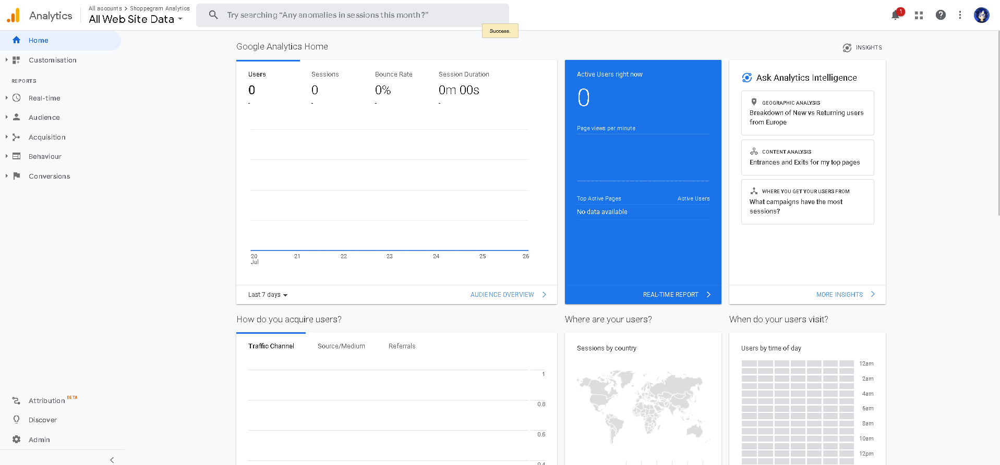

2\. Click on **Admin**

3\. Click on **E-commerce Settings**

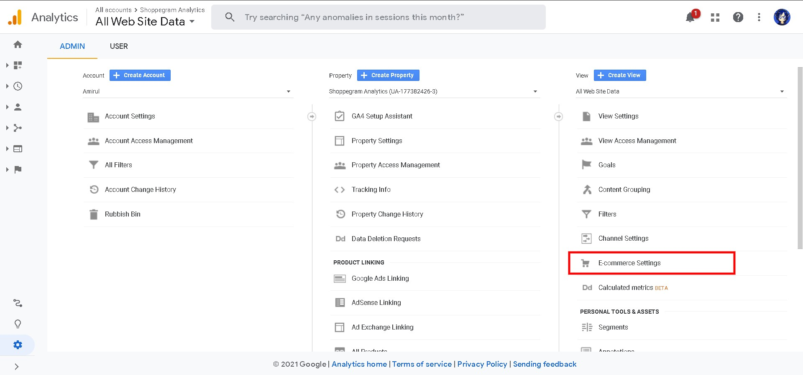

4\. Activate toggle **Enable E-commerce**

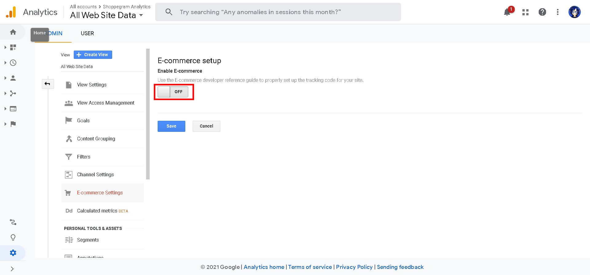

5\. Then activate toggle **Enable** **Enhanced E-commerce Reporting**

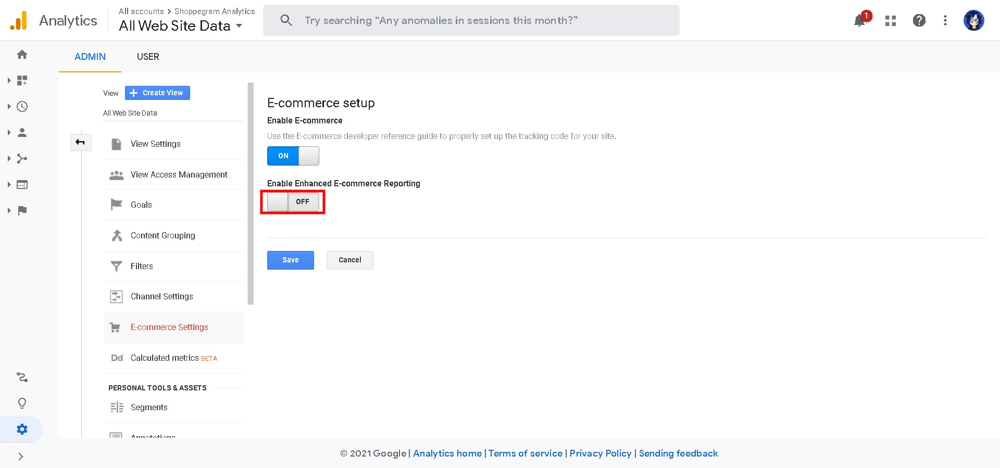

5\. Once you done, click **Save**.

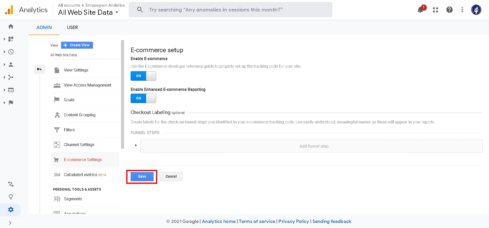
