# Google Search Console


To allow our website to be **ranked** in the **Google Search engine**, our website needs to be submitted to Google so that they know about the existence of our website.&#x20;


There are various ways to do this, among them are:-

1. Using **HTML Tag**
2. Using **Google Tag Manager**
3. Using **Google Analytic**
4. Using **DNS**


The **easiest and fastest** way is to use **HTML tags** because you only need to enter the code provided.


Make sure you log in to your Gmail account first to use Search Console. The best way is to use the Google Chrome browser as everyone is automatically signed in.

## Method 1: Use HTML tags

1. : Go to the following link : <https://search.google.com/search-console/welcome>

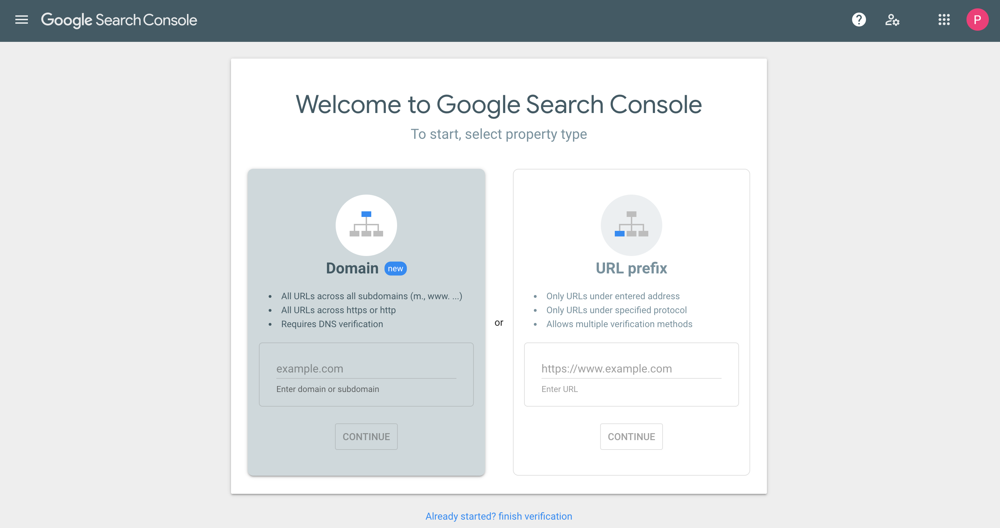

2. The display will come out as above.
3. If you use **your own domain enter your domain name in the Domain tab**&#x20;
4. If you use **a subdomain** from **Shoppego** for example **kedaisaya.myshoppegram.com** you can enter it on the **right side of the tab** which is in the **URL prefix section.**

In this example we will use the URL prefix.

5. Make sure there is **https: //** and followed by **your domain** or **subdomain**.

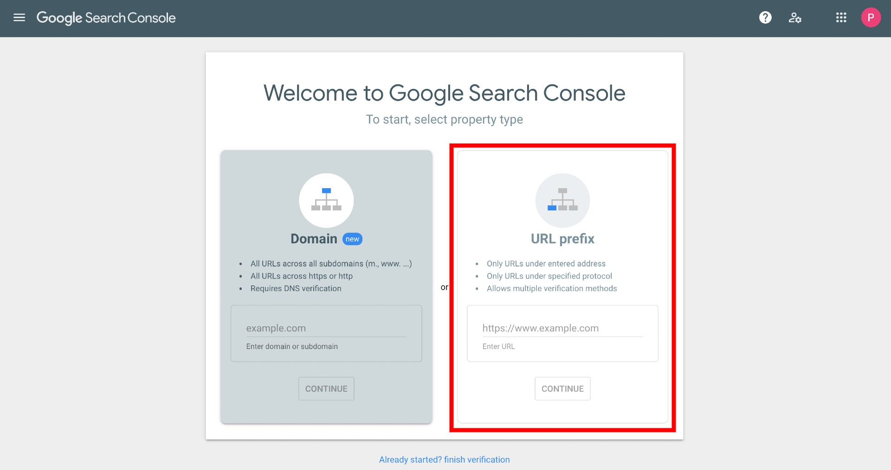

6. Click on **Continue**

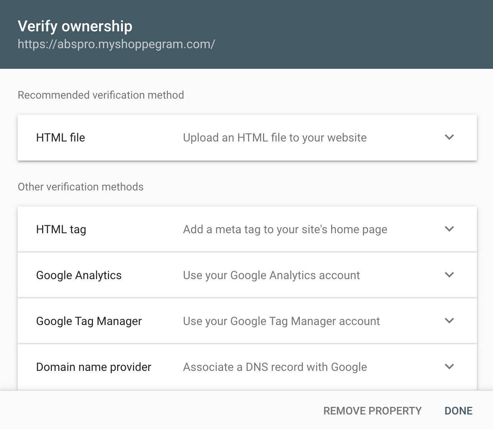

7. Click on **HTML tag**

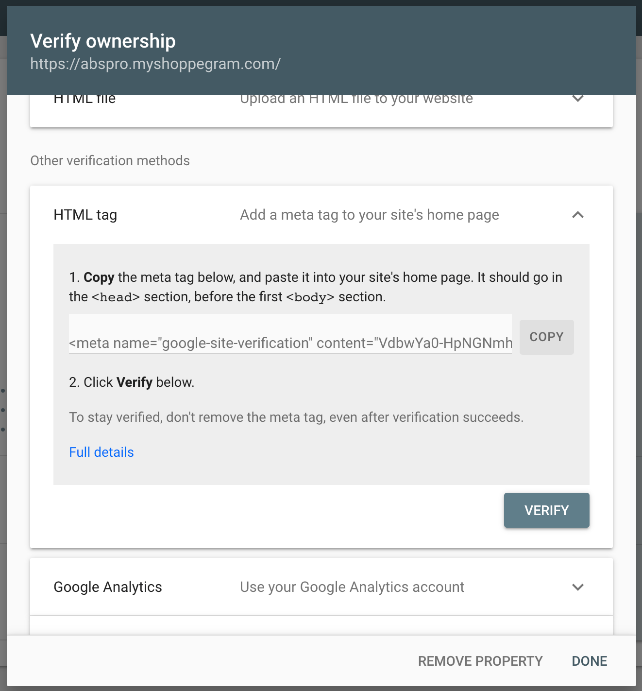

8. Click the **COPY** button.

Do not close this Google Search Console. Open a new tab to log in to your Shoppego dashboard.

## Setup in Shoppego

1. Log in to your Shoppego dashboard go to the **Online Store** and click on **Customize**.

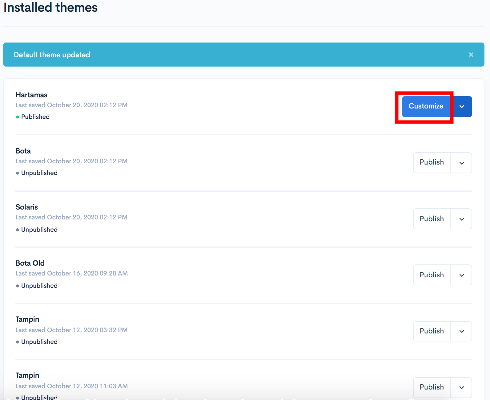

2. In that part of the page, you can go to the **Other settings** section and enter the code you just found in the **Custom meta** field.
3. Next, click the **Save** button

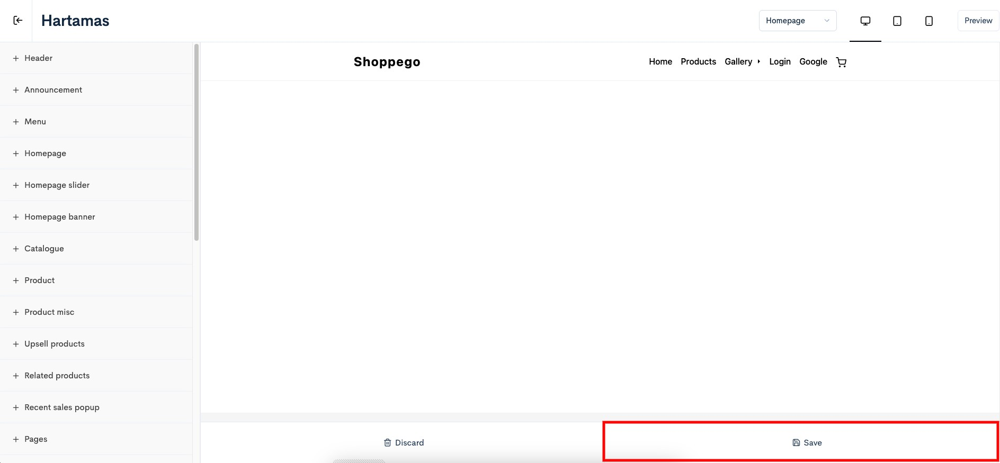

4. When done you need to go back to the **Google Search Console** page earlier.

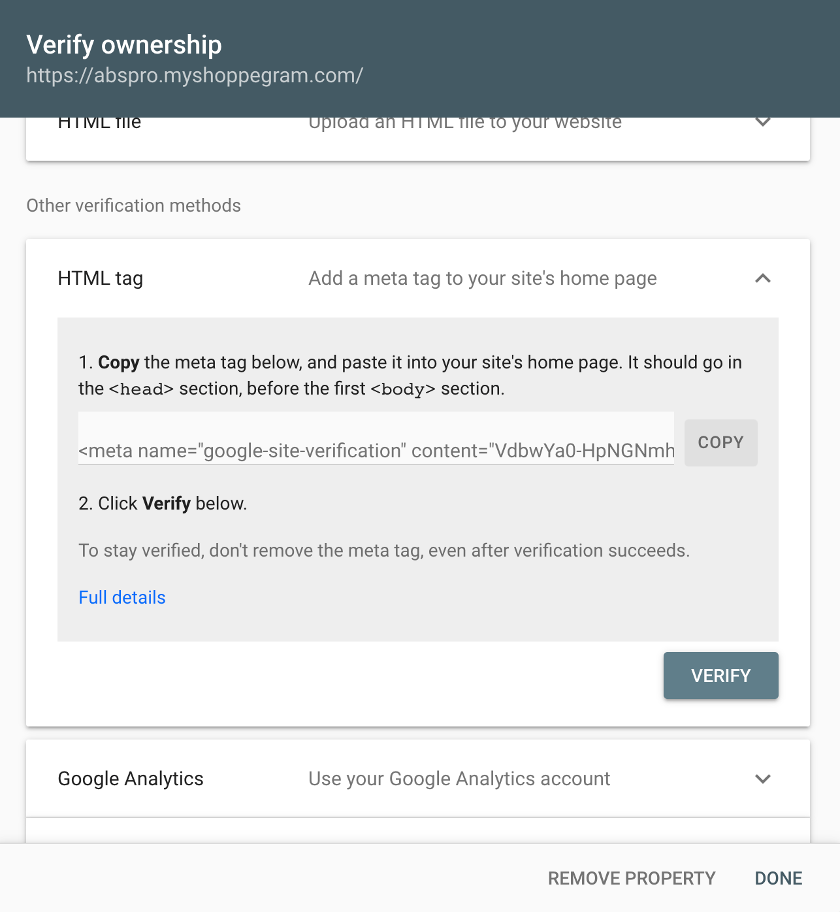

5. Click the **Verify** button

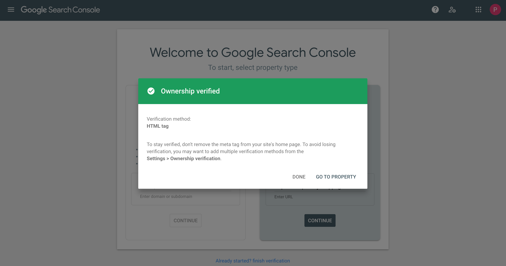

6. Make sure the display like the picture above states **Ownership verified**.
7. Click the **Done** button

Now your website has been successfully submitted to the Google Search console to get a ranking in the Google search engine.

## Check Submission Status

1. Click on the word **Search** property. The display will appear as below

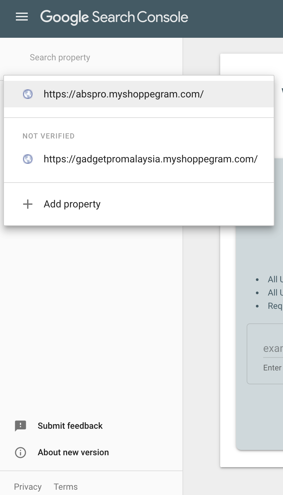

2. Click on the domain name you submitted earlier.
3. In the search bar at the top enter your **URL** name with **https: //**
4. Click the **ENTER** button on your keyboard

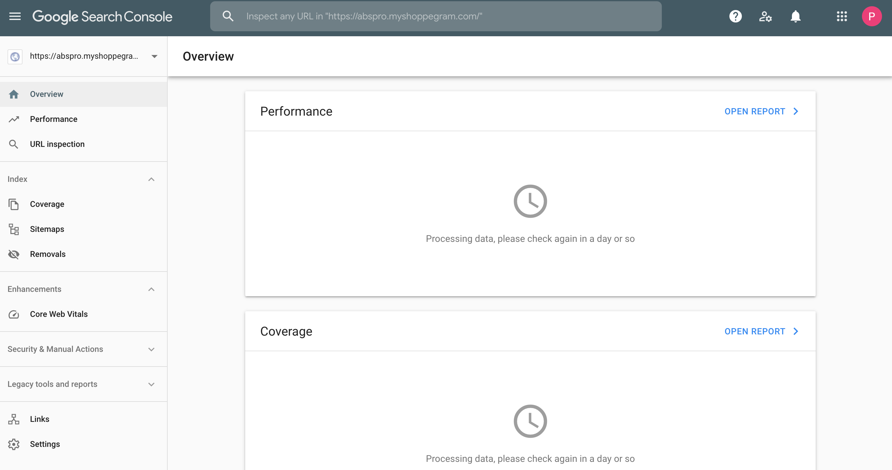

## Sitemap Setup

This sitemap can make it easier for Google to crawl your website for any recent updates that you have made on your pages/website.

For settings you can refer to the tutorial below:

1. On the Google Search Console dashboard, you can click on the **Sitemaps** button

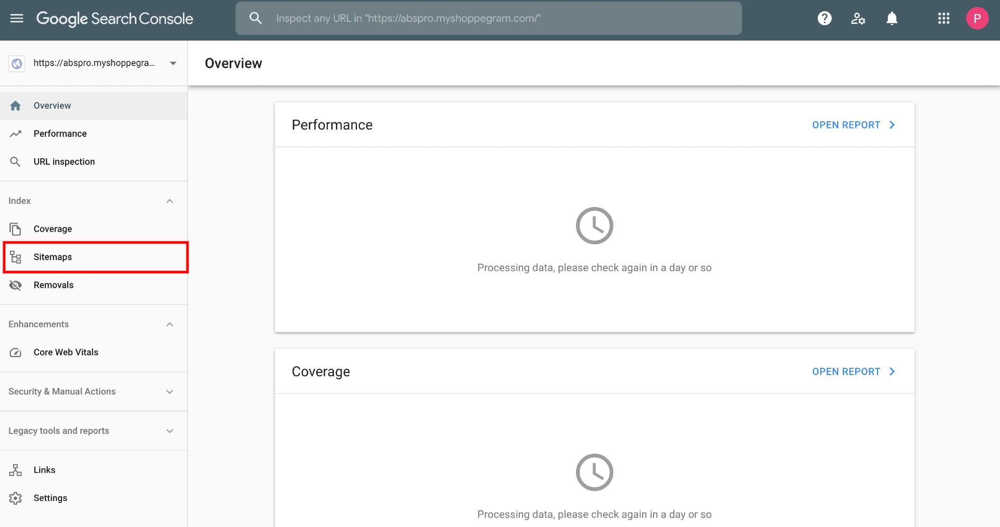

2. Next, you can enter your sitemap link in the space provided below. You only need to enter the text **sitemap.xml** in the space provided. When done you can click **Submit**

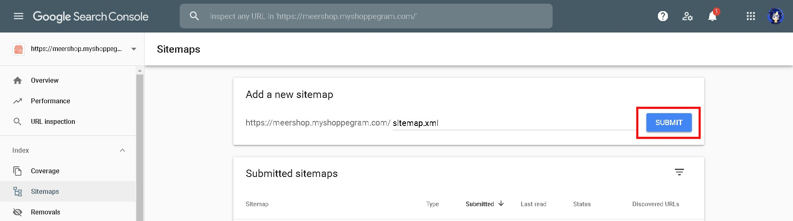

3. Once done you can refresh the page and make sure your submission status is Success.

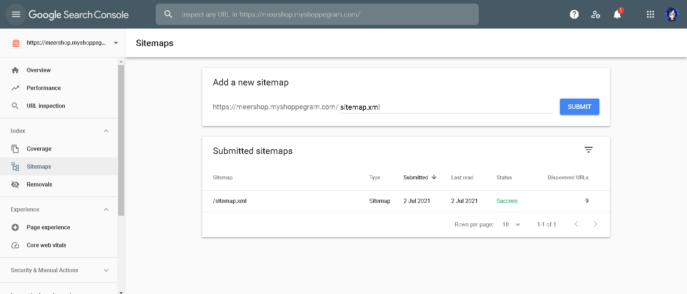
