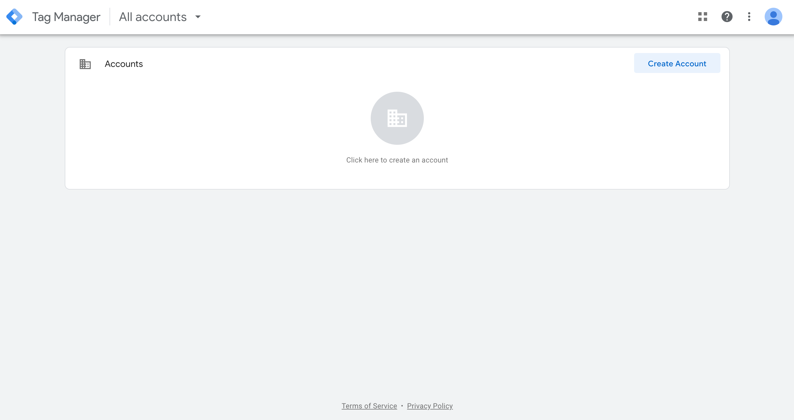
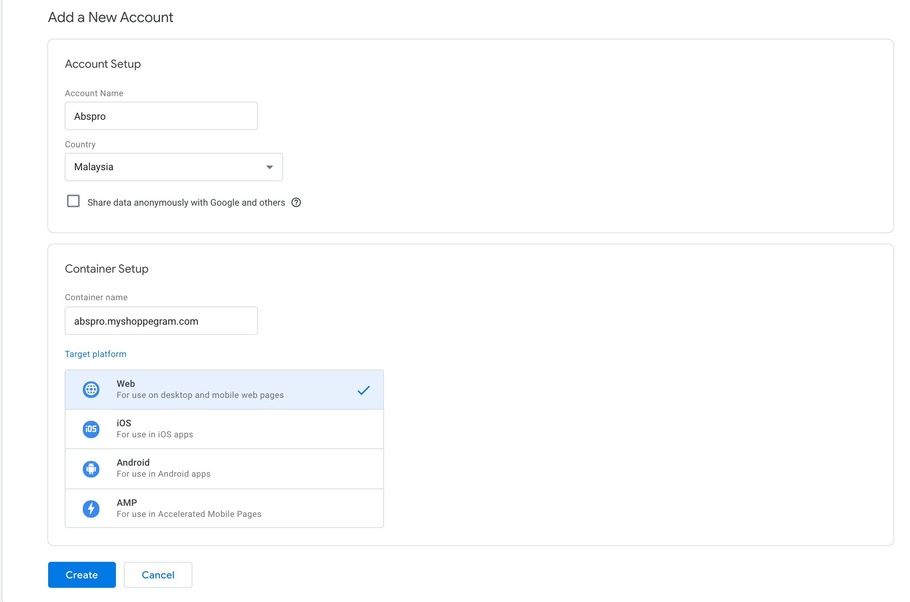
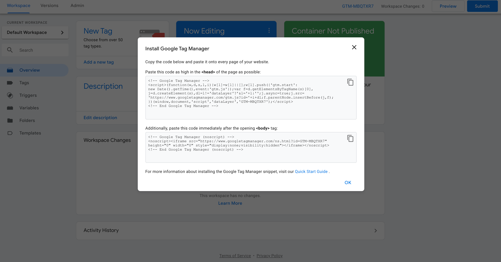
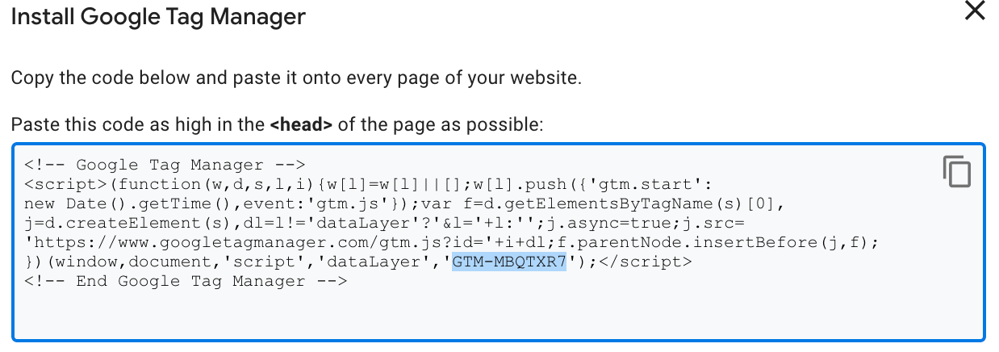
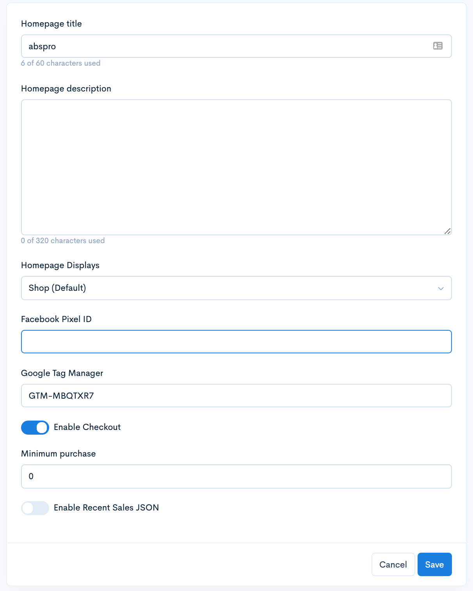

# Google Tag Manager


**Google Tag Manager** or **(GTM)** is a tool that allows all activities in our website to be tracked for the purpose of data collection so that improvements can be made.


For everyone's knowledge, google tag manager can contain various tracking tools such as facebook pixel, google analytic, google search console and others. There are several steps to integrate google tag manager into Shoppego, namely: -

1. Register **Google Tag Manager**
2. Obtain and save **GTM ID**
3. Insert **GTM ID to Shoppego**

## Register GTM

1. Go to the following link <https://tagmanager.google.com/> and **register using your gmail** is the easiest step.


\*\*<mark style="color:red;">**Notes**</mark> : If you are using **Google Chrome** and are logging in to your email, it will automatically register and be taken to the GTM dashboard page as pictured below.


2. Click the **Create Account** button.
3. Enter the requested information in the space provided.
4. Leave the Share data anonymously with Google and others box blank. In the target section of the platform click on Web.
5. Click the **Create** button and accept policy then click the Create button.

6. Next, the display as below will come out

## **Get and save the GTM ID**

1. In the first box you will see your ID as highlighted below starting with **GTM-xxxxx.**&#x20;


\*\*<mark style="color:red;">**Note**</mark> : Save **the ID** including the **word GTM.**


## Setup in Shoppego

1. Log in to the Shoppego dashboard, go to S**ettings** -> **General** [**https://my.shoppego.com/settings/general**](https://my.shoppego.com/settings/general)
2. Enter the **GTM ID** you have saved in the **Google Tag Manager** field

Click the **Save** button and now your website is already linked to GTM.
