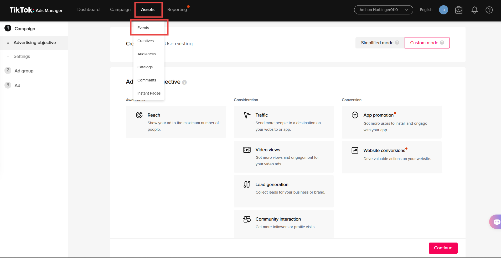
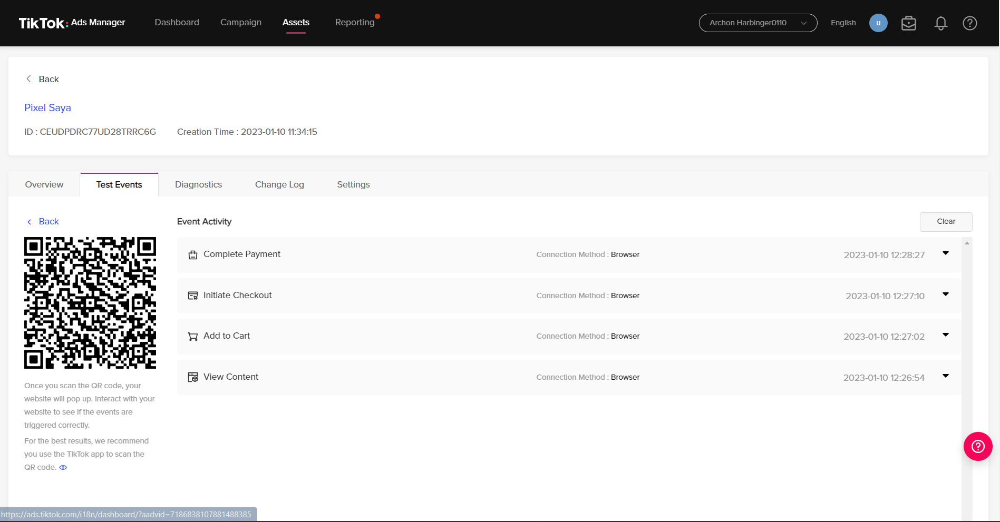

# TikTok Pixel

In Shoppego, we already make it a lot easier for our users to setup their **Tiktok pixel**. All they need to do is just insert their **Tiktok Pixel ID** that they get from their Tiktok Business Account to the **Tiktok Pixel ID** field that is already provided at Shoppego.

This setup can let you get the behavior of what your customer do at your website. This behavior is what we call as event. The event that will be triggered is **View Content**, **Add to cart, Initiate checkout,** and **Complete payment**.

You can follow below tutorial to start setup your Tiktok Pixel. Make sure you already have Tiktok Business Account to follow the below tutorial. If you don't have yet, you can register by click on this link: <https://ads.tiktok.com/i18n/signup>​

## Part 1: Setup in Tiktok Business 

1\. Fill up your details and click on the **Sign Up** button

<figure><figcaption></figcaption></figure>

2\. Next, you will see a display like this. In this page, you will be required to key in all information needed.&#x20;

<figure><figcaption></figcaption></figure>

3\. Then, you can choose **Manual Payment** as for  **Set up billing information** section.&#x20;

<figure><figcaption></figcaption></figure>

4\. For this tutorial, we will use **Custom Mode**.&#x20;

<figure><figcaption></figcaption></figure>

5\. You will see a display as shown below.

<figure><figcaption></figcaption></figure>

6\. On the page, you will see a black bar and there will be **Assets**. Click on **Assets** and choose **Events**.&#x20;

<figure><figcaption></figcaption></figure>

7\. You can select **Web Events** for the setting.&#x20;

<figure><figcaption></figcaption></figure>

8\. Next, you can click on **Create Pixel**.&#x20;

<figure><figcaption></figcaption></figure>

9\. You can select **Manual Setup** and press **Next**.

<figure><figcaption></figcaption></figure>

10\. After that, you can enter the **Pixel Name** and press **Next**.

<figure><figcaption></figcaption></figure>

11. In this section, you can press **Skip Step**.

<figure><figcaption></figcaption></figure>

12\. On that page, select only **Custom Code**.&#x20;

<figure><figcaption></figcaption></figure>

13. Turn on the **Automatic Advanced Matching** toggle and press **Finish**.

<figure><figcaption></figcaption></figure>

### Install TikTok Pixel Helper

1\. If in any case, you **do not have a plugin** or **extension which is Tiktok Pixel Helper** on your web browser, you can click **Install** to install it in your browser.&#x20;

<figure><figcaption></figcaption></figure>

2\. Next, you will be brought to a page, click the button **Add to Chrome** to install the plugin or extension in your browser.&#x20;

<figure><figcaption></figcaption></figure>

### Copy ID TikTok Pixel

1\. **Copy ID Tiktok Pixel** and save it, because the **ID** will be required to key in to your Shoppego system later.&#x20;

<figure><figcaption></figcaption></figure>

### Tiktok Pixel Trigger Events Process

1\. You can start triggering the event process using your **Tiktok Pixel**. You can click the button **Go Test Events**.&#x20;

<figure><figcaption></figcaption></figure>

2\. On the page, you will be required to insert your **domain** or **website name** in the given space.

<figure><figcaption></figcaption></figure>

3\. After that, **QR** will be generated, and you can open **TikTok application** on your IOS or android smartphone to scan the code. Then you can try creating an **order** or **initiate checkout** in your Tiktok application.&#x20;

<figure><figcaption></figcaption></figure>

4\. You can view the **triggered events** in the TikTok application in your Tiktok Ads Manager.&#x20;

<figure><figcaption></figcaption></figure>

If you can trigger all events you wanted in Shoppego which are **View Content**, **Add to Cart, Initiate Checkout & Complete Payment** means that your pixel is working fine and no issue occurred.

## Part 2: Setup in Shoppego

1\. Next, log in to your Shoppego account. Go to the **Settings** -> **General** ->In the TikTok Pixel ID s**ection,** enter your pixel ID and **Save.**

## Additional Info

For information, instead of using the **QR Code** process to test the event to trigger Tiktok Pixel Event, you can use the **plugin** or **extension Tiktok Pixel Helper** you have installed in your browser.&#x20;

Below is one of the many ways to check triggered events in Tiktok Pixel by using **Tiktok Pixel Helper**.&#x20;

You can do several ways to trigger events that can be captured by Tiktok Pixel in Shoppego. For example on the below display, we have done **Add to Cart** to trigger **Add to Cart event**.&#x20;

<figure><figcaption></figcaption></figure>

Next, you can try to test other events by executing a dummy purchase. If there is no problem occurred, **Tiktok Pixel Helper** can read the triggered events, **View content**, **Add to cart**, **Initiate checkout** and **Complete payment**.

## Configuration Error

### You have an issue where when you want to create your first ads, but the Tiktok pixels you just created can't be found?

For that issue, you need to **give some time for the Tiktok events data that you have triggered in the test events section can be detected on your pixel Tiktok. Make sure you have done the test events first on the Tiktok pixel sections before you create your first ad.**
