# Loyverse

Loyverse is a POS (point-of-sale) platform. You can use the stock product sync integration that we provide with this Loyverse platform to ensure that the stock in the store and on the Shoppego website gets the same stock change for any purchase.


This function is only available for Premium and Ultimate plan subscriptions.


## Loyverse account registration

If you don't have a Loyverse account yet, you can register through this link first: <https://loyverse.com/en/signup>

## Get Access tokens on Loyverse

1. Once you have logged into the Loyverse account dashboard, you can click on the **Integrations** button as highlighted in the display below.

<figure>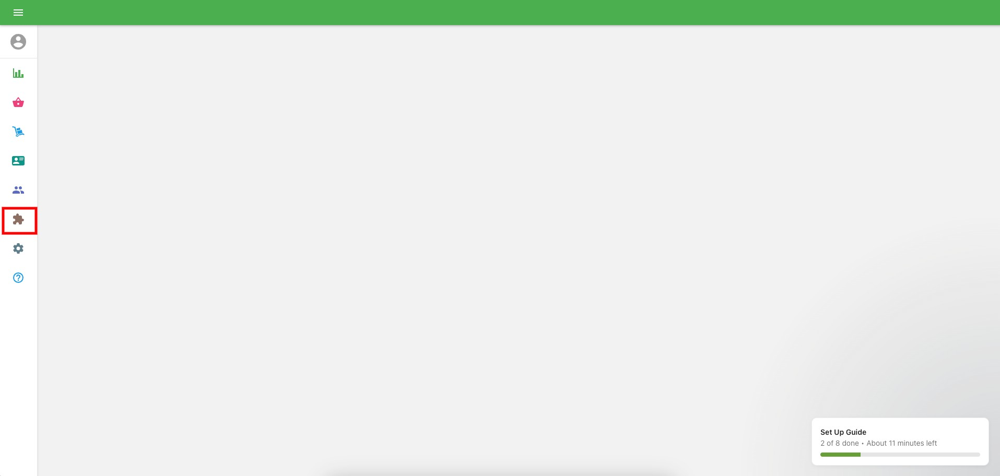<figcaption></figcaption></figure>

2. Then, you can click on **Access tokens**

<figure>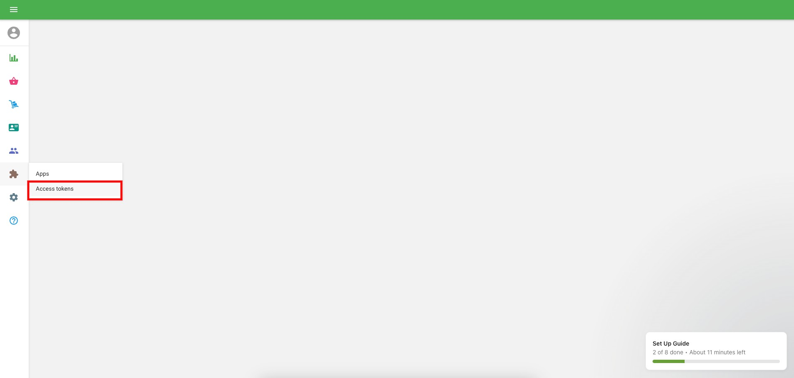<figcaption></figcaption></figure>

3. Once you are taken to the Access tokens page, you can click on the **Add access token** button

<figure>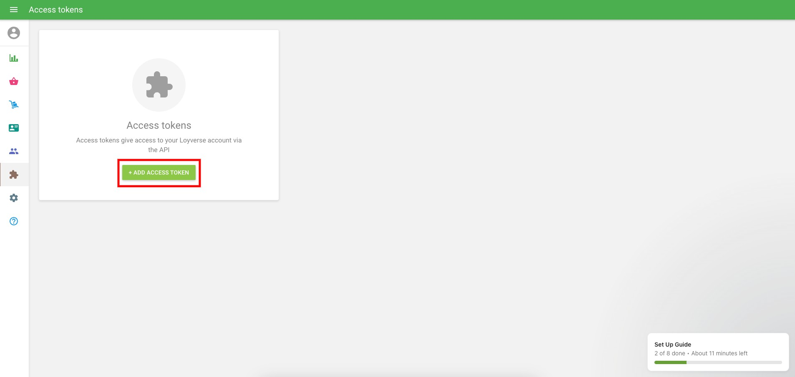<figcaption></figcaption></figure>

4. In this page, you need to **enter the name of this access token in the "Name" space as your reference** and you can also set whether you want to set a limit on how long this access token runs. In this setting, we do not tick the "Token has expiration date" toggle because we want this access token to always run.

<figure>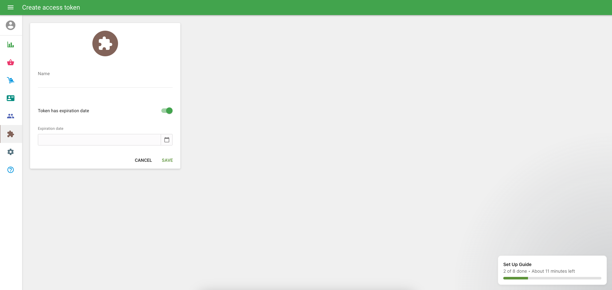<figcaption></figcaption></figure>

5. Once you have set the Access token settings you want, you can click **Save**

<figure>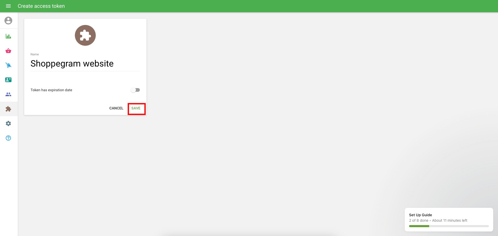<figcaption></figcaption></figure>

6. Next, you can see the Access token you have created. You can **copy the Access token** and **save it to be included in the settings on Shoppego** as well.

<figure>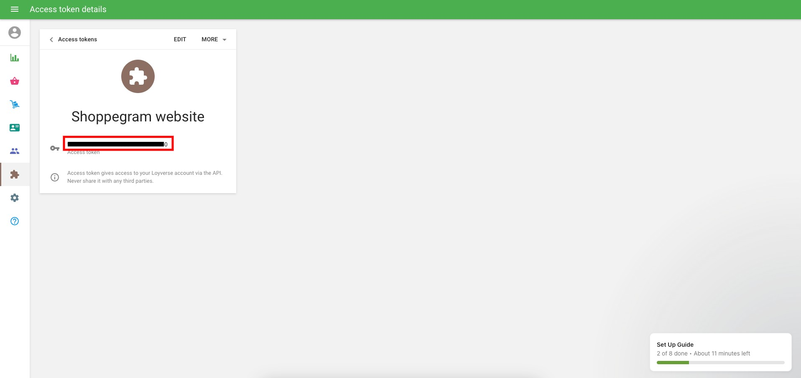<figcaption></figcaption></figure>

## Settings in Shoppegp

1. Log in to your Shoppego account

<figure><figcaption></figcaption></figure>

2. Click on **Sales channels**

<figure><figcaption></figcaption></figure>

3. Click on **Loyverse**

<figure>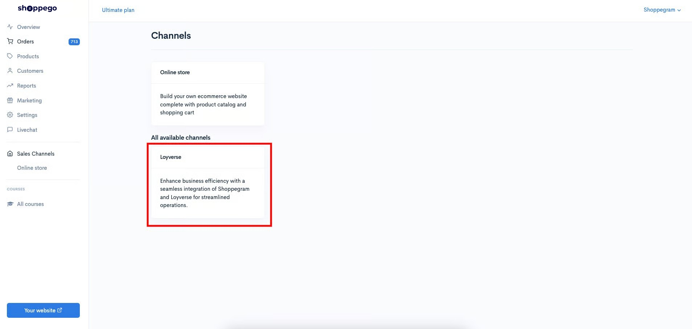<figcaption></figcaption></figure>

4. Click on the **Connect with Loyverse** button

<figure>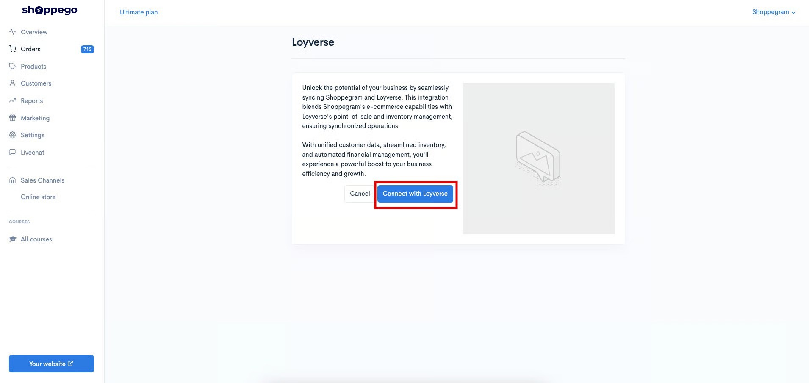<figcaption></figcaption></figure>

5. Then, you can **enter the Access token that you have obtained from the Loyverse account into the space provided as shown below**.

<figure>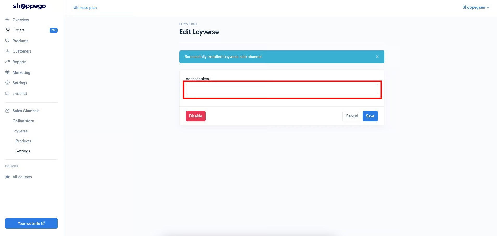<figcaption></figcaption></figure>

6. Once you enter the Access token, you can click **Save**

<figure>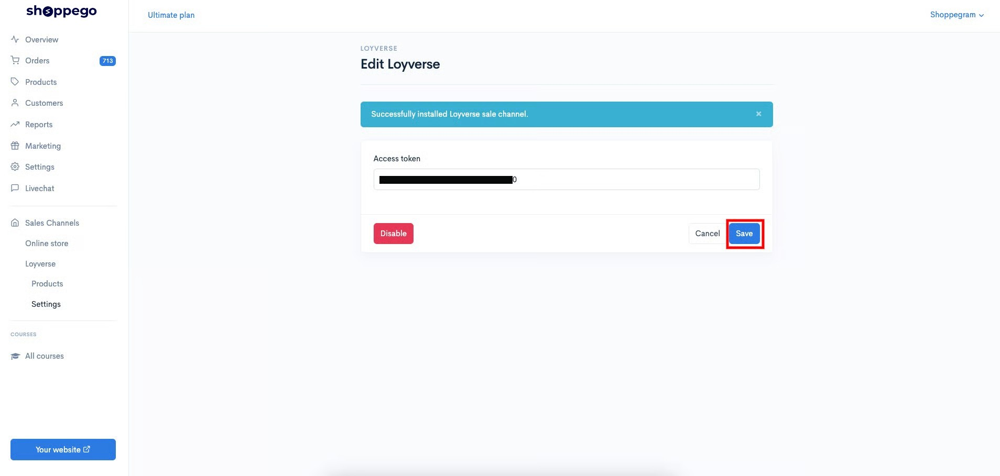<figcaption></figcaption></figure>

7. Then, you will be asked to **select your Loyverse store by setting "Loyverse stores"**

<figure>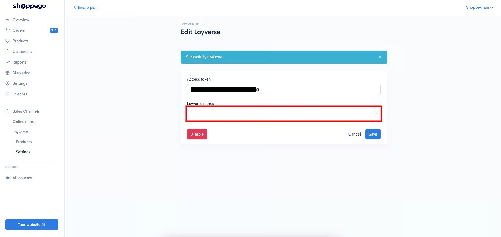<figcaption></figcaption></figure>

8. When finished, click **Save**

<figure>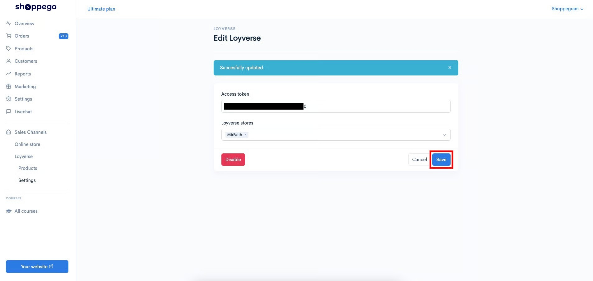<figcaption></figcaption></figure>

9. Now the integration between Loyverse and Shoppego has been completed.

<figure>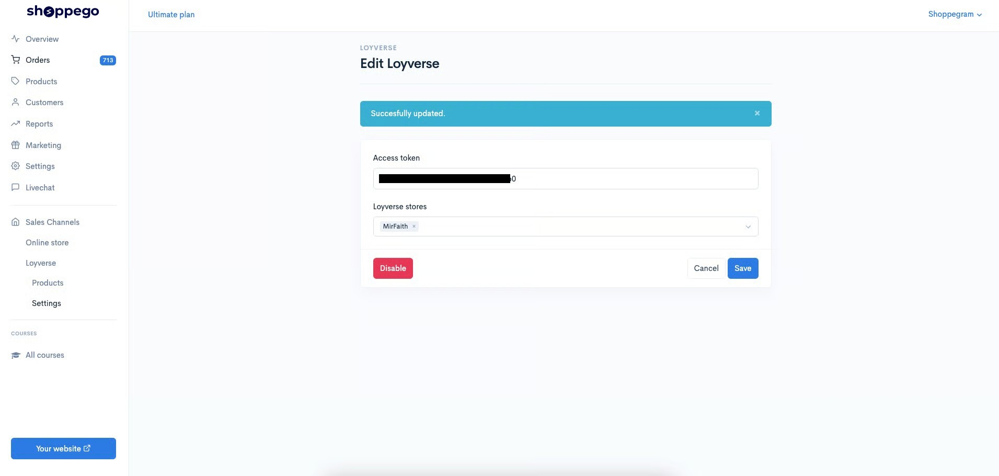<figcaption></figcaption></figure>

To set product Sync between the Shoppego and Loyverse platforms, you can click on the button below to refer to our tutorial:


[Products](loyverse/products.md)


## Additional Information

For any stock deductions on the Shoppego platform, the system will continue to update the product's stock on the Loyverse platform according to the available quantity.

<figure>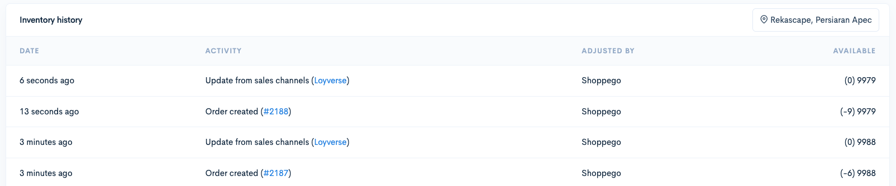<figcaption></figcaption></figure>
