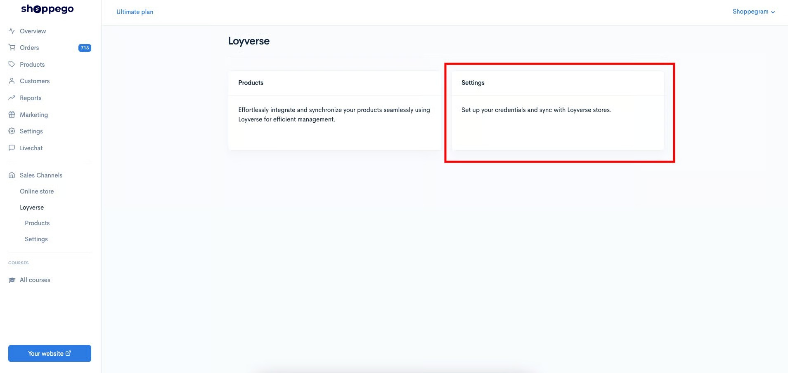
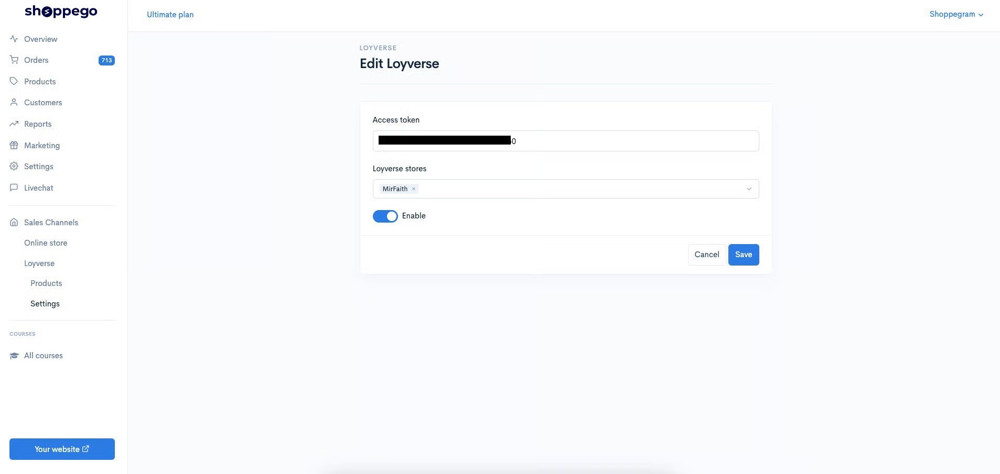
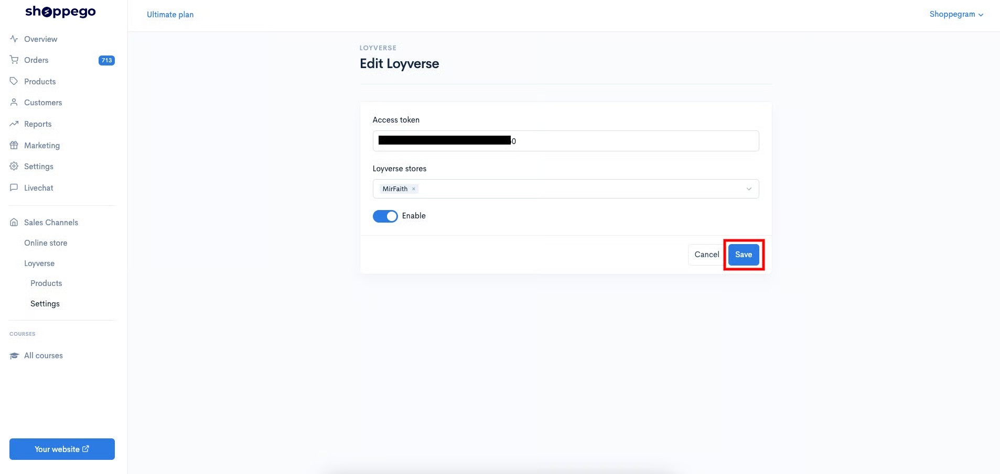

# Settings

If you want to make any changes to the integration between Loyverse and Shoppego, you can do it on this page. For more information, you can refer to this tutorial:

1. Log in to your Shoppego account

<figure><figcaption></figcaption></figure>

2. Click on **Loyverse**

<figure><figcaption></figcaption></figure>

3. Click on **Settings**

<figure><figcaption></figcaption></figure>

4. Then, you can make any changes you want

|                     | Penerangan                                                                                                                                                            |
| ------------------- | --------------------------------------------------------------------------------------------------------------------------------------------------------------------- |
| **Access token**    | Space for you to enter the Access token value you get from your Loyverse account.                                                                                     |
| **Loyverse stores** | Space for you to select the Loyverse store that you want to integrate with your Shoppego store.                                                                       |
| **Enable Toggle**   | Toggle for you to make sure this integration is activated or deactivated. A gray toggle means it is inactive. Meanwhile, the blue toggle indicates that it is active. |

<figure><figcaption></figcaption></figure>

5. Once the changes are made, you can click **Save**

<figure><figcaption></figcaption></figure>

test
