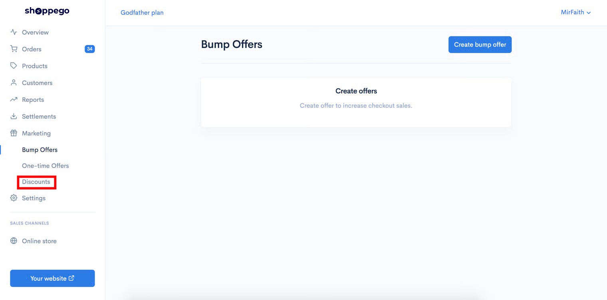
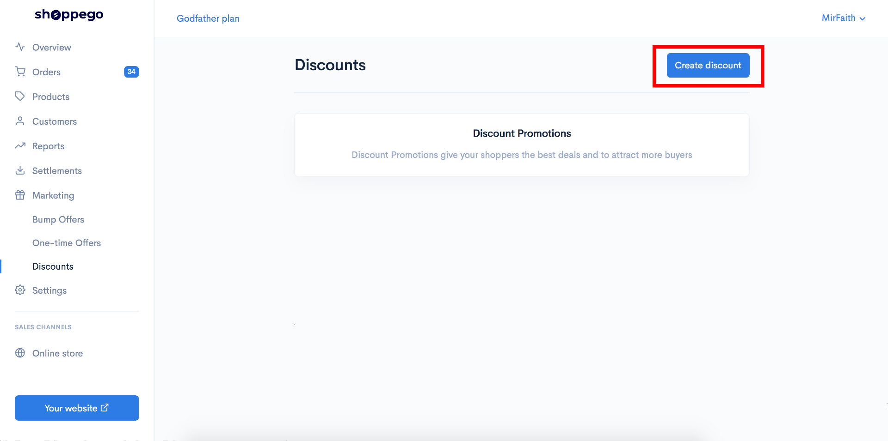
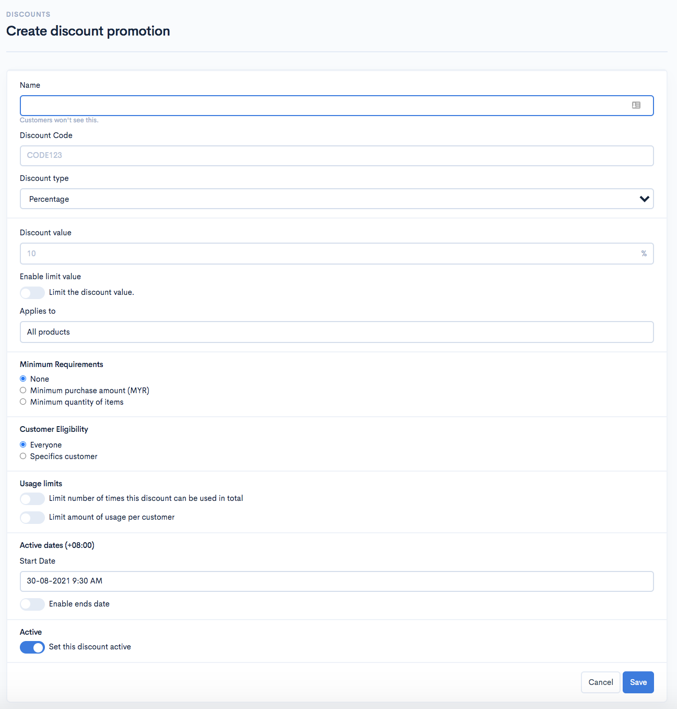
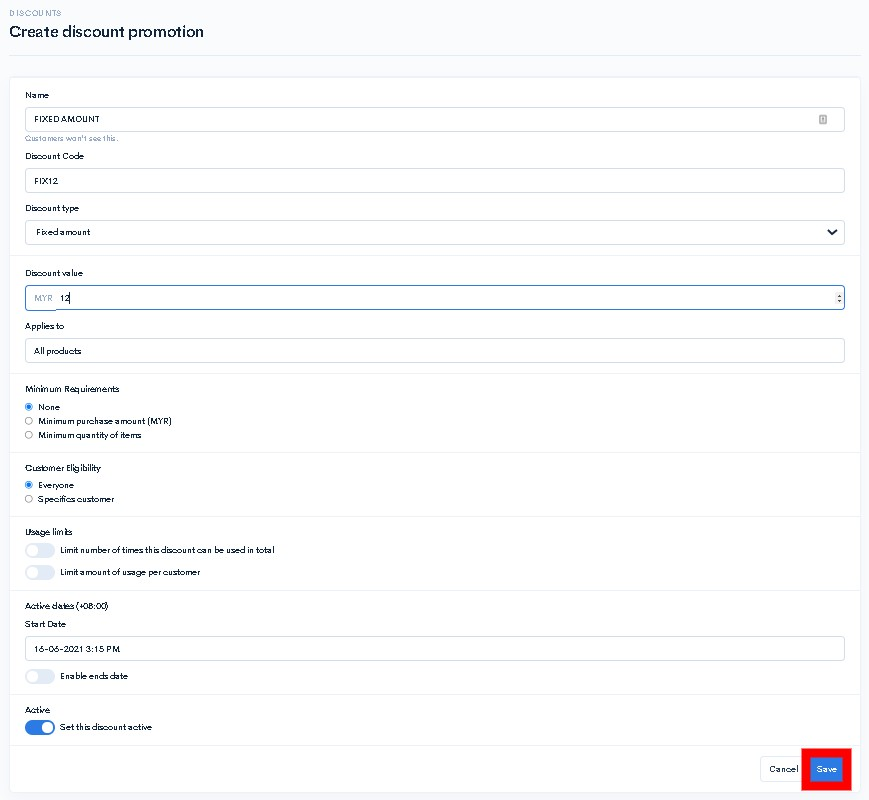

# Fixed Amount

To set the promo code discount Fixed amount, you can follow this tutorial:

1\. Log in to your Shoppego Dashboard.

2\. Click on the **Marketing** tab

3\. Click on the **Discounts** tab

4\. Click on the **Create discount** button

5\. Later you will be taken to a page where you can fill in your voucher code information.

<table><thead><tr><th width="200">Field</th><th>Description</th></tr></thead><tbody><tr><td><strong>Name</strong></td><td>You can enter your <strong>promo name</strong> (Customers will not be able to see this name)</td></tr><tr><td><strong>Discount Code</strong></td><td>You can enter the <strong>code you want customers</strong> to enter so they can use this promo.</td></tr><tr><td><strong>Discount type</strong></td><td>You can set it to <strong>Fixed amount</strong></td></tr><tr><td><strong>Discount value</strong></td><td>Here you can set the <strong>discount value for your promotion.</strong></td></tr><tr><td><strong>Enable limit value</strong></td><td>You can use this toggle if you want to <strong>set the maximum discount price that will be deducted from your Discount value</strong></td></tr><tr><td><strong>Applies to</strong></td><td>You can choose whether you want to set it to <strong>"All products", "Specific categories" or "Specific products".</strong></td></tr><tr><td><strong>Minimum requirements</strong></td><td>Here you have 3 options, either, you do not want to set any requirement <strong>("None")</strong> for the use of this discount code or you want to set a requirement based on <strong>"Minimum purchase amount" or "Minimum quantity of items".</strong></td></tr><tr><td><strong>Customer Eligibility</strong></td><td>Here you can set whether you want the discount code to be used only for <strong>"Specific customers" or for all your customers "Everyone".</strong></td></tr><tr><td><strong>Active dates (+08:00)</strong></td><td>Here you can <strong>set the date for this discount code can be applied on (Start Date)</strong> or <strong>you can also set the end date for the use of this discount code on (Enable ends date)</strong></td></tr><tr><td><strong>Active</strong></td><td>Make sure you leave the Active button in the <strong>active state (Blue)</strong> to make sure your code <strong>discount function is active.</strong></td></tr></tbody></table>

6\. Once done you can click **Save** and try to use the voucher on your website.

