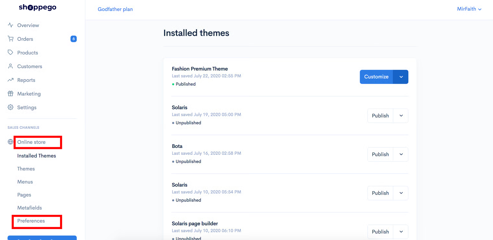
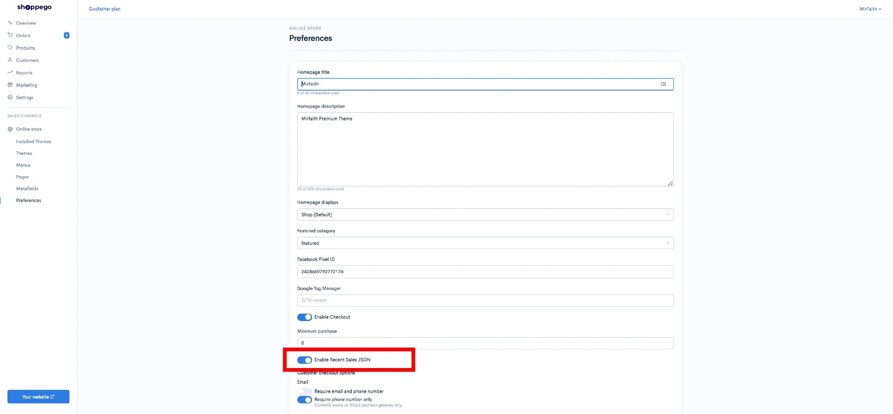
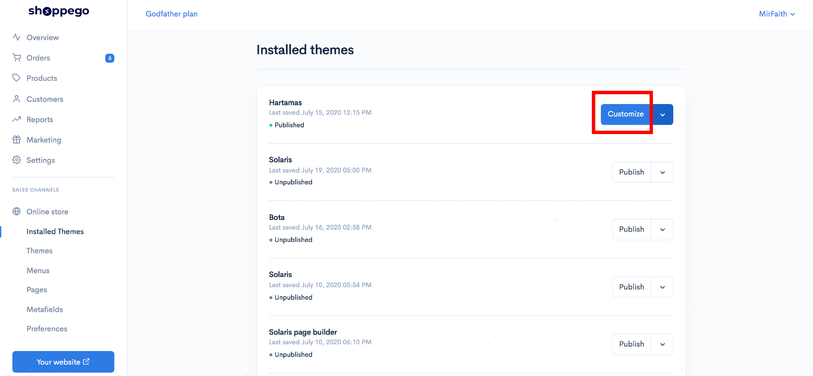
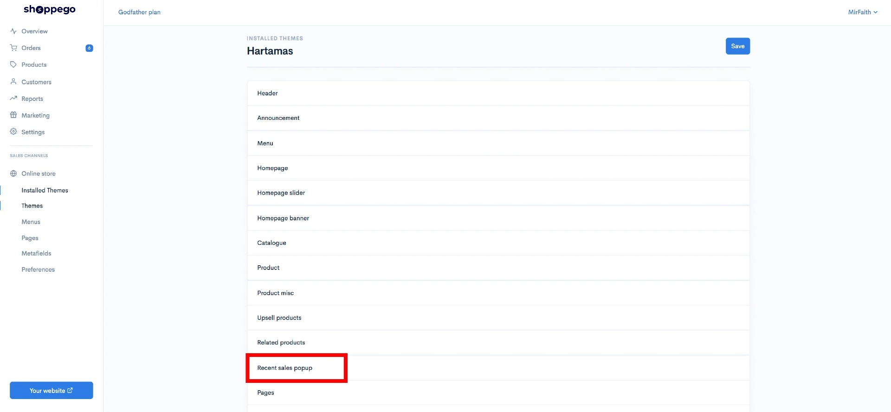
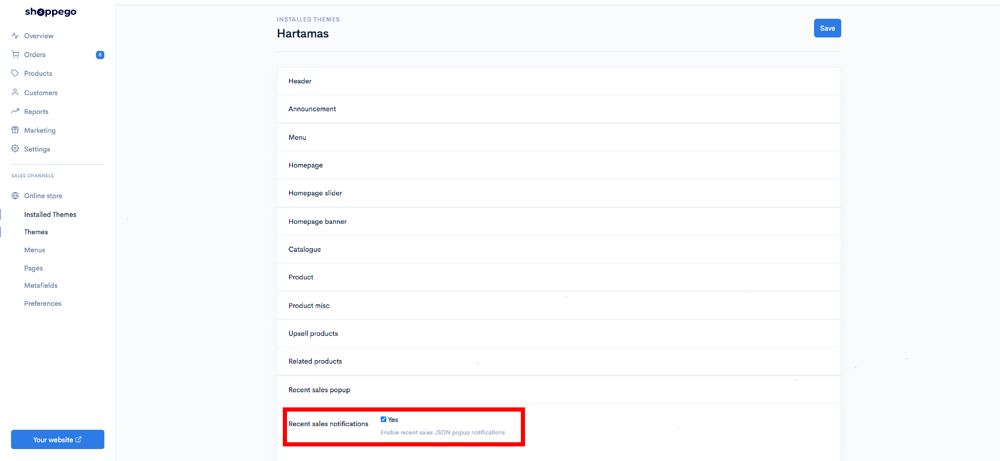
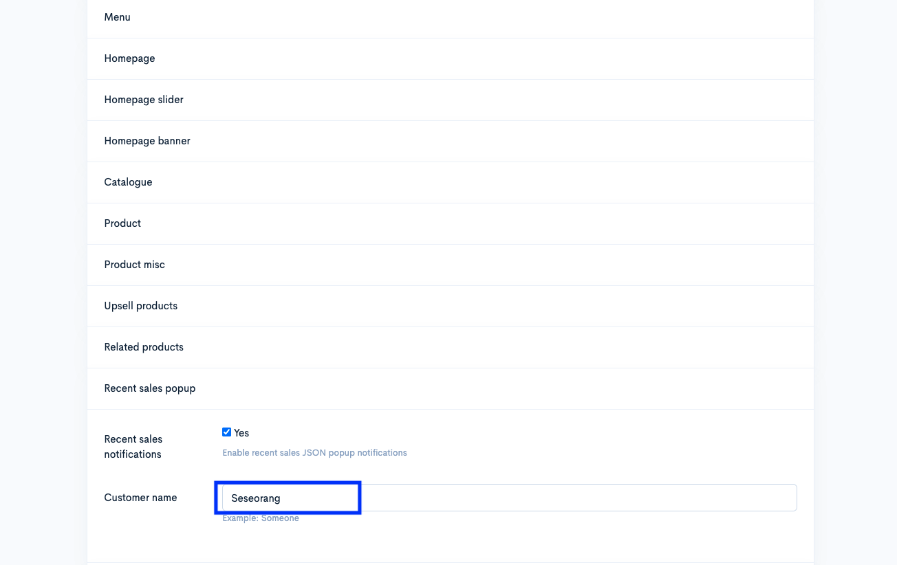
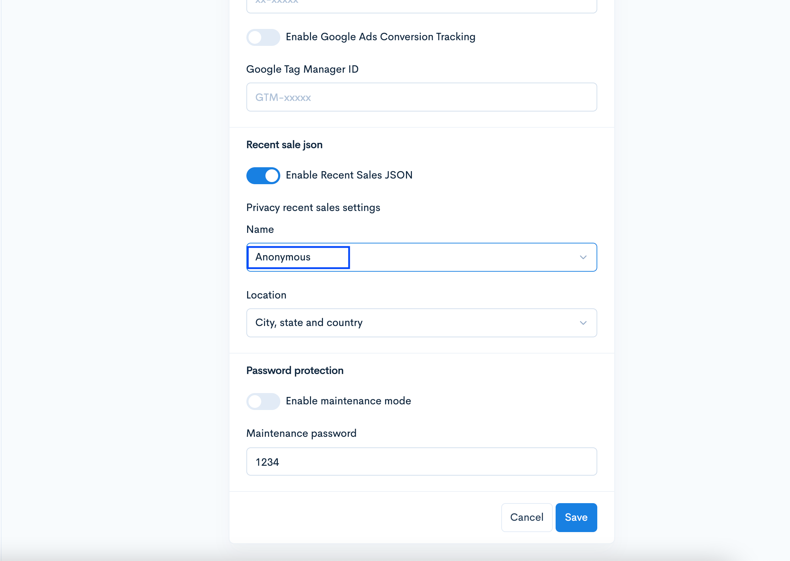
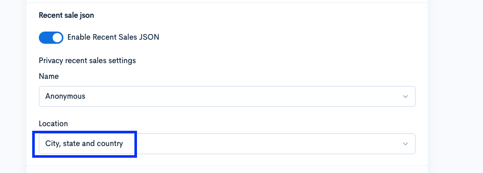
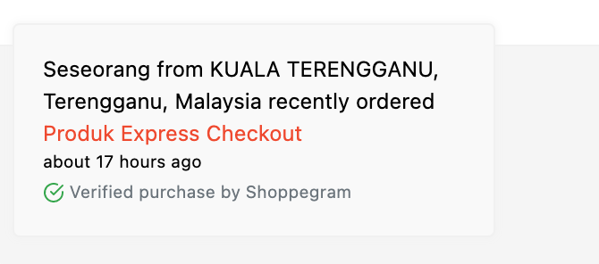

# Social Proof Notifications

## What is Social Proof Notifications


**Social proof Pop-up** is a feature of Commerce for **Standard, Premium and Ultimate account users only.**



This sales pop-up will only appear when there is a purchase from a customer on the Commerce website.


Refer to the example for an overview of pop-up sales.

* Notice at the bottom of the page above the "Daftar sekarang" button which is orange there is buyer information.
* The purpose of this Social proof is to increase the confidence of buyers to make decisions when looking at the products you offer.
* All this information is automatically generated, no need for time setting, product name, and others.&#x20;
* Just need to turn on these features.

## **Setup Social Proof**

### Enable Recent Sales JSON

1\. Log in to the Commerce Dashboard and go to **Online Store** -> **Preferences**

2\. Make sure you **enable the Recent Sales JSON** function and click **Save**

### Enable Recent Sales Popup

1\. Log in to the Commerce Dashboard and go to the **Online store**

2\. Click on the **Customize** button

**3.** Click on the **Recent sales popup**

4\. Tick ​​**Yes** on **Recent sales notifications** and click **Save**

## Set Specific Name And Location.

To set the customer name specifically or according to your wishes. You can follow the tutorial below.

1. In the **Online Store** -> **Customize** -> **Recent Sales Json section**. Enter the name you want to appear on your store and click **Save**

2 .Log in to the **Online Store** -> **Preferences** -> **Nam**e. Set as **Anonymous** and **Save.**


\*\*<mark style="color:red;">**Note**</mark>: If you want **your customer's name** to be displayed on the **Popup** display, you can **choose Full Name** in that field.


3\. If necessary, you can set a location for each customer who buys at your store. For example, locations are selected based on City, state, and country.

Then the display on your store will appear like this.

