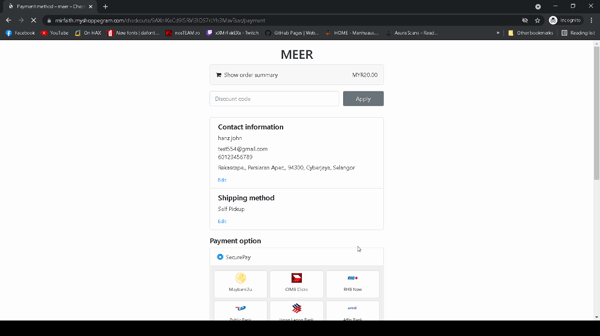
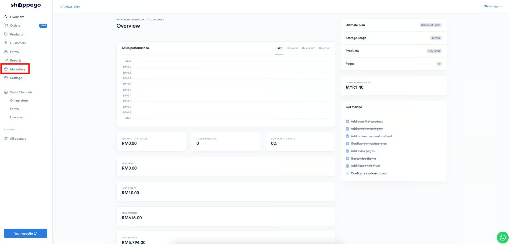
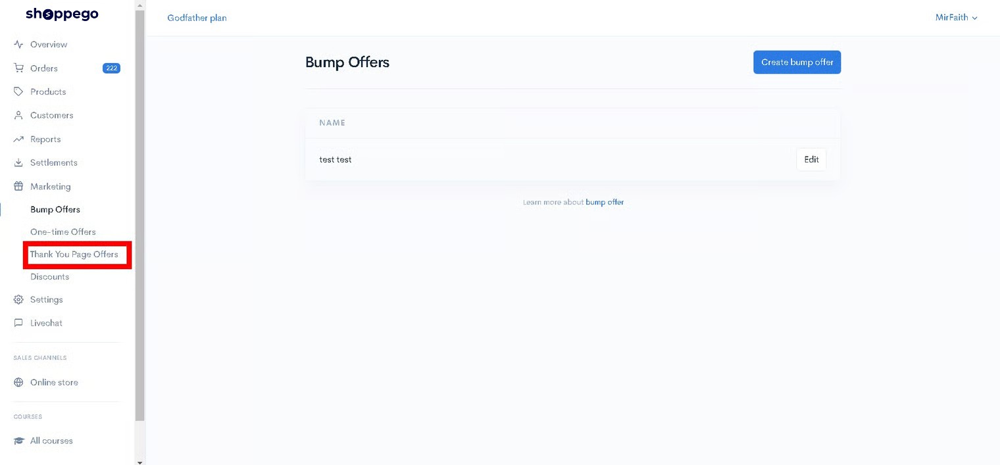
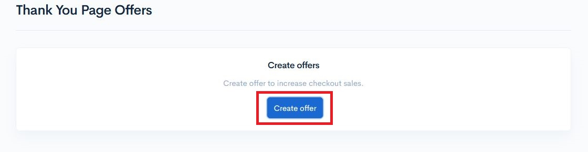
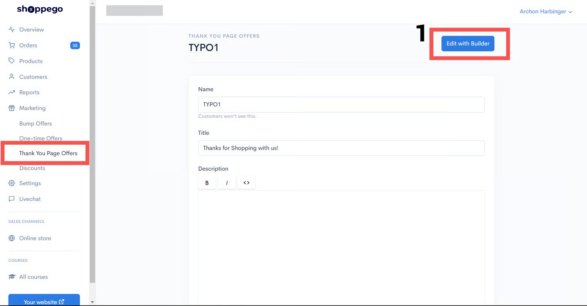
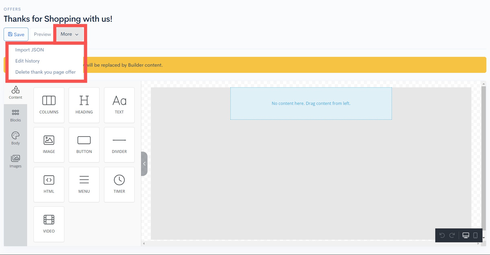
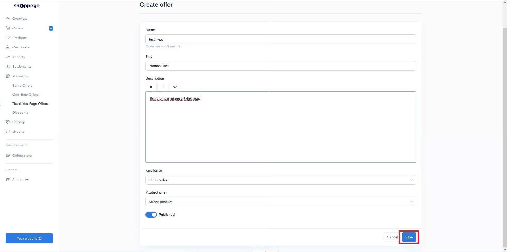

# Thank You Page Offer


These features are only available on the <mark style="color:red;">**Ultimate**</mark>**&#x20;plans**.


**Thank you page offer (TYPO)** is one of the features in Shoppego for you to upsell orders made by your customers.


**TYPO will appear on the thank you page** where after the customer **successfully makes a payment** using :&#x20;

* Stripe
* Securepay
* Bizappay
* Billplz&#x20;
* Cash on Delivery
* Lekirpay
* Chip
  

## Example of TYPO

## Setup TYPO

1\. Log in to your Shoppego Dashboard.

2\. Click on the **Marketing** tab.

3\. Click on the **Thank You Page Offer** tab.

4\. Click on the **Create offer** button.

5\. Enter your promotional information, or you can use the **Edit with Builder(1)** option.

<figure><figcaption></figcaption></figure>

6. You can create your **TYPO** using your creativity, or you can **import your JSON** from the Pages you created before.&#x20;

### Functions in the TYPO Builder:

* **Import JSON**: You can **import your JSON** from the Pages you created before.
* **Edit History**: History of changes made in the Builder.
* **Delete thank you page offer**: Delete the **TYPO page** created in your **Builder**.

<figure><figcaption></figcaption></figure>

### Setting up a Thank You Page Offer (TYPO)

<table><thead><tr><th width="168">Field</th><th>Description</th></tr></thead><tbody><tr><td><strong>Name</strong></td><td>Your TYPO name (For your reference only)</td></tr><tr><td><strong>Title</strong></td><td>Title/Headline to your promotion (This title will be visible to your customers)</td></tr><tr><td><strong>Description</strong></td><td>You can do a description of your promotion to make sure it converts more.</td></tr><tr><td><strong>Applies to</strong></td><td>You can choose whether you want to set this promotion for the entire order or specific products only. (only 1 product selection is allowed)</td></tr><tr><td><strong>Products offer</strong></td><td>You can choose the products you want to offer as your promotion to your customers.</td></tr><tr><td><strong>Published</strong></td><td>Make sure it is blue to make sure your TYPO promotion is active.</td></tr></tbody></table>

6\. Once you have entered all the details, you can click **Save.**

