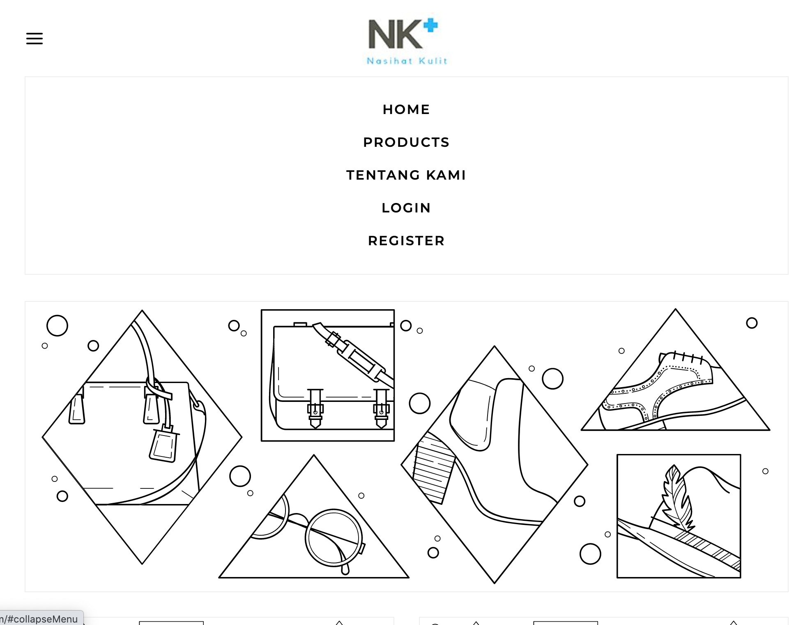
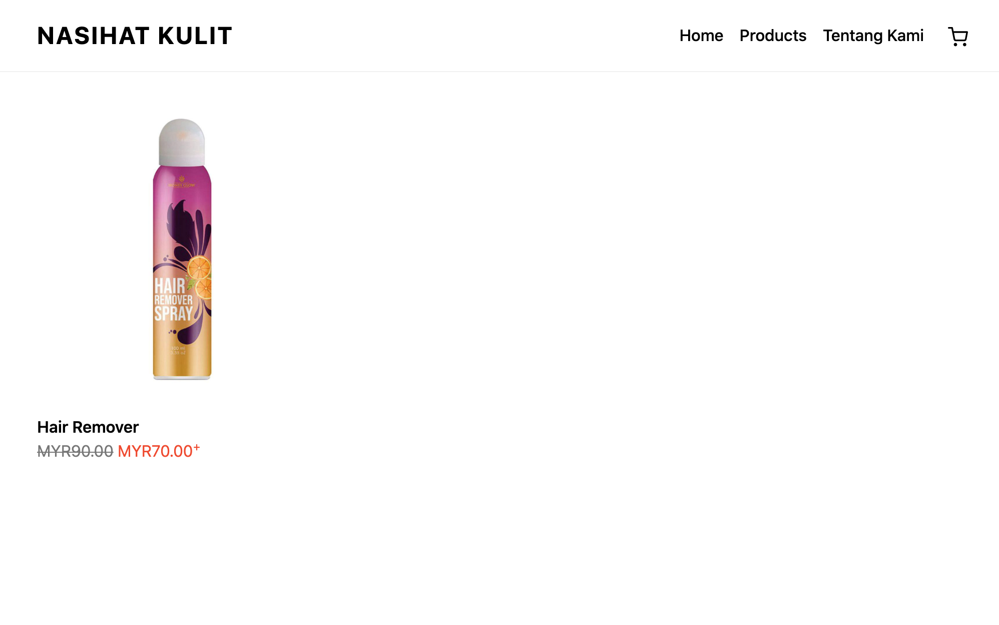
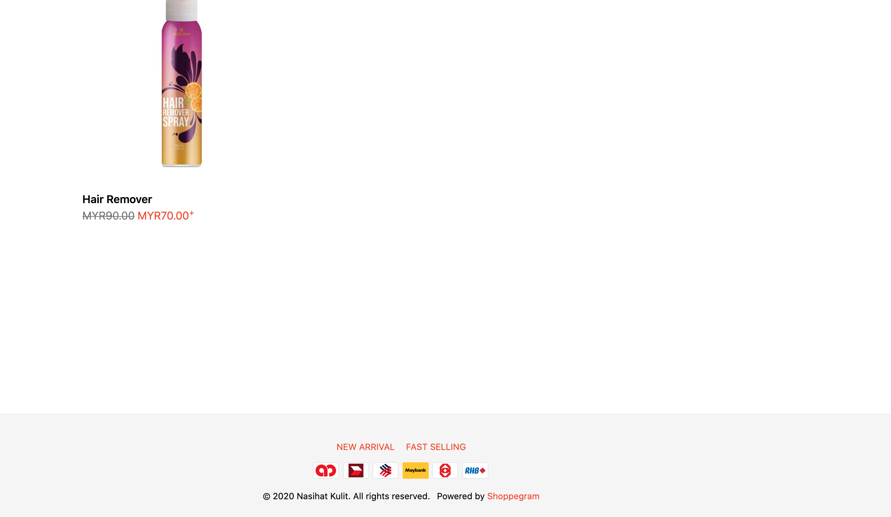
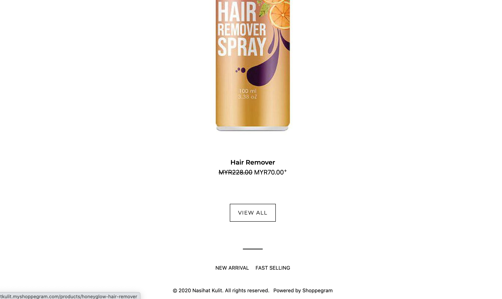

# Menus

Menus are an important element to make it easier for visitors to get information about ecommerce websites with Shoppego.

Basically, Shoppego has provided 2 Menus that are embedded in each Themes, namely:-

* **Main menu.**


[Main Menu](menus/main-menu.md)


* **Footer menu.**


[Footer Menu](menus/footer-menu.md)


However, by default, if you are registering for the first time, only the Main Menu has been set for the user.

## **Main Menu**

The Main Menu is the menu that is at the very top of the website. Refer to the picture below:-

### **Theme Solaris**

### **Theme Hartamas**

**Home, Products, About Us** is a Menu item that is in the **Main Menu**.

## **Footer Menu**

Footer Menu is the menu that is at the very bottom of the website. Refer to the picture below:-

### **Theme Hartamas**

### **Theme Solaris**

**New Arrival, Fast Selling** is a **Menu Item** that is in the **Footer Menu.**

## **Menu item**

Menu items are components that will be included in the **Main Menu** or **Footer Menu** to allow the link to be clicked and navigated to a predefined destination.&#x20;

Menu items can be navigated to your **Pages** and **Categories**. This means, when the menu item is clicked, it will be taken to the pages or categories that have been set.

## Advance menu

This Advance menu can be used for Standard plan and above only&#x20;


**\*\***<mark style="color:red;">**Note**</mark>**&#x20;:** For customer registration menu, it is only available for <mark style="color:red;">**Premium**</mark>**&#x20;plan** and **above** only.&#x20;


You can take your customers to the Register/Login link on your website by using links like these.

<table data-header-hidden><thead><tr><th width="182">Links</th><th>Deskripsi</th></tr></thead><tbody><tr><td><strong>Links</strong></td><td><strong>Description</strong></td></tr><tr><td>/account</td><td>This link will allow you to take your customers to their account page. Here it allows them to see the orders they have made.</td></tr><tr><td>/account/login</td><td>This link will allow you to take customers to the Login page</td></tr><tr><td>/account/register</td><td>This link will allow you to take customers to the Register page</td></tr><tr><td>/account/orders</td><td>This link will allow you to take your customers to their orders page. Here it allows them to see the details of orders that have been made by them before.</td></tr><tr><td>/account/logout</td><td>This link allows your customers to logout from their account once they log in to your website.</td></tr></tbody></table>
