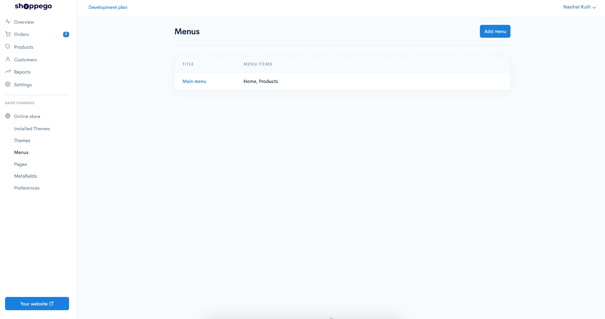
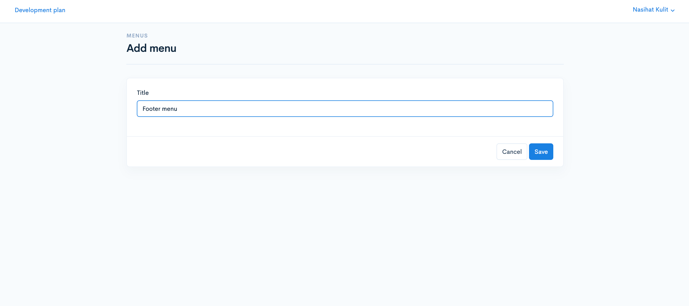
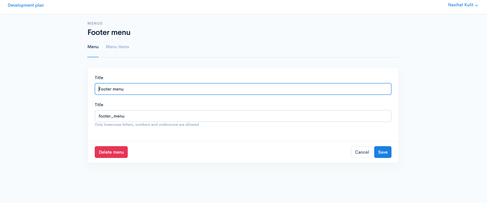
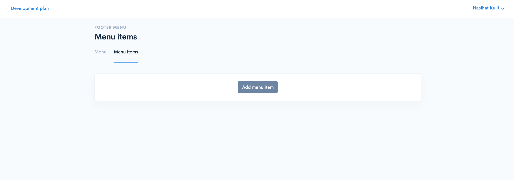
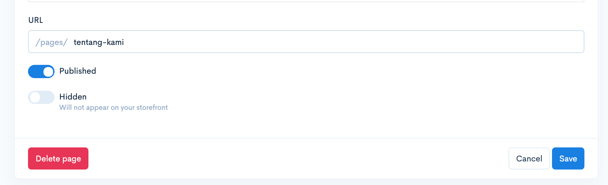
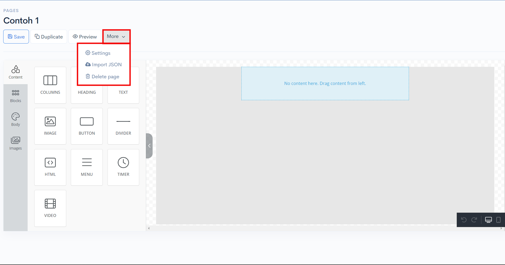
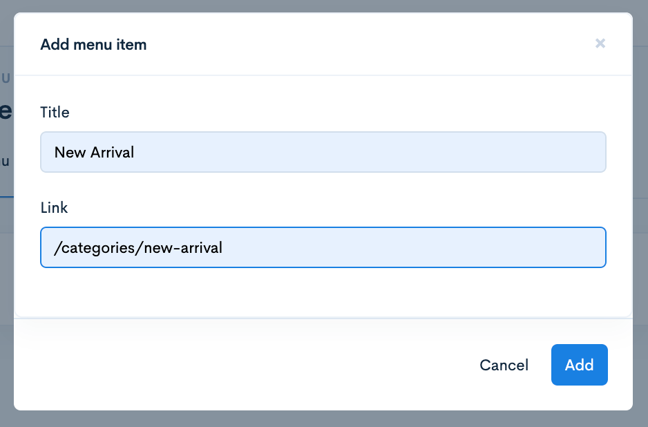

# Footer Menu

There are 2 steps to make settings in the footer menu.

1. Creating **Page/Category**:

* Tutorial to create pages: [Pages](../pages/build-pages.md)


[build-pages.md](../pages/build-pages.md)


* Tutorial to create Categories: [Categories](../../products/categories.md)


[categories.md](../../products/categories.md)


2. Creating a menu for page/category.

The tutorial are skipped to the step two. If your page or categories are not yet created you can refer to the link above.

## Part 1 : Creating Footer Menu

Log in and go to Online Store > Menus

Click on **Add Menu** and type **Footer menu** in the textfield **Title.** Be sure the spelling are correct for both capital and small letters. Click save.

The footer menu after created should be like these. Click on **Menu items** tab.

The display on **Menu items** tab.

Next click the **Add menu item** button In the Title field enter any name that symbolizes to your page.

In the link field, **only enter the handle.** Example as shown below:

* **Pages**: **/pages/your-page-name**
* **Categories**: **/categories/your-category-name**


\*\*<mark style="color:red;">**Attention**</mark>: Make sure you <mark style="color:red;">**do not**</mark>**&#x20;put a space** between **/** and your **page name**. Same goes with categories.


For example:

* **/pages/your-page-name** ✅
* **/pages/**<mark style="color:red;">**<->**</mark>**your-page-name**❌

### 1 : To get the link for Pages

There are **two ways** to get the link according to your builder interface:

1. **Pages**: Go to **Online store** -> **Pages** -> click on the **Edit** button on the **Page** name and copy the **URL**.

2. **Pages**: Go to **Online store** -> **Pages**-> **Edit** -> **More** -> **Settings** -> **SEO** -> copy **URL**.

<figure><figcaption></figcaption></figure>

### 2 : To get Link for Categories

**Categories**: go to **Products** -> **Categories** -> click **Edit** on **categories** -> click **SEO** tab copy **URL**

Paste the **URL** in Link **textfield**. The example are below.


<mark style="color:red;">\*\*Note\*\*</mark>: Please ensure that the \*\*spelling in the Link menu items\*\* that you have \*\*copied from SEO\*\* \*\*Pages\*\* and \*\*SEO Categories\*\* is the <mark style="color:red;">\*\*same\*\*</mark>.


Click add and **new footer menu** will be displayed at the bottom of your page.

