# Page Metafield


This metafield page feature allows you to **copy your landing page template** and **paste it on another page**.&#x20;


To use these features, you can refer to this tutorial:

## Get your JSON landing page

1\. Log in to your Shoppego account.

2\. Click on **Online store.**

3\. Click on **Metafields**

4\. Click on **Pages**

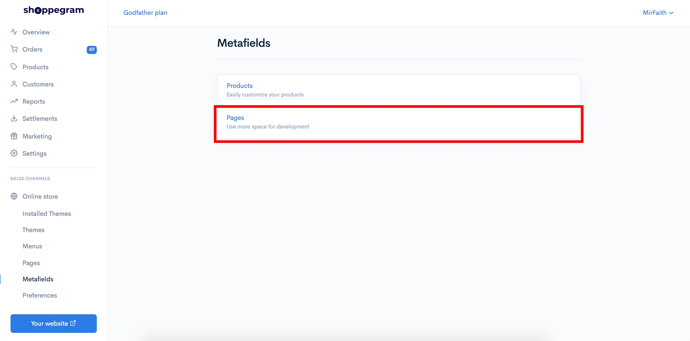

5\. Click on **the page you want to copy the page template**.

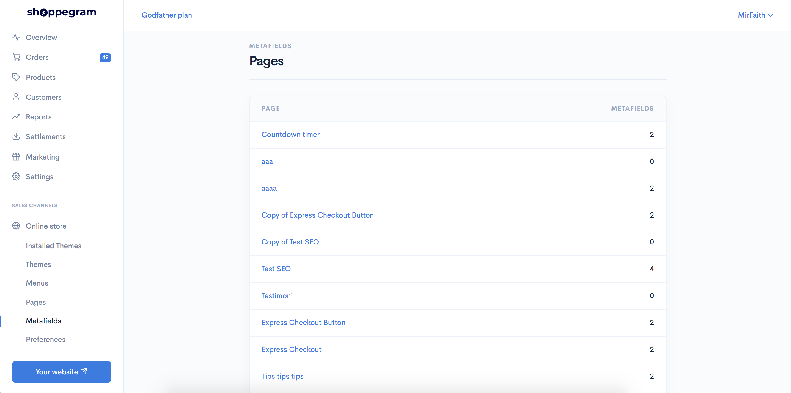

6\. Click **Edit on the json tab.**

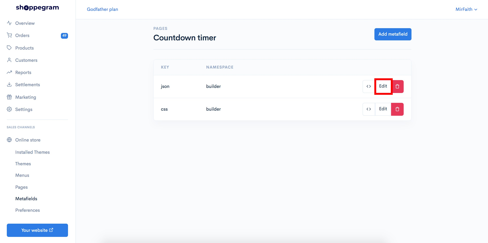

7\. You can **copy the entire text in the Value tab**

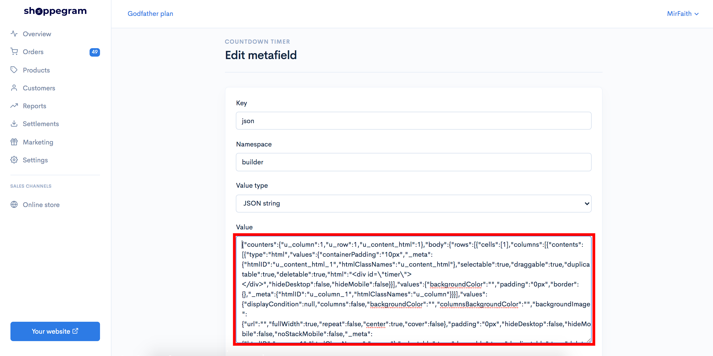


**If you want to import this sales page into another account, you can&#x20;**<mark style="color:red;">**save the text**</mark>**&#x20;you&#x20;**<mark style="color:red;">**have copied in the Value tab**</mark> <mark style="color:red;">**into your own computer as a .json file**</mark>**.**


## Create new page

After you copy the json, you can create 1 new page for the use of the metafield

1\. Go back to your Shoppego Dashboard.

2\. Click on **Online store**

3\. Click on **Pages**

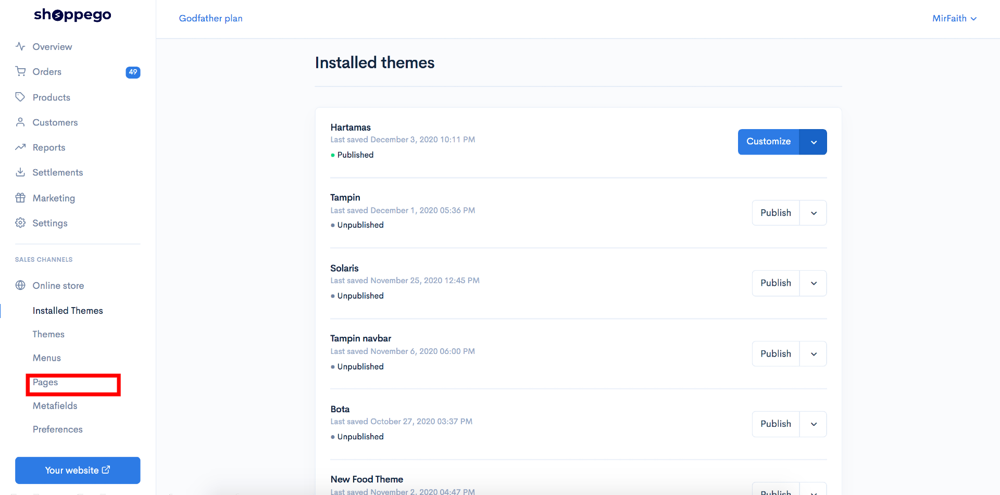

4\. Click on **Add Page**

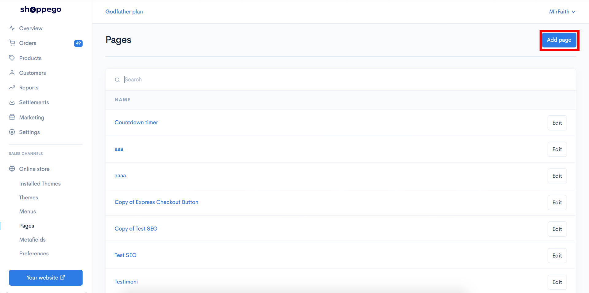

5\. Next you can fill in the **title information** (According to your wishes) for the page and click **Save**

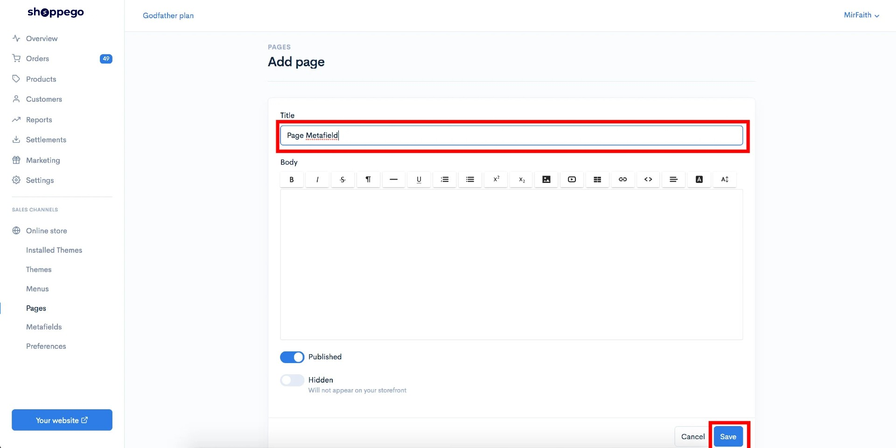

6\. When done, you can **click on the page again**.

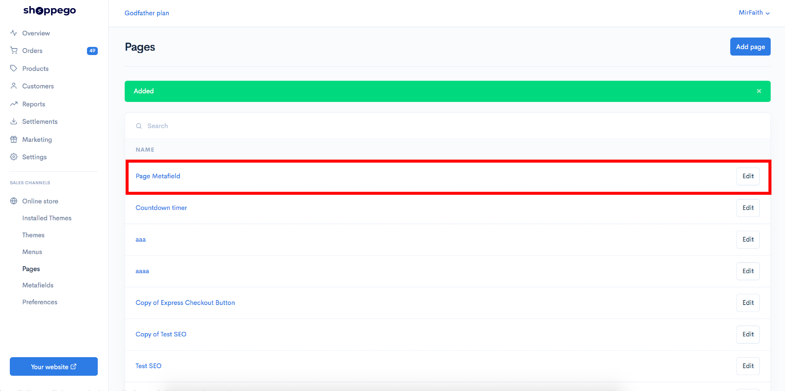

7\. Click on **Edit with builder.**

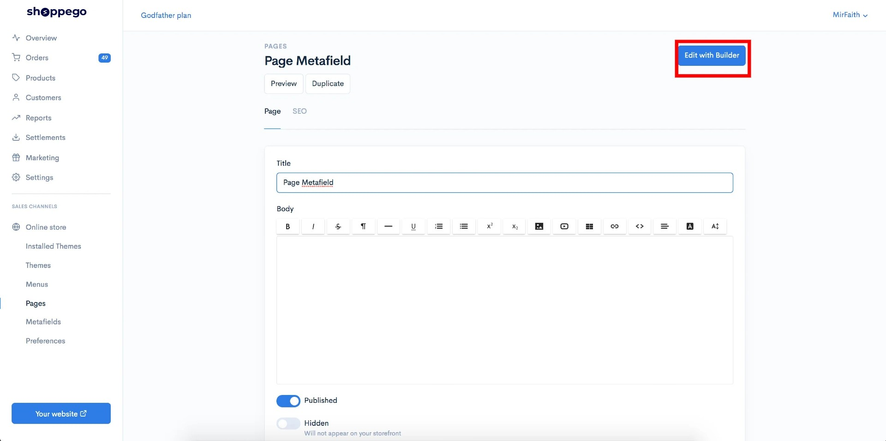

8\. In the Page builder, you can enter any element. For example, you can drag the button element and insert it into the Page builder column.

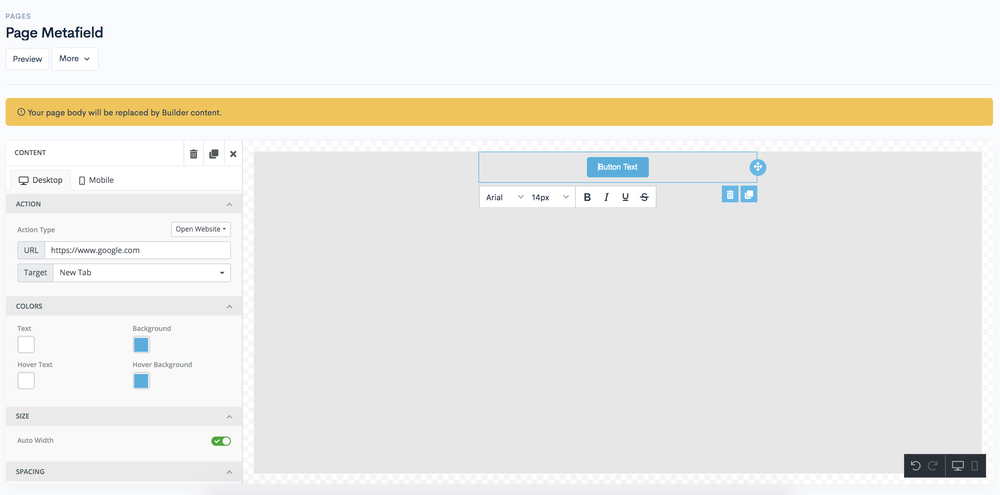

## Enter the json data into the page you just created

After creating the page using the page builder, you can enter the json data into the page you just created.

1\. Head over to your Shoppego dashboard.

2\. Click on **Online store**

3\. Click on **Metafields**

4\. Click on **Pages**

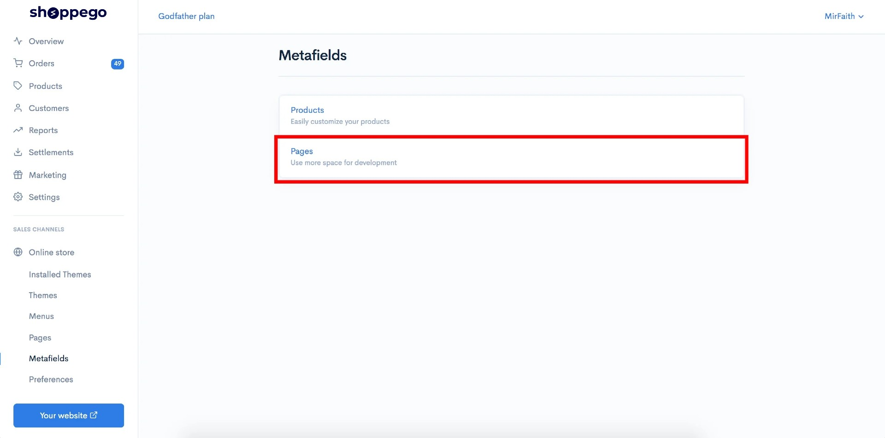

5\. Click on **the page you just created**.

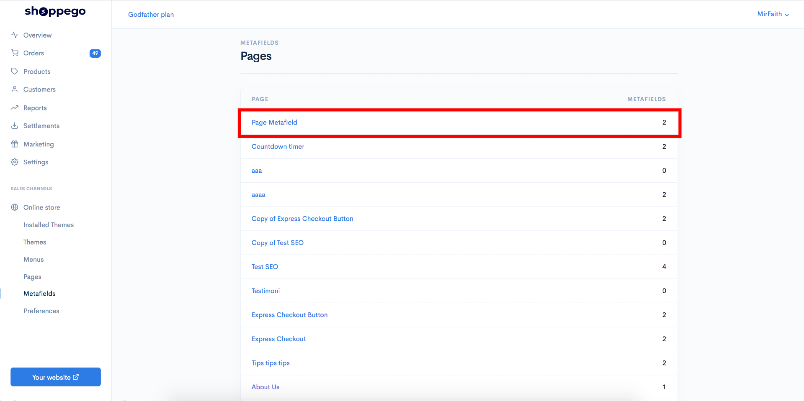

6\. Click **Edit on json tab.**

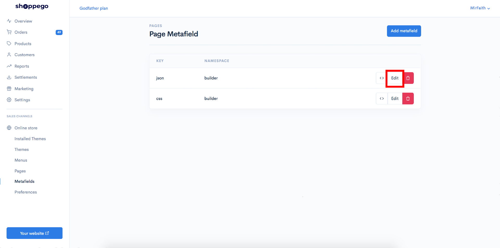

7\. Next, you can paste the json code you just copied in the previous step and make sure it is in the Value field.

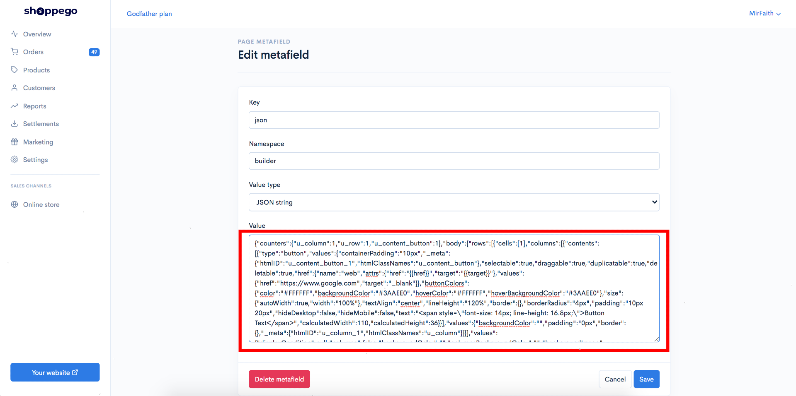

8\. When done you can click **Save**.

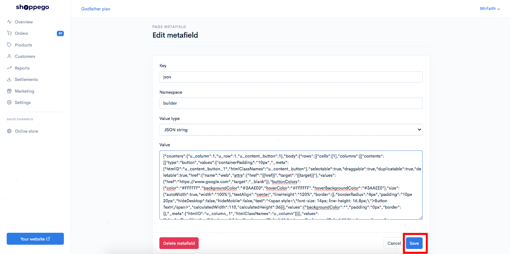

**If there is no changes at your site, you can trigger some changes at your page builder.**
