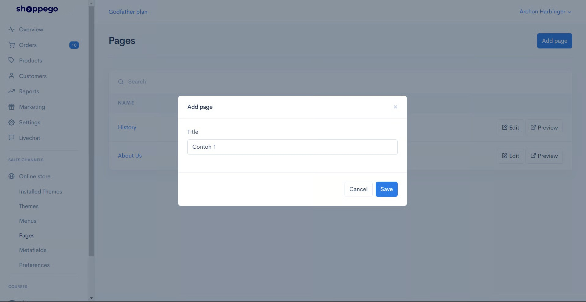
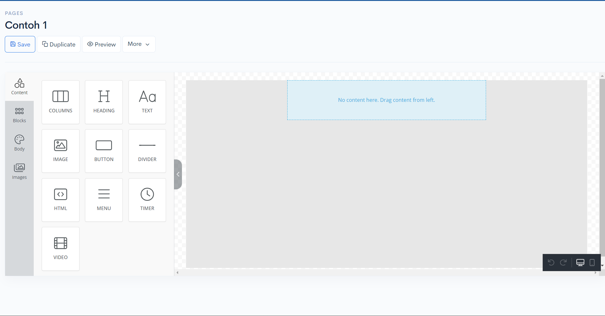

# Build pages


A **Page** is a place to fill in information such as **Contact Us, About Us, Testimonials,** and **others**.&#x20;

* Pages can also be used as **landing pages / sales pages.**&#x20;
* This is because **Pages&#x20;**<mark style="color:red;">**do not have a predetermined design**</mark> such as **images, buttons,** and **others**.
  

## **Add New Page**

Log in to the Shoppego Dashboard and go to the **Online store** -> **Pages** and click the **Add Page** button

1. Insert page name and save.

<figure><figcaption></figcaption></figure>

2. You will be taken to the **Builder** page, where you will make any **edits** you want.

<figure><figcaption></figcaption></figure>

3. Refer to the picture below, to make **settings** on the page you have created, you can **press** the **More** button.

<figure><figcaption></figcaption></figure>

### Settings in Page Builder

**Settings** - There are three parts, **Page**, **SEO**, **Redirect**.&#x20;

<table><thead><tr><th width="154">Setting</th><th> Description</th></tr></thead><tbody><tr><td><strong>Page</strong> </td><td>There you can edit the Page name and set whether the Page is to be displayed (<strong>Published</strong>) or hidden (<strong>Hidden</strong>). </td></tr><tr><td><strong>SEO</strong> </td><td>You can change the URL link of your Page and also the <strong>Search Engine Optimization (SEO)</strong> settings. For reference, see <a href="https://docs.shoppegram.com/commerce/en/products/seo-snippet"><strong>this link</strong></a>. </td></tr><tr><td><strong>Redirect</strong> </td><td>You can bring customers to another page that you want if they enter the link/URL of this page. </td></tr></tbody></table>

<table><thead><tr><th width="150.33333333333331">Setting</th><th width="473">Description</th><th data-type="content-ref"></th></tr></thead><tbody><tr><td><strong>Import JSON</strong></td><td>If you want to get the <strong>JSON for the landing page</strong>, you can refer to the tutorial at <a href="https://docs.shoppegram.com/commerce/en/online-store/metafields/page-metafield"><strong>this link</strong></a>. </td><td><a href="import-json.md">/pages/xAkJkHd07kP26KcDlJwL</a></td></tr><tr><td><strong>Delete Page</strong></td><td>You will <strong>delete the Page</strong> you created along with everything in it. </td><td></td></tr><tr><td><strong>Duplicate</strong> </td><td>You will <strong>create a copy</strong> of your original Page.  **<mark style="color:red;"><strong>Note</strong></mark>: If you turn on the <strong>Toggle Page Builder content</strong>, you will <strong>copy all the content</strong> of the <strong>original Page</strong> to the <strong>new Page copy</strong>.</td><td></td></tr></tbody></table>
