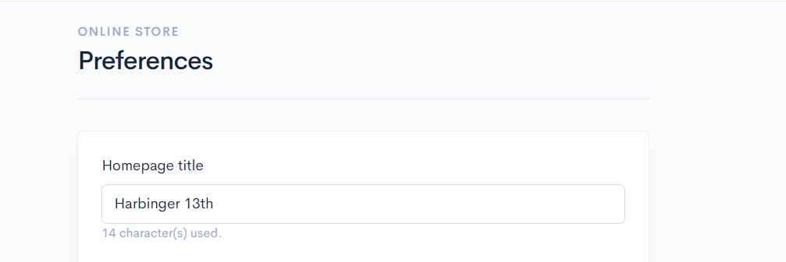
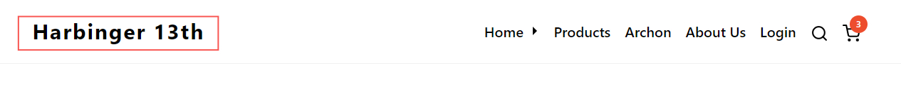
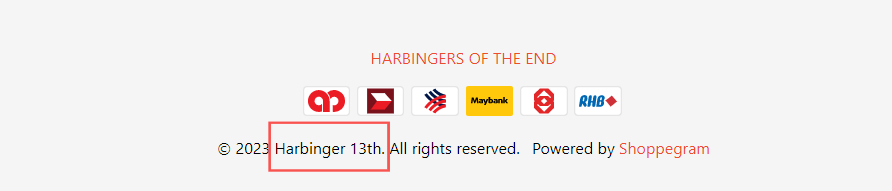

# Preferences

## Homepage Title&#x20;

1. To change the Homepage Title name, you can go to:&#x20;

**Dashboard Overview -> Online Stores -> Preferences -> Homepage Title.**

<figure><figcaption></figcaption></figure>

2. After making the changes, make sure to click the **Save** button and check if the changes have taken effect on your website. You can refer to the image below.

<figure><figcaption></figcaption></figure>

<figure><figcaption></figcaption></figure>

## Homepage Display

To set up Homepage Display, please refer to the tutorial below:


[Set page as Homepage](pages/set-page-as-homepage.md)


## Featured Category

To set up Featured Category, please refer to the tutorial below:


[Featured Category](../products/categories/featured-category.md)


## Facebook Pixel

To set up Facebook Pixel, please refer to the tutorial below:


[Facebook Pixel](../integration/tracking-and-analytics/facebook/facebook-pixel.md)


## Tiktok Pixel

To set up Tiktok Pixel, please refer to the tutorial below:


[TikTok Pixel](../integration/tracking-and-analytics/tiktok/tiktok-pixel.md)


## Google Analytics

To set up Google Analytics, please refer to the tutorial below:


[Google Analytics](../integration/tracking-and-analytics/google/google-analytics.md)


## Google Ads

To set up Google Ads, please refer to the tutorial below:


[Google Ads](../integration/tracking-and-analytics/google/google-ads.md)


## Google Tag Manager

To set up Google Tag Manager, please refer to the tutorial below:


[Google Tag Manager](../integration/tracking-and-analytics/google/google-tag-manager.md)


## Recent Sales JSON

To set up Social Proof Notifications, please refer to the tutorial below:


[Social Proof Notifications](../marketing/social-proof-notifications.md)

