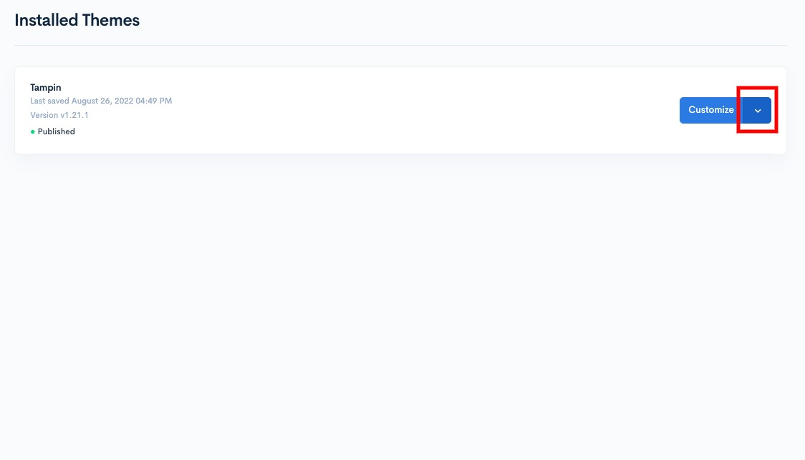
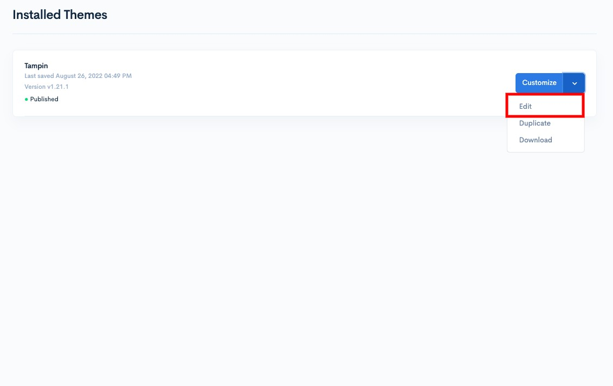
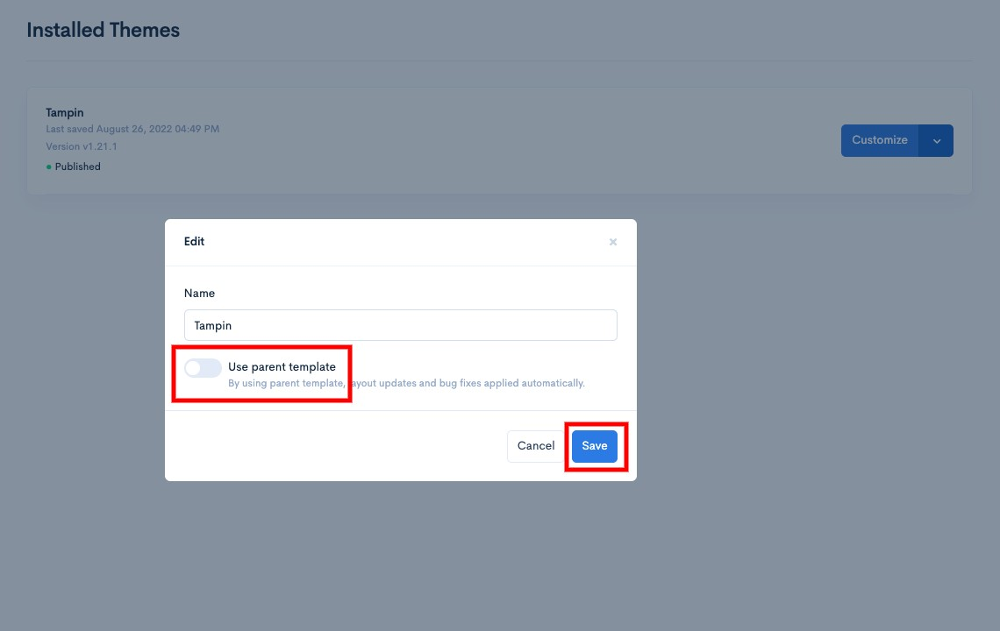
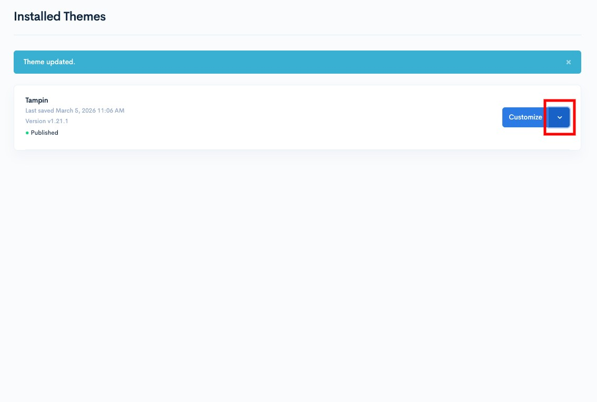
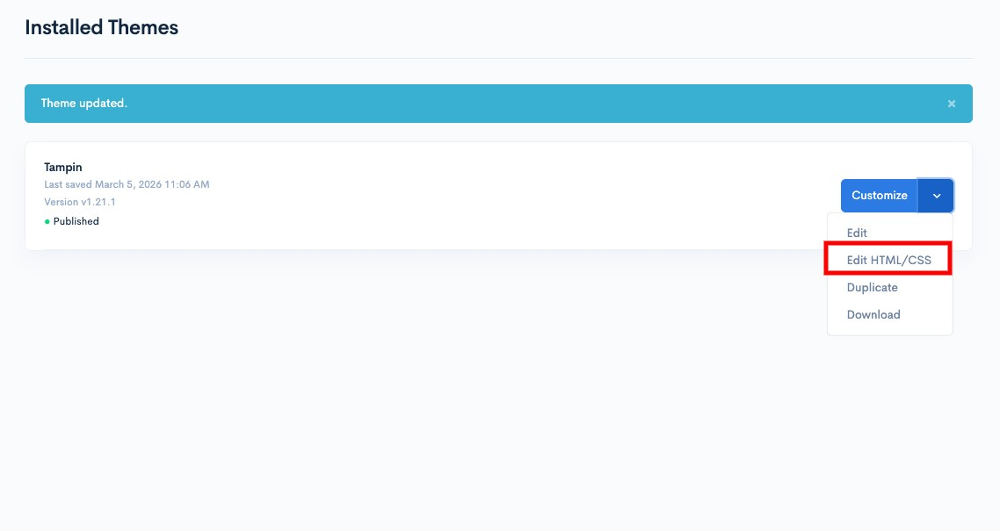

# Themes

Different themes have unique styles, designs, and experiences that suit the specific products you sell. With Shoppego themes, you can customize your online store to match the needs of your brand and business.

At Shoppego, we have 6 types of themes that you can use, including:

1. [Hartamas Themes](themes/themes-type/hartamas.md)
2. [Solaris Themes](themes/themes-type/solaris.md)
3. [Tampin Themes](themes/themes-type/tampin.md)
4. [Linggi Themes](themes/themes-type/linggi.md)
5. [Jugra Themes](themes/themes-type/jugra.md)
6. [Bota Themes](themes/themes-type/bota.md)

At Shoppego, to make it easier for users to create their own themes, we have introduced a system called Shopway. For users who want to get our theme template format directly, you can go to this link: <https://gitlab.com/shoppegram/shopway>

For users who are skilled in coding, you can make changes to existing coding themes to make layout changes and so on. For this setting, you can go to the section:

1. Log in to the Shoppego dashboard

<figure><figcaption></figcaption></figure>

2. Click on **Online store**

<figure><figcaption></figcaption></figure>

3. Click on **the arrow icon (next to the Customize button)**

<figure><figcaption></figcaption></figure>

4. Click **Edit**

<figure><figcaption></figcaption></figure>

5. **Untick** the "**Use parent template**" toggle and click **Save**

<figure><figcaption></figcaption></figure>


Users should note that if you disable the "Use parent template" function, it means that the themes will no longer receive any updates from us.


To **access the coding page**, you can click on **the arrow icon (next to the Customize button)**

<figure><figcaption></figcaption></figure>

Then, you can click on **Edit HTML/CSS**

<figure><figcaption></figcaption></figure>

In this section:

1. [Themes structure](themes/themes-structure.md)
2. [Themes variable](themes/themes-variable.md)
