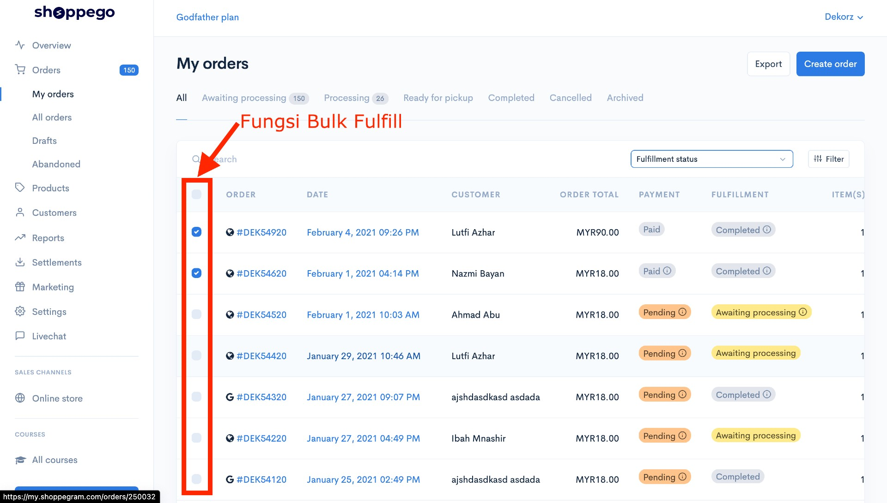
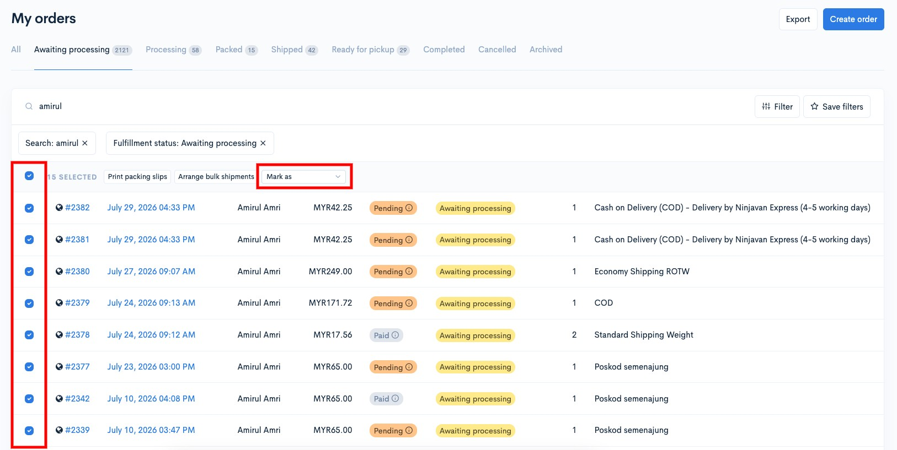
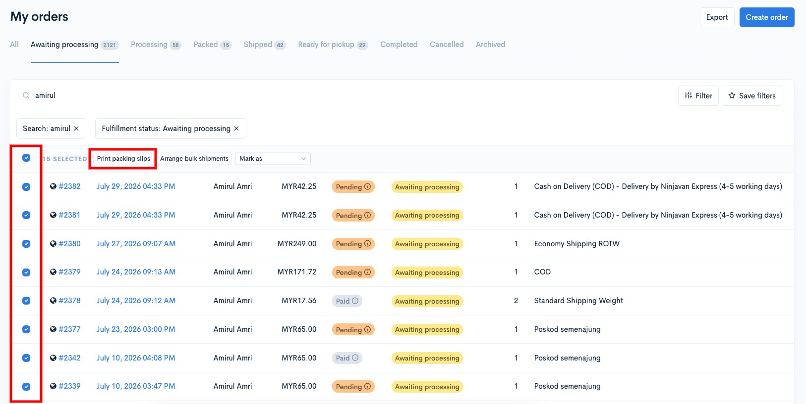

# Bulk Fulfillment

## What is Bulk Fulfillment?

If you are a Premium User and above, you can use this Bulk Fulfillment function to manage orders more easily and quickly.

1. Bulk Fulfill helps you to **update your order management** with just a few clicks
2. Bulk Fulfill allows you to "**export**" your **order to CSV File** (Excel Format) dynamically according to your convenience and requirements
3. Bulk Fulfill helps you **change the status of your order** with one click without having to make the process one by one.
4. Bulk Fulfill will allow you to **print your packing slips** according to your convenience and requirements.

## Change Order Status with Bulk Fulfillment

You can change the order status using the Bulk Fulfill function all at once. You just need to tick or select the order and then change the status of the order.

Among the **fulfillment status** that can be changed are as follows:

1. Change to **Awaiting Processing**
2. Change to **Processing**
3. Change to Packed
4. Change to **Ready for Pickup**
5. Change to **Shipped**
6. Change to **Completed**

## How to change Fulfillment Status to Completed

1\. Go to Shoppego Dashboard > **My Orders** > **All**

2\. Tick ​​on the order you want to change the fulfillment status. Then Click on "**Mark as**" selection and select "**Change status to Completed**"

## How To Print Packing Slips

1. Go to Shoppego Dashboard > **My Orders** > **All**
2. Tick ​​on the order you want to print its packing slips. Then Click on "**Print packing slips**"

<figure><figcaption></figcaption></figure>
