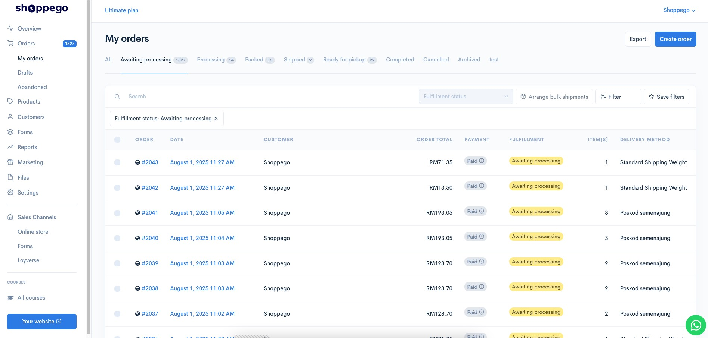
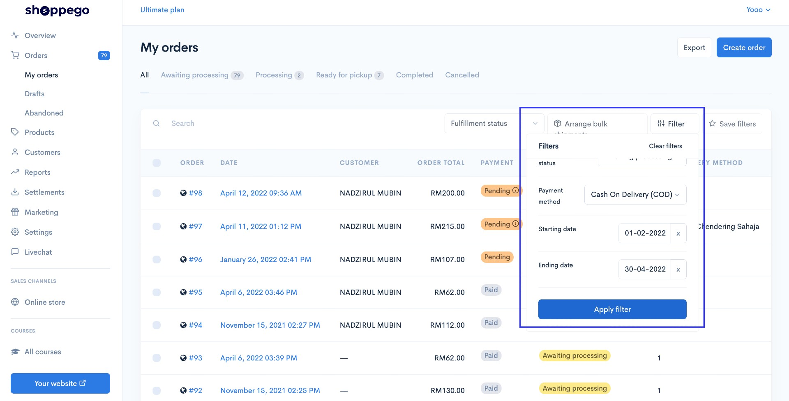
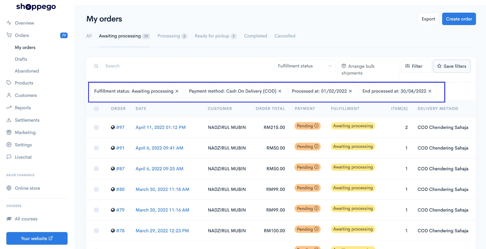
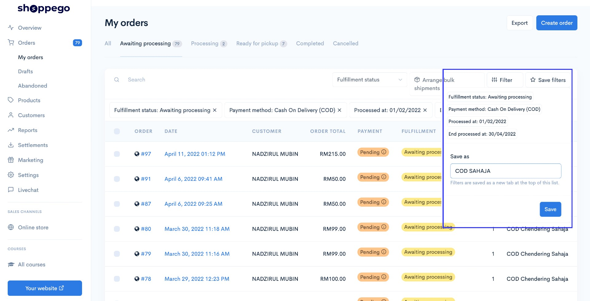
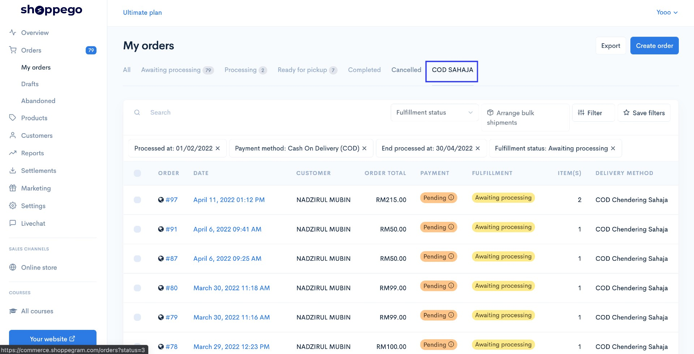

# Filter Orders

Filter orders allows you to make custom tab filter orders. You can filter orders according to what you want.&#x20;

1. Enter **Orders / My Orders**.

<figure><figcaption></figcaption></figure>

2. Press on **Filter** and choose according to your options, then press **apply filter.**

<figure><figcaption></figcaption></figure>

3. Next, your table will look like the following after you press **Apply Filter**. You can remove unwanted filters by clicking on the highlighted button as shown below.

<figure><figcaption></figcaption></figure>

4. You can **save your filter** by clicking on the **save filters button** and entering your filter name. Then you can click **save**.

<figure><figcaption></figcaption></figure>

5. A **new TAB** will appear based on the filter you just saved earlier.

<figure><figcaption></figcaption></figure>

#### <mark style="color:red;">NOTE</mark>: ONLY MAXIMUM 5 TABS ALLOWED.
