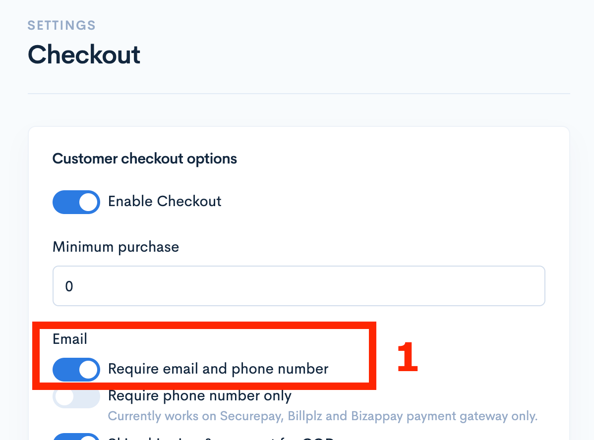
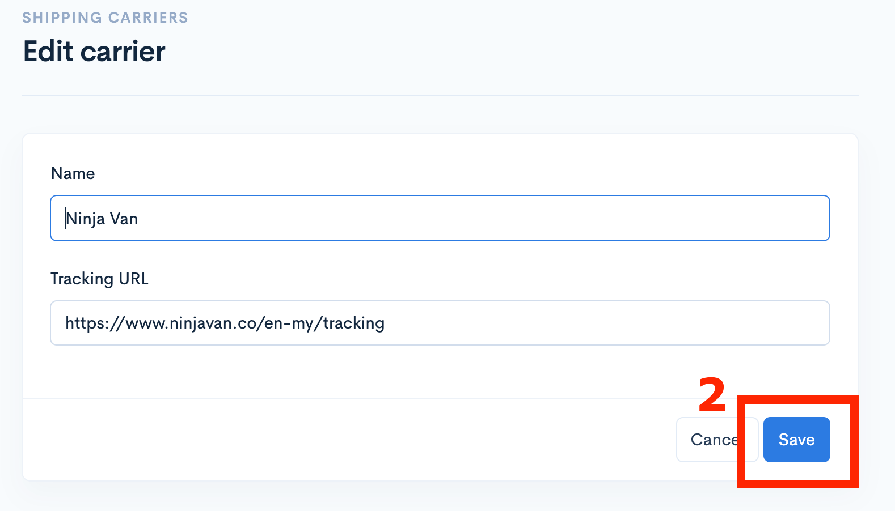
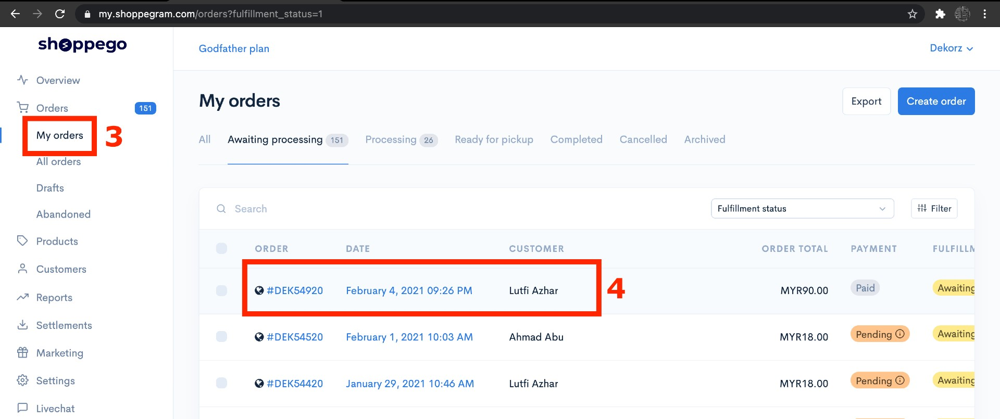
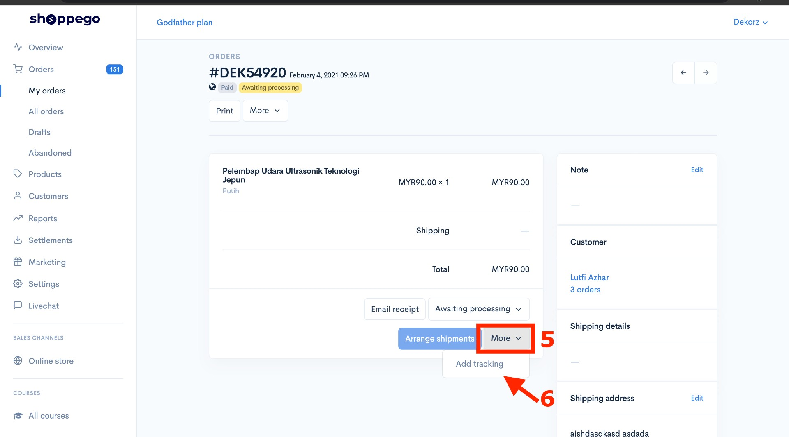
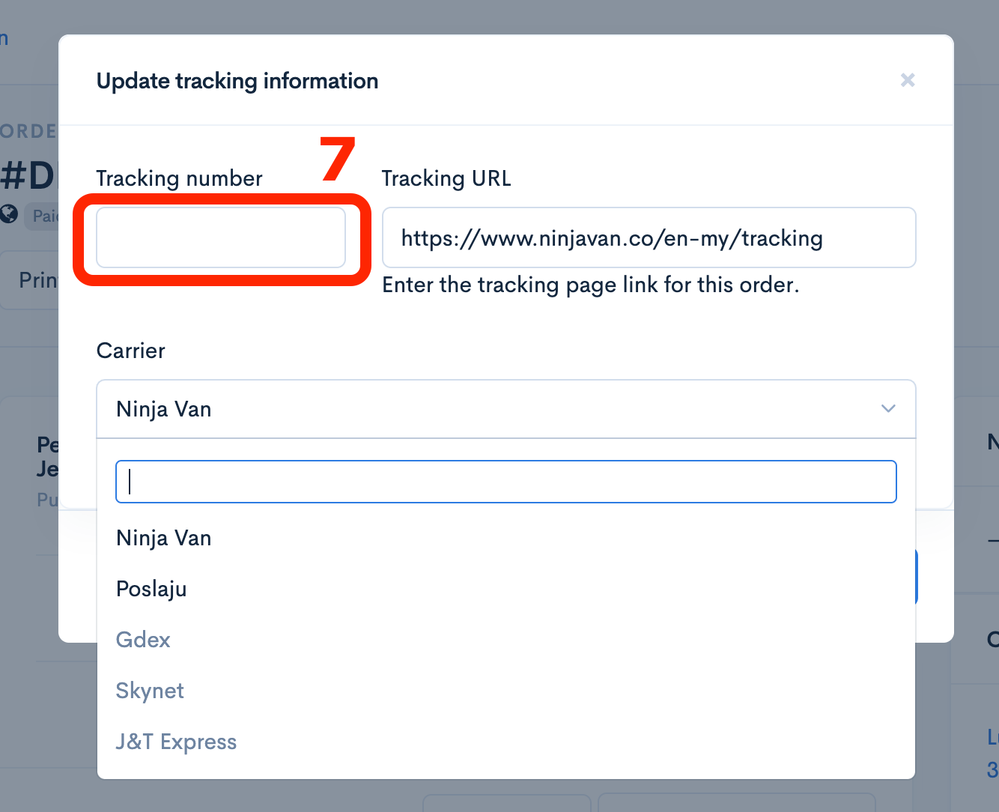

# Order Fulfillment

You can send a tracking number for your customer's orders. Your customers will get information about this order automatically via their email.

To begin this setup, there are three **(3) important steps** you need to do:

1. **Make sure the "Require email and phone number" function in the Settings (Checkout) is ON**
2. **Make sure your Shipping Carriers have been added in the Settings (Shipping Carriers) section.**
3. **Manual key-in Tracking Number of the customer in the Order section**

## Step 1: "Require email and phone number" function

Log in to your Commerce Dashboard then click on **Settings** -> **Checkout** -> **Email** -> **Turn ON "Require email and Phone Number"**

## Step 2: Add Shipping Carriers

Click on **Settings**-> **Shipping Carriers**-> Click **Add Carrier**-> Enter Carrier Name (Example: Ninja Van, Express Post etc)-> Enter Tracking URL-> **Save**

## Step 3: Inform the customer

This determination can be done after you receive an order from a customer who has entered into your Commerce website.

Go to the **My orders** section and click on the **Customer's order**.

To do this, you need to do it one by one on each customer and order that has been received.

Click **My Orders**-> **Awaiting Processing**-> Click "**Order**"

Add tracking to notify customers

Click **More** -> **Add Tracking** as below:

Enter the Tracking Number and **select your Carrier** -> Press **Save**

Enter the Tracking Number and Carrier

**After you save, your customer will automatically receive an email confirming the delivery information regarding their order and the tracking number for the order.**

You can change the status of the previous order from "Awaiting processing" to "Completed"

**Now it's done, your customers have been automatically notified via email.**

## Order Status&#x20;

<table><thead><tr><th width="212">Status</th><th>Description</th></tr></thead><tbody><tr><td><strong>Awaiting Processing</strong> </td><td>Order is <strong>waiting to be processed</strong> by the Seller/Vendor. </td></tr><tr><td><strong>Processing</strong> </td><td>Order is <strong>in the process</strong> of being packaged, shipped to the courier company, and related tasks. </td></tr><tr><td><strong>Ready for Pickup</strong></td><td>The order is <strong>ready to be picked up by the customer</strong> at the seller's store (option - Pickup on delivery method). <mark style="color:red;"><strong>**Note: The Shipping Method Pickup function and order status can only be used on the Ultimate plan.</strong></mark></td></tr><tr><td><strong>Completed</strong> </td><td>Order has been <strong>successfully delivered</strong> to the customer.</td></tr><tr><td><strong>Packed</strong></td><td>The <strong>order has been packed by the seller</strong> and is <strong>just waiting for the courier to pick it up or the seller to send it to the courier office</strong>.</td></tr></tbody></table>
