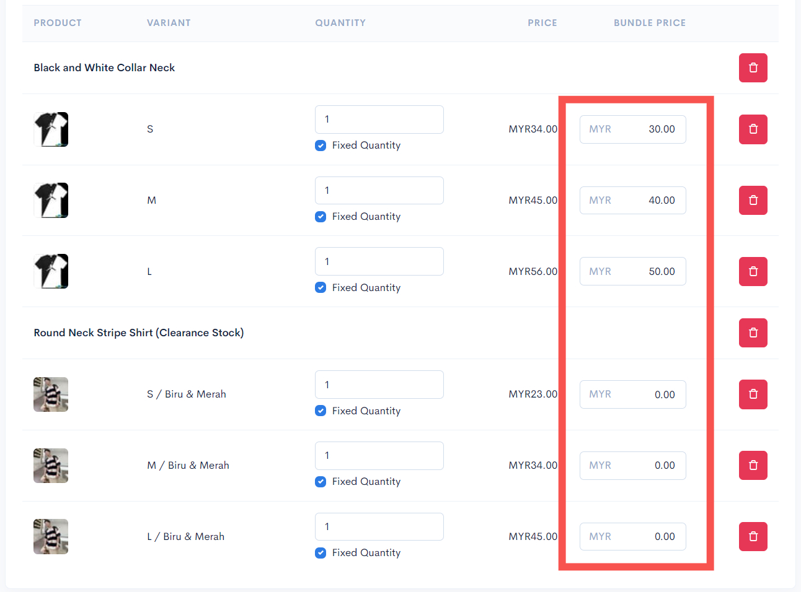

# Buy 1 Bundle and Clearance

In this tutorial scenario, you will set up a **Bundle product with clearance stock**.

Example products used in this scenario are **Tabby Pants Honey Mustard** and **Tabby Pants Teal Blue.** Follow the steps below to set up a **Bundle product with clearance stock:**

1. Add the products you want customers to buy to the bundle product, as shown below:


For the Clearance Item, you can either enter a **value of 0 (100% discount)** or **your own price** for the clearance stock.


<figure><figcaption></figcaption></figure>

2. Tick the Fixed quantity checkbox for each product in the bundle and enter a value of 1 for each available quantity field.


This setting ensures that customers can only choose one item per product.


<figure><figcaption></figcaption></figure>

3. Enter a price for each product in the Bundle price field.

<figure><figcaption></figcaption></figure>

4. Click the Save button when finished.

<figure><figcaption></figcaption></figure>

5. You can click the Preview button to see what your bundle product looks like and try to make a purchase.

<figure><figcaption></figcaption></figure>

This is the display of the product bundle on the website (Themes Hartamas):

<figure><figcaption></figcaption></figure>
