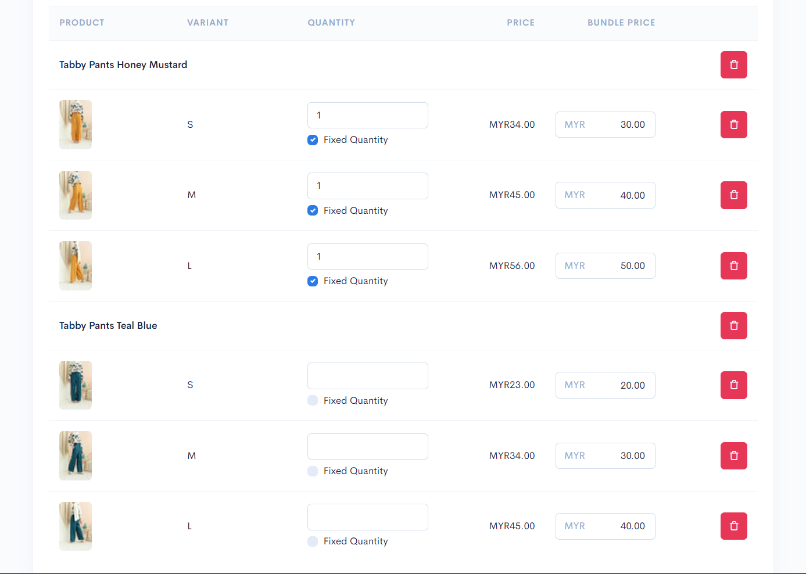
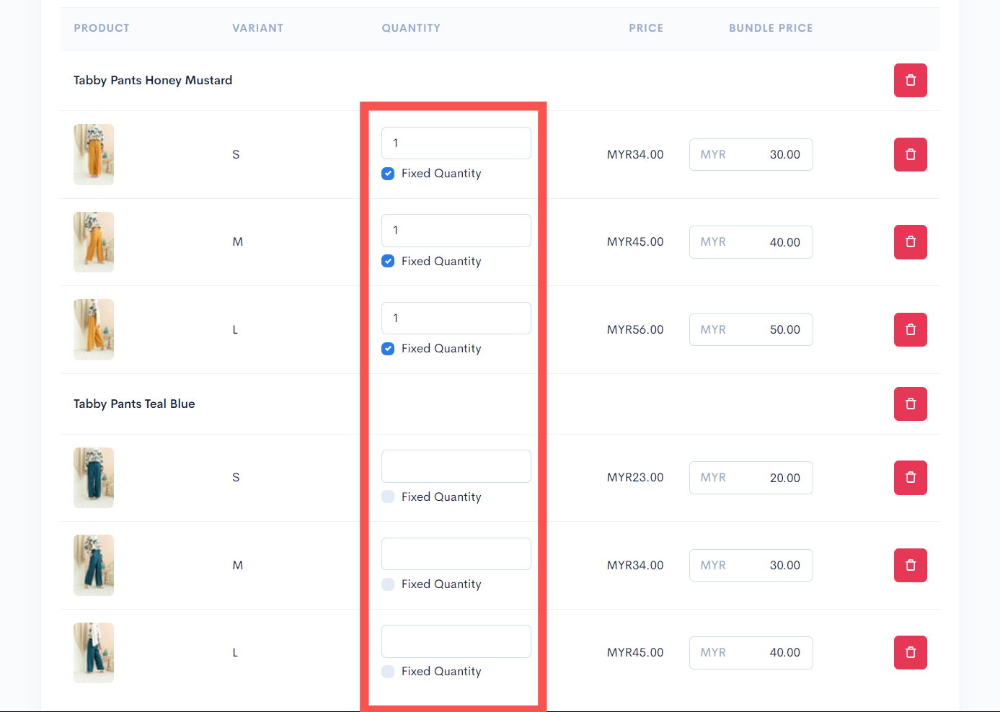
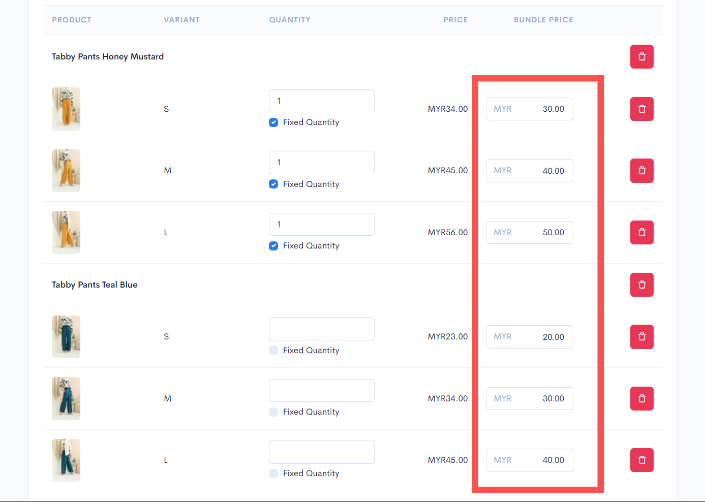
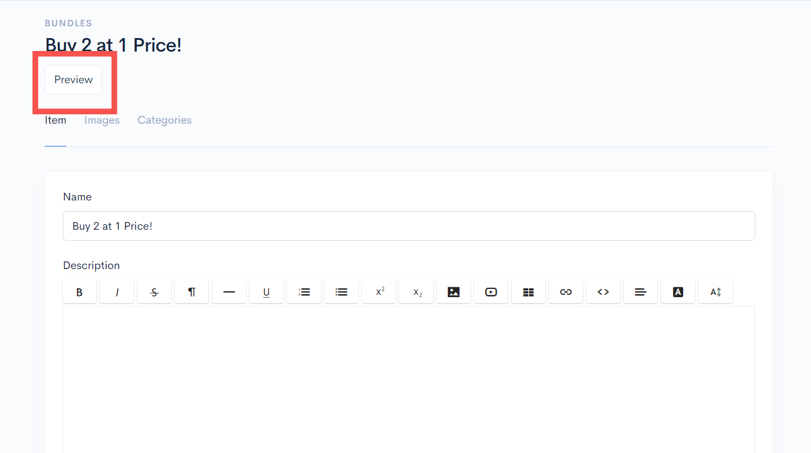
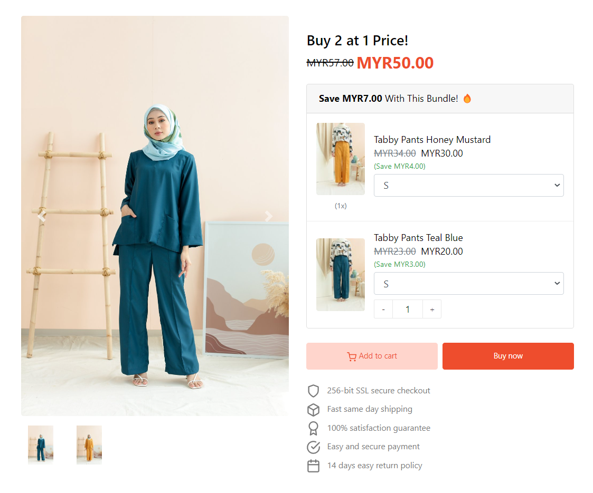

# Buy 2 Product 1 Price


To create a product bundle for this scenario, you will need to have **two different types of products.**


Example products used in this scenario are the **Tabby Pants Honey Mustard** and **Tabby Pants Teal Blue.** You can refer to the steps below for setting up the bundle product:

1. Enter the products that you want your customers to buy as shown in the following display:

<figure><figcaption></figcaption></figure>

2. Then, you can tick the checkbox for **"Fixed quantity"** on each product setting and enter a value of 1 for each quantity field available.


This setting ensures that customers can only **select one unit** for each product in the bundle.


<figure><figcaption></figcaption></figure>

3. You can enter the price for each product.

<figure><figcaption></figcaption></figure>

4. After you're done, click on the Save button.

<figure><figcaption></figcaption></figure>

5. You can click on the Preview button to preview your product bundle and try to make a purchase.

<figure><figcaption></figcaption></figure>

This is the display of the product bundle on the website (Themes Hartamas):

<figure><figcaption></figcaption></figure>
