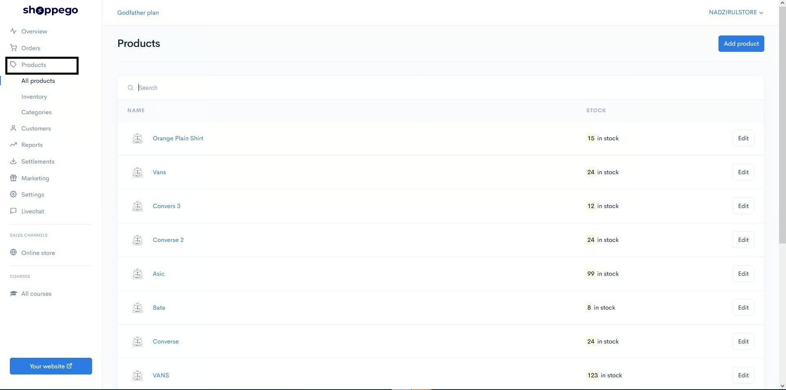
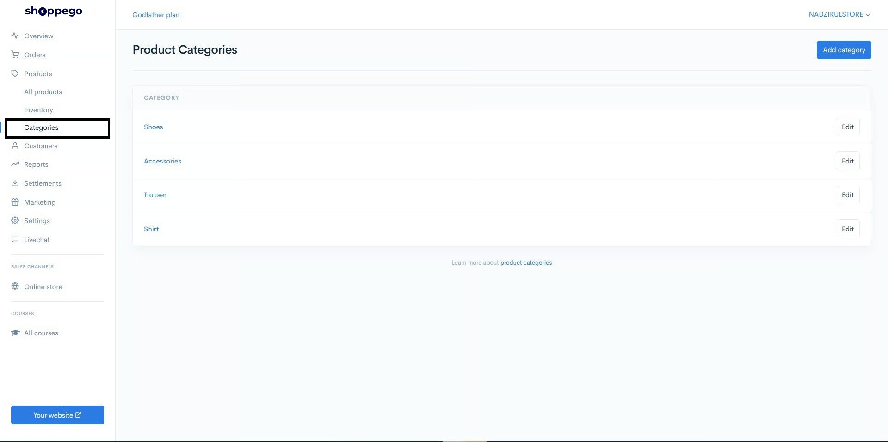
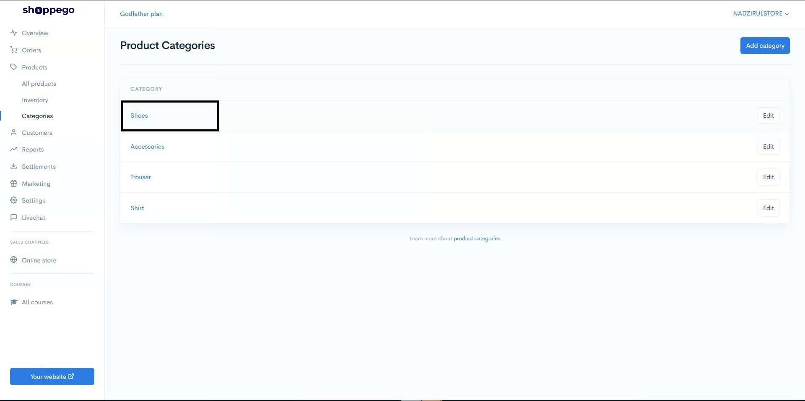
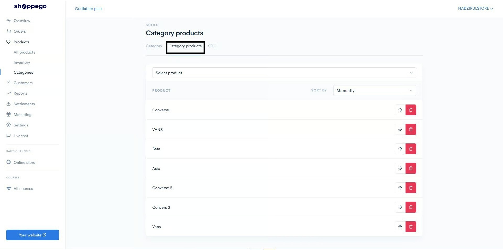
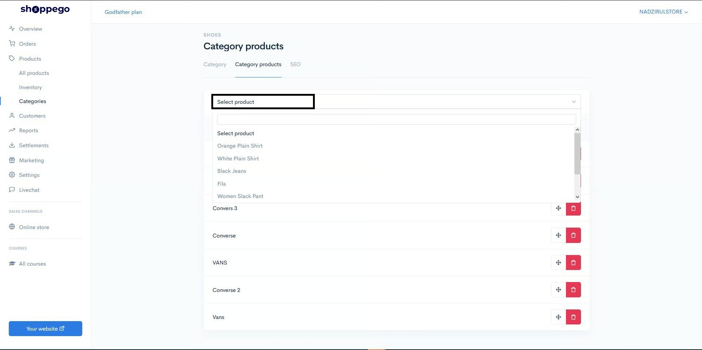
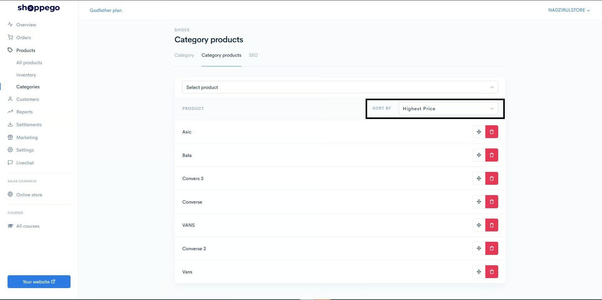
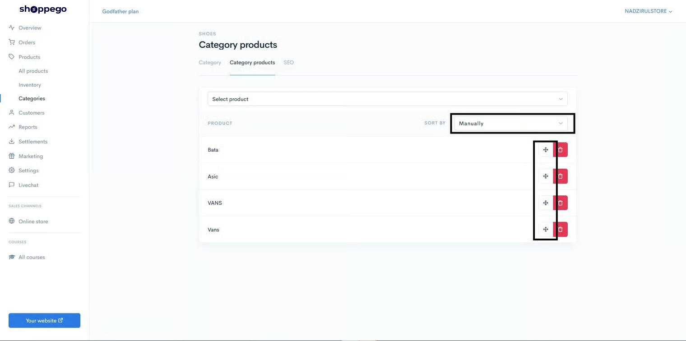

# Category Products


**Category Products** is a place where you can enter products into the category you want.&#x20;


You can also sort the products according to your own preferences.&#x20;

Below is an example of the use of the product sorting function according to the most expensive price.

## Set up Category

1\. Go to the Commerce dashboard section.

2\. Click on the **Products** section.

3\. Click on the **Categories** section.

4\. Select any category you want. For example, here we choose the category Shoes.

5\. Click on the **Category products** section. Here is a list of products available in this Shoes category.

6\. In the **Select product** section, you can **select any product that you want to include in this category**.

7\. Next you can choose how to organize your products in the store. Click on **SORT BY** and select according to your convenience. For example, here are the products arranged according to the most expensive price (**Highest Price**).

### Sort By Functions:&#x20;

The following are the options available in the **SORT BY** function:

<table><thead><tr><th width="194">Menu</th><th>Explanation</th></tr></thead><tbody><tr><td><strong>Manually</strong></td><td>Arrange the products according to your wishes</td></tr><tr><td><strong>Product name A-Z</strong></td><td>Arrange products from A to Z.</td></tr><tr><td><strong>Product name Z-A</strong></td><td>Arrange products from Z to A.</td></tr><tr><td><strong>Highest price</strong></td><td>Arrange products from the highest prices</td></tr><tr><td><strong>Lowest price</strong></td><td>Arrange products from the lowest prices</td></tr><tr><td><strong>Newest</strong></td><td>Arrange products from the latest products</td></tr><tr><td><strong>Oldest</strong></td><td>Arrange products from old products</td></tr><tr><td><strong>Availability</strong></td><td>Sort products according to stock that is still available or sold out</td></tr></tbody></table>

## Additional Info

You can also use the **arrow icons** to arrange your products using the drag and drop method.

Select **SORT BY** **Manually** and hover the mouse pointer over the **arrow icon** and click to **DRAG and DROP**

