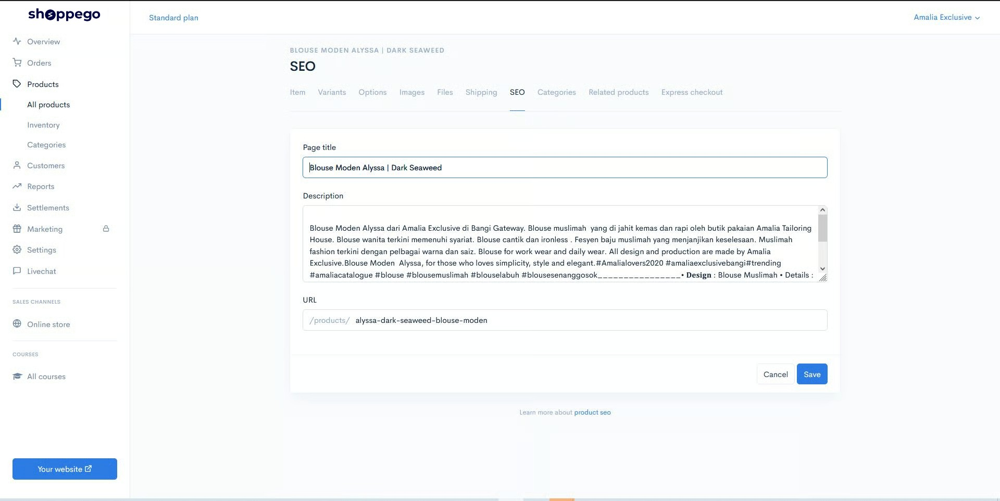
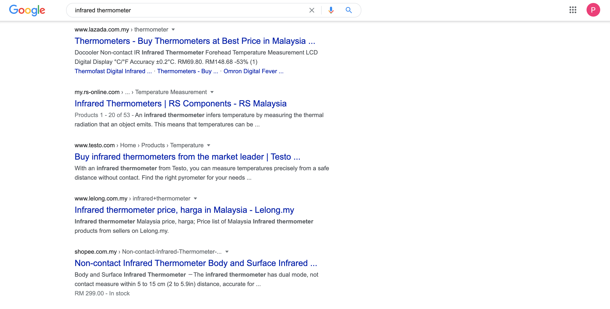

# SEO Snippet

For **SEO**, in fact, regular users **do not need to care deeply** because everything is **automatically provided** by Commerce.

However, Commerce has also provided **built-in features** to make it easier for more knowledgeable users to configure themselves how these snippets will be **displayed on pages in search engines**.&#x20;

Briefly, **SEO** is referred to as **Search Engine Optimization** which means Search Engine Optimization. Where the setting of this **SEO** will determine the **position of your website** when the search is made on **search engines such as Google, Bing, Yahoo, and so on**.

One of the ways **search engines rank** a website is through **Keywords**. For example, someone who logs into **Google** will type in the word **Infrared Thermometer.**

So search **engines will look for websites** that have the **word infrared thermometer**, if a website does not have this word it means it will not be displayed in the search.

Therefore it is important that we include all the **relevant keywords in this SEO** snippet by Commerce.

In Commerce, SEO snippets can be found inside each product. Click on **Products** -> **Product Name** -> **SEO**

By default, this field will be generated automatically based on what we fill in the product title and description.&#x20;

Consider the example below, where the blue text is the Title and below it, the black text is the description snippet.

So to further increase the chances of our website in the top position is in the **Description** section in SEO Commerce you need to enter the keyword infrared thermometer.

When done, click the **Save** button. Now your SEO Snippet has a brighter chance of being in the top position in Search Engines
