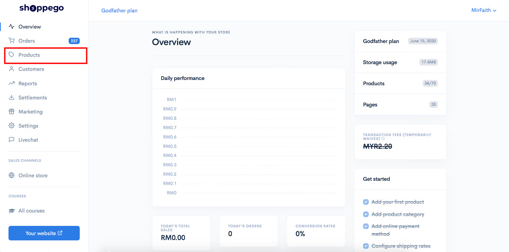
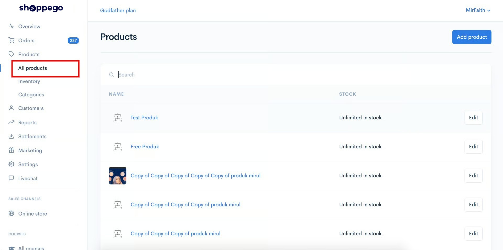
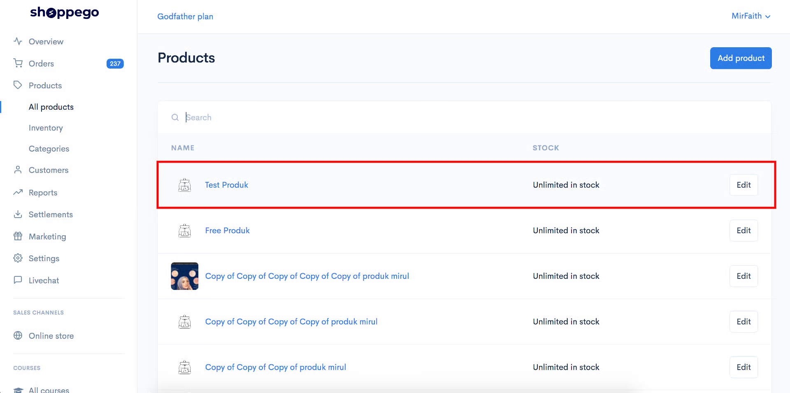
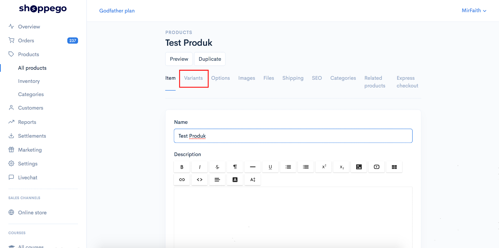
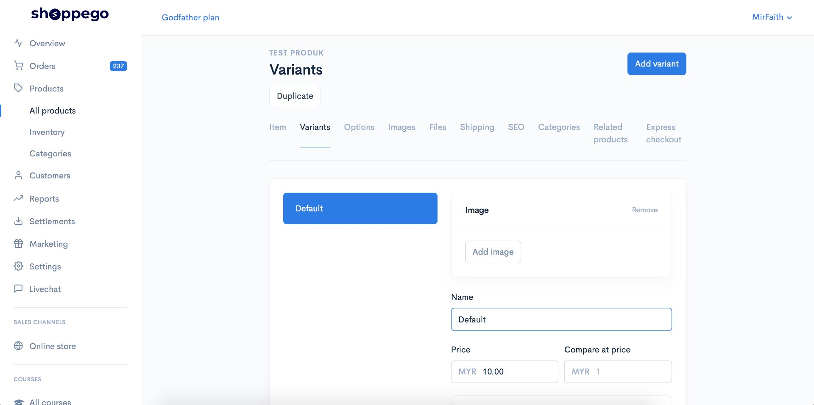
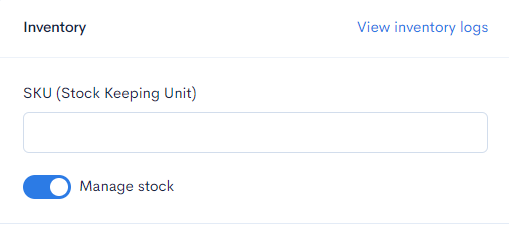
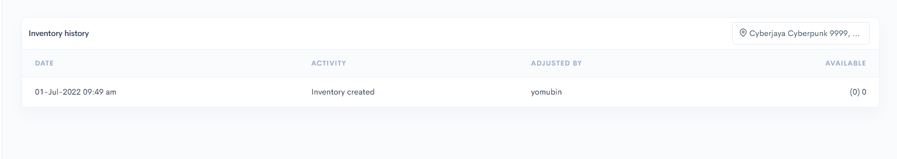

# Variants

**Setting Variants**&#x20;


\*\*<mark style="color:red;">**Note**</mark>: The **maximum setting** for **Variants** is only <mark style="color:red;">**100**</mark>.&#x20;



[Variants Setup](variants/variants-setup.md)



[Variants Image](variants/variants-image.md)


**Product variants** are used to create **more than one option** for the **same product**:&#x20;

For example:&#x20;

* **A shirt** product that has **many sizes**.&#x20;
* **Wood** products have **many measurements**.&#x20;

**Variants** can also be used as an option to **create combo products**.


[Variants for Combo Promo](variants/variants-for-combo-promo.md)


 <mark style="color:red;">**\*\*Notice**</mark>: Before continuing with this tutorial, make sure you **have added your product** and **Save** it first.



\*\*<mark style="color:red;">**Notice**</mark>: Make sure you have added **Options (Button/Dropdown/Swatch)** **to your product first** if you **want to add variants** to your product.



[Options](options.md)


## Access to Variants page

1. &#x20;Log in to your Commerce Dashboard

2. &#x20;Click on **Products**

3. &#x20;Click **All products**

4. &#x20;Click on the product name to which you want to add/change Variants


**To add variants, make sure you have added Options (Button/Dropdown/Swatch) to the product first.**


5. &#x20;Next, click on the **Variants** tab

By default for each product will come with a Default variant.

## Inventory&#x20;

### 1. View Inventory Logs


\*\*<mark style="color:red;">**Note**</mark>: The **SKU section** is for **monitoring data for your product** and <mark style="color:red;">**not**</mark>**&#x20;for updating stock.**


In this section, you can view changes or track the quantity made in the product stock section.

1. Click on V**iew inventory logs**.

<figure><figcaption></figcaption></figure>

2. In this section, all changes made to the product stock quantity will be recorded.

<figure><figcaption></figcaption></figure>

<table><thead><tr><th width="143">Field</th><th>Description</th></tr></thead><tbody><tr><td><strong>Address</strong></td><td><strong>You can change the address in this section to view the logs based on location.</strong></td></tr><tr><td><strong>Date</strong></td><td><strong>Each change made will have a date recorded.</strong></td></tr><tr><td><strong>Activity</strong></td><td><strong>Refers to the thing you did when changing stock quantity.</strong></td></tr><tr><td><strong>Adjusted by</strong></td><td><strong>Refers to the person who made the change to the stock.</strong></td></tr><tr><td><strong>Available</strong></td><td><strong>Referring to the latest stock value.</strong></td></tr></tbody></table>

### 2. Product Stock

1. To **add product stock**, you need to enter it in the space provided. You only need to **click on the dropdown.**

<figure><figcaption></figcaption></figure>

2. After that, you can **select the reason or information** related to the change in your product stock.

<figure><figcaption></figcaption></figure>

3. You will see the latest updated value for your product stock.&#x20;


If the Manage Stock button is <mark style="color:red;">**not**</mark>**&#x20;turned on**, your product will be considered to have **unlimited stock**.


<figure><figcaption></figcaption></figure>

4. If you press the **View Inventory Logs button**, you will see a list of information regarding the changes to your product stock.

<figure><figcaption></figcaption></figure>
