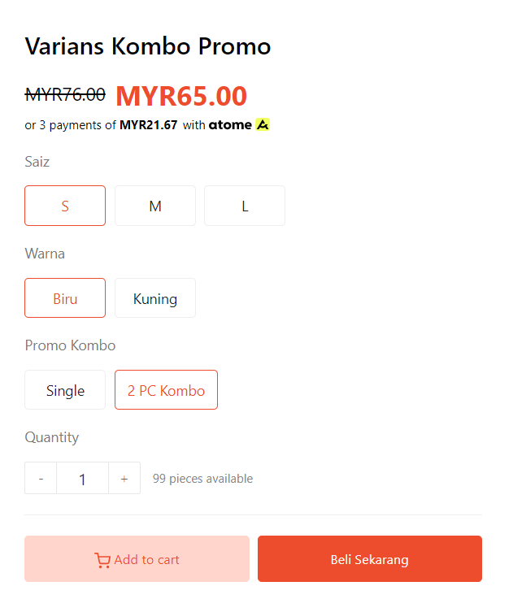

# Variants for Combo Promo

## Setting Variants for Combo Promo

&#x20;The process is the same as setting up your **options** and **variants** for a product. You can refer to the example below:


[Options](../options.md)



[Variants Setup](variants-setup.md)



\*\*<mark style="color:red;">**Note**</mark>: In this example, we will be using **3 options** which are **Size, Color,** and **Combo Promo**.


<figure><figcaption></figcaption></figure>

1. Click on the **"Add variant"** button to add another **combo variant**, for example, as shown below.
2. In the **"Name"** section, you can enter the name, for example, as shown below.&#x20;
3. Let's put the name **"2 PC Combo"** in the **"Promo Combo"** field.

<figure><figcaption></figcaption></figure>

## Inventory&#x20;

### 1. View Inventory Logs


\*\*<mark style="color:red;">**Note**</mark>: The **SKU section** is for **monitoring data for your product** and <mark style="color:red;">**not**</mark>**&#x20;for updating stock.**


In this section, you can view changes or track the quantity made in the product stock section.

1. Click on **view inventory logs**.

<figure><figcaption></figcaption></figure>

2. In this section, all changes made to the product stock quantity will be recorded.

<figure><figcaption></figcaption></figure>

<table><thead><tr><th width="143">Field</th><th>Description</th></tr></thead><tbody><tr><td><strong>Address</strong></td><td><strong>You can change the address in this section to view the logs based on location.</strong></td></tr><tr><td><strong>Date</strong></td><td><strong>Each change made will have a date recorded.</strong></td></tr><tr><td><strong>Activity</strong></td><td><strong>Refers to the thing you did when changing stock quantity.</strong></td></tr><tr><td><strong>Adjusted by</strong></td><td><strong>Refers to the person who made the change to the stock.</strong></td></tr><tr><td><strong>Available</strong></td><td><strong>Referring to the latest stock value.</strong></td></tr></tbody></table>

### 2. Product Stock

1. To **add product stock**, you need to enter it in the space provided. You only need to **click on the dropdown.**

<figure><figcaption></figcaption></figure>

2. After that, you can **select the reason or information** related to the change in your product stock.

<figure><figcaption></figcaption></figure>

3. You will see the latest updated value for your product stock.&#x20;


If the Manage Stock button is <mark style="color:red;">**not**</mark>**&#x20;turned on**, your product will be considered to have **unlimited stock**.


<figure><figcaption></figcaption></figure>

4. If you press the **View Inventory Logs button**, you will see a list of information regarding the changes to your product stock.

<figure><figcaption></figcaption></figure>

The result on your website is as shown below.

<figure><figcaption></figcaption></figure>

## Additional Information&#x20;

If you find that your **Combo Promo** is <mark style="color:red;">**Sold Out**</mark>, you need to check your **Variants**, as it is possible that you did :&#x20;

* <mark style="color:red;">**not add**</mark> that specific **Promo Combo** Variant.
* <mark style="color:red;">**not have Stock**</mark> at **Inventory**.

<figure><figcaption></figcaption></figure>
