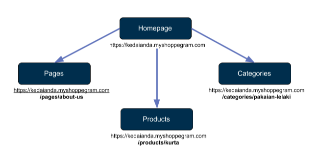

# Website Navigation

### &#x20;

In the Storefront, there is a homepage that can be navigated to **4 more places**, namely **Pages**, **Products**, **Categories**, and **Cart** by using the **URL**.&#x20;

 <mark style="color:red;">**Note**</mark> the **URL** for each element in the above image there is a URL handle as follows. The <mark style="color:blue;">**handle**</mark> is <mark style="color:blue;">**any element after the domain name**</mark>.

For example: <https://yourdomainname.com/><mark style="color:blue;">**{handle}**</mark>


**So if you want to link your menu/button to certain pages, your link will be like this:**

* <mark style="color:red;">**/products/**</mark>kurta-macho-plus-size (**Your product name**)
* <mark style="color:red;">**/pages/**</mark>about-us (**Your page name**)
* <mark style="color:red;">**/categories/**</mark>pakaian-lelaki (**Your categorie name**)
* <mark style="color:red;">**/cart/**</mark>1234:1 (**Your variant ID**)
