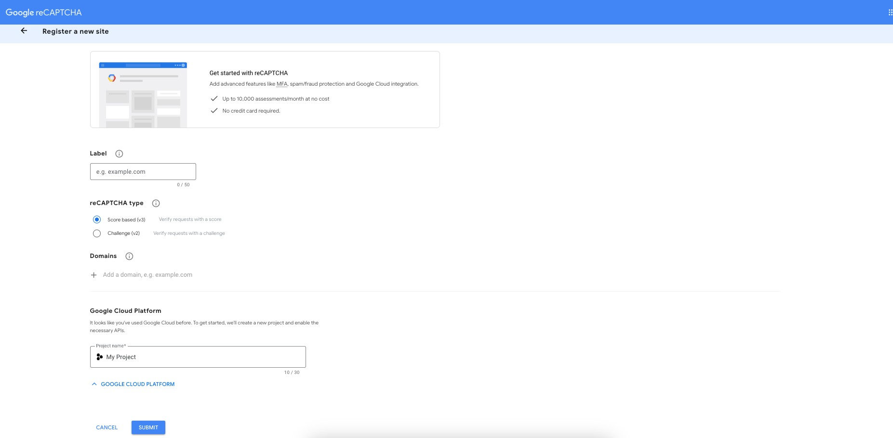
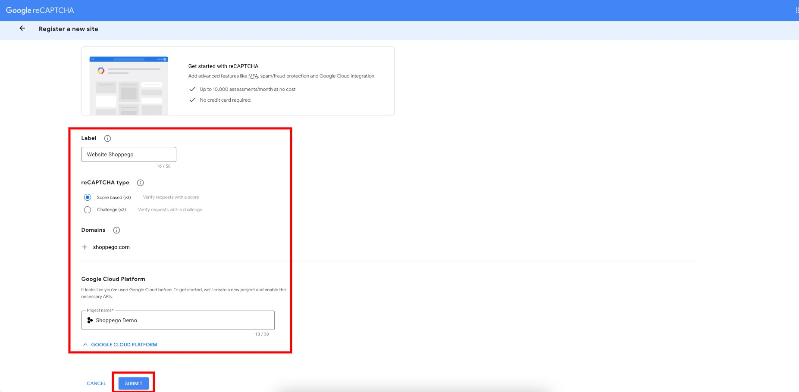
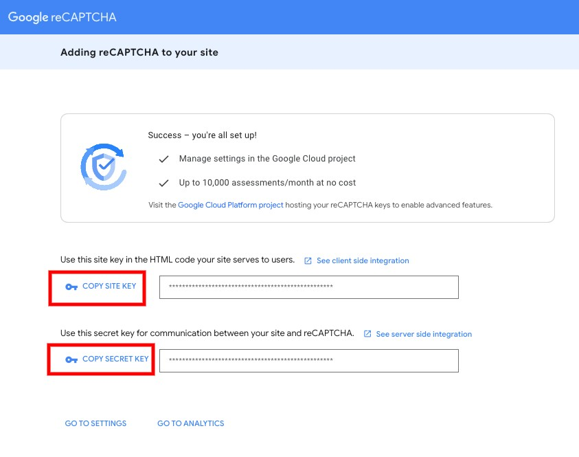
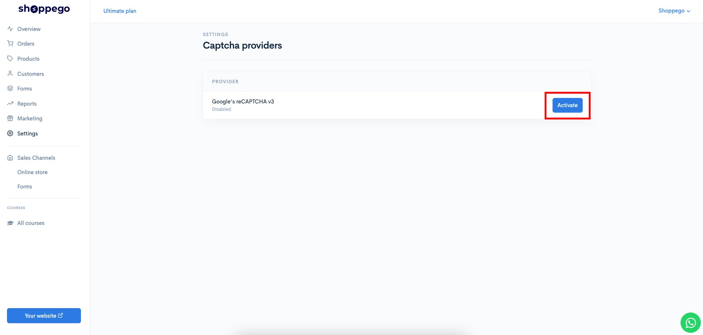
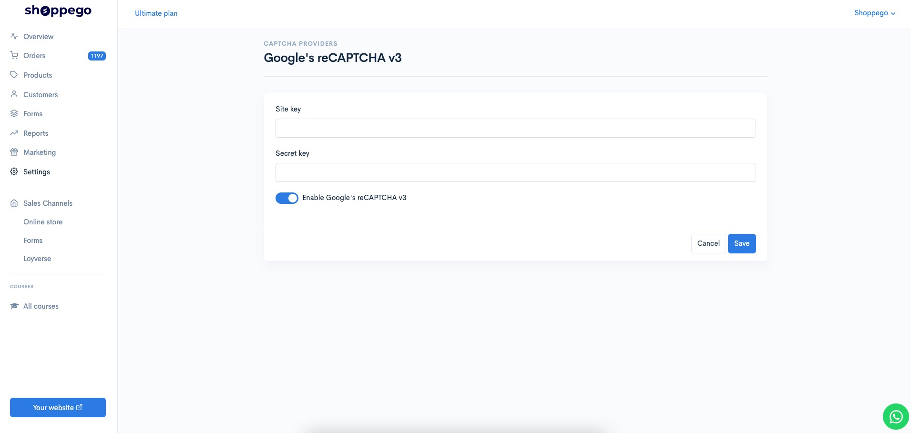
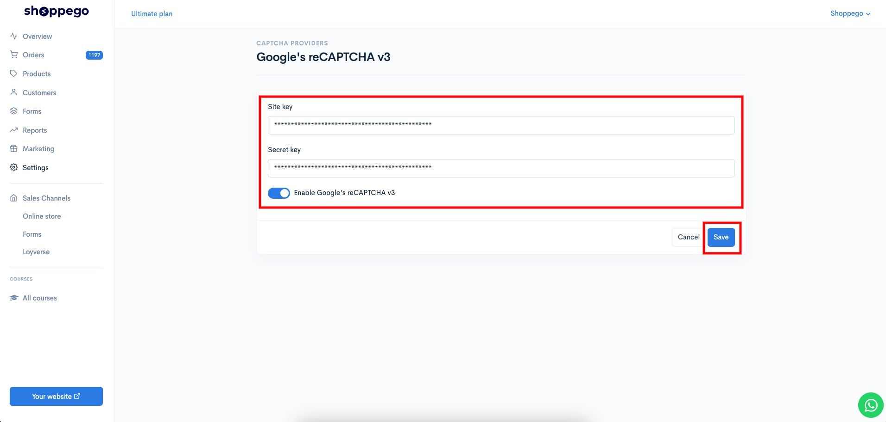
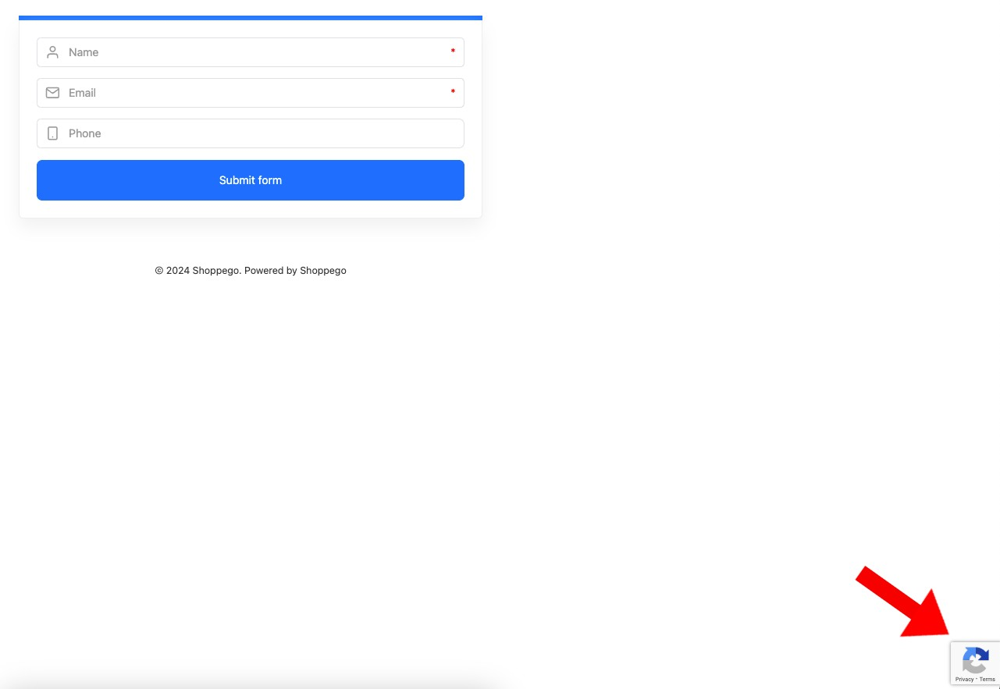

# Google reCAPTCHA V3

Before you follow the steps below, make sure you have a Google recaptcha account. If you still do not have the account, you can register at the link below:



There are 2 data you need to integrate this Google recaptcha with the Shoppego system:

* Site key
* Secret key

## Settings at Google Recaptcha

1. You can get the data by **directly going to the page on this link**:[**https://www.google.com/recaptcha/admin/create**](https://www.google.com/recaptcha/admin/create)

<figure><figcaption></figcaption></figure>

2. Then, **enter the information requested** for your captcha setting and click **Submit**

<figure><figcaption></figcaption></figure>

3. You will be **able to see your Site key and Secret key** later. You can copy them to include **in the settings on the Shoppego dashboard later**.

<figure><figcaption></figcaption></figure>

## Settings at Shoppego

1. Log in to your Shoppego account

<figure><figcaption></figcaption></figure>

2. Click on **Settings**

<figure><figcaption></figcaption></figure>

3. Click on **Captcha providers**

<figure><figcaption></figcaption></figure>

4. Click on the **Activate/Edit** button for the provider type "**Google's reCAPTCHA v3**"

<figure><figcaption></figcaption></figure>

5. Then, you can **enter your Site key** **and Google reCAPTCHA Secret key** in the space provided.

<figure><figcaption></figcaption></figure>

6. When finished click **Save**

<figure><figcaption></figcaption></figure>

Now your setting is complete. You should be able to see the Google Recaptcha logo displayed later on the page that has "Forms" and also the "Log in" and "Sign up" pages of your website.

<figure><figcaption></figcaption></figure>
