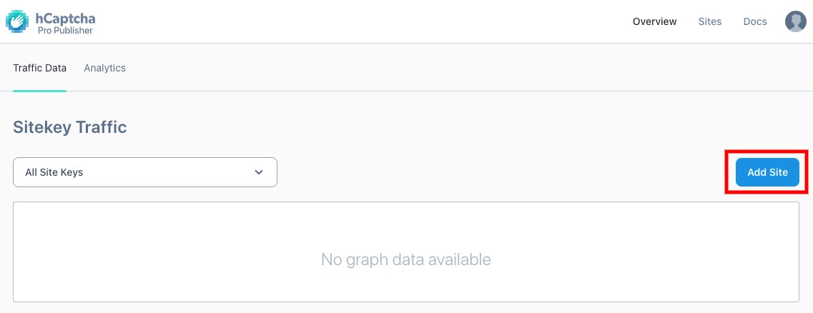
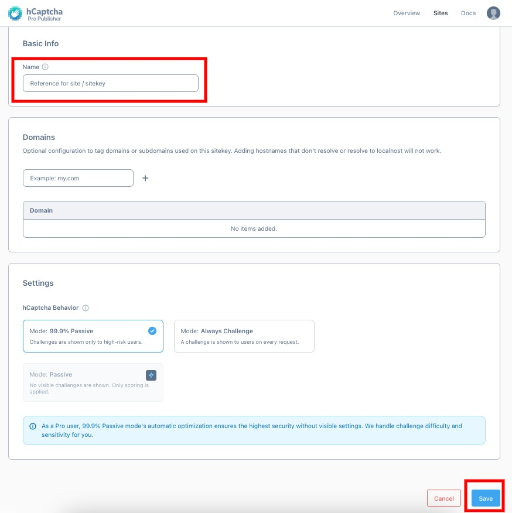
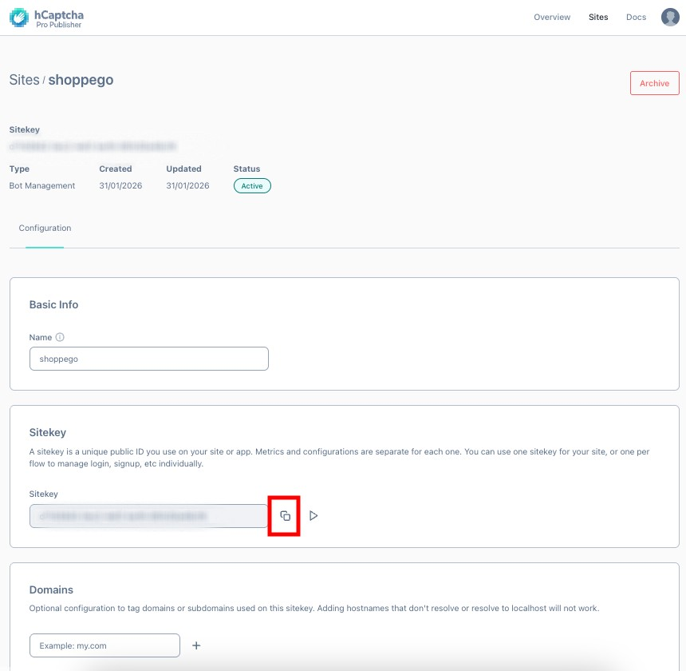
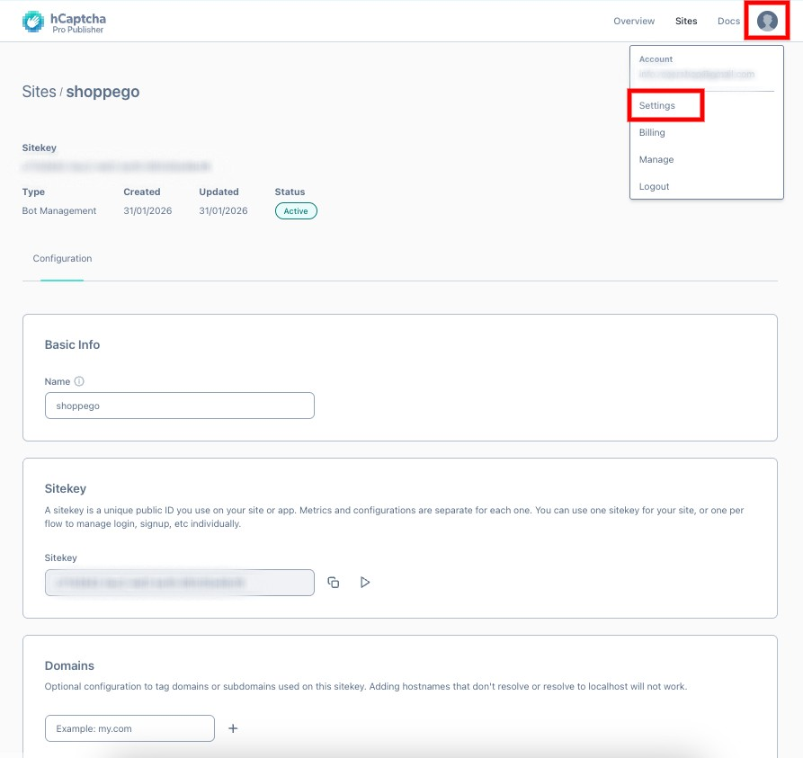
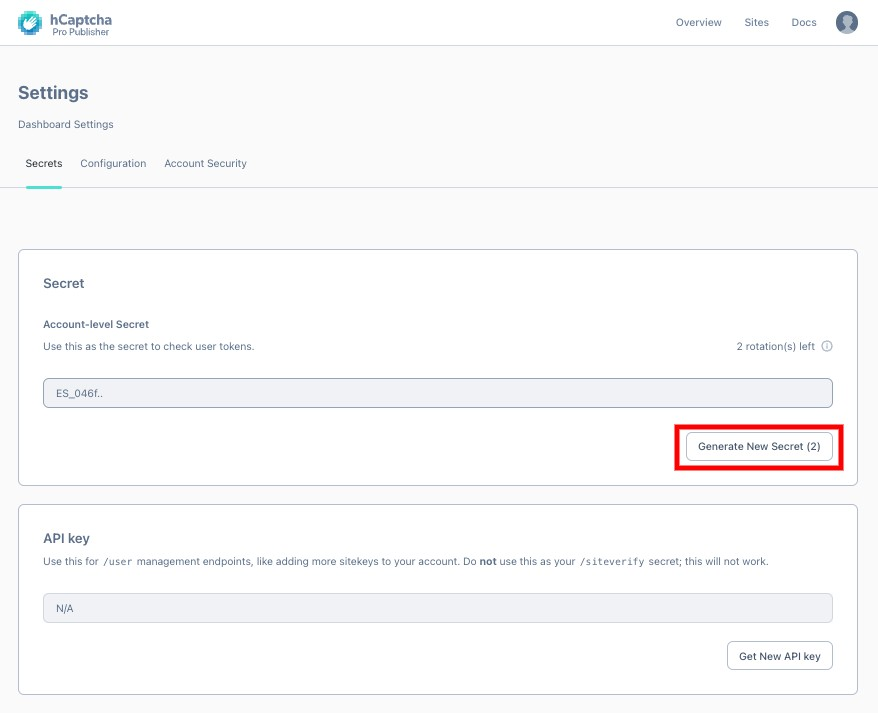
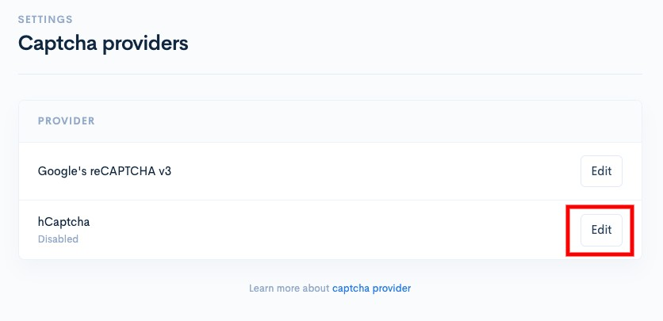
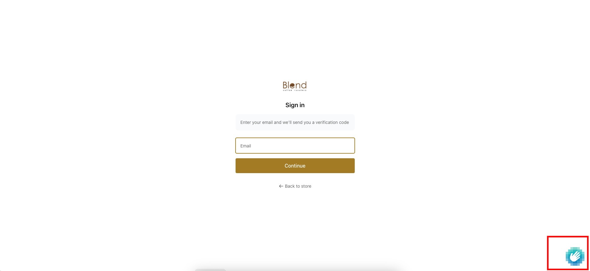

# hCaptcha

Before you follow the steps below, make sure you have an hCAptcha account. If you don't have one yet, you can register at the link below:



There are 2 pieces of data you need to integrate hCaptcha with the Shoppego system:

* Site key
* Secret key

## Setting in hCaptcha

1. You can get this data by clicking on **Add Site**.

<figure><figcaption></figcaption></figure>

2. Then, **enter your Site name for reference (make sure all letters are lowercase)**. When finished click **Save**

<figure><figcaption></figcaption></figure>

3. Later, you will be **able to see your Site key**. You can **copy it to enter in the settings on the Shoppego dashboard later**.

<figure><figcaption></figcaption></figure>

For the **Secret key**, you should have created it when you **first registered your hCaptcha** **account**. If you have **forgotten your Secret key**, you can click on your **account menu** and select **Settings**.

<figure><figcaption></figcaption></figure>

Then, you can click on **Generate New Secret** and **copy your new secret key** to **enter in the settings in Shoppego**.

<figure><figcaption></figcaption></figure>

## Setting in Shoppego

1. Log in to your Shoppego account.

<figure><figcaption></figcaption></figure>

2. Click on **Settings**

<figure><figcaption></figcaption></figure>

3. Click on **Captcha providers**

<figure><figcaption></figcaption></figure>

4. Click on the **Activate/Edit** button for the provider type "**hCaptcha**"

<figure><figcaption></figcaption></figure>

5. Then, you can enter your **Site key** and **hCaptcha Secret key** in the **spaces provided**. Make sure to **tick the Enable toggle** and click **Save**.

<figure><figcaption></figcaption></figure>

Now your settings are complete. You should be able to see the hCaptcha logo displayed on the "Forms" page and also the "Login" page of your website.

<figure><figcaption></figcaption></figure>
