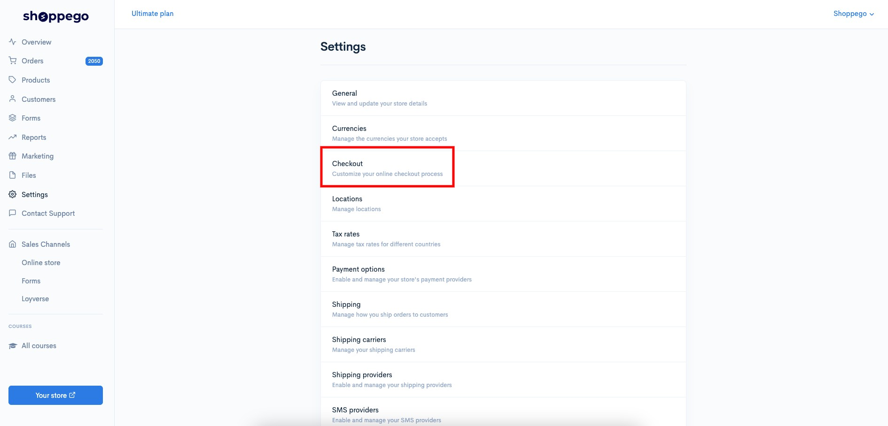
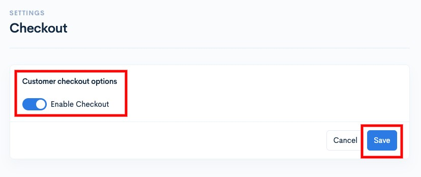
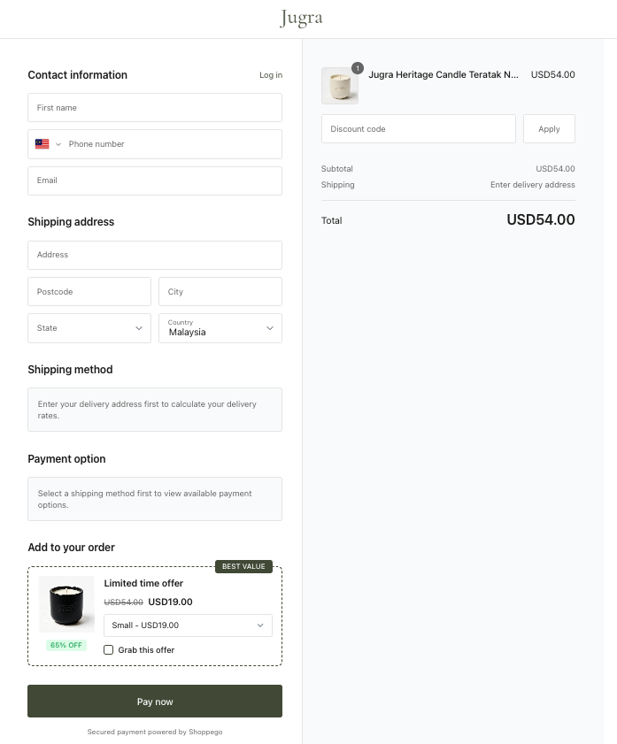
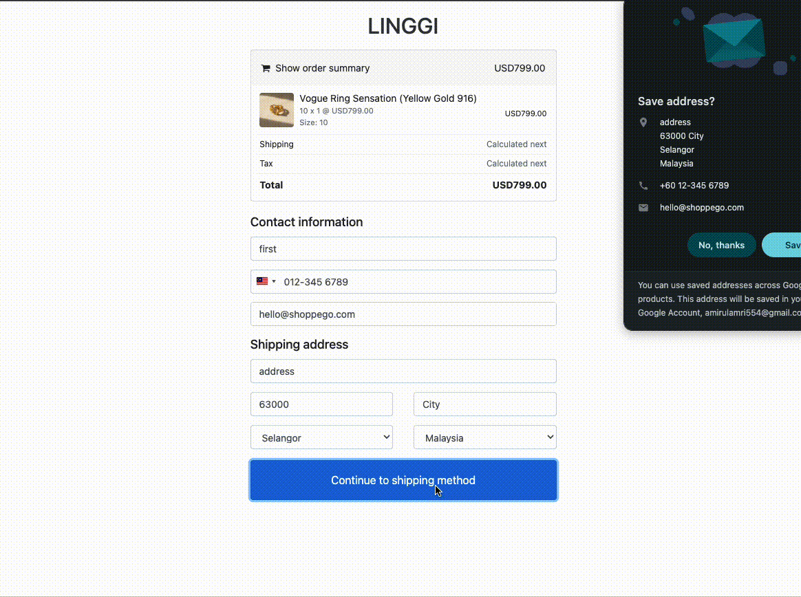
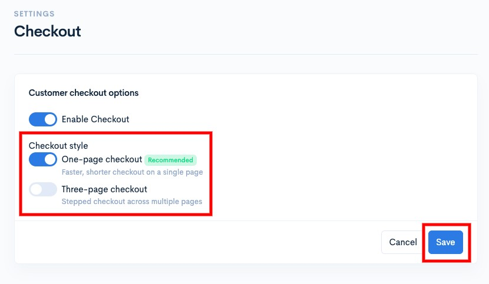
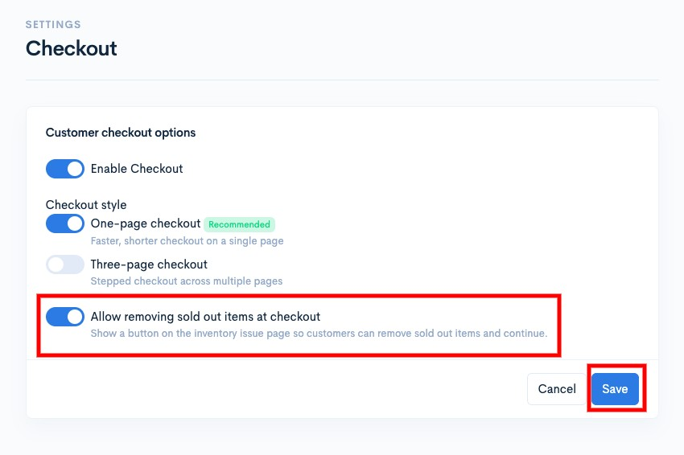

# Checkout

## Customizing your payment fields

If you sell your products using an online store, then you can customize your payment fields. You can specify which fields you want to display and the type of payment fields you want to display.

## On this page:

* [Customer payment options](checkout.md#customer-payment-options)
* [Checkout style](checkout.md#checkout-style)
* [Allow removing sold out items at checkout](checkout.md#allow-removing-sold-out-items-at-checkout)

## Customer payment options

If you are using the purchase function for an online store, you need to enable the toggle as in this setting.

If you do not do this setting, you will be able to see the "Page not found" display after you want to make a purchase of any product on your website later.

1. Log in to your Shoppego account

<figure><figcaption></figcaption></figure>

2. Click on **Settings**

<figure><figcaption></figcaption></figure>

3. Click on **Checkout**

<figure><figcaption></figcaption></figure>

4. Tick ​​the **Enable checkout** toggle and click **Save**

<figure><figcaption></figcaption></figure>

## Checkout style

Shoppego offers 2 types of payment field displays that you can use, namely:

1. One-page checkout (Ultimate plan only)
2. Three-page checkout

However, for the one-page checkout payment field style, it can only be used for Ultimate plan subscriptions.

Example of "One-page checkout" display:

<figure><figcaption></figcaption></figure>

Example of "Three-page checkout" display:

<figure><figcaption></figcaption></figure>

You can check this setting in the section:

1. Log in to your Shoppego account

<figure><figcaption></figcaption></figure>

2. Click on **Settings**

<figure><figcaption></figcaption></figure>

3. Click on **Checkout**

<figure><figcaption></figcaption></figure>

4. Make the selection you want either "One-page checkout (Ultimate plan only)" or "Three-page checkout" and click Save

<figure><figcaption></figcaption></figure>

## Allow removing sold out items at checkout

For products with issues, such as being out of stock, having unavailable variants, or being completely discontinued, the system will display a specific page to prevent successful checkout. This measure avoids issues such as stock levels dropping into negative figures.

To allow customers to remove products with such issues directly on the checkout page without needing to visit the cart page, you can configure the "Allow removing sold out items at checkout" setting as follows:

1. Log in to the Shoppego dashboard

<figure><figcaption></figcaption></figure>

2. Click on **Settings**

<figure><figcaption></figcaption></figure>

3. Click on **Checkout**

<figure><figcaption></figcaption></figure>

4. Tick ​​the toggle "**Allow removing sold out items at checkout**" and **Save** the setting

<figure><figcaption></figcaption></figure>
