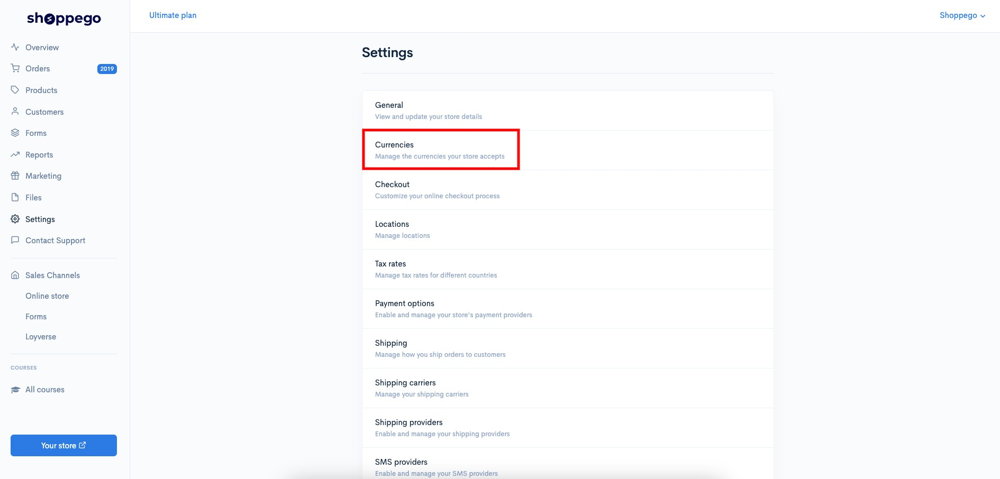
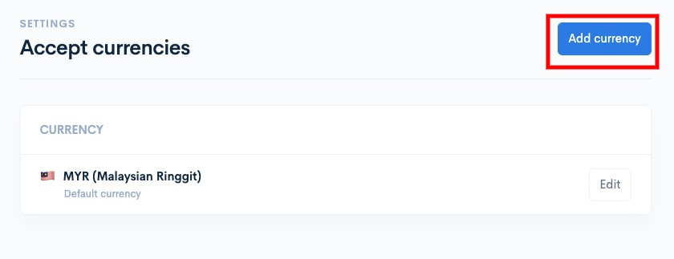
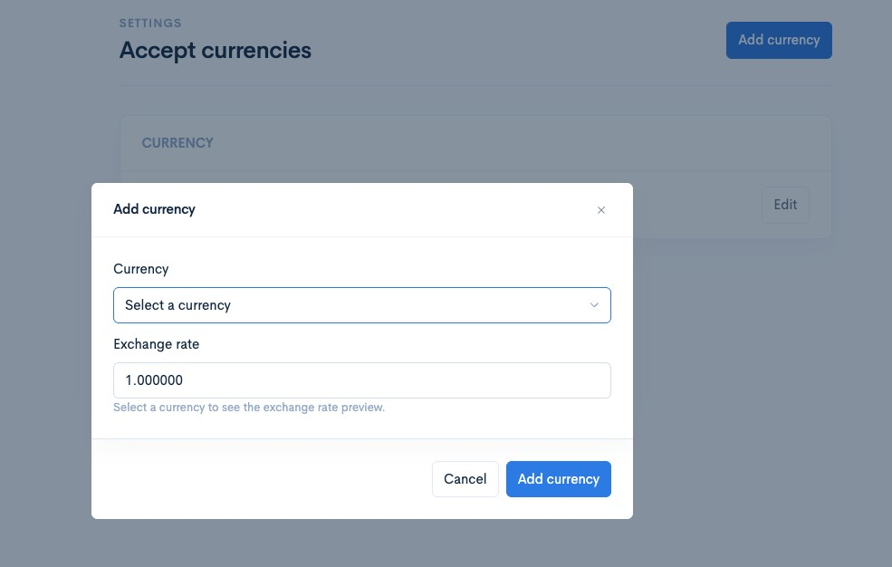
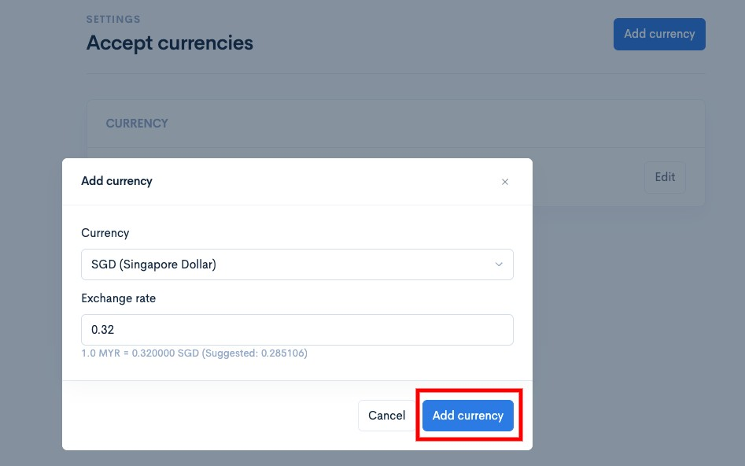
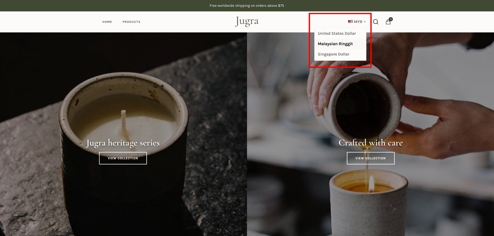

# Currencies

You can change the way currency is displayed in your store to make it easier for your customers to read the amounts.

## On this page

* [Considerations for currency formatting](currencies.md#considerations-for-currency-formatting)
* [Add your currency formatting](currencies.md#tambahkan-pemformatan-mata-wang-anda)
* [Example of displaying currency formatting in your store](currencies.md#example-of-displaying-currency-formatting-in-your-store)

## Considerations for currency formatting

* This currency formatting is only used for display in your store/website to make it easier for your customers to read the amount. On the checkout page, customers will still see the currency according to your store/website's original currency.
* The currency formatting selection will be based on the customer's IP Address itself (If you have set the currency for that location).
* You can only format currencies for countries such as Malaysia (MYR), Brunei (BND), Indonesia (IDR), United Kingdom (GBP), United States (USD) and Singapore (SGD).
* The currency conversion display will depend entirely on the "Exchange rate" setting you set. The system will not perform the conversion automatically.

## Add your currency formatting

1. Log in to your Shoppego account

<figure><figcaption></figcaption></figure>

2. Click on **Settings**

<figure><figcaption></figcaption></figure>

3. Click on **Currencies**

<figure><figcaption></figcaption></figure>

4. Click on **Add currency**

<figure><figcaption></figcaption></figure>

5. Then, you can select the currency you want to add and enter the exchange rate value for that currency.

<figure><figcaption></figcaption></figure>

6. After finishing click **Add currency**

<figure><figcaption></figcaption></figure>

## Example of displaying currency formatting in your store

<figure><figcaption></figcaption></figure>
