# Cloudflare


This tutorial is for those who <mark style="color:red;">**have problems**</mark> with the use of DNS by domain providers.


Each domain purchased has a section called Nameserver for us to give access to platforms such as Cloudflare to manage our DNS.

**Starting February 26, 2026, every Shoppego user only need to do a CNAME record and every store/website will have the same CNAME record value/setting.**

## **Domain Migration**



## Part 1: Value CNAME Record

1\. You can log in to the **Shoppego Dashboard.**

2\. Click on **Settings.**

3\. Click on **Custom domain.**

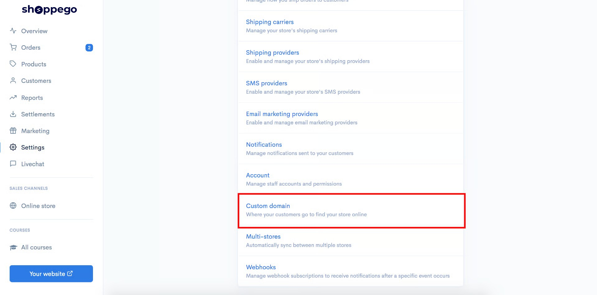

4\. Click on **Add existing domain.**

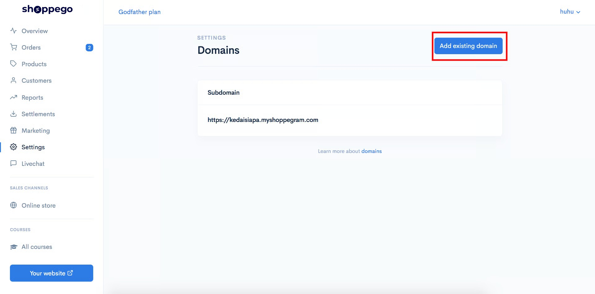

5\. Later you will be able to see a popup that has a **value for your CNAME record**.


**CNAME designation in the domain provider.**\
1: If the **CNAME value** is **@**, enter **your domain name** or "**@**" in the **CNAME field** in the domain provider.


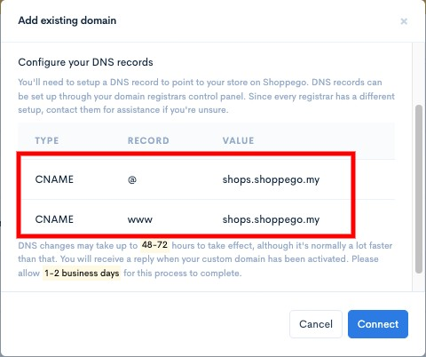


You need to save the **Value** for **CNAME record** for you to enter in your domain's **DNS record** in the domain provider's system later.


## Part 2: Cloudflare Registration

1. Go to the following link  <https://dash.cloudflare.com/sign-up>. Enter your email and password to **register** and click **Create Account.**

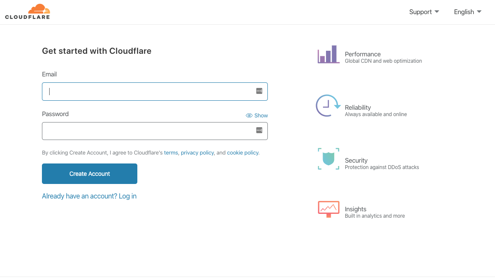

2. Enter your purchased domain name from your domain provider. Then, click **Add Site**.


In this section, you need to **enter the domain name&#x20;**<mark style="color:red;">**without**</mark>**&#x20;[www](http://www).**


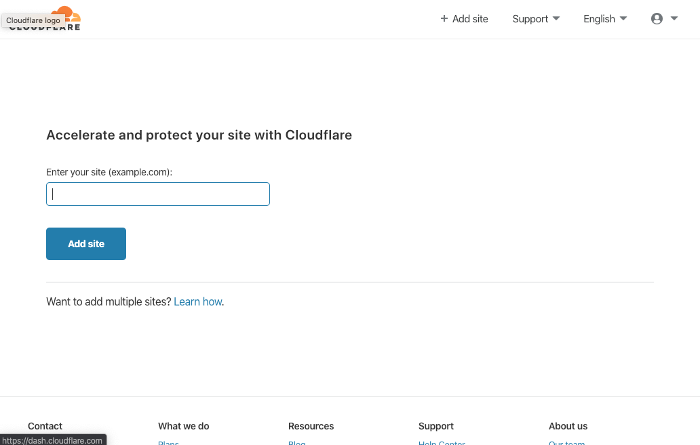

3. Next click on **Free Plan** and click **Confirm Plan.**

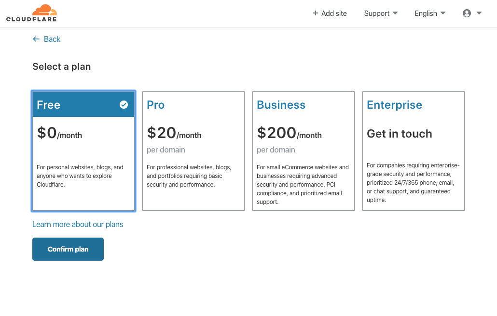

## Part 3: DNS Setup

Wait until the display like the picture below comes out.

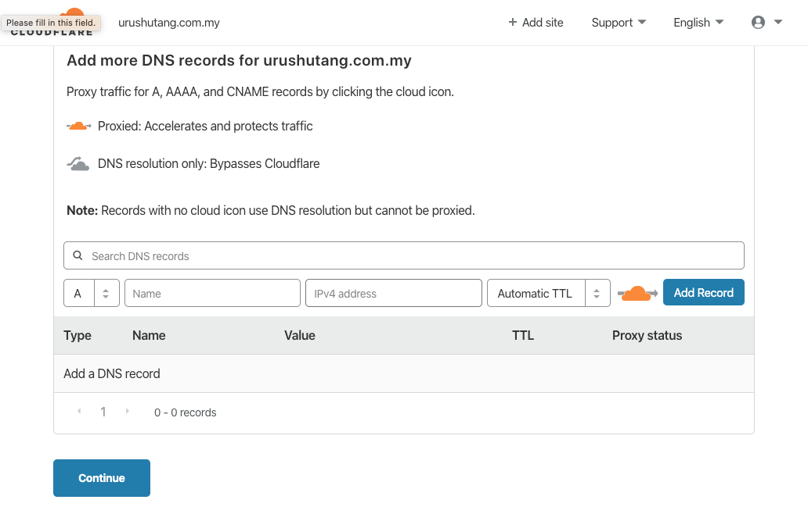


If there are any **DNS records that are different** from the settings below, you can <mark style="color:red;">**delete**</mark> all of those records and refer back to the settings below.



If the value of the **DNS record is the same** as the display below, you can just <mark style="color:blue;">**ignore**</mark> the settings below.


### 1: CNAME record settings:&#x20;

1. For the **CNAME record** settings, you can select the CNAME **dropdown** and enter the information in the corresponding fields:&#x20;

   * **Type**: CNAME&#x20;
   * **Name**: @&#x20;
   * **Target**: shops.shoppego.my
   * **Proxy Status**: DNS Only (\*\*<mark style="color:red;">**Note**</mark>: Make sure the **cloud icon** is **gray**)&#x20;
   * **TTL**: Automatic / 1 Hour&#x20;

   After completing the settings, click the **Save** button.

<figure>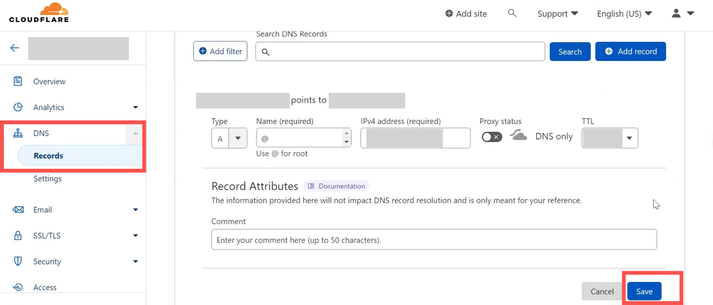<figcaption></figcaption></figure>

### 2: Setting up CNAME www Record(Optional):&#x20;

2. For **CNAME Record**, select the **CNAME dropdown** and enter the information in the fields:&#x20;

   * **Type**: CNAME&#x20;
   * **Name**: www
   * **Target**: shops.shoppego.my
   * **Proxy Status**: DNS Only (\*\*<mark style="color:red;">**Note**</mark>: Make sure the **cloud icon** is **gray**)&#x20;
   * **TTL**: Automatic / 1 hour&#x20;

   After completing, click the **Save** button.

<figure>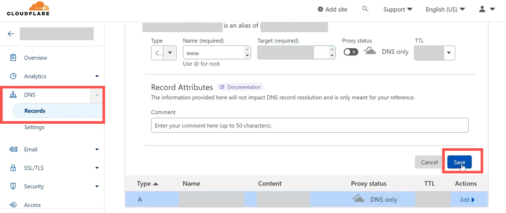<figcaption></figcaption></figure>

3. &#x20;When you have finished making the settings, the display you will receive is as follows:

<figure>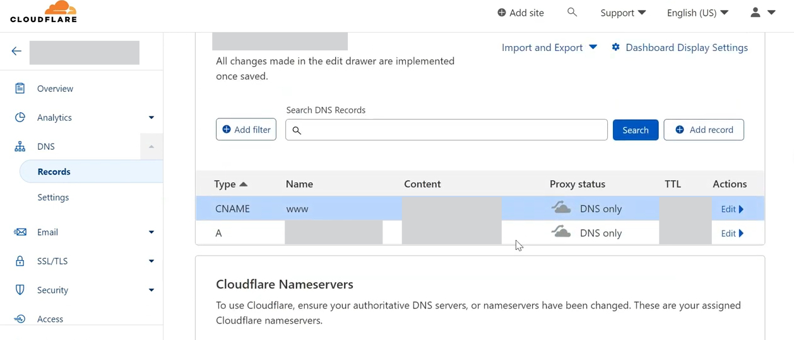<figcaption></figcaption></figure>

### 3: Nameserver Setting

1. Next in the **Proxy Status** column, there is an **orange cloud (Proxied)** icon.&#x20;


**Click on the icon** to change it to **gray (DNS Only)** and click **Save**. Do it for the **A record** and also the **CNAME record**.&#x20;


2. Then click **Continue.**

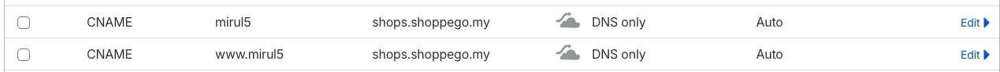

3. After clicking **Continue**, the display as below will appear. Click **Continue by default**

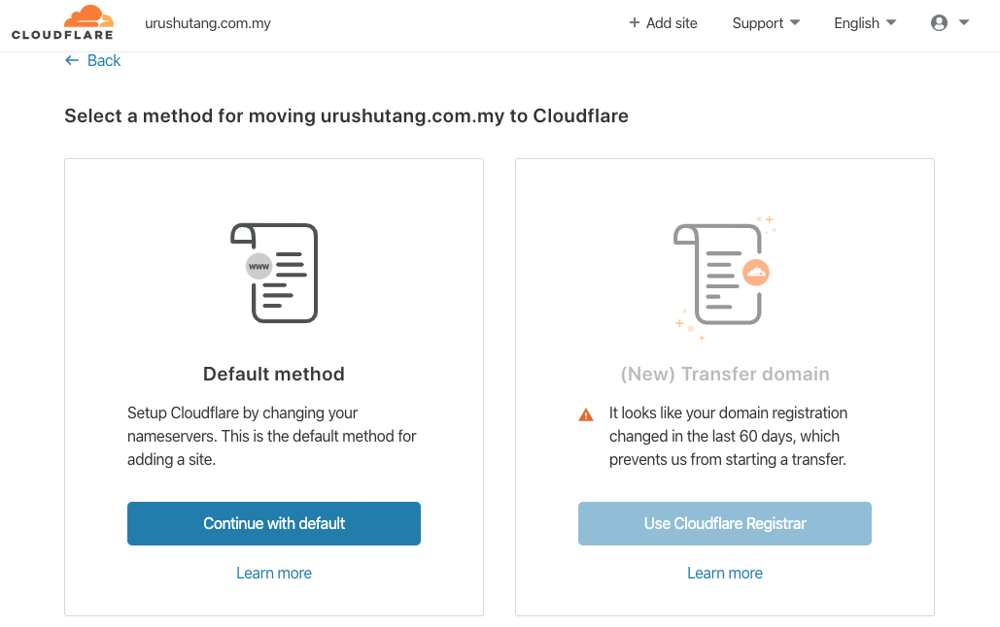

4. Then there will be a nameserver from Cloudflare that you can use in your domain name provider.

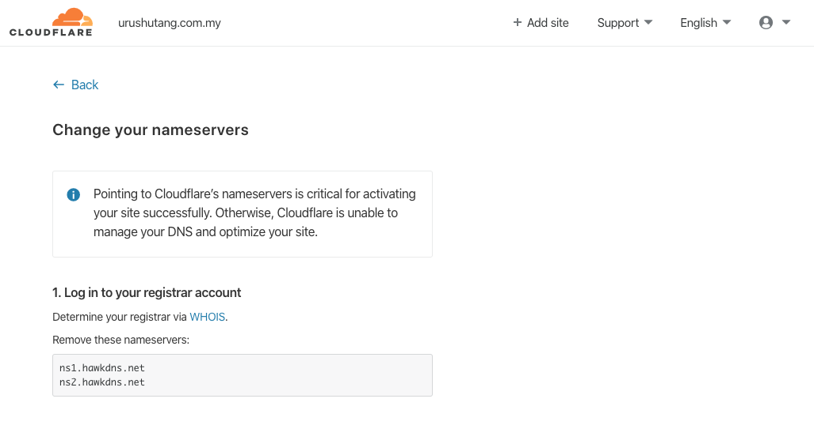

5. Log in to your domain name provider's account and delete the nameserver on your domain provider. **Replace with Cloudflare nameserver** that has been provided as shown below :&#x20;

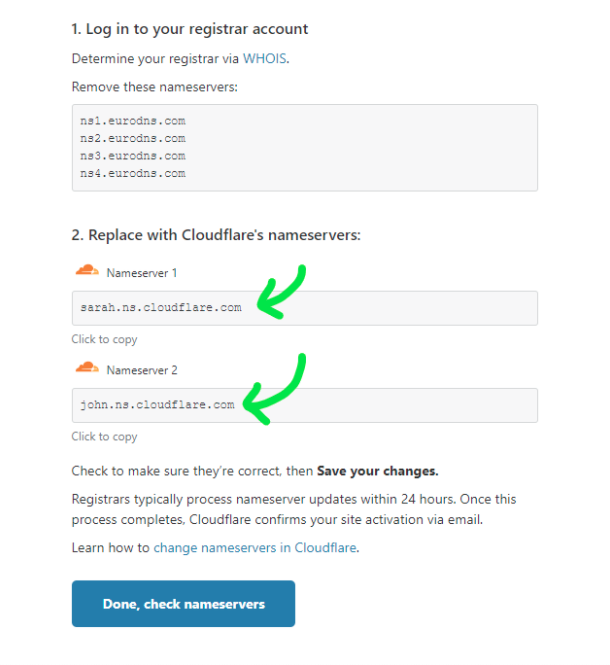

6. After you replace the nameservers click the **Done** button, **check nameservers**.


If you <mark style="color:red;">**encounter any issues**</mark> with changing your nameservers, you can **contact your domain provider for assistance** in making these changes.

