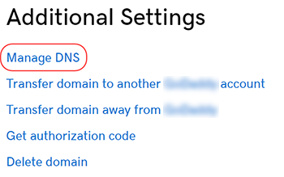
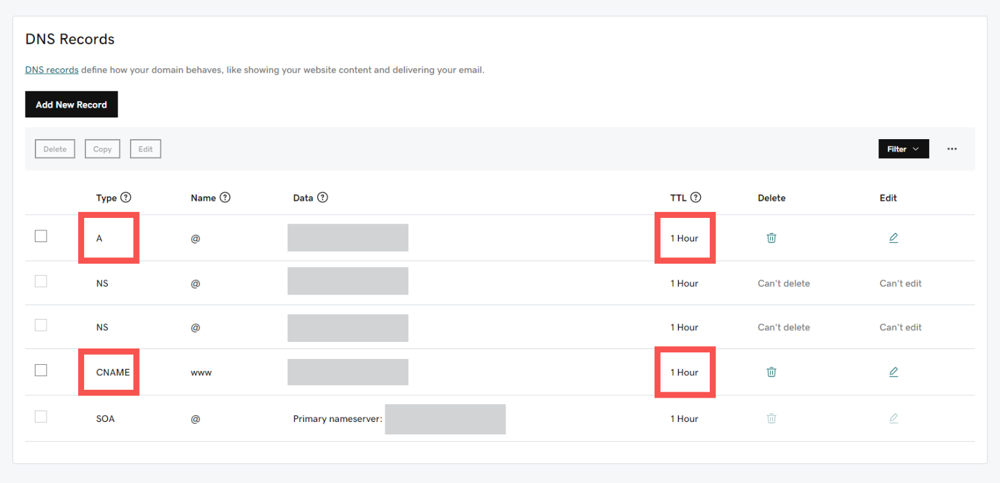

# Godaddy

There are 3 parts to this setup:

* **Part 1**: Get the value for CNAME record
* **Part 2**: Setup in Godaddy
* **Part 3**: Setup in Shoppego

 <mark style="color:red;">**Reminder**</mark>: Make sure **your domain has been purchased and is ready for setup**. If you purchased a ".com" domain, you can **continue to follow this tutorial**.&#x20;


If the Malaysian domain is like ".my, .com.my, .net.my" you need to setup your DNS records in your MYNIC account or you can contact your domain provider to make the changes.

**Starting February 26, 2026, every Shoppego user only need to do a CNAME record and every store/website will have the same CNAME record value/setting.**

## Part 1: Value CNAME Record

1\. You can log in to the Shoppego dashboard

2\. Click on **Settings**

3\. Click on **Custom domain**

4\. Click on **Add existing domain**

5\. Later you will be able to see a popup that has a **value for your CNAME record**.


**CNAME designation in the domain provider.**\
1: If the **CNAME value** is **@**, enter **your domain name** or "**@**" in the **CNAME field** in the domain provider.



You need to save the **Value** for **CNAME record** for you to enter in your domain's DNS record in the domain provider's system later.


## Part 2: Setup in GoDaddy

1\. Log in to your GoDaddy account and go to your product page.

2\. In the Domain Manager column, you can click on the domain for which you want to set the DNS record.

3\. Scroll down to the **Additional Settings** column and click on **Manage DNS**.

4\. On the **DNS Management** page, in the Records section you can click on **Add**.


**If your domain provider cannot set a CNAME record for the host to the main domain or @, you can transfer DNS management to the Cloudflare system. You can refer to this link for an example of setting: <https://docs.shoppego.com/en/settings/custom-domain/cloudflare>**


### Setup for CNAME record

1. On the **DNS Management page**, in the **Records** section, you can click on **Add**.&#x20;
2. You can **choose CNAME** from the **Type** options for that menu.&#x20;
3. You can enter the information they request for setting up your CNAME **record**:
   * **Type**: CNAME
   * **Name**: **@** or **your domain name**&#x20;
   * **Data**: **shops.shoppego.my**
   * **TTL**: **Default (1 Hour)**

### Setup for CNAME www record(Optional)

1. Click **Add again** and select **CNAME** from the **Type options**.&#x20;
2. You can select **CNAME** from the **Type** options for the menu field.
3. You can then enter the following information for setting up your **CNAME record**:&#x20;
   * **Type**: **CNAME**&#x20;
   * **Name**: **www**&#x20;
   * **Data**: **shops.shoppego.my**
   * **TTL**: **Default** (**1 Hour**)

Once done you can click **Save.** Below is the display for you finished domain setup in **GoDaddy**.

<figure><figcaption></figcaption></figure>


You will need to wait within **48 hours** to make sure your setting is readable. During this time, your website, email, and other domain services will also be disrupted.

You may refer for [**Propagation Period**](godaddy.md#propagation-time)


## Propagation Period

You only need to wait for a <mark style="color:red;">**period of 48 hours**</mark> for the setting to be read and your domain can be used before you make a Custom domain setting in Shoppego.&#x20;

The shortest time your domain can **be used is within 1 hour**. If not, you need to <mark style="color:red;">**wait for a period of 48 hours to 72 hours.**</mark> You can check the status of your domain propagation through the link we provided (<https://www.whatsmydns.net/>)

## Additional information:&#x20;

To ensure that your DNS is directed to Shoppego, you can [Check your DNS Here ](https://www.whatsmydns.net/)and make sure the **DNS displayed is the one you have set**.

1. To check your DNS: You can click this link: Check your [**DNS here**](https://www.whatsmydns.net/) or <https://www.whatsmydns.net/>&#x20;


You can enter your **domain name** (with <mark style="color:red;">www</mark> and **without www**) in the space provided. Make sure you have made the changes to the CNAME record check.


<figure><figcaption></figcaption></figure>

## Part 3 : Setup in Shoppego

1. Log in to the Shoppego Dashboard -> **Settings(1)** and click **Custom Domains(2).**

<figure><figcaption></figcaption></figure>

2. On this Domains page, click on the **Add existing domain** button.

<figure><figcaption></figcaption></figure>

3. In the space below, you need to **enter your domain** name <mark style="color:red;">**without**</mark>**&#x20;www**.

<figure><figcaption></figcaption></figure>

4. When you have successfully entered your domain, the display will change as below:


\*\*<mark style="color:red;">**Note**</mark>: If there are **no issues**, the team will take **5-10 minutes to activate your domain**. If your domain still isn't activated within this timeframe, please contact our team.


<figure><figcaption></figcaption></figure>

5. If your **Custom Domain** is **ready** and **can be used**, an example display like the following will appear.&#x20;


The words "**Connected**" and "**SSL activated**" will turn <mark style="color:green;">**green**</mark>. This condition will only occur if all the **settings that have been made are correct.**&#x20;


<figure><figcaption></figcaption></figure>
