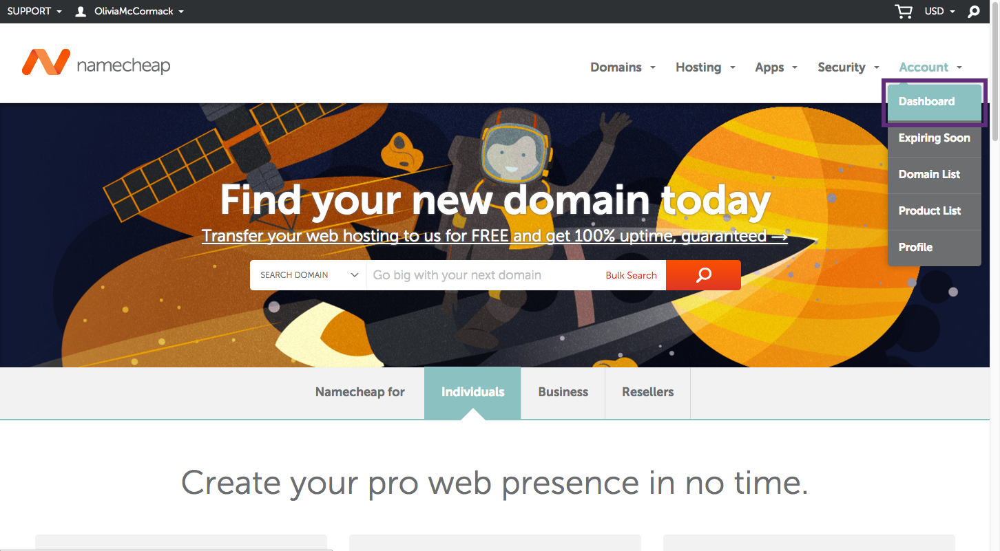
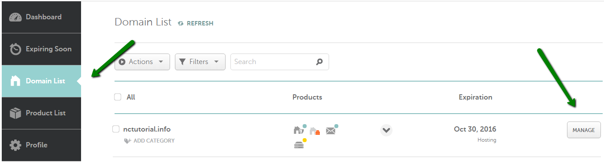
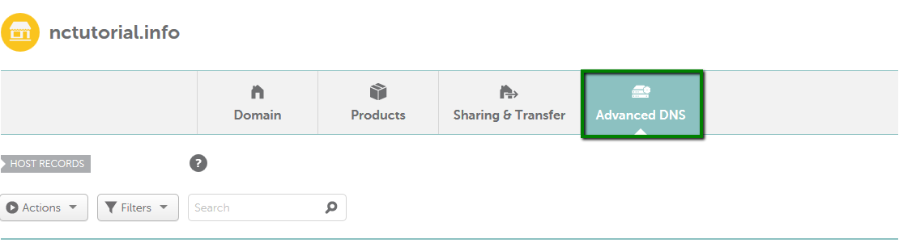
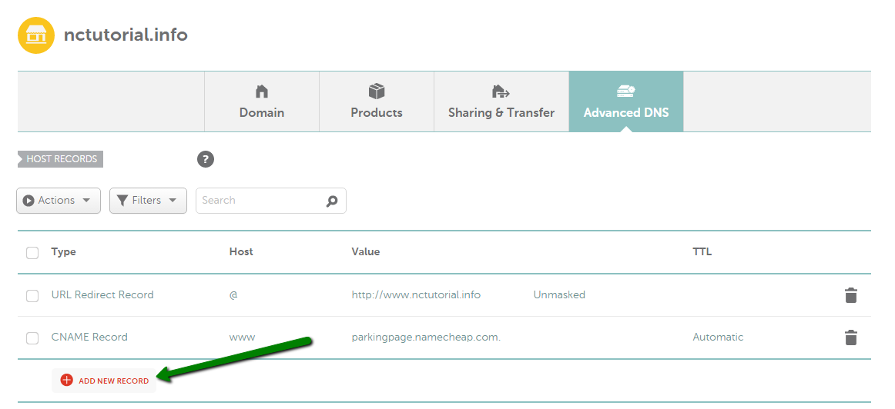
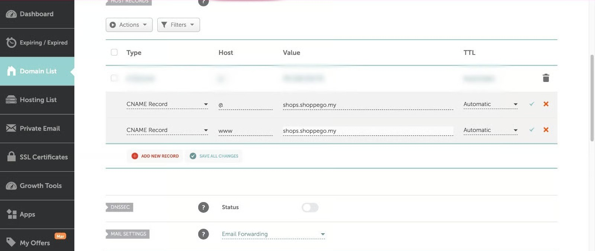

# Namecheap

There are 3 parts to this setup:

* **Part 1**: Get the value for CNAME record
* **Part 2**: Setup in Namecheap
* **Part 3**: Setup in Shoppego


<mark style="color:red;">\*\*Reminder\*\*</mark>: Make sure \*\*your domain has been purchased and is ready for setup\*\*. If you purchased a ".com" domain, you can \*\*continue to follow this tutorial\*\*.


If the Malaysian domain is like ".my, .com.my, .net.my" you need to setup your DNS records in your MYNIC account or you can contact your domain provider to make the changes.

**Starting February 26, 2026, every Shoppego user only need to do a CNAME record and every store/website will have the same CNAME record value/setting.**

## Part 1: Value CNAME Record

1\. You can log in to the Shoppego dashboard

2\. Click on **Settings**

3\. Click on **Custom domain**

4\. Click on **Add existing domain**

5\. Later you will be able to see a popup that has a **value for your CNAME record**.


**CNAME designation in the domain provider.**\
1: If the **CNAME value** is **@**, enter **your domain name** or "**@**" in the **CNAME field** in the domain provider.



You need to save the **Value** for **CNAME record** for you to enter in your domain's DNS record in the domain provider's system later.


## Part 2: Setup in Namecheap

1\. Log in to your Namecheap account

2\. Click on **Accoun**t -> from the menu click on **Dashboard**

3\. Click on **Domain List** and click on the **Manage** button in the domain for which you want to set up a DNS record.

4\. Click on **Advanced DNS**

5\. In the **HOST RECORDS** column you can click on the **ADD NEW RECORD** button


**If your domain provider cannot set a CNAME record for the host to the main domain or @, you can transfer DNS management to the Cloudflare system. You can refer to this link for an example of setting:** [**https://docs.shoppego.com/en/settings/custom-domain/cloudflare**](https://docs.shoppego.com/en/settings/custom-domain/cloudflare)


### Setup for CNAME record

1. Next, you can click on the **ADD NEW RECORD** button again and from the menu that will appear, you can select **CNAME Record**.
   * **Type** : CNAME record
   * **Host** : @ or your own domain name
   * **Value** : shops.shoppego.my
   * **TTL** : Automatic

### Setup for CNAME www record(Optional)

2. Next you can select **CNAME Record** from the menu.
   * **Type :** CNAME
   * **Host :** www
   * **Value : shops.shoppego.my**
   * **TTL :** Automatic


**Attention**: Make sure your setup only has **CNAME records**, other records such as _URL Redirect records_ or A records can be <mark style="color:red;">**removed**</mark> from the setup.


The display of your finished domain setup as below :

<figure><figcaption></figcaption></figure>

Once done you can click on **Save all changes** and for this setting.


You have to wait **at least 48 hours** before it can be read. Once your domain is usable you can enter your domain in the settings in Shoppego. Please refer [**Propagation Period**](namecheap.md#propagation-time)


## Propagation Period

You only need to wait for a <mark style="color:red;">**period of 48 hours**</mark> for the setting to be read and your domain can be used before you make a Custom domain setting in Shoppego.

The shortest time your domain can **be used is within 1 hour**. If not, you need to <mark style="color:red;">**wait for a period of 48 hours to 72 hours.**</mark> You can check the status of your domain propagation through the link we provided ([https://www.whatsmydns.net/](https://www.whatsmydns.net/))

## Additional information:

To ensure that your DNS is directed to Shoppego, you can [Check your DNS Here ](https://www.whatsmydns.net/)and make sure the **DNS displayed is the one you have set**.

1. To check your DNS: You can click this link: Check your [**DNS here**](https://www.whatsmydns.net/) or [https://www.whatsmydns.net/](https://www.whatsmydns.net/)


You can enter your **domain name** (with <mark style="color:red;">www</mark> and **without www**) in the space provided. Make sure you have made the changes to the CNAME record check.


<figure><figcaption></figcaption></figure>

## Part 3: Setup in Shoppego

1. Log in to the Shoppego Dashboard -> **Settings(1)** and click **Custom Domains(2).**

<figure><figcaption></figcaption></figure>

2. On this Domains page, click on the **Add existing domain** button.

<figure><figcaption></figcaption></figure>

3\. In the space below, you need to **enter your domain** name <mark style="color:red;">**without**</mark>**&#x20;www**.

<figure><figcaption></figcaption></figure>

4. When you have successfully entered your domain, the display will change as below:


\*\*<mark style="color:red;">**Note**</mark>: If there are **no issues**, the team will take **5-10 minutes to activate your domain**. If your domain still isn't activated within this timeframe, please contact our team.


<figure><figcaption></figcaption></figure>

5. If your **Custom Domain** is **ready** and **can be used**, an example display like the following will appear.


The words "**Connected**" and "**SSL activated**" will turn <mark style="color:green;">**green**</mark>. This condition will only occur if all the **settings that have been made are correct.**


<figure><figcaption></figcaption></figure>
