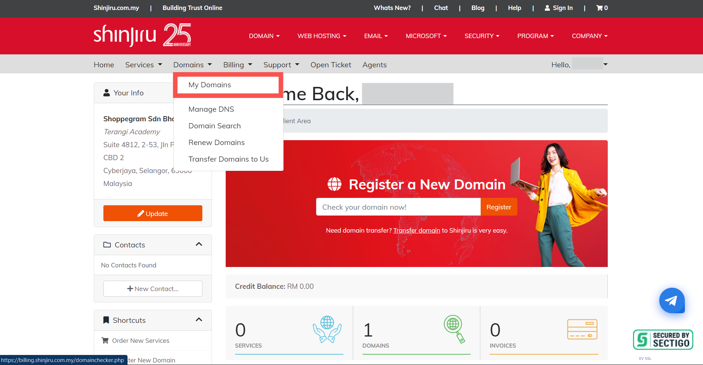
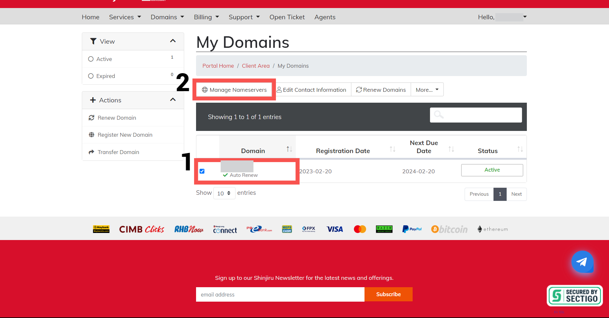

# Changing Nameserver

1. To change the Nameserver in Shinjiru, you can click on the **Domains dropdown** and **click My Domains**.

<figure><figcaption></figcaption></figure>

2. Then, make sure you **tick your domain (1)** and click on **Manage Nameservers (2)**.

<figure><figcaption></figcaption></figure>

3. Click on the "**Advanced Settings**" tab.
4. Select "**Use custom nameservers**" from the list of options.
5. Enter the Cloudflare nameservers you obtained in the "**DNS**" tab of your Cloudflare account in the appropriate spaces. You will need to **enter at least two nameservers**.
6. Click on the "**Save Changes**" button to **update the nameservers** for your domain.


After you save the changes, it may **take up to 24-48 hours** for the new nameservers to propagate across the internet.



During this time, your website **may experience some issues**, so it's important to plan accordingly.



If you **experience any issues** with changing the nameservers, you can **contact the domain provider** to help you make this setting.



Once propagation is complete, **your domain** will **use Cloudflare's nameservers** and you will be able to **manage your DNS settings through the Cloudflare dashboard**.

