# Brevo

To set up **Brevo**, you need to get an **API Key** from **Brevo** and enter the key you have obtained into the Shoppego system.

## Log in to your Brevo account

1. You can log in to your Brevo account here or at [this link](https://login.brevo.com/): <https://login.brevo.com/>

<figure>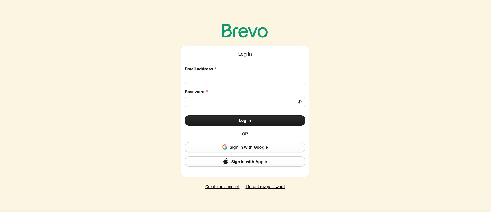<figcaption></figcaption></figure>

### Get Brevo API key

1. You can click on the **profile dropdown menu and select Settings.**

<figure>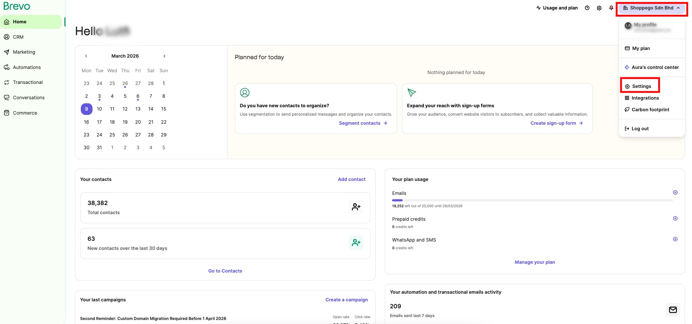<figcaption></figcaption></figure>

2. After that, you can click on **SMTP & API**

<figure>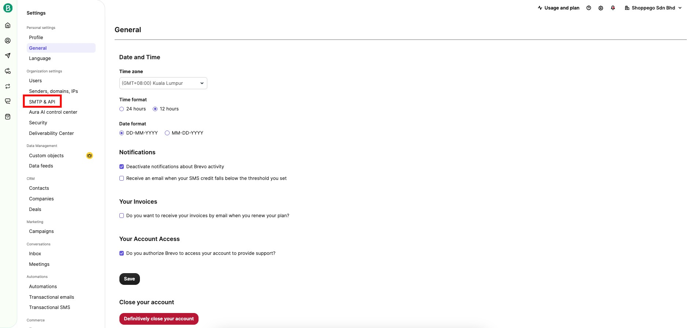<figcaption></figcaption></figure>

3. Next, you can click on **API keys & MCP**

<figure>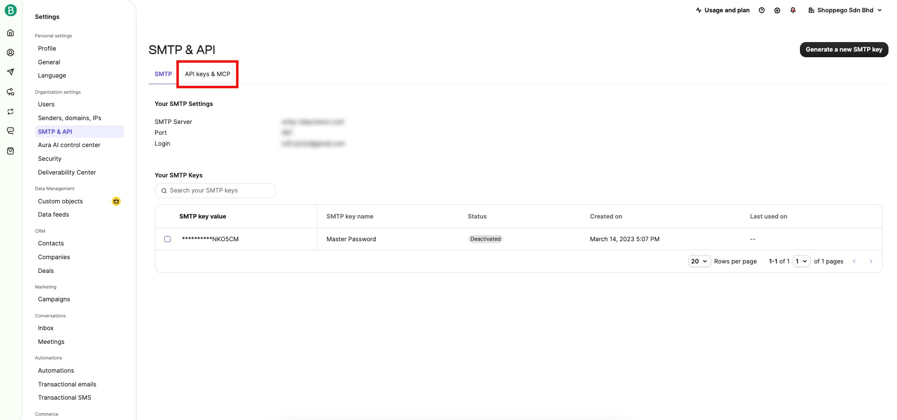<figcaption></figcaption></figure>

4. After that, you can click on **Generate a new API Key**.

<figure>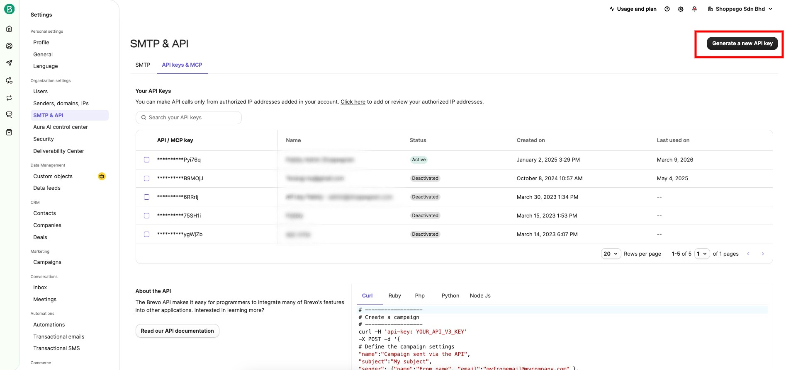<figcaption></figcaption></figure>

5. Later you will be asked to **enter the name of your API key** and you can click **Generate**.

<figure>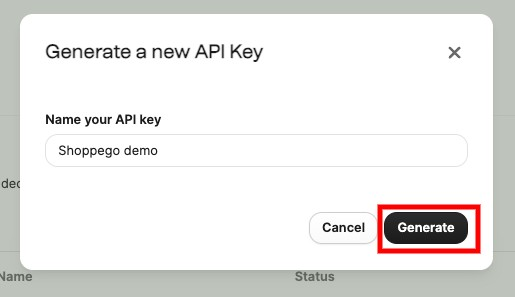<figcaption></figcaption></figure>

6. Once completed, you will be able to view and **copy your API key** to be used for the integration process on the Shoppego platform later

<figure>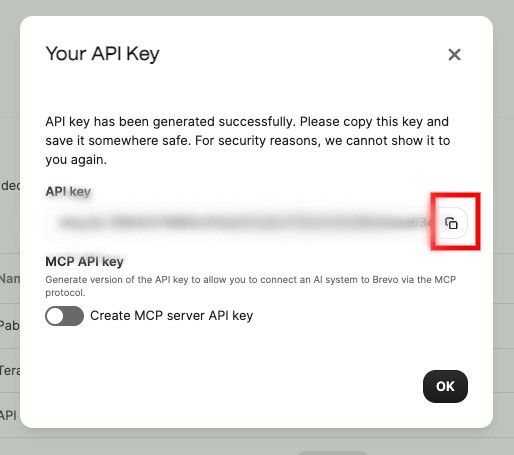<figcaption></figcaption></figure>

### Get List ID(Optional)

If you do not make this setting, your customer information that will be imported will not be in any list.

1. Log in to the Brevo dashboard

<figure><figcaption></figcaption></figure>

2. Click on the **CRM** menu

<figure>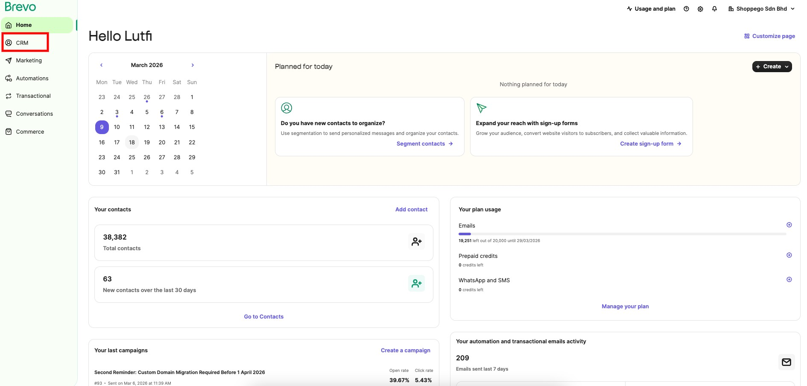<figcaption></figcaption></figure>

3. Click on the **Lists** menu.

<figure>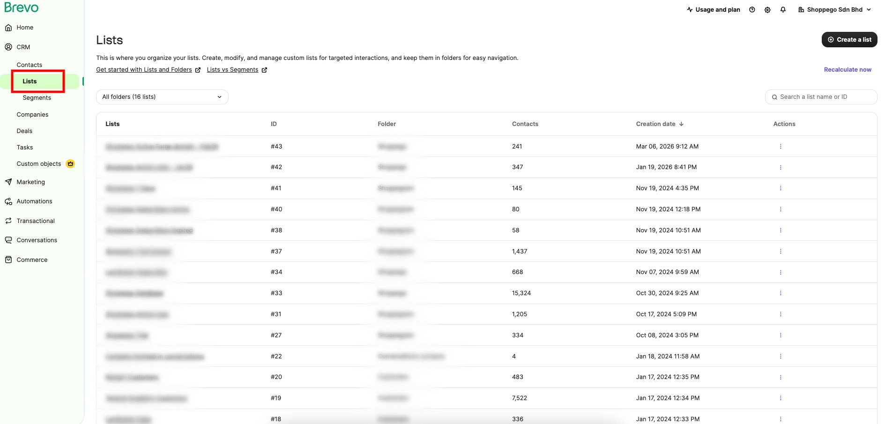<figcaption></figcaption></figure>

4. Later, you will be able to see the "**List ID**" information for the list you want to use.

<figure>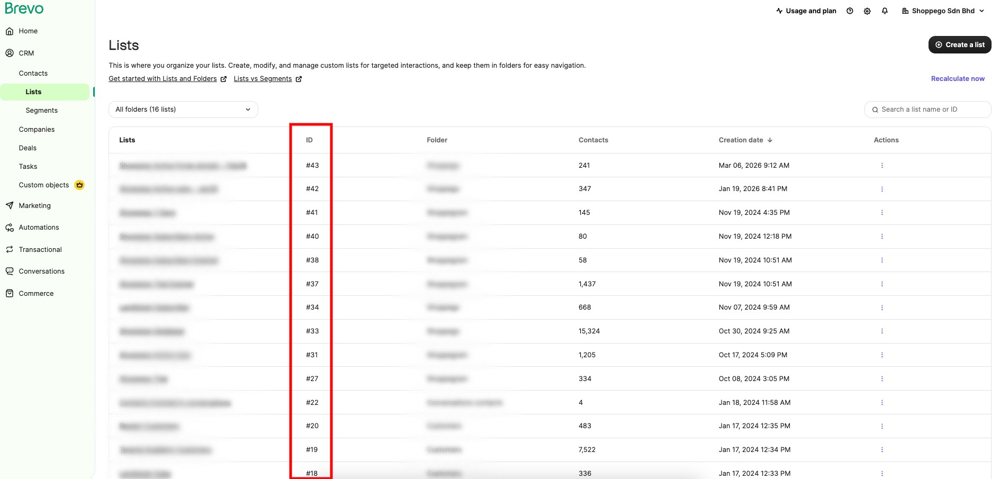<figcaption></figcaption></figure>

## Setting up in Shoppego

1. On the Dashboard Overview, you can go to **Settings**.

<figure><figcaption></figcaption></figure>

2. After that, you can click on **Email Marketing Provider**.

<figure>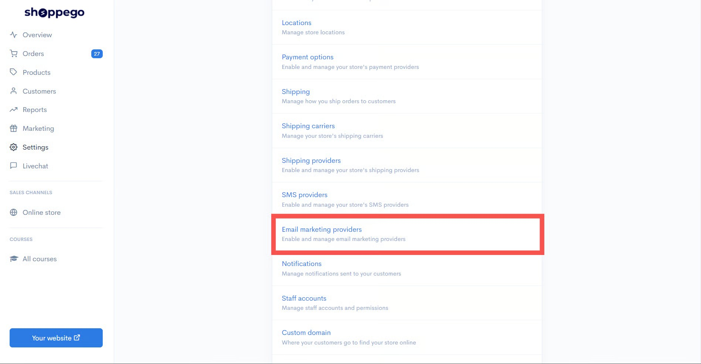<figcaption></figcaption></figure>

3. On this page, you will need to press the **Activate** button to activate **Brevo** and press **Edit**.

<figure>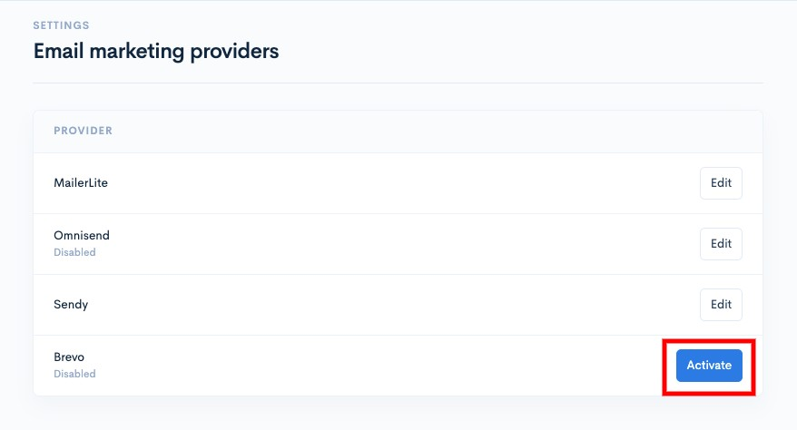<figcaption></figcaption></figure>

4. You need to enter the **API key** you got from **Brevo** into the space provided. You can also enter the **List ID**.


\*\*<mark style="color:red;">Note</mark>:

* **List ID** - Used to place registered customers into the group you want.
  

5. Make sure you turn on the **Enable** toggle to use Brevo

<figure>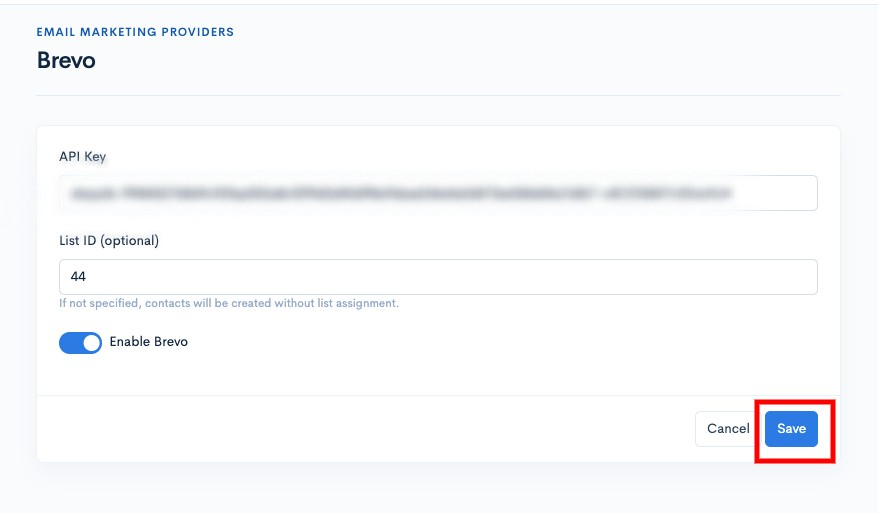<figcaption></figcaption></figure>

<mark style="color:blue;">Congratulations</mark>! Your **Brevo** setup has been successful.

Sync Shoppego customer information with Brevo List

**If you want to set up your Brevo List Sync with your customer information from the Shoppego platform, you need to make sure you have set up "**[**Deactivated Blocking Unauthorized IP Address**](brevo.md#deactivated-blocking-unauthorized-ip-address)**" first.**

To sync information, you just need to click on the **Sync All Customers/Sync button**.

<figure>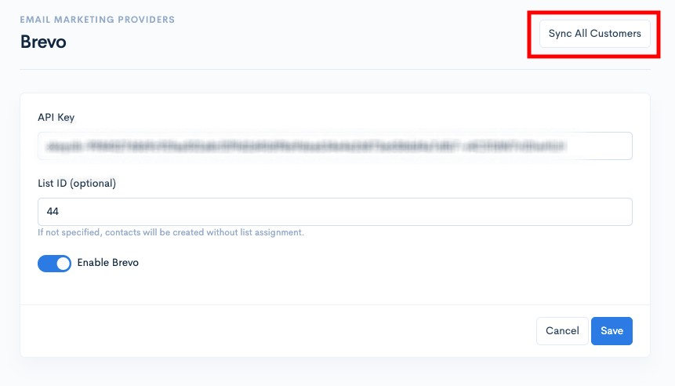<figcaption></figcaption></figure>

## Additional information

### Deactivated Blocking Unauthorized IP Address

1. Log in to your Brevo account

<figure><figcaption></figcaption></figure>

2. Click on the **profile menu** and click **Settings**

<figure><figcaption></figcaption></figure>

3. Click on the **Security** menu

<figure>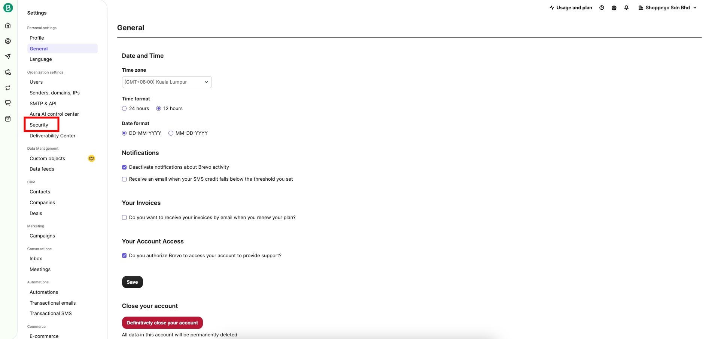<figcaption></figcaption></figure>

4. Click on **Authorized IPs**

<figure>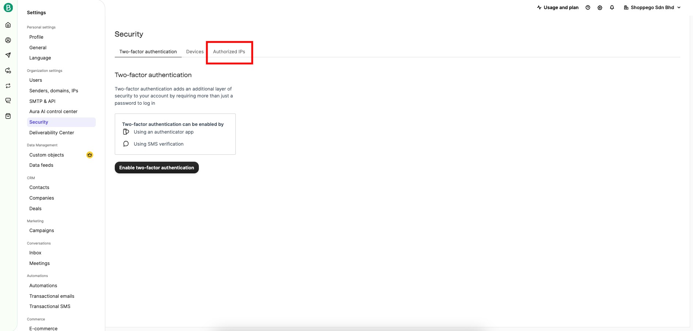<figcaption></figcaption></figure>

5. Click on the **Deactivate blocking** button

<figure>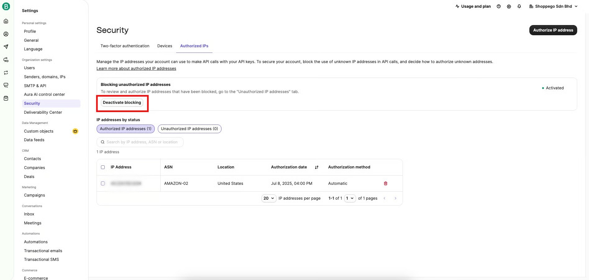<figcaption></figcaption></figure>
