# Sender.net

To set up **Sender.net**, you need to get an **API Access Token** from **Sender** and **enter the key** you have obtained into the Shoppego system.

## Log in Sender account

1. You can log in to your Sender account [here ](https://auth.sender.net/oauth/login?scope=scope\&client_id=21\&response_type=code\&redirect_uri=https%3A%2F%2Fapp.sender.net%2F)or at this link: [https://auth.sender.net/oauth/login](https://auth.sender.net/oauth/login?scope=scope\&client_id=21\&response_type=code\&redirect_uri=https%3A%2F%2Fapp.sender.net%2F)

<figure>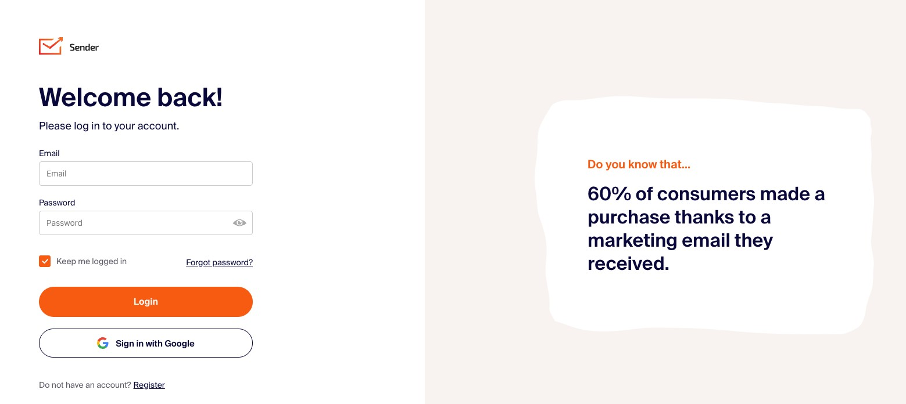<figcaption></figcaption></figure>

## Get the API Access Token Sender

1. You will be taken to the **Sender Dashboard** page, you need to click on **Account settings**

<figure>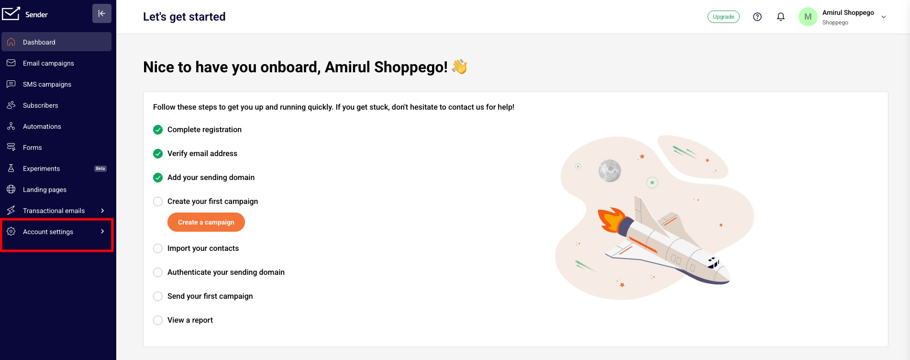<figcaption></figcaption></figure>

2. You can click on **API access tokens**

<figure>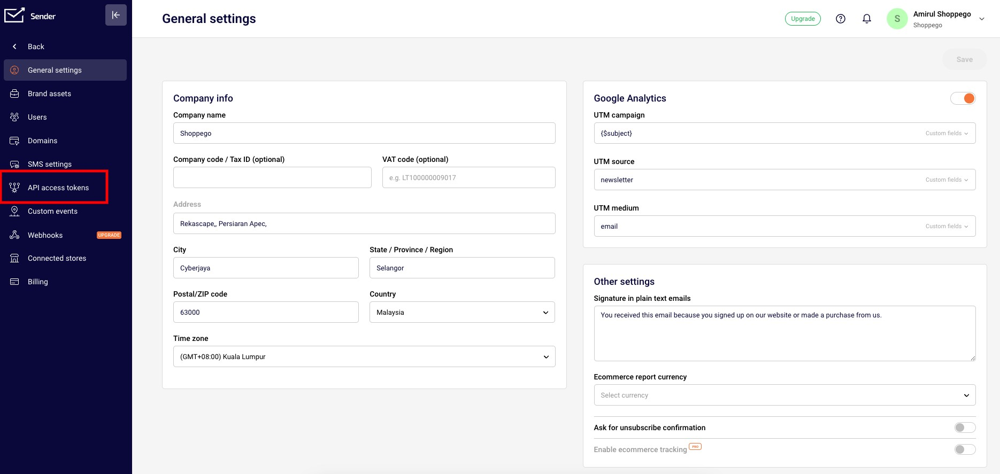<figcaption></figcaption></figure>

2. After that, you can **click** on **Create API token**

<figure>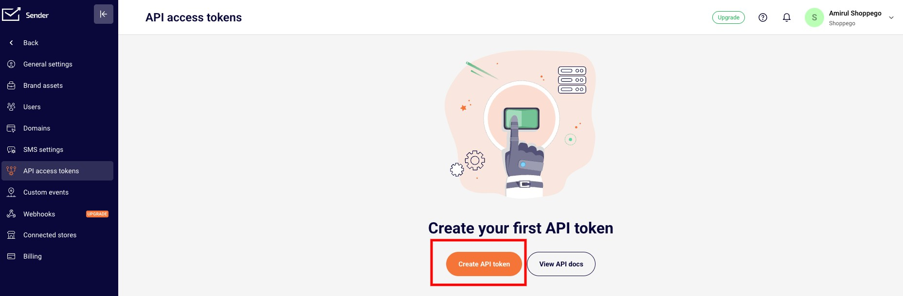<figcaption></figcaption></figure>

4. Next, you can select **Forever** and click **Create**

<figure>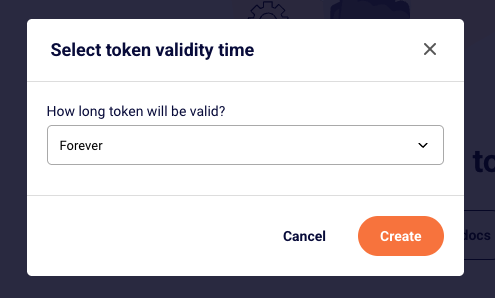<figcaption></figcaption></figure>

5. After that, you can click on **Copy token** to be used for the integration process on the Shoppego platform later.

<figure>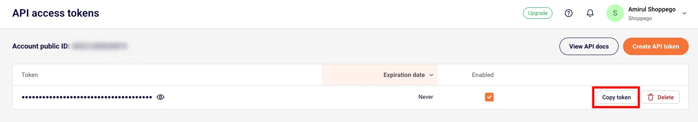<figcaption></figcaption></figure>

## Get Group ID (Optional)

If you do not make this setting, your customer information that will be imported will not be in any list.

1. Log in to the Sender.net dashboard

<figure><figcaption></figcaption></figure>

2. Click on **Subscribers**

<figure>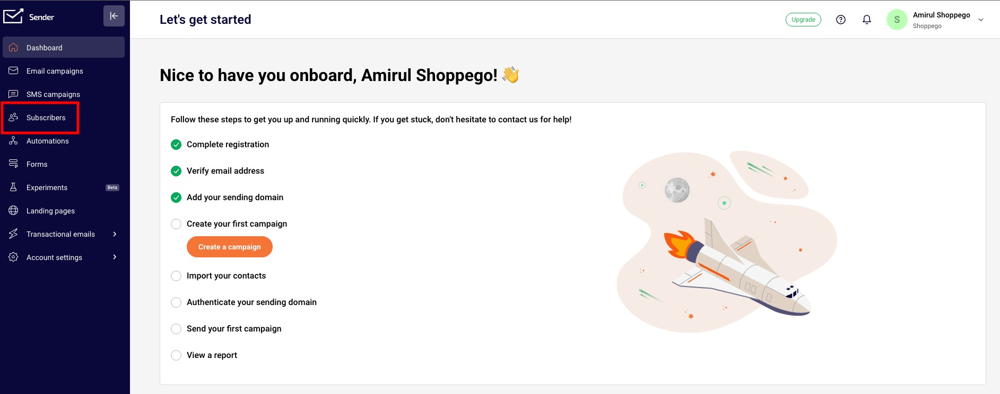<figcaption></figcaption></figure>

3. Click on **Groups**

<figure>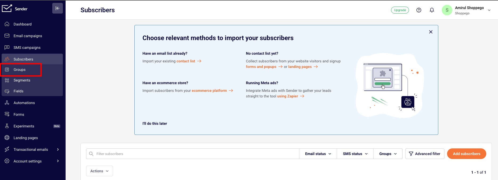<figcaption></figcaption></figure>

4. Click on **Create new group**

<figure>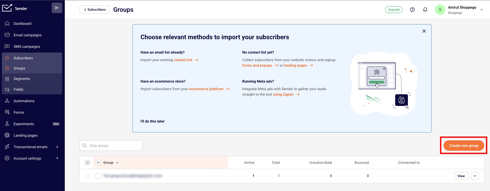<figcaption></figcaption></figure>

5. Next, you can enter the group name as your reference and click **Save**

<figure>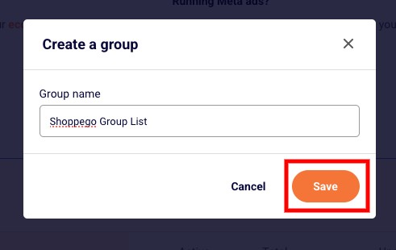<figcaption></figcaption></figure>

6. Then, you will be taken to the group page itself and you will be able to see the Group ID. You can **copy the Group ID** to use for integration with the Shoppego platform.

<figure>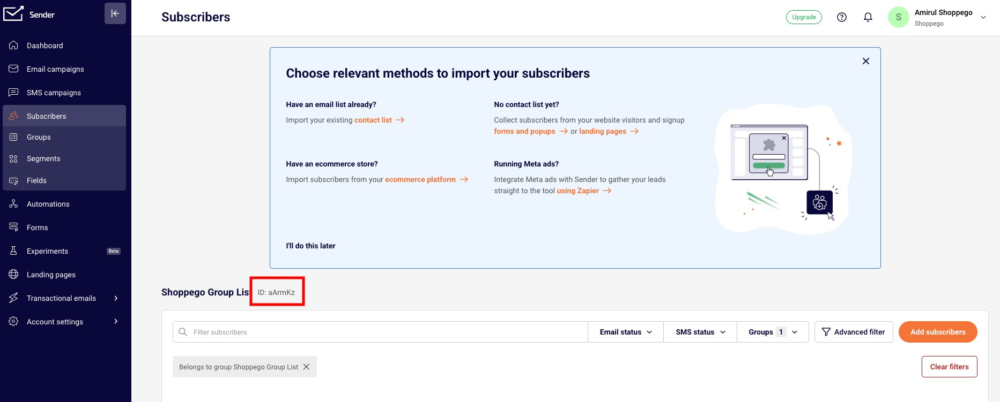<figcaption></figcaption></figure>

## Setting up in Shoppego

1. On the **Dashboard Overview**, you can go to **Settings**

<figure><figcaption></figcaption></figure>

2. After that, you can click on **Email Marketing Provider**

<figure><figcaption></figcaption></figure>

3. On this page, you will need to press the **Activate/Edit** button to **activate Sender.net**.

<figure>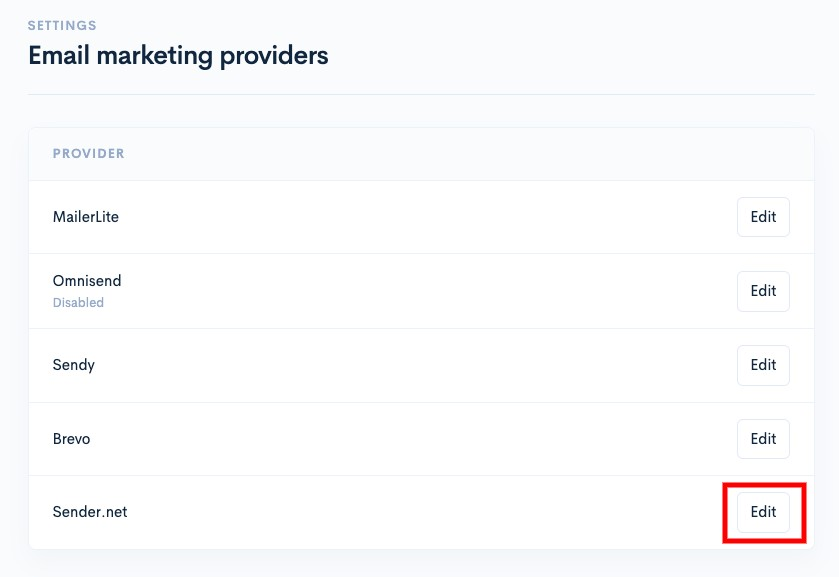<figcaption></figcaption></figure>

4. You need to enter the **API access token** you got from **Sender.net** into the space provided. You can also put the **Group ID**.


\*\*<mark style="color:red;">**Attention**</mark> :&#x20;

* **Group ID** - Used to place registered customers into the group you want.
  

5. Make sure you turn on the **Enable toggle to use Sender.net**

<figure>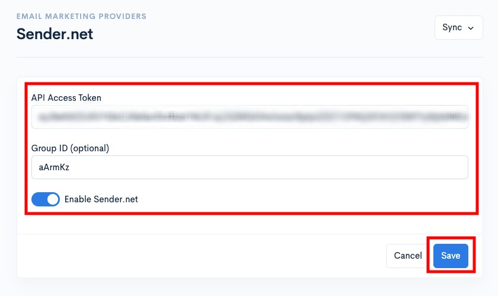<figcaption></figcaption></figure>

<mark style="color:blue;">**Congratulations**</mark>! Your **Sender.net** setup has been successful.

### Sync Shoppego Customer Information With Sender Group List

To sync information, you just need to click on the **Sync All Customers/Sync** button.

<figure><figcaption></figcaption></figure>
