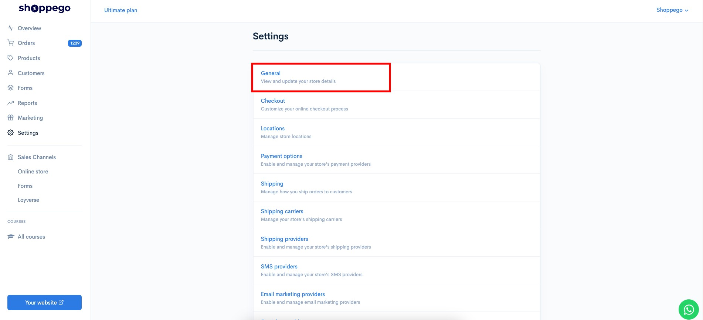
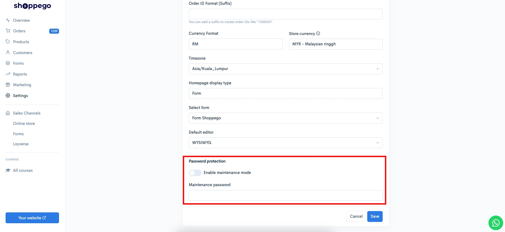
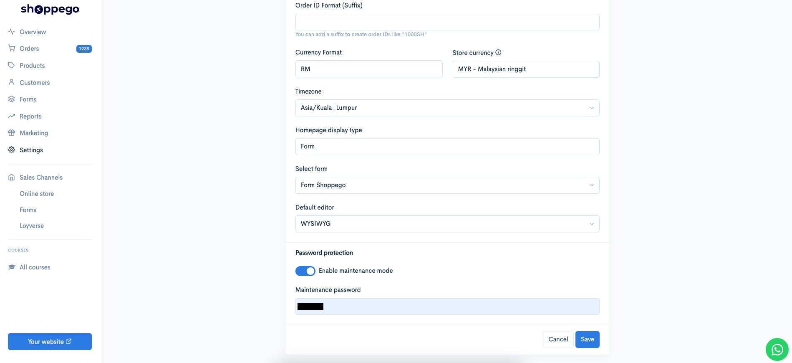
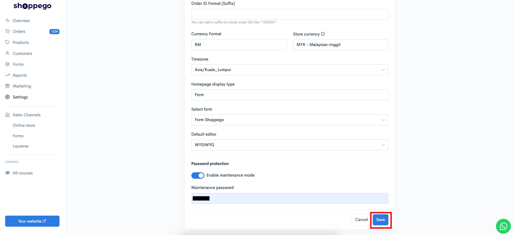
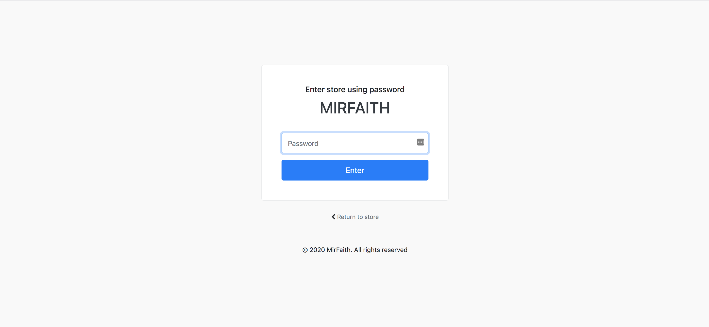

# Maintenance mode

In Shoppego, you can ensure that your website cannot be seen from public view by using the **Maintenance mode** function.

This function is often used when you want to reset your website for future promotions and various other functions.

## Maintenance mode activation setting

To activate maintenance mode on the Shoppego website, you can refer to this step.

*1.* Log in to your Shoppego account

*2.* Click on **Settings**

*3.* Click on **General**

*4.* Scroll below to find the settings of the Password protection tab. In that setting, you can see the Enable maintenance mode setting toggle.

*5.* You can activate the **Enable maintenance mode** toggle and enter the **password** you want.\
\
***\*\******Make sure the password you enter has only lowercase letters and numbers.**

*6.* Once finished you can click **Save**

*7.* You can see the results by trying to open your website.

