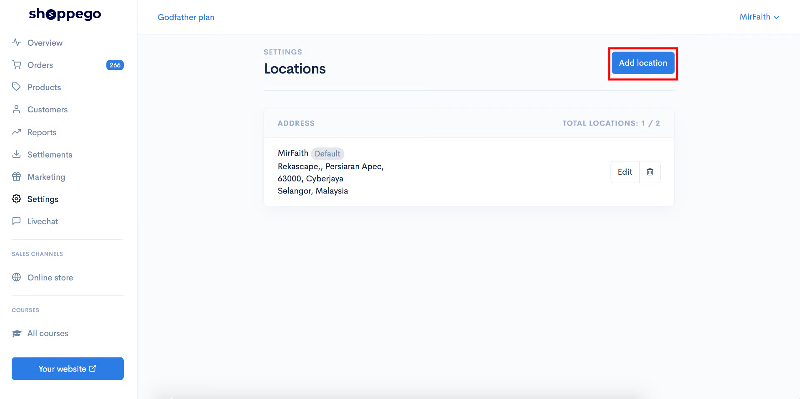
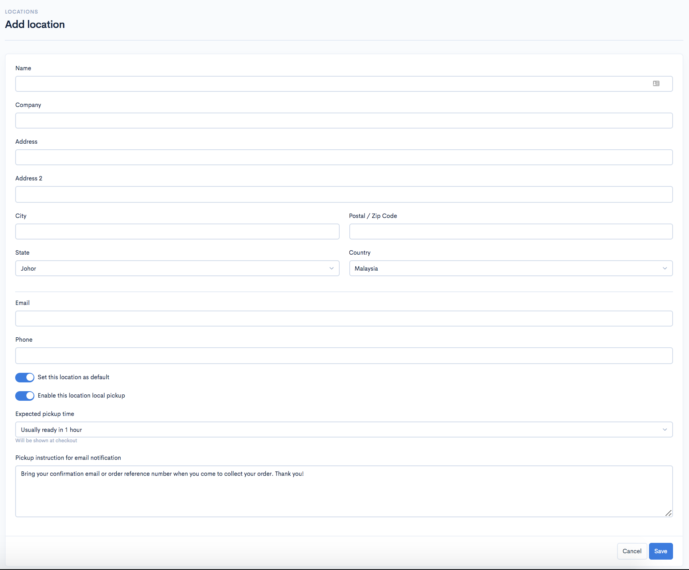
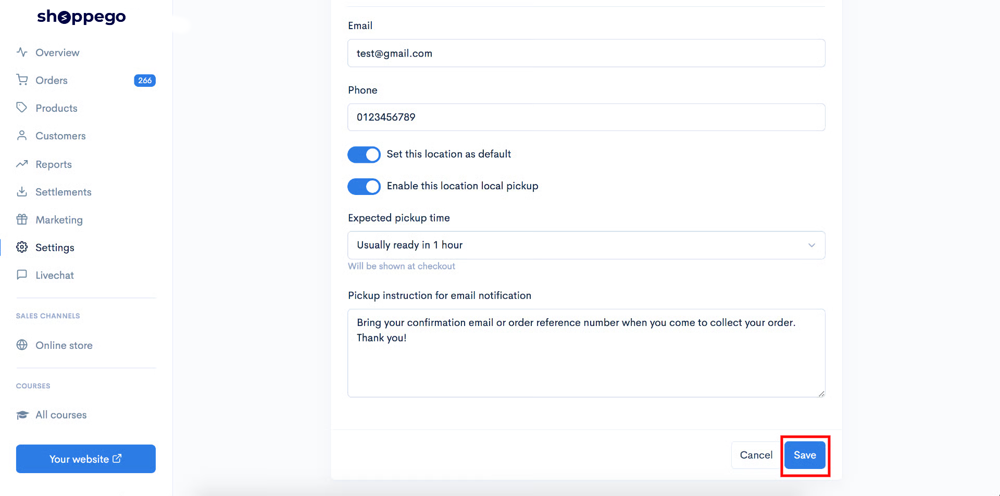
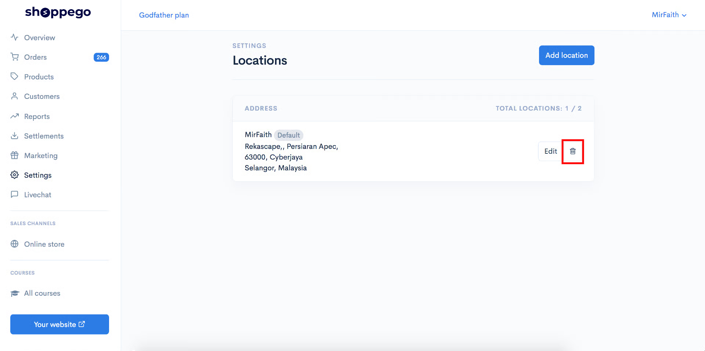

# Locations

This Location setup must be filled in by each user of the Shoppego system if they want to make integrations with any Shipping provider system.

For each user of the Shoppego system, they already have a Default locations address that is entered into their store locations.

In the Locations setting as well, our users can set the Pickup type shipping in their store.&#x20;


For this local pickup function, it is only **available** on the <mark style="color:red;">**Ultimate**</mark>**&#x20;plan**.


## Access to Locations Settings

1\. Log in to your Shoppego dashboard

2\. Click on **Settings**

3\. Click on **Locations**

## Add Location in your store

1\. You can add other locations in your store by clicking on the **Add location** button

2\. You can enter the information required for setting your locations

<table data-header-hidden><thead><tr><th width="222">Parameters</th><th>Use case</th></tr></thead><tbody><tr><td><strong>Name</strong></td><td>You can enter the name of the person who manages this location.</td></tr><tr><td><strong>Company</strong></td><td>You can enter the name of the company that manages this location.</td></tr><tr><td><strong>Address</strong></td><td>You can enter an address for your location.</td></tr><tr><td><strong>Address 2</strong></td><td>You can enter an address for your location.</td></tr><tr><td><strong>City</strong></td><td>You can enter a city name for your location.</td></tr><tr><td><strong>Postal / Zip Code</strong></td><td>You can enter the postal code for your location.</td></tr><tr><td><strong>State</strong></td><td>You can enter the state for your location.</td></tr><tr><td><strong>Country</strong></td><td>You can select country for your location.</td></tr><tr><td><strong>Email</strong></td><td>You can enter an email that allows customers to contact you.</td></tr><tr><td><strong>Phone</strong></td><td>Anda boleh masukkan nombor telefon yang membolehkan pelanggan untuk menghubungi anda.</td></tr><tr><td><strong>Set this locations as default</strong></td><td>Anda boleh tick pada toggle ini sekiranya anda ingin jadikan lokasi ini sebagai lokasi utama untuk store anda.</td></tr><tr><td><strong>Enable this location local pickup</strong></td><td>You can tick on this toggle if you want to make this location the pickup location for your customers. <strong>This function is only available on the Ultimate plan.</strong></td></tr><tr><td><strong>Expected pickup time</strong></td><td>You can choose the time you need for you to prepare your customer's order after they place an order on your website. <strong>This function is only available on the Ultimate plan.</strong></td></tr><tr><td><strong>Pickup instruction for email notification</strong></td><td>You can enter instructions for your customers after they place an order on your website. <strong>This function is only available on the Ultimate plan.</strong></td></tr></tbody></table>

3\. Once you have entered all the required information, you can click on the **Save** button to save the settings.

## Make changes to your location

1\. You can click on the **Edit** button at the location where you want to make the change

## Remove existing locations available on your store

1\. You can click on the **trash can icon** button to delete the existing location found in the location setting in your store.

