# Local Pickup

This Local Pickup setting, allows your customers to pick up their items through the location they have selected during checkout on your website.

When you activate this Local Pickup setting during checkout, your customers will be given two options, namely whether to use **Ship** or **Pickup** type delivery. As they select the delivery type of Pickup, they will be able to see the locations they can choose to pick up their order.


**Ship** - The seller will **use courier services** to deliver the customer's order.



**Pickup** - When customer choose the **Pickup delivery** option, they will be able to see the location(s) they can **choose to pick up their order**.


You can set the location you want to make the pickup location in your Locations settings. For now, you cannot segregate your product stock according to your desired location. So you need to make sure that each of your products is in every location you have set.


This **Local Pickup** function is only available on the <mark style="color:red;">**Ultimate**</mark>**&#x20;plan**.


## Setup Local Pickup 

1\. You need to log in to your Shoppego account first

2\. Click on **Settings**

3\. Click on **Locations**

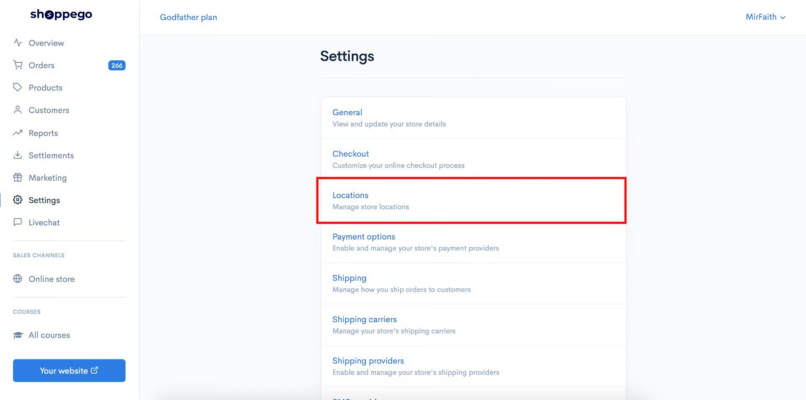

4\. Click **Edit** on any address you want to make the pickup location for your customers

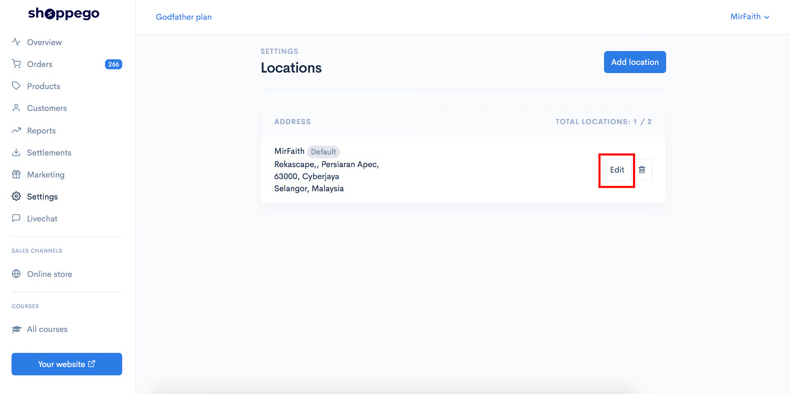

5\. Next on the Locations setting, you can **scroll down** to tick the **Enable this location local pickup toggle**

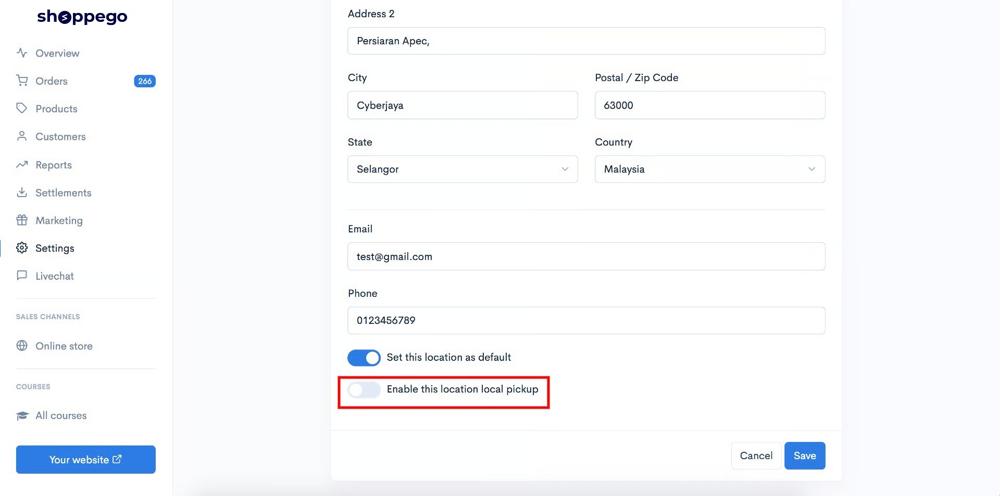

6\. At the **Expected pickup time** setting, you can select the time you need to take to complete your customer's order.

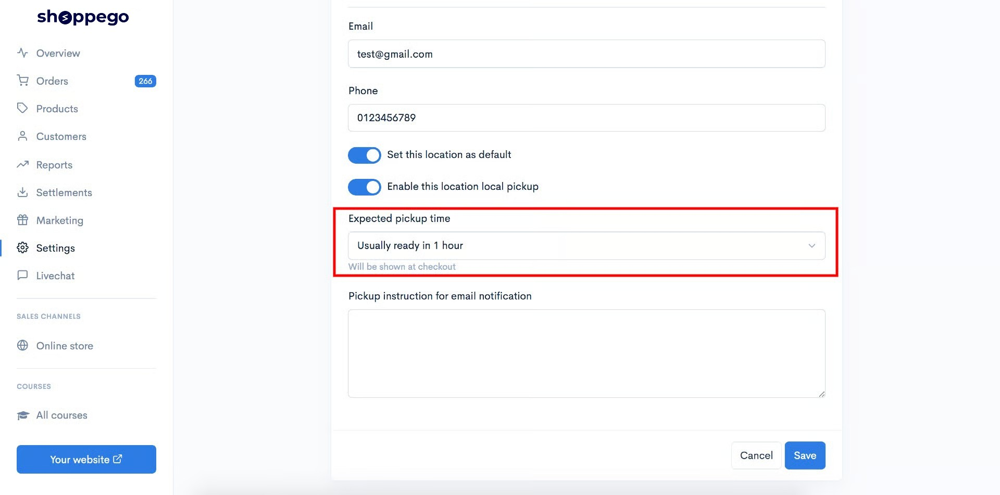

7\. In the **Pickup instruction for email notification** column, you can enter the instructions you want to give to your customers after they successfully checkout.

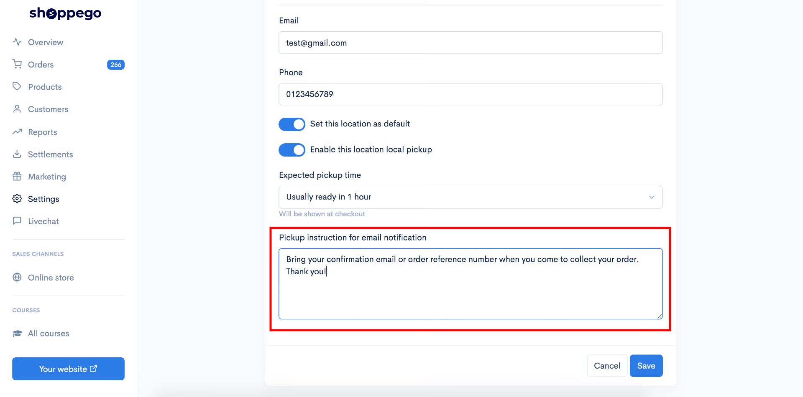

8\. After making all the settings, you can click **Save**

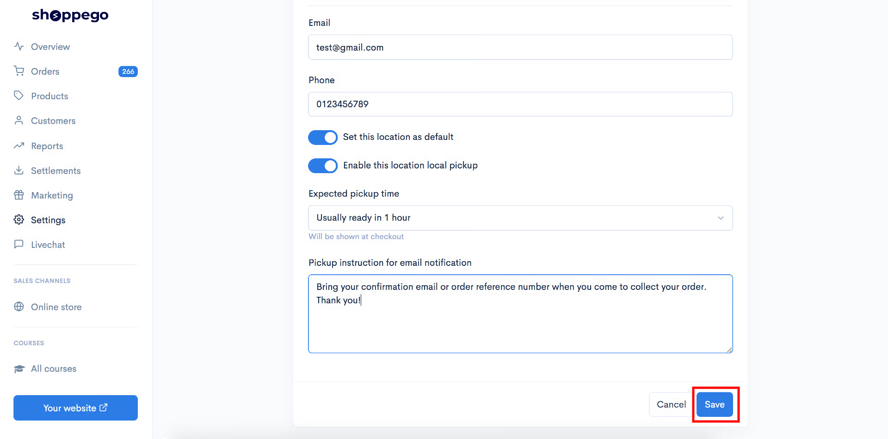

Now your Local pickup setup is successful.

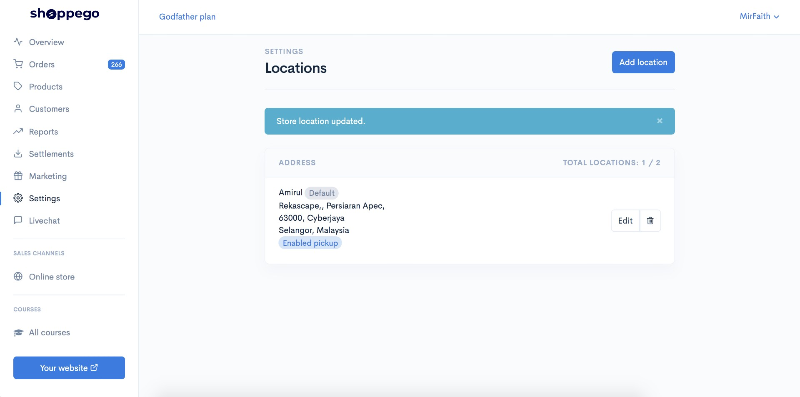

## Additional Setup 

For this Local Pickup setting, customers will receive an email regarding the order they made in their email.

For our old users, you need to make sure you use the latest Email Notifications Order Confirmation template. If you don’t use an up-to-date email template, your customers won’t be able to see the pickup instructions and locations you specify.

To make sure you use the latest email notifications template you can refer to this setting method:

1\. Log in to your Shoppego account

2\. Click on **Settings**

3\. Click on **Notifications**

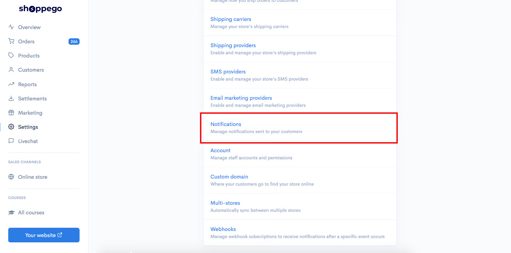

4\. Click **Edit on the Order Confirmation** tab

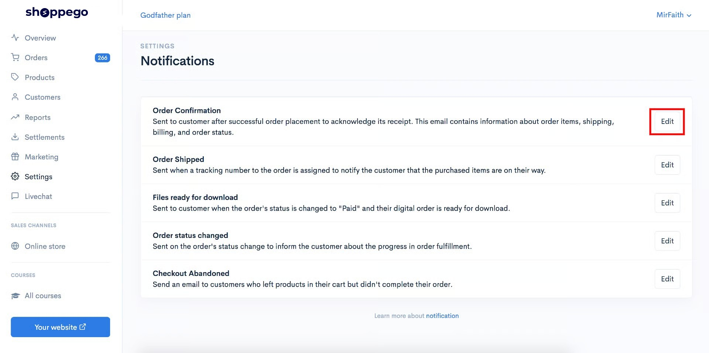

5\. Click on the **More** button

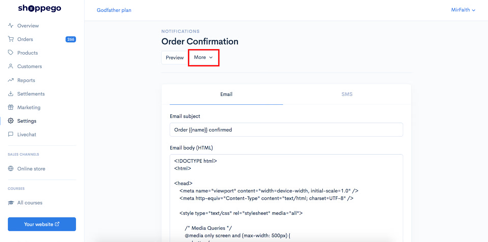

6\. Click on the **Restore to default** button

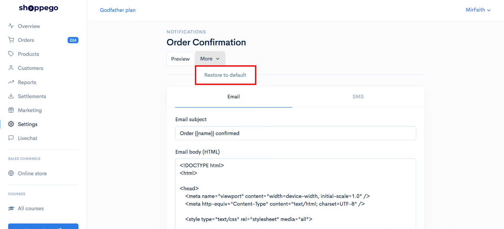

Now you have the latest Order Confirmation email notifications template.

## Example of Local Pickup display at Checkout

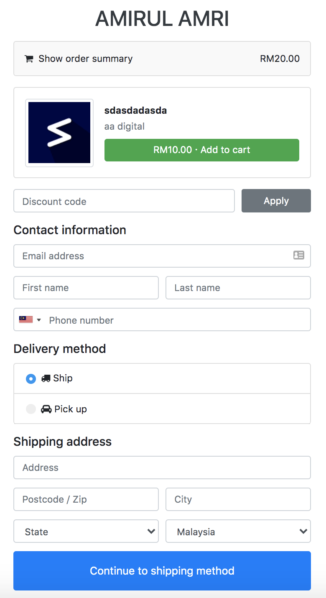
