# MCP

Shoppego now allows you to connect Claude or ChatGPT to your store, enabling it to create and manage your pages, forms, themes and products.

The MCP connector URL for your store is as follows: https\://\[namasubdomain].myshoppegram.com/mcp

## On this page:

* [Settings on Shoppego](mcp.md#settings-on-shoppego)
* [Connecting ChatGPT](mcp.md#connecting-chatgpt)
* [How to use it on ChatGPT](mcp.md#how-to-use-it-on-chatgpt)
* [Connecting Claude](mcp.md#connecting-claude)
* [Additional information](mcp.md#additional-information)

## Settings on Shoppego

1. Log in to the Shoppego dashboard

<figure><figcaption></figcaption></figure>

2. Click on **Settings**

<figure><figcaption></figcaption></figure>

3. Click on **General**

<figure><figcaption></figcaption></figure>

4. Change the MCP setting to "**On**" and **Save** the setting

<figure>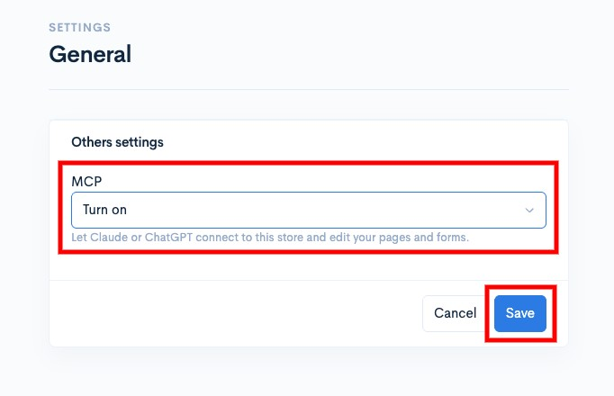<figcaption></figcaption></figure>

## Connecting ChatGPT

1. Log in to your ChatGPT account.

<figure>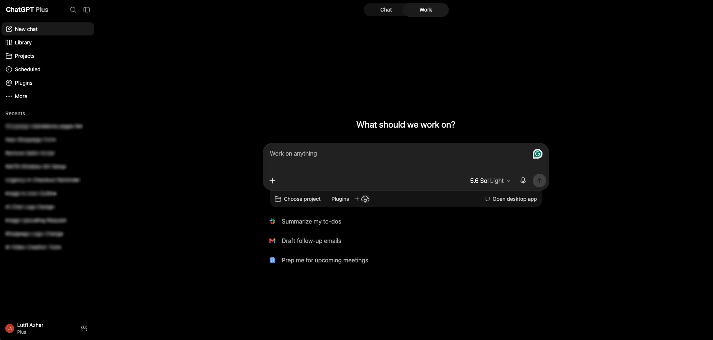<figcaption></figcaption></figure>

2. Click on your "**Profile Menu**" and select "**Settings**"

<figure>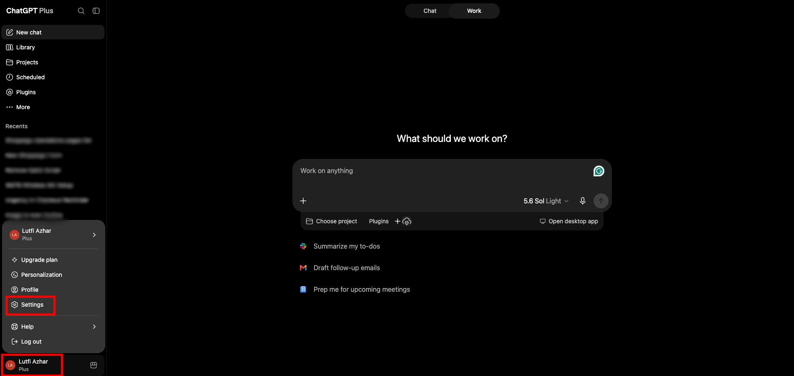<figcaption></figcaption></figure>

3. Click on the "**Security and login**" menu

<figure>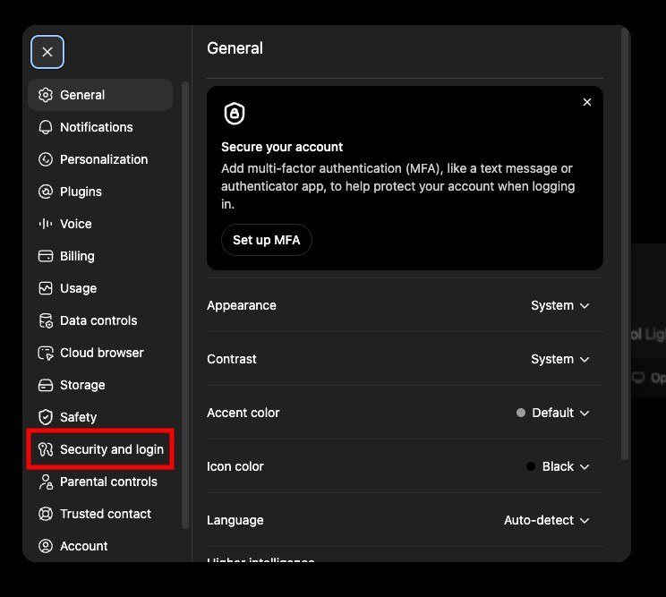<figcaption></figcaption></figure>

4. Activate the "**Developer mode**" setting toggle

<figure>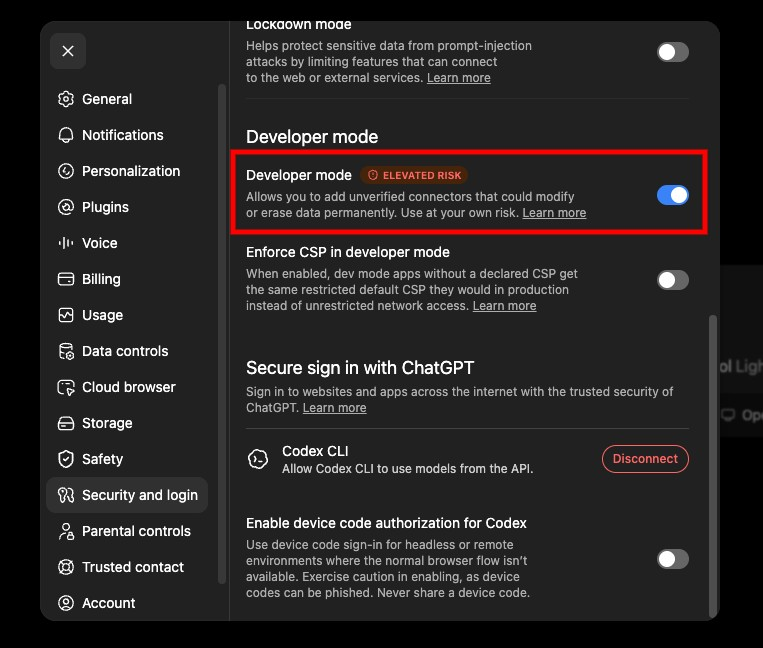<figcaption></figcaption></figure>

5. Then, you can refresh your ChatGPT dashboard page and click the "**Plugins**" menu.

<figure>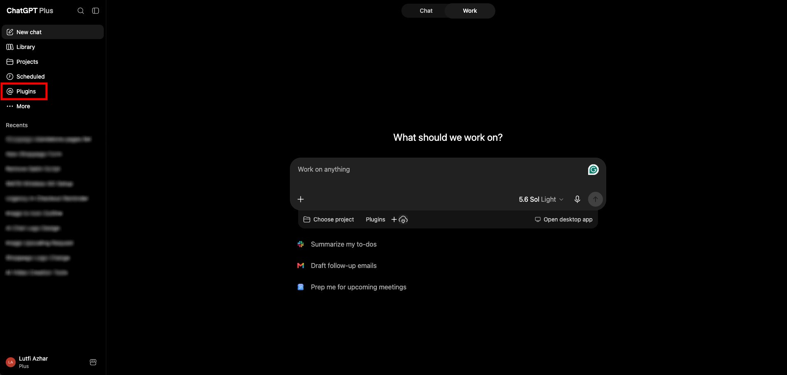<figcaption></figcaption></figure>

6. On the "**Plugins**" page, you can click the **+ icon** button to add your own plugins.

<figure>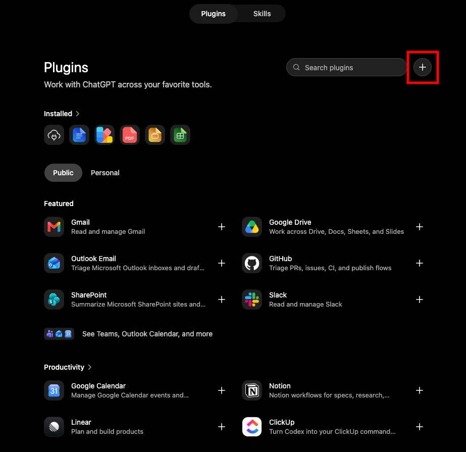<figcaption></figcaption></figure>

7. You can enter all your MCP information. For "**Authentication**," you can leave it set to "**OAuth**." Once finished, click **Create**.

<figure>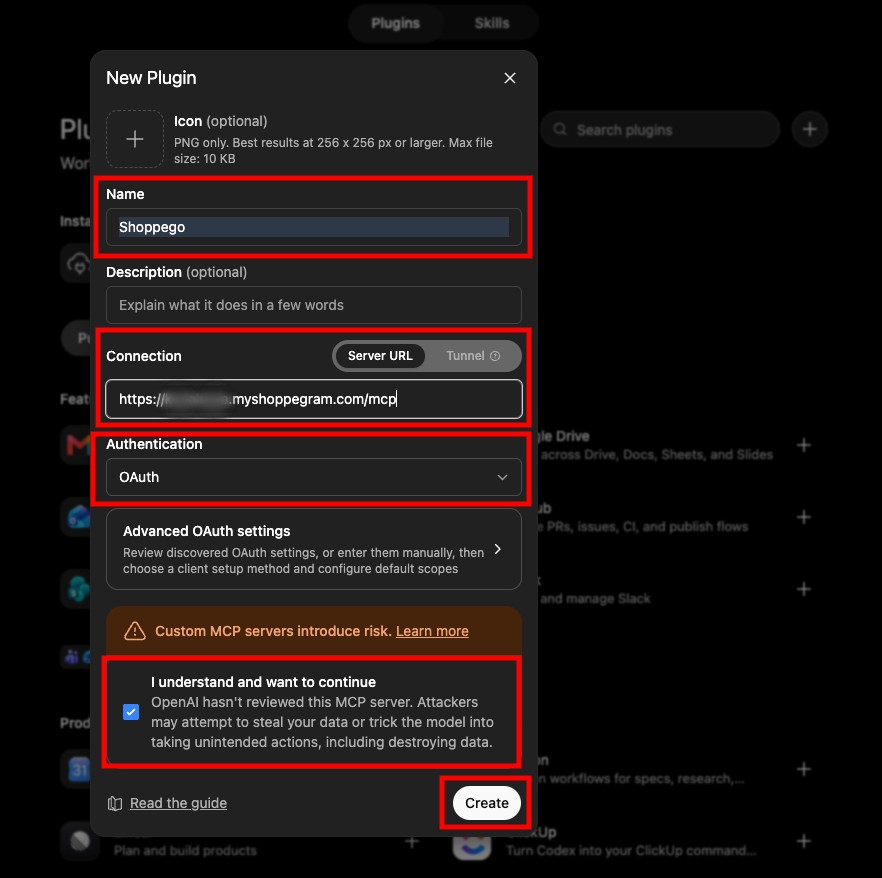<figcaption></figcaption></figure>

8. Later you will be taken to the Shoppego page for you to log in, select the store and approve the setting.

<figure>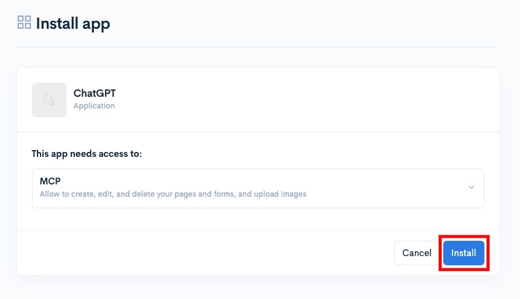<figcaption></figcaption></figure>

## How to Use It on ChatGPT

1. Log in to your ChatGPT account.

<figure><figcaption></figcaption></figure>

2. Click on "**New chat**"

<figure><figcaption></figcaption></figure>

3. Then, you can click on "**Plugin**" and select the Shoppego plugin you just added.

<figure>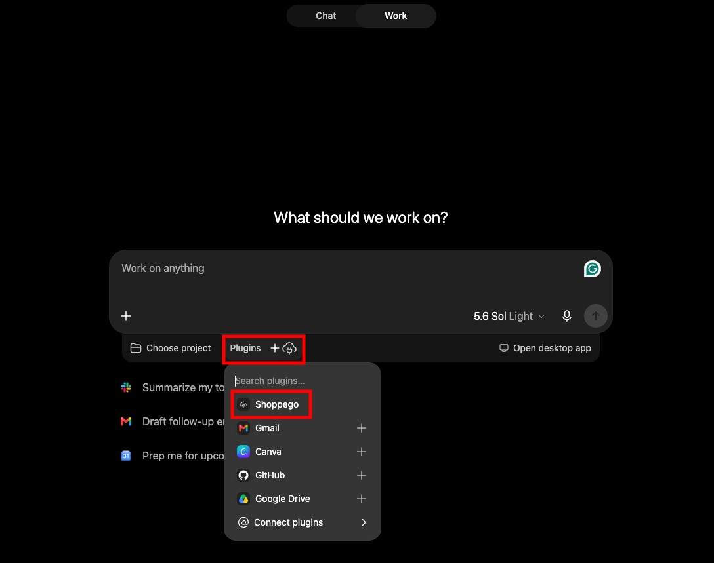<figcaption></figcaption></figure>

5. Once done, you can write your own prompt to have it make changes or manage your forms or pages.

#### Example Prompt:

<figure>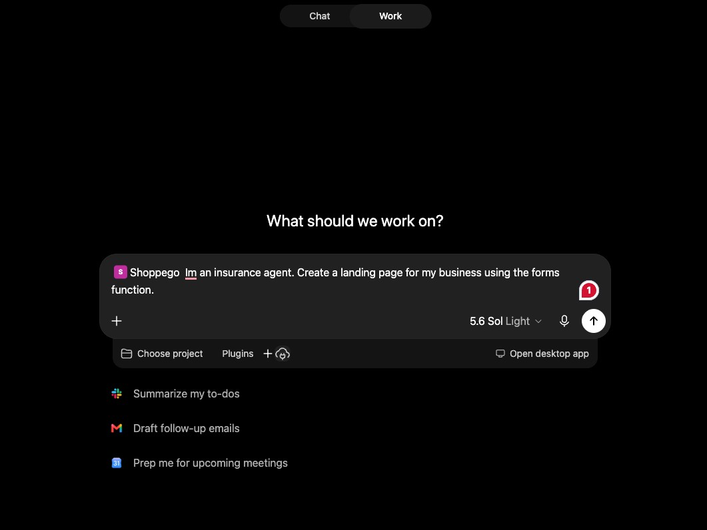<figcaption></figcaption></figure>

#### Prompt Result:

<figure>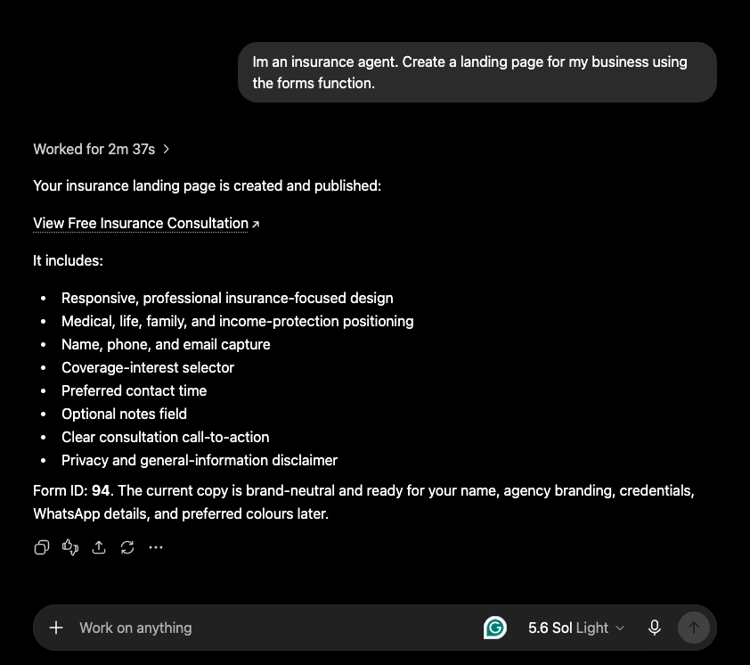<figcaption></figcaption></figure>

## Connecting Claude

1. Log in to your Claude account and click on "**Settings**" > "**Connectors**".<https://claude.ai/customize/connectors>

<figure>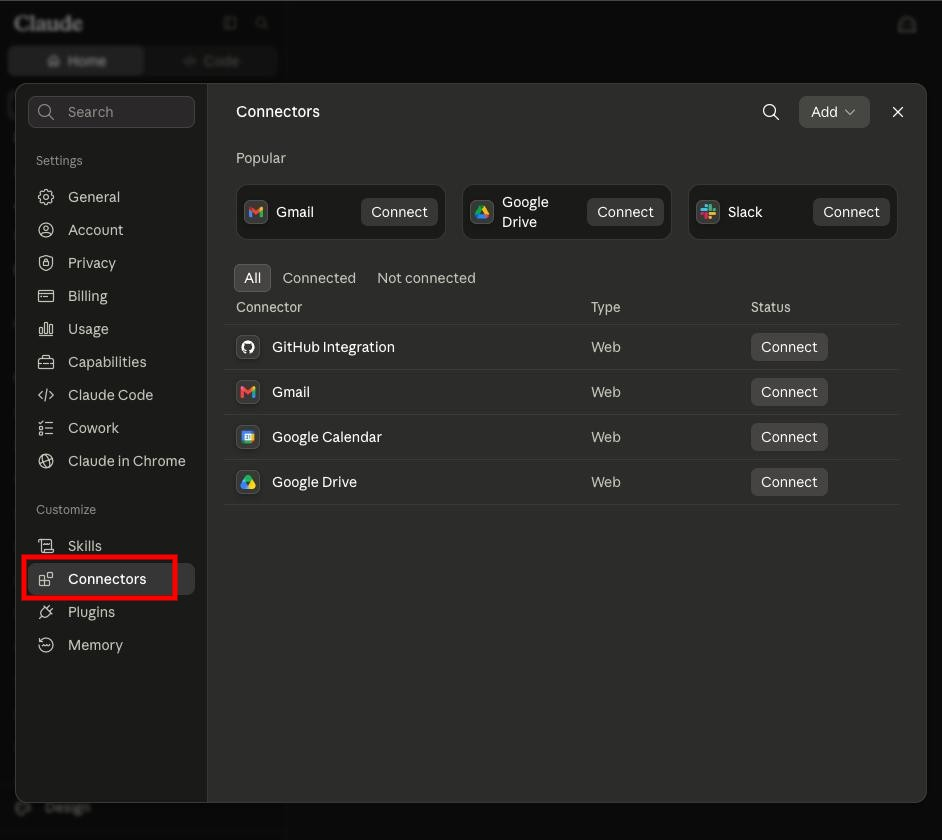<figcaption></figcaption></figure>

2. Click the "**Add**" button and select "**Add custom connector**".

<figure>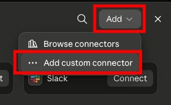<figcaption></figcaption></figure>

3. Once done, you can **enter your MCP information**. For the "**OAuth**" settings, you can **leave both fields blank**. After that, click **Add**.

<figure>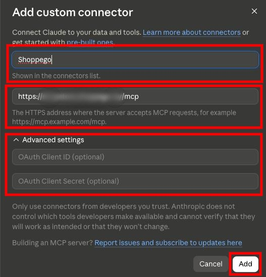<figcaption></figcaption></figure>

## Additional Information

For any pages or forms created using this MCP, you cannot make any custom changes to the page content via the builder editor or similar tools.
