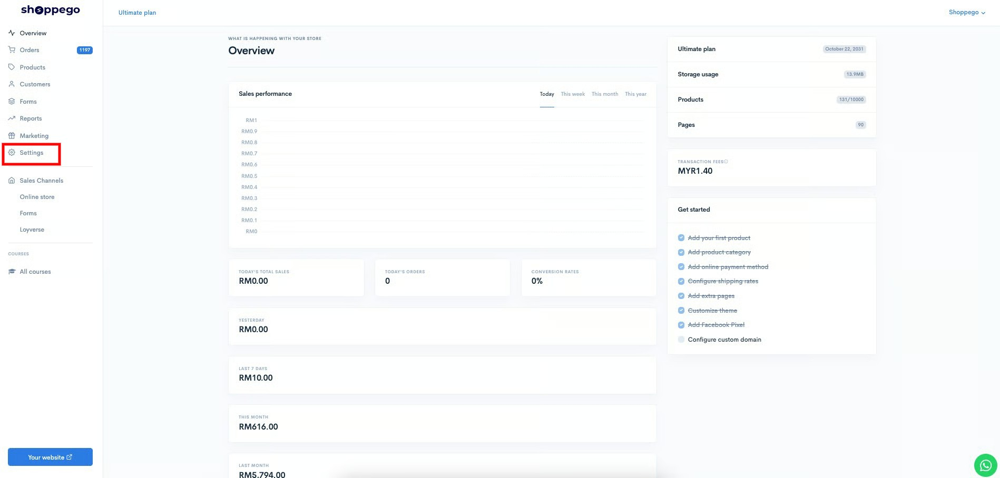
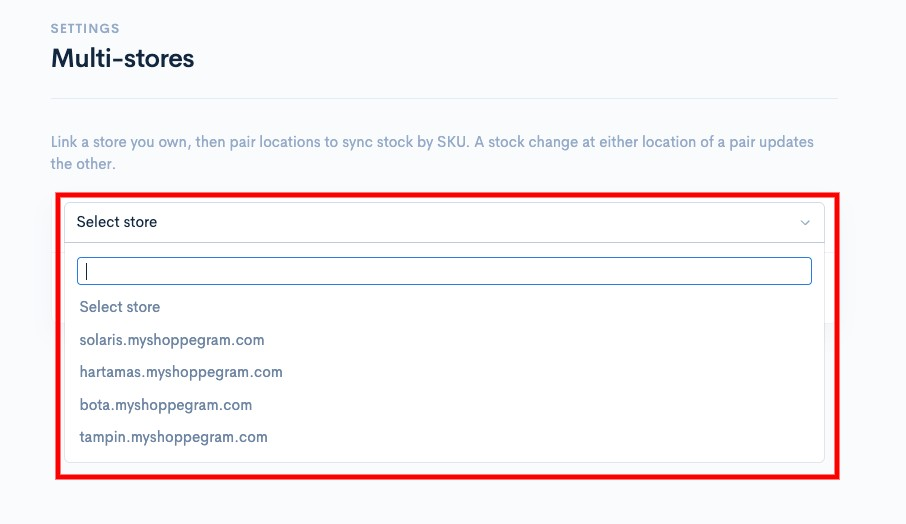
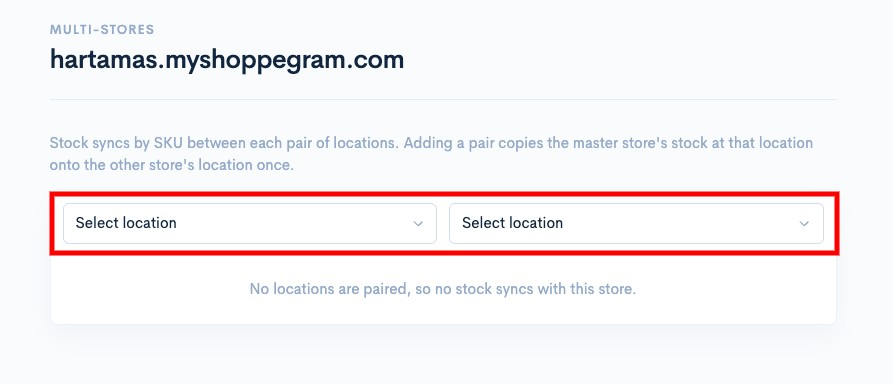
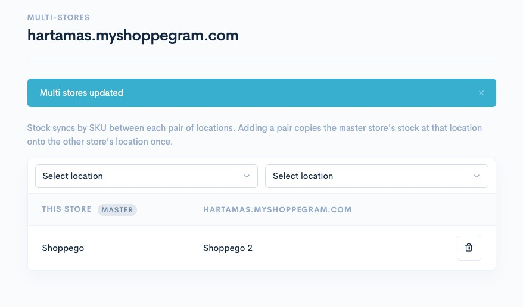

# Multi-stores

You can use this function to synchronize product stock levels across your Shoppego stores. **Please note that the system will only synchronize product stock for**:

* **Stock changes from the Shoppego (master) platform**
* **Stock changes resulting from inter-website purchases.**
* **Stock changes through the cancel/refund process on the Shoppego platform**

**The cross-platform stock synchronization function on Shoppego will also be guided by the SKU settings of the products or product variants themselves.**


This feature is available only for the **Ultimate** plan subscription.


## Product Format for Shoppego

You need to ensure that every product on Shoppego for which you want to synchronize stock has the same SKU.

To set up SKUs on the Shoppego platform, you can go to the following section:

1. Log in to your Shoppego account

<figure><figcaption></figcaption></figure>

2. Click on **Products**

<figure><figcaption></figcaption></figure>

3. Click on the product for which you want to adjust the stock, or you can simply create a new product.

<figure><figcaption></figcaption></figure>

4. You can go to the **Variants** tab.

<figure><figcaption></figcaption></figure>

5. Click on the variant selection tab where you wish to add SKU settings to synchronize stock.

<figure><figcaption></figcaption></figure>

6. Then, you can **enter the same SKU designation as your product in the other sstore in the "SKU (Stock Keeping Unit)" designation on the Shoppego platform** and click **Save**

<figure><figcaption></figcaption></figure>

## Setting up Multi-stores on Shoppego

1. Log in to your Shoppego account

<figure><figcaption></figcaption></figure>

2. Click on **Settings**

<figure><figcaption></figcaption></figure>

3. Click on "**Multi-stores**"

<figure><figcaption></figcaption></figure>

4. Next, you can search for the Shoppego store for which you want to synchronize stock and click on that store.

<figure><figcaption></figcaption></figure>

Later, you will be asked to continue selecting the location between the 2 stores.

<figure><figcaption></figcaption></figure>

Your Shoppego store is now connected to your WooCommerce account.

<figure><figcaption></figcaption></figure>

## Additional Information

Manual stock reconciliation can only be performed for the store designated as the "master" or primary stock source. If you make manual changes to a store that is not the "master" or primary stock source, those changes will not be reflected across the stores.

**Automatic stock synchronization only works when the SKUs within Shoppego are identical across the respective Shoppego stores**. If the SKUs differ, Shoppego will not be able to synchronize the stock for the product in question.

**One of your Shoppego stores will serve as the primary source for your inventory**. We recommend updating product stock levels exclusively at that specific Shoppego store. Avoid updating stock at other Shoppego stores, as doing so can lead to inconsistencies in stock data.
